# 纽约和新冠肺炎:谁面临风险，曲线是否变平？

> 原文：<https://medium.com/analytics-vidhya/nyc-covid-19-whose-at-risk-and-is-the-curve-flattening-66a92cff71d7?source=collection_archive---------19----------------------->

一个多月前，整个国家都变了。正如一个人所说，一个“看不见的敌人”开始困扰我们的国家，并从本质上说，它采取了风暴。随着疫情的出现，纽约市开始被称为病毒的“中心”,纽约现在是这个国家以及其他许多国家中病例最多的城市。作为一个在纽约生活了一辈子的人，同时也是一名纽约居民，我决定找到一种方法，让每个人都了解正在发生的事情以及某些人可能面临的风险。多亏纽约市卫生和精神卫生部(DOHMH)每天公布在 https://github.com/nychealth/coronavirus-data 发现的新冠肺炎病毒的数据，我们能够看到每日确诊病例和死亡的数据，按行政区和邮政编码分列的确诊病例，以及最终确诊病例的年龄和性别比例。在 python(可以在 https://github.com/gsrankel/COVID-19[的](https://github.com/gsrankel/COVID-19)找到)中进行了一点清理之后，数据就可以向我们展示这种病毒是如何真正影响纽约市地区的了。

注意:

尽管我们收集了截至 4 月 12 日的数据，但我们使用截至 4 月 11 日的数据进行以下分析。原因是每天下午 5:00 报告数据，并且在下一次每日更新出来的第二天仍在更新。

# 新冠肺炎确诊病例

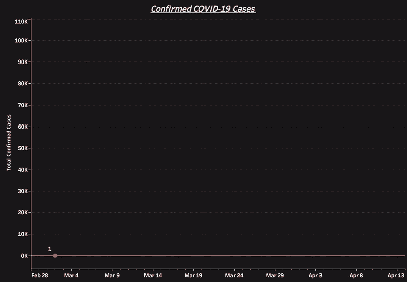

说明 1:3 月 2 日至 4 月 11 日确诊病例总数

根据提供的数据，截至 4 月 11 日，仅纽约市就有 104，313 例确诊病例，随着最近几天的每日更新，这些数字还在攀升。说说一个惊人的数字来看看。然而，在这些数字中，有一个问题是我们想知道的:“我们是否在使曲线变平？”。3 月 2 日，纽约市出现了首例确诊的新冠肺炎病例。3 月 20 日星期五，州长安德鲁·科莫宣布了一项强制留在家中的命令，于 3 月 22 日晚上 8 点生效。在宣布这一消息时，他们估计约有 7100 人的新冠肺炎病毒检测呈阳性。根据 DOHMH 提供的数据，这个数字实际上是 17，777 人，说明 2 测试呈阳性。

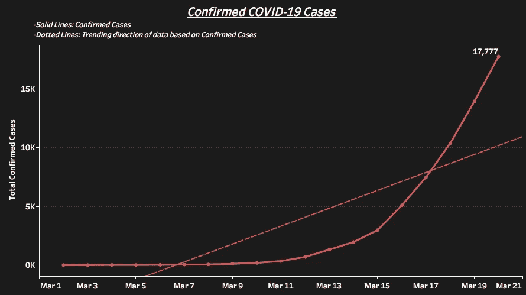

说明 2:截至 2020 年 3 月 20 日纽约市确诊病例总数

如你所见，3 月 11 日至 20 日之间报告的案例数量有所上升。随着我们越来越接近这一日期，你可以看到每天报告的病例数量和各点之间的差距越来越大，这表明这基本上是未来的开始。

然而，我们现在可以开始看到强制的秩序和实施的社会距离政策正在发挥作用。当我们每周查看数据时，我们能够看到确诊病例的发生率实际上正在下降。当查看周环比分析时，我们可以看到报告的确诊病例数量下降了 23.59%，从 32，456 例降至 24，799 例。根据图 3 和图 4，您可以直观地看到曲线变平，每天确诊病例的数量确实在下降。

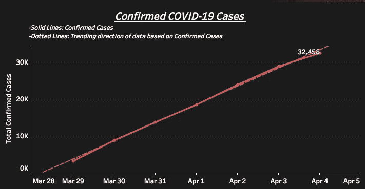

说明 3:3 月 29 日至 4 月 4 日期间确诊病例总数

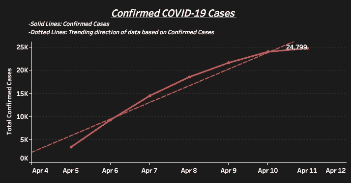

说明 4:4 月 5 日至 4 月 11 日期间确诊病例总数

当我们查看报告病例数之间的每日差异时，我们看到在最近几天，这证实了我们一直显示的情况，即自 3 月 31 日以来，12 天中有 2 天报告的病例数较前一天有所增加。正如我们在图 5 中看到的，低于 0 的报告数字表明确诊病例较前一天有所减少。

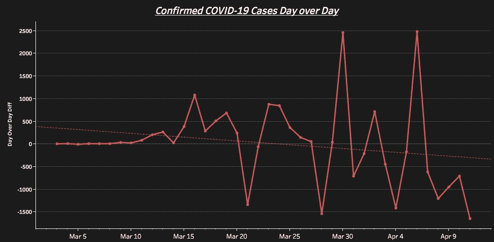

说明 5:截至 2020 年 11 月 4 日，新冠肺炎确诊病例日复一日

# 确认死亡

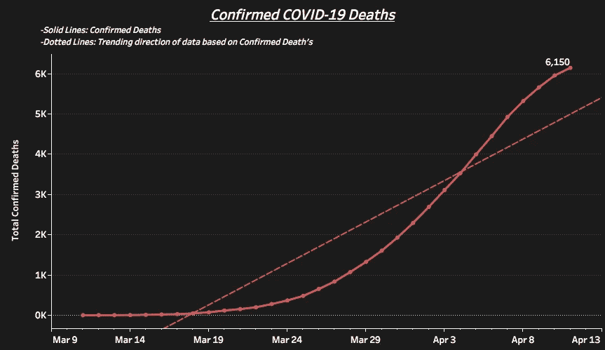

说明 6:截至 4 月 11 日的新冠肺炎确诊死亡总数

当我们看到这种病毒造成的伤亡人数时(图 6)，令人不安的是，它已经夺走了多少条生命，而且还会夺走多少条生命。截至 4 月 11 日，已有 6150 人因该病毒丧生。自 3 月 11 日首次报告死亡以来，死亡率倾向于遵循与确诊病例相同的趋势，但有大约一周的滞后时间。与我们在确诊病例中看到的类似，我们看到曲线从 3 月 24 日左右开始呈上升趋势，从视觉上看，数字在最近几天开始放缓。正如我们在图 7 和图 8 中看到的一周比一周的分析，我们从 4 月 5 日至 4 月 11 日报告了 2，621 例病例，这代表了比前一周报告的 2，457 例死亡增加了 6.67%。

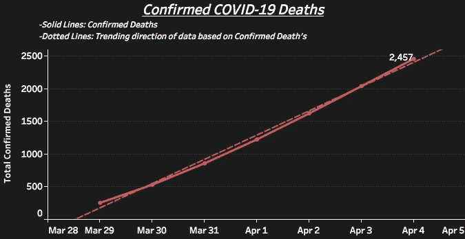

说明 7:3 月 29 日至 4 月 4 日期间的总确认死亡人数

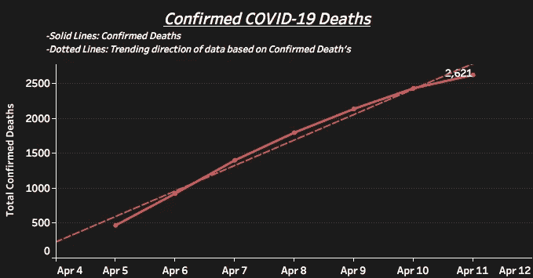

说明 8:4 月 5 日至 4 月 11 日期间的总确认死亡人数

然而，有一个好消息。在图 9 中，我们在日复一日的分析中看到，报告的死亡人数正在下降，因为过去 5 天中有 4 天报告的死亡人数较前一天有所下降，趋势开始指向正确的方向。尽管如此，这种病毒正在夺走太多的生命，我和其他所有人都希望看到这一数字尽快降至零。

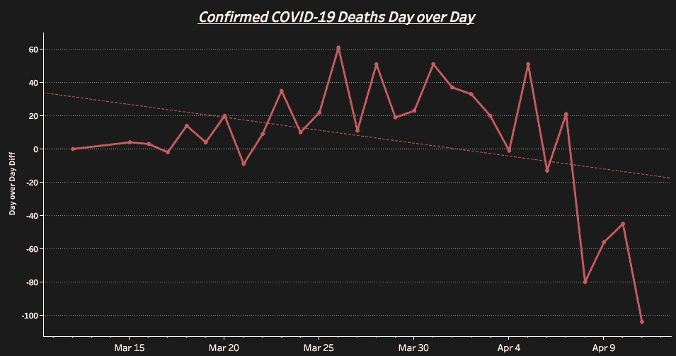

图 9:截至 4 月 11 日的一天中确认的新冠肺炎死亡人数

# 按行政区和邮政编码分列的确诊病例

我们现在将深入了解纽约市周围对人们来说风险较高的地区。在对数据进行了一点清理之后，我们能够创建一个 CSV，它能够按行政区和邮政编码显示确诊病例和确诊病例的百分比。确诊病例百分比的计算是确诊病例总数与接受检测的总人数之比。在查看这些数据时，我需要确定一个基线，来定义一个比其他区域更危险的区域。为此，我决定使用每个邮政编码的平均确诊病例数和每个邮政编码的平均确诊病例百分比，作为确定某些邮政编码是否是人们检测呈阳性的高风险地区的手段。截至 4 月 11 日，每个邮政编码的平均确诊病例数为 587.90，每个邮政编码的平均确诊病例百分比为 55.58%。

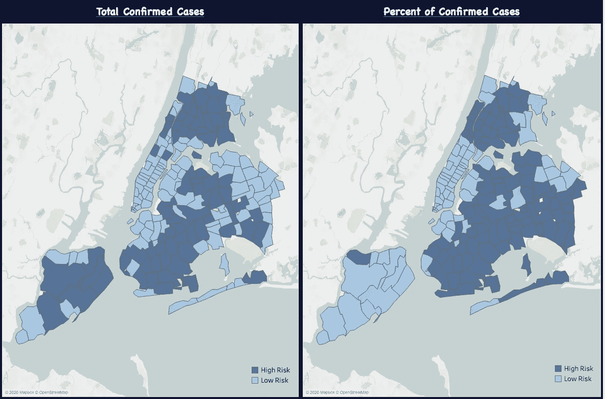

说明 10:截至 4 月 11 日按邮政编码分列的确诊病例总数。说明 11:截至 4 月 11 日按邮政编码分列的确诊病例总数百分比

根据图 10 和图 11，我们可以通过较暗的蓝色阴影看到基于上述基线的风险较高的区域。正如我们所看到的，暴露在病毒面前人数更多的地区是布朗克斯、布鲁克林和斯塔滕岛。然而，当我们去看看人们检测呈阳性的比率时，皇后区往往是那些正在接受检测的人更有可能感染的地区，而你去看看斯塔滕岛，那里有许多人被确认感染了病毒，然而，更多的人已经接受了检测，并返回了阴性结果。曼哈顿也显示出低风险，这往往是令人惊讶的，因为曼哈顿比其他地区更密集，预计会有更多的人被感染。

在图 12 和图 13 中，我们看到一个包含所有邮政编码的箱线图。如下图 12 所示，我们的数据倾向于向右倾斜，虽然我们的平均值为 587.90，但我们的中位数为 468.5，这表明我们有一半的数据实际上低于平均值。在观察这张图表时，我们注意到最右边的一点代表确诊病例最多的邮政编码。这是位于皇后区的邮政编码 11368。事实上，最右边的两个点都位于皇后区，并且彼此相邻，因为那个点的邮政编码是 11373。

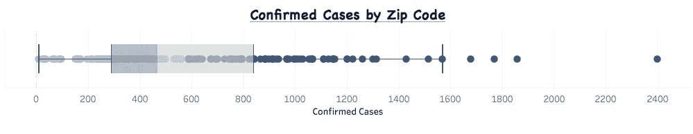

说明 12:按邮政编码分列的确诊病例方框图

现在，当我们检查下图 13 中按邮政编码列出的确诊病例百分比时，我们这里的数据倾向于向左倾斜。这告诉我们，纽约市有更多的邮政编码测试高于平均值，平均值为 55.58%，中位数为 57.32%。与图 12 中发生的情况相反，这只是向我表明，尽管在你的邮政编码区内可能不会发生很多阳性病例，但与大量确诊病例相比，你仍然更有可能不感染病毒。

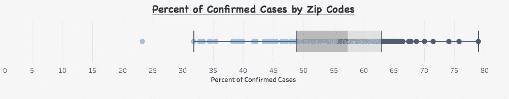

说明 13:按邮政编码分列的确诊病例百分比方框图

我们现在将对以下每个区的一些统计数据进行细分:

# 布朗克斯区

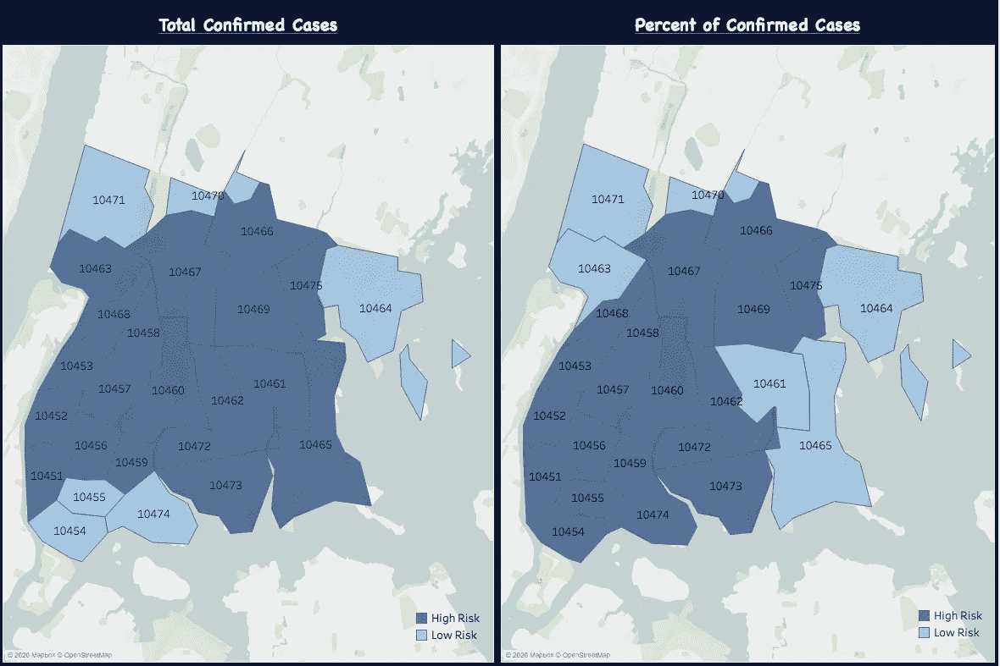

说明 14:按邮政编码划分的高风险区和低风险区的布朗克斯区

*   邮政编码为 884.80 的行政区平均确诊病例数最高
*   按邮政编码分列的确诊病例百分比平均值第三高的行政区，为 58.22%
*   确诊病例最多的邮政编码:10467 和 1796
*   最高确诊病例百分比的邮政编码:10468，占 66.20%

# 布鲁克林区

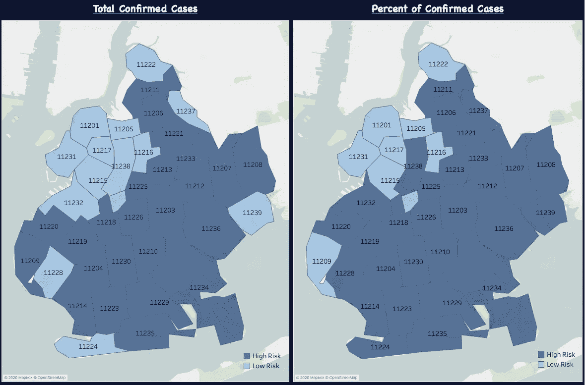

说明 15:按邮政编码划分的高风险区和低风险区的布鲁克林区

*   平均确诊病例数第二高的行政区，邮编为 732.8
*   按邮政编码分列的确诊病例百分比第二高的行政区，为 59.14%
*   确诊病例最多的邮政编码:11219 和 1679
*   最高确诊病例百分比的邮政编码:11219，占 67.81%

# 曼哈顿

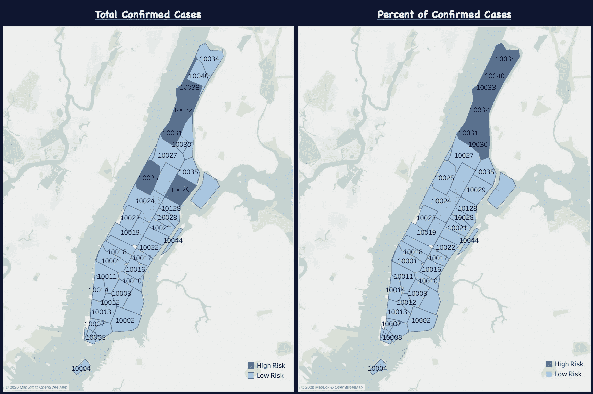

说明 16:曼哈顿区按邮政编码划分的高风险区和低风险区

*   邮政编码为 304.7 的最低平均确诊病例区
*   按邮政编码分列的确诊病例百分比平均值最低的行政区为 45.82%
*   确诊病例最多的邮政编码:10029 和 824
*   最高确诊病例百分比的邮政编码:10031 占 65.35%

# 昆斯区

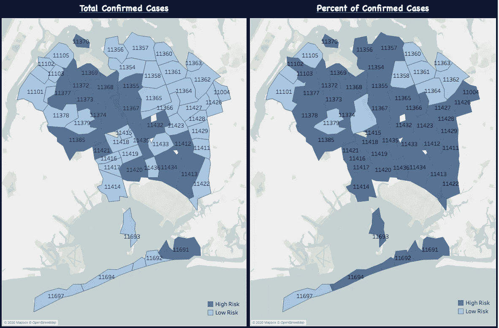

说明 17:按邮政编码划分的高风险区和低风险区皇后区

*   邮编为 556.9 的行政区平均确诊病例数第二低
*   按邮政编码分列的确诊病例百分比平均值最高的行政区为 60.69%
*   确诊病例最多的邮政编码:11368 和 2398
*   最高确诊病例百分比的邮政编码:11368，占 79.01%

# 斯塔腾岛

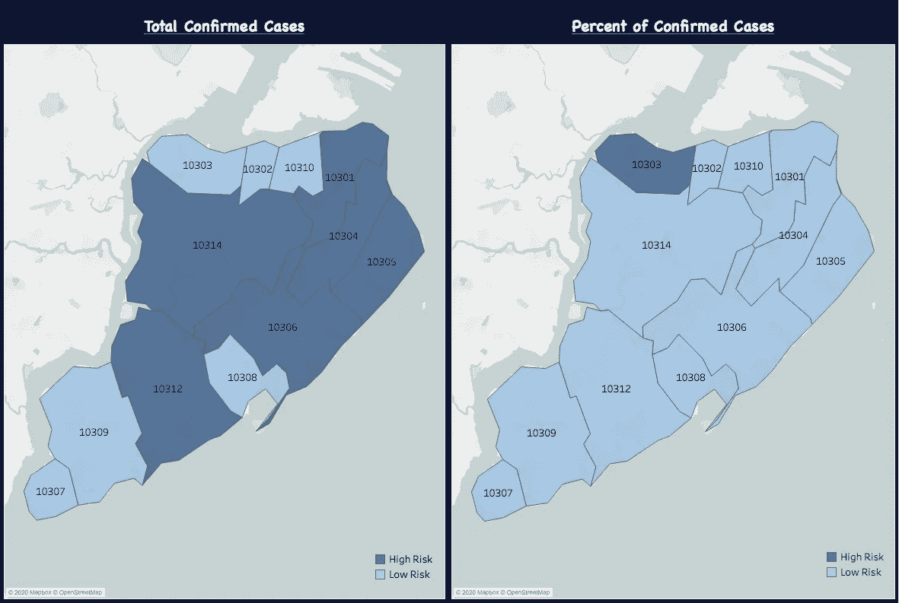

说明 18:按邮政编码划分的高风险区和低风险区

*   平均确诊病例数第三高的行政区，邮编为 664.00
*   按邮政编码分列的确诊病例百分比平均值第二低的行政区为 48.63%
*   确诊病例最多的邮政编码:10314 和 1569
*   最高确诊病例百分比的邮政编码:10303，占 56.12%

# 按年龄分列的确诊病例和死亡百分比

大多数人在新闻中听到的是，只有老年人最容易感染这种病毒。虽然这种说法有一部分是对的，但年轻一代似乎也有同样的机会得到它。根据下面的插图 19，从 3 月 26 日开始，它显示了年龄组如何分为 5 个不同的类别，以及这些年龄组感染病毒的百分比以及这些年龄组死亡的百分比。

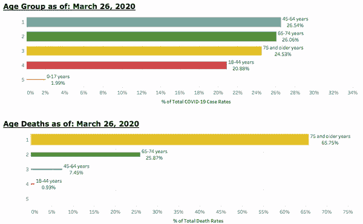

说明 19:3 月 26 日至 4 月 11 日期间按年龄组分列的病例和死亡百分比

正如我们在数据发布的第一天所看到的，数据显示 45-65 岁的人实际上是感染这种病毒最多的人。随着时间的推移，我们可以看到老年人的比例有所增加，现在 75 岁以上的老年人占 29.42%，65-74 岁的老年人占 26.37%。当观察 18-44 岁的年龄组时，尽管随着时间的推移感染病毒的人的百分比在下降，但您仍有可能感染病毒，目前的几率为 16.74%。

然而，当谈到死亡时，我们从新闻中听到的这种病毒实际上正在影响老年人。超过 90%因该病毒死亡的报告来自 65 岁以上的人，这一数字在数据收集过程中保持一致。

# 按性别分列的确诊病例和死亡百分比

随着新冠肺炎病毒首次开始传播，数据显示，被证实患有该病的男性多于女性。尽管在收集这些数据时变化很小，但性别之间的差距已经变小了。3 月 26 日的百分比显示，男性为 58.38%，女性为 41.62%。不过，截至 2020 年 4 月 12 日，男性的比例为 56.07%，女性的比例为 43.93%

然而，就死亡率而言，男性和女性之间的差距越来越大。3 月 26 日，男性为 74.18%，女性为 25.82%。截至 4 月 11 日，我们看到男性和女性的差距有所扩大，分别为 76.38%和 23.62%。

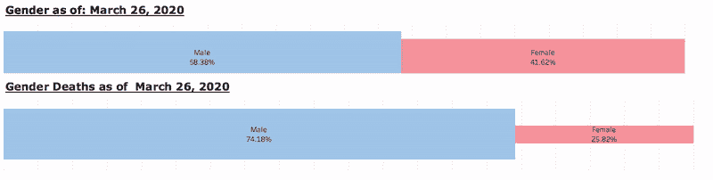

# 结论

总之，从我们收集的数据来看，我们开始看到在减缓这种病毒在纽约市地区传播的正确方向上的趋势。我们可以看到，社会距离和留在家里的法律已经生效，对减缓这种病毒产生了积极的影响。

谈到风险，我们了解到，老年男性，特别是 65 岁以上的男性，在面对这种病毒时必须格外小心。我们还发现，纽约市的某些区域更容易受到威胁，例如布朗克斯区、布鲁克林区以及皇后区的某些区域。

我花时间创建了一个交互式仪表板，让每个人都可以看到上面的所有信息。我会定期更新数据，让每个人都看到正在发生的趋势，让每个人都知道你所在地区的情况！见下面的 Tableau 仪表板的链接，让我知道你在数据中看到了什么！

[https://public.tableau.com/profile/gregory.rankel#!/viz home/NYCCOVID-19 analysis/dashboard 1](https://public.tableau.com/profile/gregory.rankel#!/vizhome/NYCCOVID-19Analysis/Dashboard1)

## 参考资料:

*   [https://www . health . ny . gov/statistics/cancer/registry/appendix/neighbor](https://www.health.ny.gov/statistics/cancer/registry/appendix/neighborhoods.htm)
*   https://github.com/nychealth/coronavirus-data