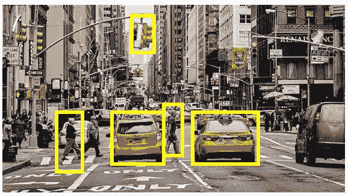

# 目标检测算法-R CNN 与快速-R CNN 与快速-R CNN

> 原文：<https://medium.com/analytics-vidhya/object-detection-algorithms-r-cnn-vs-fast-r-cnn-vs-faster-r-cnn-3a7bbaad2c4a?source=collection_archive---------5----------------------->

> 本文将描述用于任何对象检测问题的各种 R-CNN 算法之间的比较。假设本文的读者具有基本的 CNN 模型的先决知识，该模型通常用于图像分类。

# 图像分类和目标检测的区别