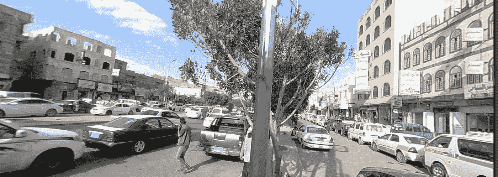
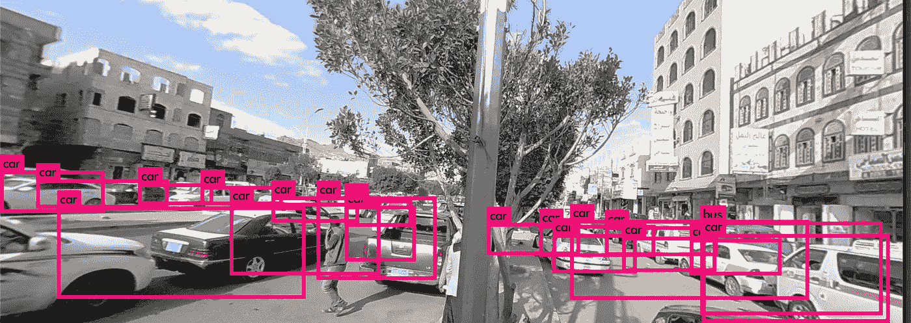

# 对象检测和深度学习:使用 YOLO 识别谷歌街景图像内容

> 原文：<https://medium.com/analytics-vidhya/object-detection-and-deep-learning-identify-google-streetview-image-content-using-yolo-in-r-bca631aa0bf3?source=collection_archive---------14----------------------->

> **谷歌街景**是谷歌地图和谷歌地球中的一项技术，可以从世界上许多街道的位置提供交互式全景。该项目于 2007 年在美国的几个城市启动，并已扩展到世界各地的城市和农村地区。有街景图像的街道在谷歌地图上显示为蓝线。
> 
> 谷歌街景显示拼接图像的全景。大多数摄影是通过汽车完成的，但也有一些是通过三轮车、船、雪地车、水下设备以及步行完成的。
> 
> 【https://en.wikipedia.org/wiki/Google_Street_View 

# **刮图像**

以下是你如何在谷歌地图中抓取谷歌街景的图片:

```
jpeg(file="/complete/URL/tofile/Sanaa1.jpeg")
google_streetview(location = c(15.3168264, 44.2289662),
                  size = c(400,600),
                  panorama_id = NULL,
                  output = "plot",
                  heading = 90,
                  fov = 90,
                  pitch = 0,
                  response_check = FALSE,
                  key = key)dev.off()
```



也门萨那街道的谷歌街景摘录

如果您打算一次使用多个图像，您可以运行一个“for”循环，从不同的位置抓取多个图像。

# **深度学习:物体检测——为什么选择 YOLO？**

> **你只看一次** (YOLO)是一个最先进的实时物体检测系统。在 Pascal Titan X 上，它以 30 FPS 的速度处理图像，在 COCO test-dev 上有 57.9%的 mAP:[https://pjreddie.com/darknet/yolo/](https://pjreddie.com/darknet/yolo/)
> 
> 暗网 YOLO 模型比基于分类器的系统有几个优点。它在测试时查看整个图像，因此它的预测由图像中的全局上下文提供信息。它还通过一个网络评估进行预测，不像 R-CNN 这样的系统需要数千个图像。这使得它速度极快，比 R-CNN 快 1000 多倍，比[快的 R-CNN](https://github.com/rbgirshick/fast-rcnn) 快 100 倍。
> 
> [https://pjreddie.com/darknet/yolo/](https://pjreddie.com/darknet/yolo/)

下面是将在我们提取的图像上实现的 3 行脚本，用于识别其内容:

```
#Image Detection
library(image.darknet)
#Import YOLO Tiny Model 
yolo_tiny_voc <- image_darknet_model(type = 'detect', 
 model = "tiny-yolo-voc.cfg", 
 weights = system.file(package="image.darknet", "models", "tiny-yolo-voc.weights"), 
 labels = system.file(package="image.darknet", "include", "darknet", "data", "voc.names"))
Output_image <- image_darknet_detect(file="/complete/URL/tofile/Sanaa1.jpeg", 
                          object = yolo_tiny_voc,
                          threshold = 0.12)
```



标签已经添加到我们的形象

> **改变检测阈值**
> 
> 默认情况下，YOLO 仅显示置信度为. 25 或更高的检测到的对象。您可以通过将`-thresh <val>`标志传递给`yolo`命令来改变这一点。例如，要显示所有检测，您可以将阈值设置为 0。
> 
> **对 YOLO 进行 VOC 培训**
> 
> 你可以从头开始训练 YOLO，如果你想玩不同的训练制度，超参数，或数据集。
> 
> **获取帕斯卡 VOC 数据**
> 
> 为了训练 YOLO，你需要 2007 年到 2012 年的所有 VOC 数据。你可以在这里找到数据[的链接。要获取所有数据，创建一个目录来存储所有数据，并从该目录运行:](https://pjreddie.com/projects/pascal-voc-dataset-mirror/)
> 
> `wget https://pjreddie.com/media/files/VOCtrainval_11-May-2012.tar
> wget https://pjreddie.com/media/files/VOCtrainval_06-Nov-2007.tar
> wget https://pjreddie.com/media/files/VOCtest_06-Nov-2007.tar
> tar xf VOCtrainval_11-May-2012.tar
> tar xf VOCtrainval_06-Nov-2007.tar
> tar xf VOCtest_06-Nov-2007.tar`
> 
> [https://pjreddie.com/darknet/yolo/](https://pjreddie.com/darknet/yolo/)