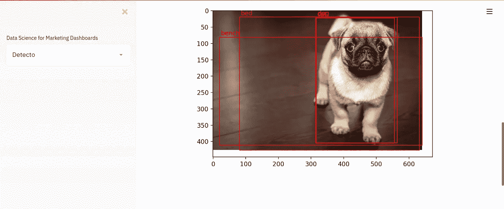

# 几行代码中的对象检测

> 原文：<https://medium.com/analytics-vidhya/object-detection-in-a-few-lines-of-code-40640fdb2c46?source=collection_archive---------8----------------------->


目标检测是计算机视觉的重要组成部分。这一事实可以在其众多应用中看到，如自动驾驶汽车的视觉、手机中的人脸检测、野生动物保护中的物种计数和跟踪等。然而，建立一个目标检测模型并不容易。对于经验丰富的机器学习工程师来说，这意味着使用 Tensorflow 对象检测 API 或其他框架的类似工具的几行代码。

另一方面，您也可以通过迁移学习将几个预训练模型(如 YOLOV3)中的一个用于您的自定义任务。还有其他对象检测平台提供商，如 CustomVision.ai、谷歌的 Cloud AutoML 等，它们为大多数业务需求提供易于使用的一键式解决方案。

# 探测器；新来的孩子

然而，在这个领域有一个新的产物，它既开源又易于用于物体检测。这个新来的孩子叫做[侦探](https://detecto.readthedocs.io/en/latest/#)。网站上的以下总结清楚地定义了 Detecto 是什么；

> [“Detecto](https://github.com/alankbi/detecto)是一个 Python 包，允许你只用 5 行代码就能构建全功能的计算机视觉和物体检测模型。对静态图像和视频的推断、对自定义数据集的迁移学习以及将模型序列化为文件只是 Detecto 的几个功能”

检测有很酷的功能，值得讨论。因此，在这篇文章和随后的几篇文章中，我们将使用 **Detecto** 用几行代码构建一个简单的对象检测器，并使用[**Streamlit**](http://streamlit.io/)**框架部署它。**

**不过，在我们开始之前，让我们定义一下什么是对象检测。对象检测涉及图像(和视频)中对象的定位和分类。这意味着它帮助我们定位一个物体的确切位置，并告诉我们这个物体属于哪一类。当然，它还可以对图像/视频中的多个对象进行定位和分类。听起来很酷，对吧？我知道！**

# **安装依赖项**

**让我们首先创建一个名为 object-detector 的文件夹(您可以随意命名)。接下来，使用 **python3 venv** 在文件夹中创建一个虚拟环境，命令如下**

```
$ python3 -m venv detecto
```

**现在，使用以下命令激活您的虚拟环境**

```
$ source detecto/bin/activate # if you are running on Linux or Mac$ detecto\Scripts\activate # for windows users
```

**现在您已经在虚拟环境中，使用以下命令安装您的依赖项**

```
pip install detectopip install streamlitpip install matplotlibpip install pillow
​# You can combine all that by running:pip install detecto streamlit matplotlib pillow
```

# **创建我们的模块和 UI**

**现在已经成功地安装了我们的依赖项，让我们开始主要的工作。首先，创建一个名为 app.py 的文件来保存应用程序的界面。然后添加以下代码；**

```
import streamlit as stfrom PIL import Imagefrom predict import cat_vs_dog, detecto_mimport matplotlib.pyplot as plt​def main(): st.markdown(“# Object Dector”) st.markdown(“#### A Simple Object detector using Detecto”) st.markdown(“ — -”) # getting the image from the user uploaded_file = st.file_uploader(“Choose an pic…”, type=”jpg”) if uploaded_file is not None: st.image(uploaded_file, caption=’Your Image.’,         use_column_width=True) st.success(“#### And taraaaaa!”) result = detecto_m(uploaded_file) # passing image to our function result = plt.plot() # plotting the result st.pyplot(result) st.balloons() #some fun ballons# to run our moduleif __name__==’__main__’: main()
```

**​**

**下面的代码从导入我们将使用的库开始。Streamlit 有许多很酷的预建 UI 组件，我们可以轻松地在我们的应用程序中使用，如文件上传器、markdown 输出、酷气球和用于显示图像的图像组件。**

# **创造我们的人造大脑**

**我们还从 predict.py 模块中导入了一个名为 detecto_m()的函数。现在让我们创建这个模块和函数。**

```
# the imports
from detecto import core, utils, visualize​def detecto_m(pic): image = utils.read_image(pic) model = core.Model() labels, boxes, scores = model.predict_top(image) result = visualize.show_labeled_image(image, boxes, labels) return result
```

**在短短 5 行代码中，我们有一个非常光滑的对象检测功能，能够检测 80 个对象类。多酷啊。很棒吧？**

# **运行应用程序**

**我们可以在终端中使用以下命令运行我们的应用程序**

```
$ streamlit run app.py
```

**和 taraaaa 您将在默认浏览器中看到类似下面的截图。**

****

**Detecto 是相当光滑，因此值得你的注意。让我们看看你用这个令人敬畏的包裹建造了什么。**