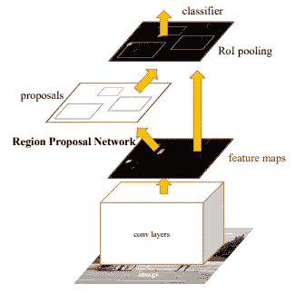
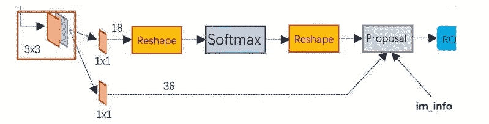
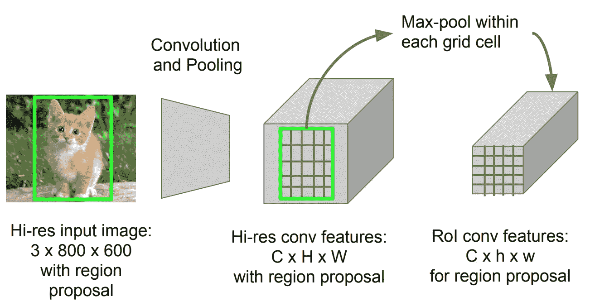
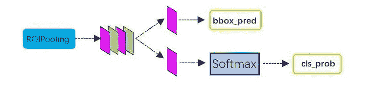

# 使用快速 RCNN 的目标检测

> 原文：<https://medium.com/analytics-vidhya/object-detection-using-faster-rcnn-2ef96661288a?source=collection_archive---------15----------------------->

快速 RCNN 是目标检测领域的经典算法之一。快速 RCNN 可以解决这个问题，快速 RCNN 使用第三方工具选择性搜索来提取区域建议。它用 RPN 代替选择性搜索，将整个目标检测功能纳入统一网络。RPN 基本上是卷积网络，它基本上有助于获得更优雅和有效的建议。

更快的 RCNN

最终目标是找出图像中对象可用的子集。除此之外，我们还将找出对象周围的边界框以及它所属的类。

**结构:**

**卷积层**:基本上是卷积、池化和重逻辑层，负责提取特征。这一层可以是 VGG、ResNet、InceptioNet、AlexNet、LeNet 类型的 CNN 架构。稍后用于 RPN 层和全连接层。

**区域提案网络(RPN) :** 主要用于生成区域提案。它获取特征地图数据并生成建议。它使用 softmax 函数来分类背景图像是阳性还是阴性(候选框)，并使用 bbox 对候选框执行回归校正以获得建议。

RPN 架构

可以看出，RPN 有两条线，上面的线用于使用 softmax 分类获得正锚或负锚。下面是用来找出偏移和纠正位置。提案的最后一层负责合成 bbox 回归偏移量对应的正锚点，以获得提案，同时删除太小和超出边界的提案。到提案层，完成了目标定位的功能。

**感兴趣区域**:收集提议和特征图，从提议中提取特征，并将其发送到全连通层，以找出目标类别。我们可以看到 ROI pooling 有两个输入(I)原始特征图(II)RPN 输出的建议框

建议的 RPN 箱尺寸与按 1:1、1:2 或 2:1 比例生产的锚箱尺寸不同。这可以在下一个网络中很好地排除故障。投资回报池有助于解决这个问题。

怎么会？。因为建议对应于 M * N 大小。首先使用空间比例参数将其映射回要素地图大小。现在对应于每个建议的特征地图区域被划分成网格。之后，在每个网格上应用最大池。因此，在结果输出应该是相同的大小。

**分类**:使用建议特征图计算特征类别和包围盒回归，得到更准确的定位。

参考:

 [## 假人的目标检测第 3 部分:R-CNN 系列

### 在第 3 部分中，我们将研究四种目标检测模型:R-CNN、快速 R-CNN、更快 R-CNN 和屏蔽 R-CNN。这些模型…

lilianweng.github.io](https://lilianweng.github.io/lil-log/2017/12/31/object-recognition-for-dummies-part-3.html)