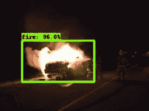
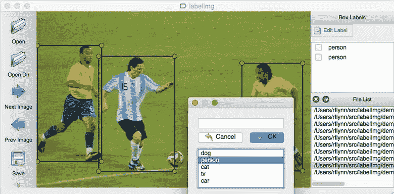
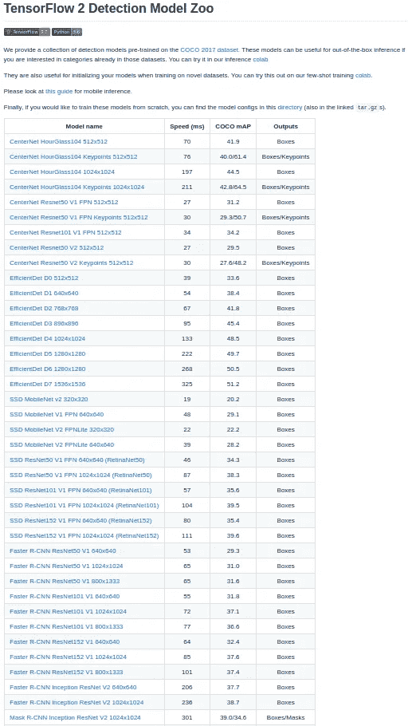

# 使用张量流 2 的对象检测

> 原文：<https://medium.com/analytics-vidhya/object-detection-using-tensorflow2-3422da78b33e?source=collection_archive---------27----------------------->

使用 TensorFlow 对象检测 API 对图像进行对象检测的简单方法。

Google 发布了新的运行在 TensorFlow 2 上的物体检测 API。

# 介绍

物体检测的一般步骤:
1。收集和标记数据
2。安装培训库
3。选择和训练模型

[我的 GitHub 回购](https://github.com/ManojKesani/fire_detection)

# 迁移学习

在训练模型的实践中，需要大量的标记数据
，这并不总是可能的。因此，我们在巨大的公共数据集上训练一个网络。以此为起点，我们然后根据我们的
定制数据训练网络。这里的假设是，模型将学会从较大的数据集识别
模式，并帮助我们在
小数据集上更好地收敛。一般来说，库提供预先训练的模型，我们从那里开始。

## 1.收集和标注数据

收集数据时，应注意涵盖各种照明
条件，如白天、夜晚、多云、..等等。这有助于开发稳健的型号
。收集后，将图像的名称随机化是一个好主意。这将有助于我们直接与他们合作，而不用担心打乱数据和标签。
*提示:拥有多个对象时，在数据集中重叠对象会有所帮助。*

LabelImg 是一种用于标记数据集的流行工具，可通过 pip 在系统中安装 label img
进行安装。安装后，导航至
数据文件夹并开始贴标签。在感兴趣的物体周围画一个方框，并给出它们的名称。这将为所选目录中的每张图片
创建带有标签的 XML 文件。现在我们有了标记的数据，我们将它们分成
训练和测试目录。应该达到的比率
主要取决于数据集的大小，通常建议 80/20。
*提示:A、D 是上一张、下一张图像的快捷键。r 用于调出矩形标注工具。*

## 2.安装培训图书馆

训练神经网络需要 NVIDIA 驱动程序。对于软件和更新中的 Ubuntu
，进入 Ubuntu 软件，将下载从
改为“主服务器”，然后在附加驱动中选择版本 435(我已经在这个驱动上测试了
)。下载并安装 cuda10.0，并将路径添加到。bashrc

*导出路径=/usr/local/cuda-10.0/bin $ { PATH:+:$ { PATH } }
导出 LD _ LIBRARY _ PATH =/usr/local/cuda-10.0/lib 64 $ { LD _ LIBRARY _ PATH:+:$ { LD _ LIBRARY _ PATH } }*

然后在 Nvidia developers 上注册并下载 cuDNN 库
并遵循安装过程。不同
版本的兼容性列表可在[这里](https://docs.nvidia.com/deeplearning/sdk/cudnn-support-matrix/ index.html)找到。

*   对于 TensorFlow，pip 安装-升级 tensorflow-gpu
*   对于探测器 2，去 pytorch.org 选择你的设置并安装
    pytorch 1.4。(在 GCC 5.6 上测试)

上述库的深入文档可从以下网址获得

 [## 安装- TensorFlow 2 对象检测 API 教程文档

### 虽然安装和使用 TensorFlow 并不一定要有 Anaconda，但我建议这样做，因为它…

tensor flow-object-detection-API-tutorial . readthedocs . io](https://tensorflow-object-detection-api-tutorial.readthedocs.io/en/latest/install.html#tensorflow-gpu)  [## 安装-检测器 2 0.2.1 文档

### 编辑描述

detectron2.readthedocs.io](https://detectron2.readthedocs.io/tutorials/install.html) 

## 3.选择和训练模型

[https://github . com/tensor flow/models/blob/master/research/object _ detection/g3doc/tf2 _ detection _ zoo . MD](https://github.com/tensorflow/models/blob/master/research/object_detection/g3doc/tf2_detection_zoo.md)

TensorFlow 提供了许多用于检测的模型，我选择了 efficientdet_d0 进行训练，因为最终的模型大小较小，并且易于共享最终训练的权重(易于下载和上传)。所以我们下载 efficientdet_d0 的权重。除此之外，我们还需要一些来自我的 github repo 的文件，它们是

*   generate_tfrecord.py —将 XML 转换为 TF 记录。(来自文档)
*   label map . Pb txt-包含标签 FIRE
*   pipeline.config —包含培训结构，如班级数量、学习率、批量大小...等等

现在，我们从 XML 文件生成 Tf 记录，并开始训练。文献建议在终止前达到 1 的损耗，但由于数据集非常小，损耗从 0.6 开始，在 6300 步后达到 0.2 的平稳状态。现在，在终止训练之后，我们导出用于推理的模型。

我们定义一个检测函数，将模型加载到内存中。这个训练过的模型权重也和测试图片一起在我的 Github repo 中。对于这个函数，我们提供了一个到我们想要推断的图像的路径列表，然后可视化输出。

## 输出

代码的推理部分加载权重，如果检测置信度大于 0.5，则绘制一个边界框。将打印一份声明，说明“着火”或“不着火”，可用作报警系统的触发器。

模型剪枝和量化可以进一步提高推理速度。