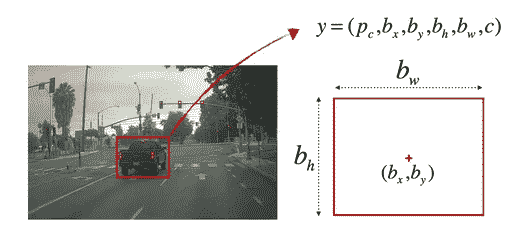
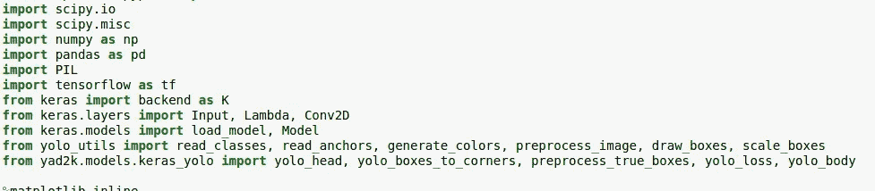
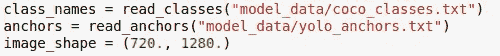
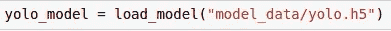
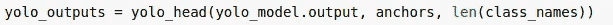
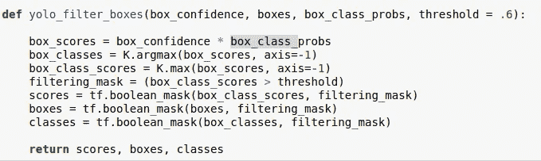
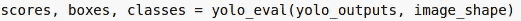
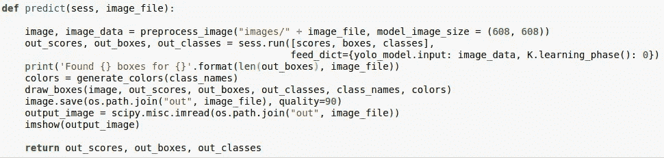
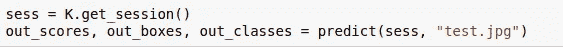
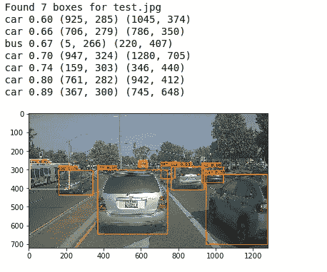

# 使用 YOLO 的对象检测和汽车检测实现

> 原文：<https://medium.com/analytics-vidhya/object-detection-using-yolo-and-car-detection-implementation-1ec79e882875?source=collection_archive---------5----------------------->

使用滑动窗口进行目标定位有几个缺点，例如选择合适的内核大小、步幅等。这导致高计算成本。

# **简介**

《YOLO》(你只看一次)由约瑟夫·雷德蒙、桑托什·迪夫瓦拉、罗斯·吉斯克和阿里·法尔哈迪于 2015 年推出。YOLO 最大的优点是它在实现高精度的同时还能实时运行。YOLO 的方法是将目标检测作为一个回归问题，并将其完全传递给一个连接的神经网络。该系统将输入图像分成 S×S 网格，并且每个网格单元预测边界框、这些框的置信度、类别概率。这些预测被编码为 s×s×(B∫5+C)张量。

图一。展示了 YOLO 模型的工作原理

除了类别概率之外，每个边界框还有 5 个附加值，如下所示:

1.  Pc:物体出现在包围盒中的置信度
2.  bx，by:对象的中心坐标，如果有的话。如果没有对象存在，则该值为“无关”。
3.  bh，bw:当前物体的高度和宽度。如果没有对象存在，则该值为“无关”。
4.  c:被检测对象的类别

图二。表示边界框的参数

YOLO 架构由 24 个卷积层和 2 个全连接层组成。交替的 1×1 可选层减少了先前层的特征空间。网络的最终输出是 7×7×30 个预测张量。

## **非最大抑制**

当同一个对象出现在几个网格单元中时，就有了非最大抑制的概念。该算法然后可以检测具有不同置信度得分的相同对象周围的几个边界框。非最大值抑制抑制 Pc 值低于特定阈值的值(检测)。首先，它选择最高的 Pc 或 IOU 值，并抑制低于该值的所有值。然后选择第二高的并继续这个过程。以下是步骤:

**第一步:**预测所有网格对象的【Pc，bx，by，bw，bh】。

**第二步:**当 Pc≤0.6(阈值)时报废。这是低概率的有条件丢弃。

**步骤 3:** 当有剩余的盒子时:
**步骤 3.1** :选取 Pc 最大的盒子，并将其作为预测输出。
**步骤 3.2** :丢弃 IOU≥0.5 的盒子(剩余)，输出在步骤 3.2 中预测。
**步骤 3.3** :返回步骤 3

# **汽车检测使用(在 Keras 中实现):**

*   **输入**是一批图像，每个图像的形状为(m，608，608，3)
*   **输出**是一个包含已识别类的边界框列表。每个包围盒由 6 个数字表示( *pc* 、 *bx* 、 *by* 、 *bh* 、 *bw* 、 *c* )(pc、bx、by、bh、bw、c)。输出维度为(19，19，5，85)
*   我们选择了 5 个锚箱来覆盖 80 个班级
*   YOLO 的架构是:图像(m，608，608，3) ->深度 CNN ->编码(m，19，19，5，85)
*   然后，我们只选择几个盒子，基于:分数阈值:丢弃已经检测到分数小于阈值的类的盒子
*   非最大抑制:计算并集上的交集，避免选择重叠的框
*   以上步骤给出了最终的 YOLO 输出。

## 让我们开始编码:

1.  导入所需的库

导入所需的库

2.接下来，我们读取类、锚盒并设置输入图像形状。
class . txt 参考[链接](https://gist.github.com/AruniRC/7b3dadd004da04c80198557db5da4bda)，anchors.txt 参考[链接](https://github.com/JudasDie/deeplearning.ai/blob/master/Convolutional%20Neural%20Networks/week3/model_data/yolo_anchors.txt)

阅读类、锚和图像形状

3.因为训练大型数据集需要很长时间，所以让我们下载训练好的 YOLO 模型并加载它。参考[链接](https://www.google.com/url?sa=t&rct=j&q=&esrc=s&source=web&cd=&ved=2ahUKEwjGnNXfi_3sAhXrzDgGHSMxC1EQFjAAegQIAxAC&url=https%3A%2F%2Fgithub.com%2FOlafenwaMoses%2FImageAI%2Freleases%2Fdownload%2F1.0%2Fyolo.h5&usg=AOvVaw0J6cPR1x27wCKXmrin_Hwn)下载 pickle 文件。

加载下载的预训练 YOLO 模型

4.以下命令处理并转换输出张量

实现用于处理输出的 YOLO 头

5.接下来，我们需要实现一个函数来过滤盒子。下面的函数执行两件事。首先，它通过用盒类概率乘以盒置信度来计算分数。通过这样做，我们可以拒绝低于某个阈值的盒子。其次，它通过选择最大值来输出盒子所属的类。

实现过滤盒功能

调用实现的函数

现在我们已经初始化了所有需要的参数，现在我们可以编写 predict 函数来测试我们的图像模型。下面的函数处理一个输入图像，在初始化的分数、盒子和类上运行会话。然后，我们使用不同的颜色在不同的类名上生成和绘制边界框，并保存图像文件。现在，我们还可以看到使用 imshow 和带有类标签的边界框的坐标的输出图像

用于检测图像中对象的预测函数

通过传递所需的参数来调用预测函数

运行预测函数后的输出