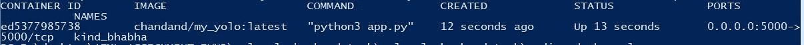
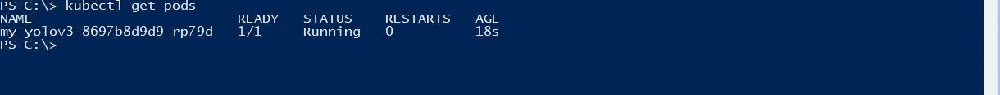

# 使用 YOLO v3 进行对象检测，并在 Kubernetes 上使用 Flask 和 Docker 进行部署

> 原文：<https://medium.com/analytics-vidhya/object-detection-using-yolo-v3-and-deploying-it-on-docker-and-minikube-c1192e81ae7a?source=collection_archive---------1----------------------->


我多次听说过 Yolo，但从未尝试过。今天我想尝试一下，看看它在图像上的表现如何。因为我已经爱上了 Docker，所以我也会将它 Dockerize 并部署在 Minikube 上。抓紧了！

首先要做的事！你需要以下的东西来开始。我给你下载的链接。

1.  Yolo_v3 重量:[https://pjreddie.com/media/files/yolov3.weights](https://pjreddie.com/media/files/yolov3.weights)
2.  Yolo_v3 cfg 文件:【https://github.com/pjreddie/darknet/tree/master/cfg T3
3.  标签文件:[https://github . com/pjreddie/darknet/blob/master/data/coco . names](https://github.com/pjreddie/darknet/blob/master/data/coco.names)

如果你想使用 Yolo_v3 tiny，那么从[这里](https://github.com/pjreddie/darknet)下载并使用各自的权重和 cfg 文件(yolov3-tiny.cfg，yolov3-tiny.weights)。

现在，让我们开始编写代码，使用上述预训练的权重进行对象检测。

创建一个 python 文件(比如 detect.py ),并插入以下代码来导入必要的包并设置置信度阈值

现在，让我们编写一些函数来加载模型，并准备好进行预测。

对图像进行预测的函数如下:

嘭！！我们准备测试它。让我们编写 main()函数来读取图像并检测其中的对象。

在末尾插入下面的代码来调用 main 函数

```
if __name__== "__main__":
  main()
```

您将在屏幕上看到一个弹出窗口，显示检测到的类别和模型的置信度值。用一些不同的图像来测试它，看看它的表现如何。

现在让我们使用 flask 将这个模型公开为 REST API！检查并安装 Python 3 的 flask。x 在你的系统上。现在只需很少的改动，你就可以通过 API 调用这个模型了。我不会在这里讨论烧瓶的基础知识。你可以在这里找到更多关于烧瓶[的参考资料。](https://www.tutorialspoint.com/flask/index.htm)

上面的代码将在端口 5000(默认的 flask 服务器端口)上创建一个 flask 服务器，您可以使用 API“http://localhost:5000/API/test”访问该模型。要测试 API，请使用以下命令:

```
curl.exe -X POST -F image=[@test1](http://twitter.com/test1).jpg 'http://localhost:5000/api/test' --output test.png
```

您可以在“test.png”图像中检查模型的输出。


test.png

到目前为止一切顺利！是时候使用强大的码头工人了！。我们开始吧！！！！！！

首先按照这里的说明安装 docker:([Ubuntu](https://phoenixnap.com/kb/how-to-install-docker-on-ubuntu-18-04)或者 [Windows](https://docs.docker.com/v17.09/docker-for-windows/install/) )。我更喜欢在 Linux(Ubuntu)上运行 docker。在 Ubuntu 上安装和运行 docker 是小菜一碟，但在 windows 上可能不是这样。

要从该项目创建 docker 映像，首先将 python 脚本文件(detect.py)重命名为 app.py。在构建 docker 映像期间，使用主可执行脚本作为 app.py 会更方便。在编译之前，您必须在文件名“requirements.txt”中列出所有必需的包。对于这个项目，requirement.txt 将如下所示:

```
Flask
pybase64
jsonpickle
pillow
numpy
opencv-python
```

现在创建一个名为“Dockerfile”的新文件，并将下面的代码行放入其中。

```
FROM ubuntu:18.04
#MAINTAINER <your name> "<your email>"
RUN apt-get update -y && apt-get install -y python3-pip python3-dev libsm6 libxext6 libxrender-dev
#We copy just the requirements.txt first to leverage Docker cache
COPY ./requirements.txt /app/requirements.txt
WORKDIR /app
RUN pip3 install --upgrade pip
RUN pip3 install -r requirements.txtCOPY . /appENTRYPOINT [ "python3" ]CMD [ "app.py" ]
```

该项目已准备好使用 Docker 进行编译。用 docker 编译它，从项目的父目录运行下面的命令。

```
docker build -t my_yolo:latest .
```

成功构建后，您将获得以下消息:


docker 的成功构建

通过以下命令运行新构建的 docker 映像:

```
docker run -d -p 5000:5000 my_yolo:latest
```

检查 docker 映像是否存在以及映像的运行状态。

```
docker images
docker ps -a
```



命令“docker ps -a”的结果

如果状态是 Up，那么一切正常，否则你可以使用“docker log <container id="">”命令进行调试，看看哪里出错了。</container>

现在让我们开始将 Docker 映像部署到在 Windows 10 上本地运行的 Minikube。

启动 Minikube

```
minikube start
```


Minikube 开始了！

如果你的 Minikube 像上面的快照显示的那样启动良好，那就去给自己拿一块巧克力吧！我在 Minikube 上遇到了很多问题，花了将近一天半的时间才解决

现在我们将继续尝试使用 Minikube 部署我们的 Docker 映像。首先，我们必须启动 Minikube docker demon 来使用我们系统中的 docker 映像。要开始在 Minikube 中使用 Docker，请运行以下命令:

```
minikube docker-env
```

现在要配置我们的 shell，我们必须运行以下命令:

```
minikube docker-env | Invoke-Expression
```

现在您的 shell 被配置为使用 Minikube 的 Docker 环境。继续检查那里的 docker 图像。执行“docker images”命令后，您将看到 Minikube 的存储库，其中包含标签、图像 ID 和大小。

现在我们将不得不构建我们的映像来运行这个 Minikube Docker 环境。转到您的项目目录，用 dockerizing 我们的项目一节中提到的命令构建您的项目。如果你不想重新构建，并且你已经把你的 docker 镜像放到了像 Docker Hub 这样的仓库中，那么你可以直接从那里取出你的镜像并使用它。

成功构建/拉取后，您将能够使用“docker images”命令查看您的 docker 映像。


在 Minikube 中成功构建/提取 docker 映像。

现在我们的映像已经准备好进行部署了！我们将使用 **kubectl** 来运行容器，并将其作为服务公开。要启动容器，请运行以下命令:

```
kubectl run my-yolov3 --image=chandand/my_yolo --port=8500 --image-pull-policy=IfNotPresent
```

您将在终端上获得“deployment . apps/my-yolo v3 created”输出。您可以看到 Pod 是使用以下命令创建的:

```
kubectl get pods
```



Pod 创建成功

检查 Pod 的状态。如果状态为“正在运行”,那么我们可以使用以下命令将其公开给外部流量:

```
kubectl expose deployment my-yolov3 --type="LoadBalancer"
```

让我们查看一下我们刚刚创建的服务。

```
kubectl get services
```


服务被创建并作为负载平衡器公开

您可以在 web 浏览器中查看您的 Minikube 部署！键入以下命令启动 Minikube 仪表板。

```
minikube dashboard
```


Minikube 仪表板

您可以通过各种方式访问您的 flask server API 和部署模型。有三种方法可以访问应用程序

1.  通过 Pod IP
2.  通过服务 IP
3.  通过节点端口

访问应用程序的最佳方式是将其暴露给外部流量，并通过节点端口进行访问。

您还可以进行端口转发，以便在本地测试和调试您的 API。要进行端口转发，请使用以下命令:

```
kubectl port-forward my-yolov3-8697b8d9d9-rp79d 5000:5000
```

这里“my-yolov 3–8697 b8d9d 9-rp79d”是我的 pod 的完整名称。你可以用 Postman 来测试你的 API。该模型将可在 API '[http://localhost:5000/API/test](http://localhost:5000/api/test)上访问


在邮递员上测试 API

万岁！！我们在 Kubernetes 上为 Darknet 的 YOLO-v3 对象检测模型部署了一个完美的工作 API。你现在一定有这种感觉:


如果你想了解更多，更好地了解 YOLO，你可以继续尝试创建一个应用程序，将使用网络摄像头作为输入，并实时检测物体(耶！你可以用 YOLO 做实时物体检测)。

有很多改进和修改可以在这个项目中完成。如果需要，我会试着再写一篇关于在网络摄像头上使用 YOLO 和在 AWS、Azure、Google Cloud 或 IBM Cloud 的 Kubernetes 服务上部署它的博文。


请在评论区分享你的想法，如果你喜欢就鼓掌。现在我要让我过热哭泣的电脑休息了。下次见！:)