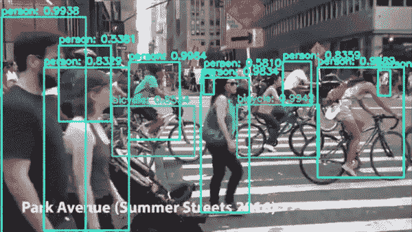
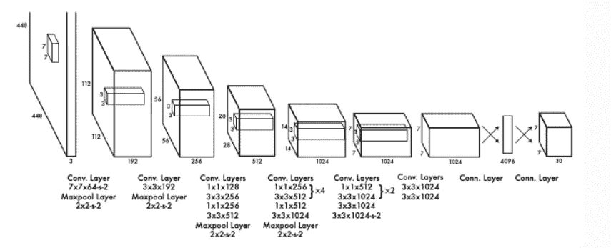
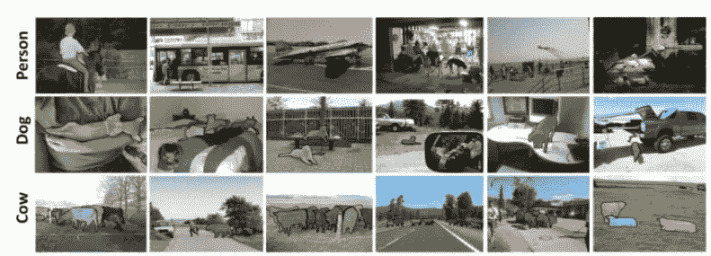
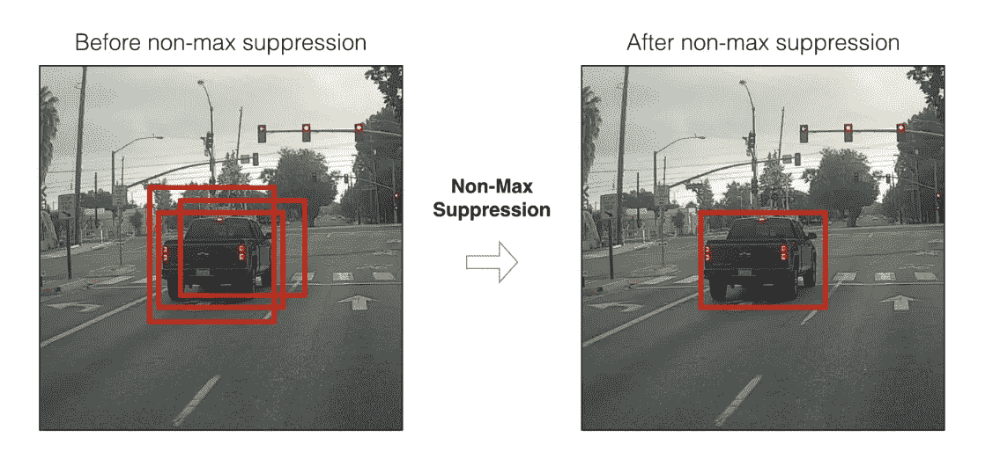
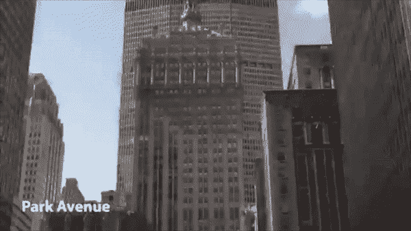

# 使用 YOLOv3 的对象检测

> 原文：<https://medium.com/analytics-vidhya/object-detection-using-yolov3-d48100de2ebb?source=collection_archive---------7----------------------->

使用 YOLOv3 使用 COCO 数据集检测对象。

## 什么是 YOLO？

YOLO——你只看一次——是一种非常快速的多对象检测算法，它使用卷积神经网络(CNN)来检测和识别对象。

神经网络具有这样的网络结构。

来源:[https://arxiv.org/pdf/1506.02640.pdf](https://arxiv.org/pdf/1506.02640.pdf)

## 什么是 COCO 数据集？

上下文中的常见对象( **COCO** )上下文中的常见对象( **COCO** )是一个数据库，旨在实现对象检测、实例分割、图像字幕和人物关键点定位的未来研究。COCO 是一个大规模的对象检测、分割和字幕数据集。

来自 COCO 数据集的样本。

## #工作流程:-

1)读取输入视频

2)加载 YOLO v3 网络

3)读取循环中的帧

4)从帧中获取斑点

5)实施向前传球

6)获取边界框

7)非最大抑制

8)绘制带有标签的边界框

9)写入处理过的帧

# Result:
带有检测到的对象、边界框和标签的新视频文件

## 步骤 1:导入库并设置路径

Will 将使用 cv2 中的 VideoCapture 功能导入要在其中识别对象和标签的视频。

## 步骤 2:加载 YOLOv3 型号:-

我们需要从[这里的](https://pjreddie.com/darknet/yolo/)加载 YOLOv3 模型的权重和配置文件。您可以从[这里](https://github.com/pjreddie/darknet/blob/master/data/coco.names)下载 coco 数据集名称文件，并正确设置路径。

## 步骤 3:读取框架

我们从视频文件中一个一个地读取帧。

## 第四步:获得斑点

一个斑点是一个 4D numpy 数组对象(图像，通道，宽度，高度)。它具有以下参数:

*   要变换的**图像**
*   **缩放**因子(1/255)将像素值缩放至[0..1])
*   **尺寸**，这里是一个 416x416 的正方形图像
*   **表示**值(默认值=0)
*   选项 **swapBR=True** (因为 OpenCV 使用 BGR)

## 步骤 5:实现向前传递

通过网络传递每个 Blob。

## 步骤 6:获取边界框:-

这里我们得到了边界框。

## 步骤 7:-非最大抑制。

邻域窗口在某种程度上具有相似的分数，并且被认为是候选区域。这导致了数百个提议。由于建议生成方法应该具有高召回率，所以我们在这一阶段保持宽松的约束。然而，通过分类网络处理这么多建议是很麻烦的。这就产生了一种技术，这种技术基于一些被称为非最大抑制的标准来过滤提议。

## 步骤 8:绘制边界框:-

我们为帧中检测到的每个对象绘制边界框。我们使用 CV2.rectangle 函数来绘制。

## 步骤 9:在文件中写入处理过的帧:-

在最后一步中，我们在视频帧中写入提议的边界框和标签，并保存它。

完整代码位于:-

 [## pratikpatil 699/object detection _ yolov 3

### 在 GitHub 上创建一个帐户，为 pratikpatil 699/object detection _ yolov 3 开发做贡献。

github.com](https://github.com/pratikpatil699/objectdetection_yolov3) 

## 输出带标签的视频:-

