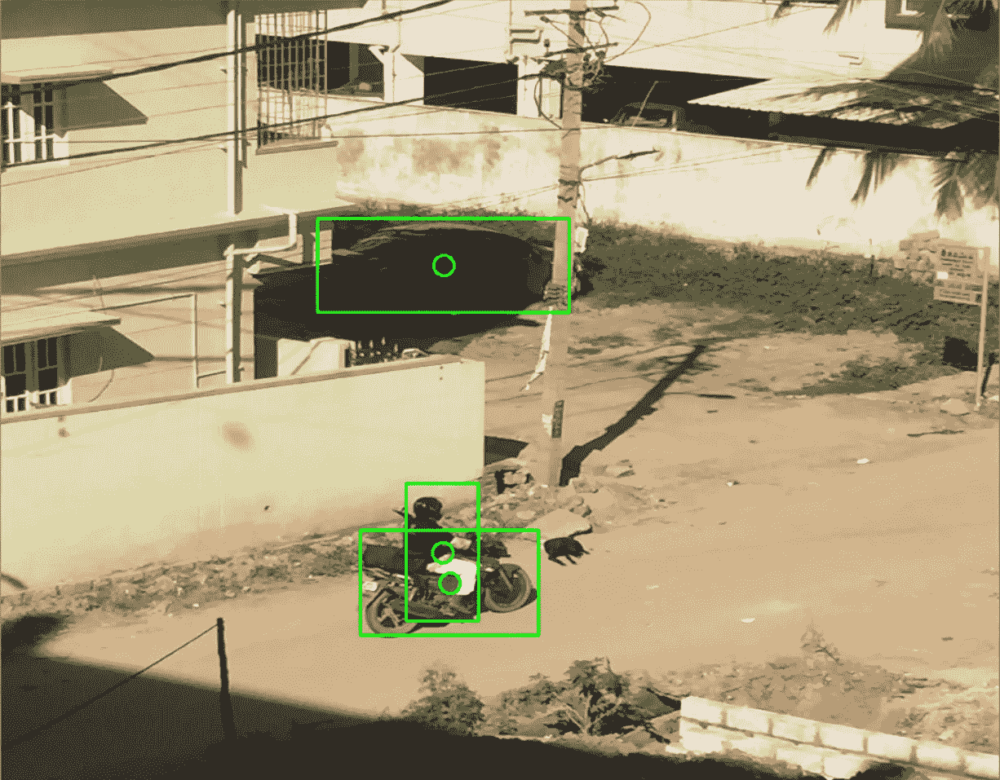

# 使用 YOLOv3 的 OpenCV-Python 的对象检测

> 原文：<https://medium.com/analytics-vidhya/object-detection-with-opencv-python-using-yolov3-481f02c6aa35?source=collection_archive---------1----------------------->

使用 YOLOv3 算法检测汽车、摩托车和人

大家好。

目标检测正在成为计算机视觉中一个引人入胜的应用和研究领域。由于更快的计算能力和先进的算法，我们正在通过使用图像和视频让计算机像人类一样理解。

在本文中，我们将看到如何使用 OpenCV 和 Python，通过应用最流行的 YOLO(你只看一次)算法来检测静态图片中的对象。

我假设:

你对 Python 有一定的了解，熟悉 IDE — Jupyter notebook。你已经了解了卷积神经网络(CNN)的工作原理*(我推荐吴恩达教授在 CNN 上的课程* [*Coursera*](https://www.coursera.org/learn/convolutional-neural-networks?specialization=deep-learning) *进行学习)*

几个澄清:

OpenCV 是计算机视觉库/框架，我们将使用它来支持我们的 YOLOv3 算法。OpenCV 内置了对暗网架构的支持。

暗网架构是用于分类 80 个不同类别的预训练模型。我们现在的目标是，我们将在 OpenCV 中使用 Darknet(YOLOv3)来使用 Python 语言对对象进行分类。

我们开始吧。

YOLO 是一个物体检测算法*(查看论文出来吧 2015* [*这里*](https://arxiv.org/pdf/1506.02640.pdf) *)。*最新的 YOLOv3 比基本的 YOLO 和 YOLOv2 更强大，比 R-CNN 等以前的算法更快，也更准确。核心原因是各层的卷积实现，这意味着与需要多次扫描的其他算法相比，它只扫描图像(或帧)一次来进行预测。(卷积的幂。耶！)

设置:

我们需要 3 个主要文件

1.  yolo.cfg(从此处[下载](https://github.com/pjreddie/darknet/blob/master/cfg/yolov3.cfg) ) —配置文件
2.  yolo.weights(从[这里](https://pjreddie.com/media/files/yolov3.weights)下载)——预训练的重量
3.  coco.names(从[这里下载](https://github.com/pjreddie/darknet/blob/master/data/coco.names) )- 80 个班级名字

让我们开始编码:

这里我用的是 Jupyter 笔记本。

第一步是导入 cv2 和 numpy 库。然后我们通过传递权重和 cfg 文件使用 **cv2.dnn.readNet** 加载 yolo v3 算法。然后，我们将使用 coco.names 文件加载数组中的所有类名。

接下来我们将定义输出层，因为我们将在那里使用**net . getunconnectedoutlayers**和 **net.getLayerNames.** 来定义要检测的对象

接下来让我们加载一个图像。我们将把图像的高度和宽度缩小到 40%和 30%。并将所有这些值保存在原始图像的**高度、宽度、通道**变量中。

要查看图像，请使用下面的代码，但要记住将下面的代码放在文件的末尾。任何代码总是在下面三行的上面。

原象

这是我们的原始图像，我们希望从中检测尽可能多的对象。但是我们不能把这个图像直接交给算法。所以我们需要从这个图像做一些转换。这被称为斑点转换，基本上是从图像中提取特征。

我们将通过使用 **cv2.dnn.blobFromImage** 并传递几个变量来检测 blob 中的对象: **img** 是文件名，比例因子为 0.00392，要在 blob 中使用的图像大小为(416，416)，从层中减去平均值为(0，0，0)，设置 **True** 标志意味着我们将使用红色反转蓝色，因为 OpenCV 使用 BGR，但我们在图像中有通道为 RGB。

现在让我们通过使用下面的代码来看看 3 个不同的 blobs 是什么样子的。我们没有观察到太多的差异，但这是我们将输入到 YOLO 算法。

我们现在使用 **net.setInput(blob)** 将这个 blob 传递给网络，然后将它转发给 **outputlayers。**此处所有对象都已被检测到，并且 **outs** 包含我们需要指示提取对象位置的所有信息，如顶部、左侧、右侧、底部位置、类别名称。

现在让我们通过在屏幕上显示信息来评估**输出**。主要我们将试图预测置信度，意思是当算法预测某个对象时，它有多有把握。为此，我们将循环通过**出局，**首先获得每个**出局**的所有**分数**。然后获取其中得分最高的 **class_id** ，然后通过传递 **class_id** 将**置信度**赋给**得分**的值。

现在，我们将置信度阈值指定为 0.5。任何高于 0.5 的值都意味着检测到物体。设**中心 x，中心 y，w** 为宽度， **h** 为被检测物体的高度。这里我们将我们先前保存的原始图像的**高度、宽度**变量。我们还将在物体的中心画一个厚度为 2 的圆，只是为了证明物体已经被检测到。

进一步让我们通过使用 **center_x，center_y，w，h** 在被检测对象周围绘制矩形。并附加一些信息到像**类，信心。**

运行上面的代码会产生以下输出。

可能会有这样的情况，同一个对象可能会被多次检测到，如下所示。(在我上面的测试图像中，没有检测到多个对象，所以我使用下面的不同图像来显示该场景)。您可以看到笔记本电脑和显示器各检测到两个框。我们想消除这种情况。

为了消除这种情况，我们将使用非最大抑制(NMS)功能。这将通过使用某个阈值(任何具有小于 0.6 的值的框将被移除)来消除框，并且它确定仅保留所有框中最好的。并且**索引**变量将跟踪这种被检测到的独特物体。因此不会多次检测到相同的对象。

现在使用下面的循环遍历所有找到的**框**，如果框出现在**索引**中，那么只画一个矩形，给它上色，在上面放上类名文本。

最终输出将类似于这样。

因此，我们从测试图像中检测出汽车、人和摩托车。

哇哦。我想这很难接受。

但我希望这将有助于实现 yolov3 算法。我试图让初学者的心态可以理解。如果您有任何问题或意见，请告诉我。

回旋石！

快乐学习！

谢了。

【你可以在 [Github](https://github.com/darshanadakane/yolov3_objectdetection) 上找到完整的代码。喜欢就明星。谢谢]

*(在下一篇文章中，我将展示如何使用网络摄像头和 YOLOv3 算法实时检测物体)*