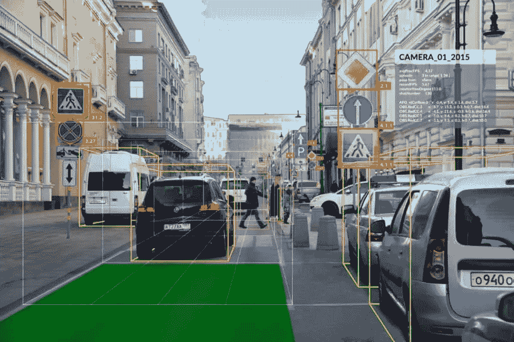
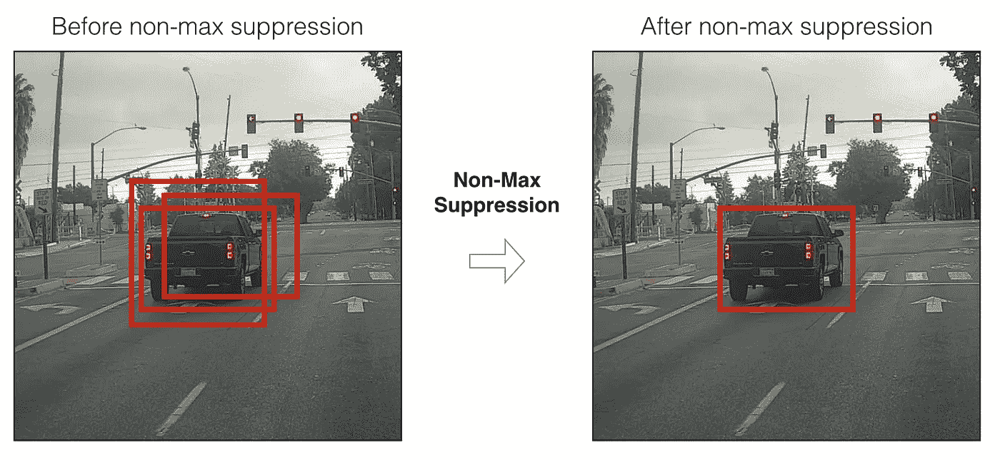
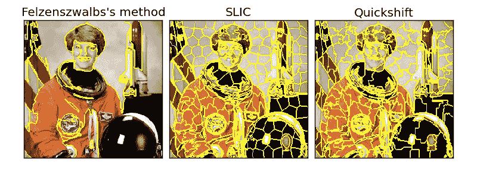
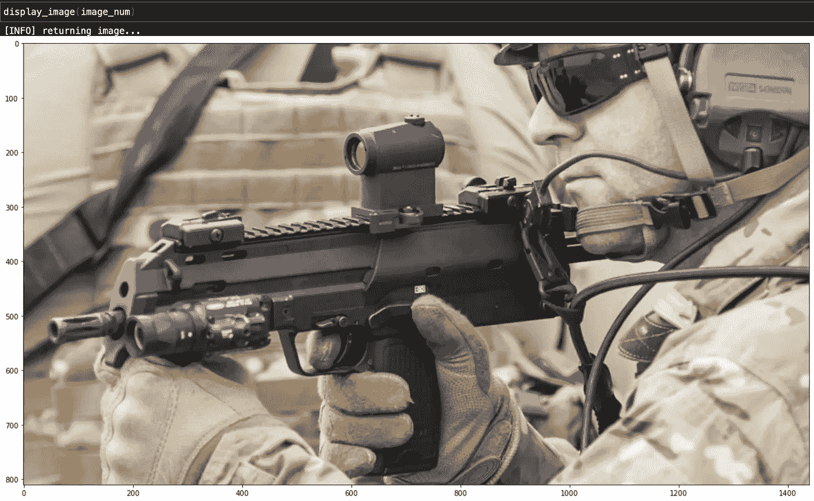
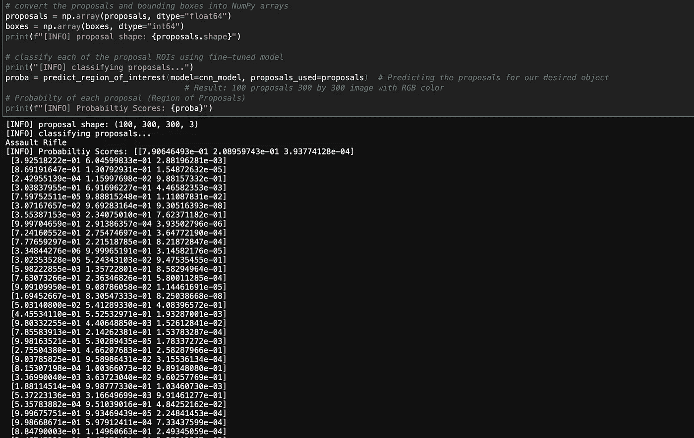
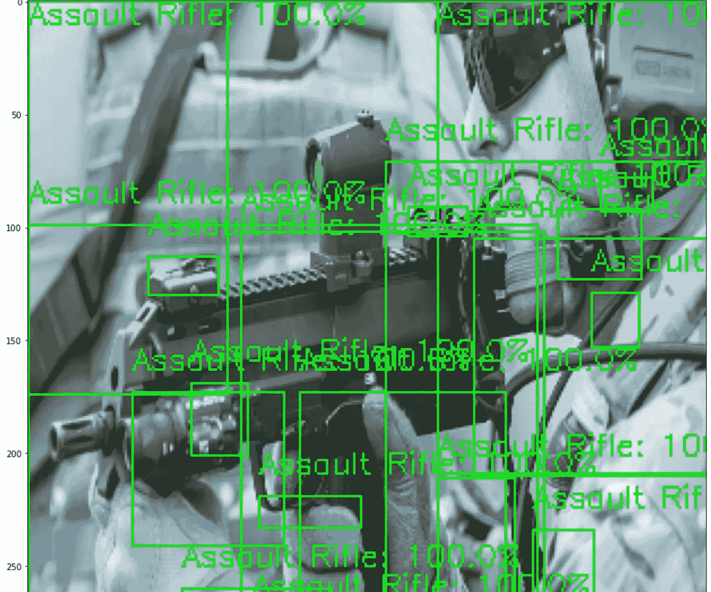
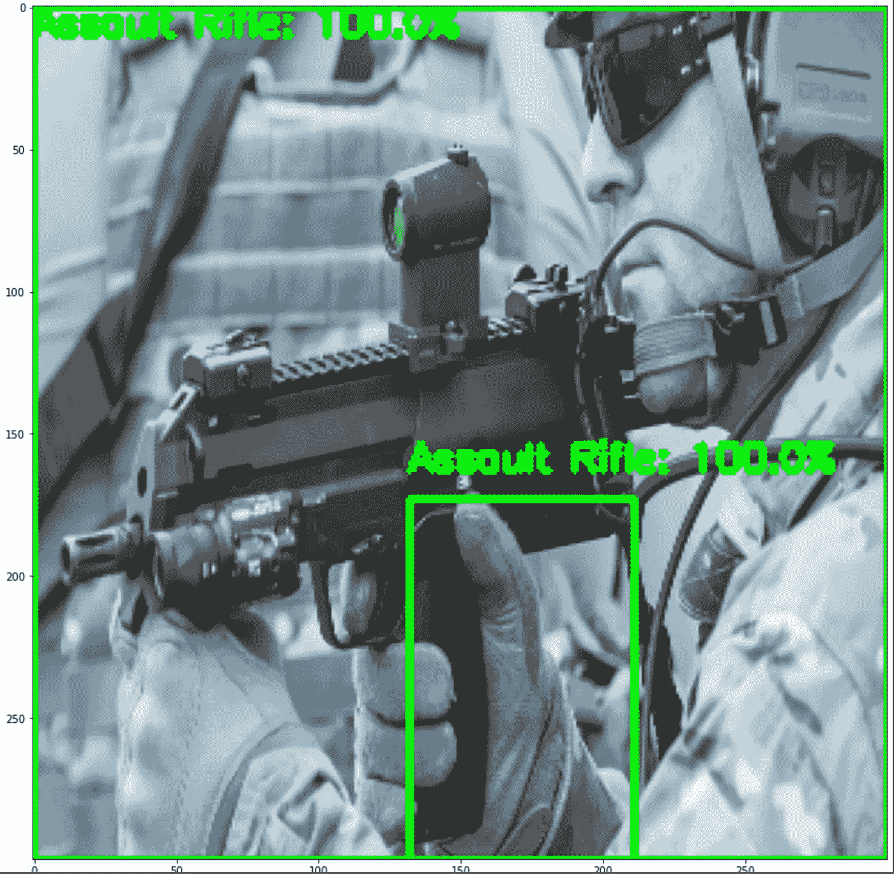
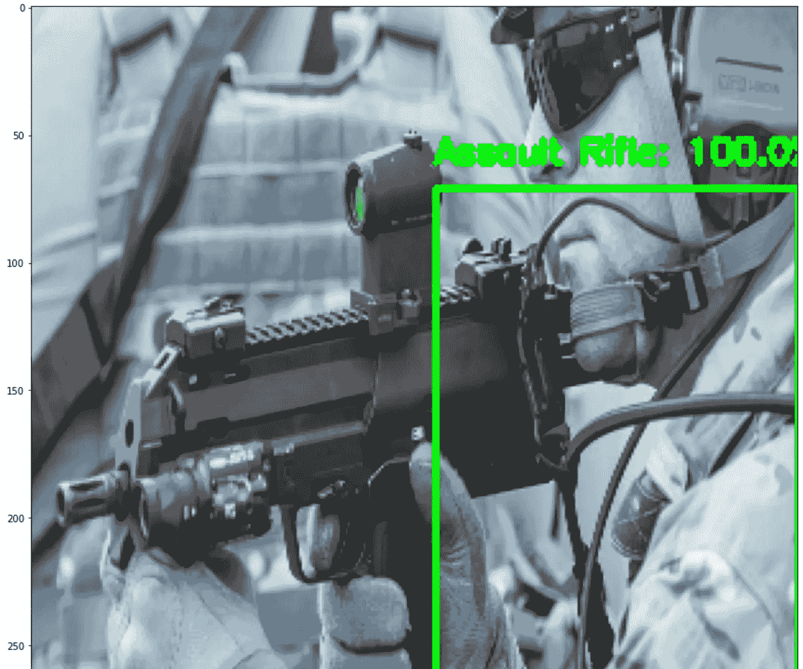
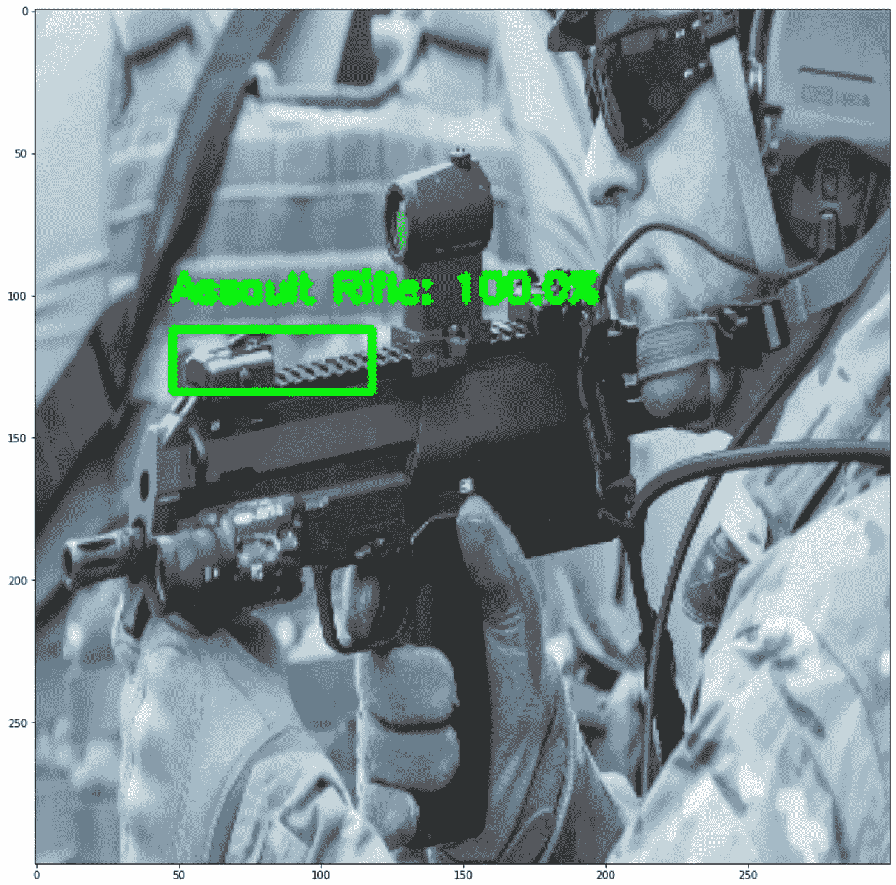

# 使用 OpenCV 进行对象检测:一步一步

> 原文：<https://medium.com/analytics-vidhya/object-detection-with-opencv-step-by-step-6c49a9cc1ff0?source=collection_archive---------2----------------------->



几个月前，我决定使用 keras 创建一个图像分类模型来检测武器等威胁。我现在决定把这个扩展到物体检测。

像这样的工具的目的是能够使用相机系统实时检测物体。

## 目标检测与图像分类

在我们开始之前，我会稍微假设你已经知道物体检测和图像分类之间的区别，但这将作为一个快速回顾。

**图像分类**是通过您的模型使用图像作为您的输入的过程，该模型检测给定图像中的相似性，以获得您想要的类别的输出。这将导致你的类名和概率分数的输出。

**物体检测**是通过模型使用图像和/或视频作为输入的过程，该模型检测任何物体。许多不同的对象检测方法都会发生这种情况。这将产生边界框、类名和概率分数的输出。

## 走向

将会对将要使用的一些方法进行简要的解释，因为我不会对某些方法进行太多的详细说明，因为当涉及到对象检测时，你可以有许多关于一个主题/方法的博客。

我将一步一步地提供我的过程，但我不会覆盖我使用的已经建立的神经网络，它是从零开始创建的。也许我会在我为这个项目创建的神经网络上写另一篇博客。

这个博客和项目的主要目标是使用真实世界的数据集/问题展示一个非常基本的对象检测形式。

## 正在使用的数据

图像总数:3000

类别数:3 : {“突击步枪”:0，“手枪”:1，“无火器”:2}

预先存在的神经网络:是

## 进口

我使用的大部分进口产品来自 tensorflow 和 keras。这些库将帮助加载我预先存在的卷积神经网络，并处理将用于通过对象检测模型的图像。

OpenCV 将是用于对象检测的库。

```
# Neural Network
from tensorflow.keras.applications import imagenet_utils
from keras.preprocessing.image import load_img, img_to_array
from tensorflow.keras.applications.mobilenet_v2 import preprocess_input
from tensorflow.keras.utils import to_categorical
from sklearn.preprocessing import LabelBinarizer
from tensorflow.keras.models import load_model
import keras
import tensorflow as tf# For measuring the inference time.
import time
import random# Computer Vision
import cv2# Graphing
import matplotlib.pyplot as plt
import seaborn as sns# Math
import numpy as np# File handling
import pickle
from os import listdir
from os.path import isfile, join
import os
```

## 功能

我将列出一些在整个项目中使用或可以使用的非常简单明了的函数，并且我将对与对象检测有直接联系的函数进行解释。

第一个函数只是使用 matplotlib 显示图像:

```
def display_image(image_num):
    """
    Prints out picture of
    the image that is selected

    After the else statement,
    we try to use the file name
    in oder to print out the image,

    while the first image is used to 
    print the image directly without a 
    filename.
    """
    try:
        fig = plt.figure(figsize=(20, 15))
        plt.grid(False)
        plt.imshow(images[image_num])
    except (RuntimeError, TypeError, NameError):
        print("[INFO] Could not print image")
        print("[INFO] trying something else...")
    else:
        print("[INFO] returning image...")
        # Image path - getting images on file
        image_paths = "Demo-Images/"
        image_select = image_paths + ([f for f in listdir(image_paths) if isfile(join(image_paths, f))][image_num])  # Other way instead of the listdir function
        img = plt.imread(fname=image_select)
        plt.imshow(img)
```

注意:您的 image_paths 将取决于您对保存图像的目录的命名。

第二个函数用于预测您的输入图像，为您提供类别名称(突击步枪、手枪、无火器)和概率得分的输出:

```
# Prediction Function
def predict(model, image_num):
    # Image path - getting images on file
    image_paths = "Demo-Images/"
    image_select = image_paths + ([f for f in listdir(image_paths) if isfile(join(image_paths, f))])[image_num] # Other way instead of the listdir function

    img = load_img(image_select, target_size=(300, 300))  # Loading image
    img = img_to_array(img)  # Transforming image to array
    img = img / 255  # Normalizing Image
    img = np.expand_dims(img, axis=0)  # Expanding dimensions
    predict = cnn_model.predict(img)  # Predicting the image
    pred_name = classes[np.argmax(predict)]  # Predicting the name
    prediction = str(round(predict.max() * 100, 3))
    print(display_image(image_num=image_num))
    return prediction + '%', pred_name
```

注意:这是加载你预先存在的神经网络，并给你输入图像的结果。基于您从头开始构建 CNN 的方式，您将拥有不同的 target_size 参数值。

第三个函数从根本上执行与上面的函数相同的任务，但是有一点小小的变化。第三个函数预测区域提议/边界框:

```
# Prediction Function
def predict_region_of_interest(model, proposals_used):
    """
    predicts region proposals
    """
    predict = model.predict(proposals_used)  # Predicting the image
    for proposals in predict:
        pred_name = classes[np.argmax(proposals)]  # Predicting the name
    prediction = str(round(predict.max() * 100, 3))
    print(pred_name)
    return predict
```

第四个函数计算 IoU(交集/并集),这实质上是我们的对象检测模型的性能测量。IoU 查看通过您的对象检测方法找到的建议的预测边界框/区域:

```
def compute_iou(boxA, boxB):
    """
    IOU is a form of 
    performance measurement
    for our object detector.
    """
    # determine the (x, y)-coordinates of the intersection rectangle
    xA = max(boxA[0], boxB[0])
    yA = max(boxA[1], boxB[1])
    xB = min(boxA[2], boxB[2])
    yB = min(boxA[3], boxB[3])
    # compute the area of intersection rectangle
    interArea = max(0, xB - xA + 1) * max(0, yB - yA + 1)
    # compute the area of both the prediction and ground-truth
    # rectangles
    boxAArea = (boxA[2] - boxA[0] + 1) * (boxA[3] - boxA[1] + 1)
    boxBArea = (boxB[2] - boxB[0] + 1) * (boxB[3] - boxB[1] + 1)
    # compute the intersection over union by taking the intersection
    # area and dividing it by the sum of prediction + ground-truth
    # areas - the intersection area
    iou = interArea / float(boxAArea + boxBArea - interArea)
    # return the intersection over union value
    return iou
```

第五个也是最后一个函数叫做非最大值抑制(NMS ),它清理边界框以返回概率最高的边界框:



```
#  Felzenszwalb et al.
def non_max_suppression(boxes, overlapThresh):
    # if there are no boxes, return an empty list
    if len(boxes) == 0:
        return []
    # initialize the list of picked indexes
    pick = []
    # grab the coordinates of the bounding boxes
    x1 = boxes[:,0]
    y1 = boxes[:,1]
    x2 = boxes[:,2]
    y2 = boxes[:,3]
    # compute the area of the bounding boxes and sort the bounding
    # boxes by the bottom-right y-coordinate of the bounding box
    area = (x2 - x1 + 1) * (y2 - y1 + 1)
    idxs = np.argsort(y2)# keep looping while some indexes still remain in the indexes
    # list
    while len(idxs) > 0:
        # grab the last index in the indexes list, add the index
        # value to the list of picked indexes, then initialize
        # the suppression list (i.e. indexes that will be deleted)
        # using the last index
        last = len(idxs) - 1
        i = idxs[last]
        pick.append(i)
        suppress = [last]# loop over all indexes in the indexes list
        for pos in range(0, last):
            # grab the current index
            j = idxs[pos]
            # find the largest (x, y) coordinates for the start of
            # the bounding box and the smallest (x, y) coordinates
            # for the end of the bounding box
            xx1 = max(x1[i], x1[j])
            yy1 = max(y1[i], y1[j])
            xx2 = min(x2[i], x2[j])
            yy2 = min(y2[i], y2[j])
            # compute the width and height of the bounding box
            w = max(0, xx2 - xx1 + 1)
            h = max(0, yy2 - yy1 + 1)
            # compute the ratio of overlap between the computed
            # bounding box and the bounding box in the area list
            overlap = float(w * h) / area[j]
            # if there is sufficient overlap, suppress the
            # current bounding box
            if overlap > overlapThresh:
                suppress.append(pos)
        # delete all indexes from the index list that are in the
        # suppression list
        idxs = np.delete(idxs, suppress)
    # return only the bounding boxes that were picked
    return boxes[pick]
```

## 选择性搜索

现在我们可以进入是什么让你的对象检测运行的话题。我们将使用选择性搜索这一主要模式来检索区域提案。

选择性搜索是一种自动区域提议算法。它的工作原理是使用超像素算法对图像进行过度分割，特别是 Felzenszwalb 的超像素算法。从那里，选择性搜索寻求将超像素合并在一起，以找到图像中可能包含物体的区域。



```
# Setting a max amount of region proposals used when running selective search
max_proposals = 2_000
max_proposals_infer = 100  # Search for (1) gathering training data and (2) performing inference
```

对于 max_proposals_infer，您可以在图像中允许更多的区域提议以获得更好的结果。

下一个代码将加载我们预先存在的卷积神经网络:

```
# initialize the input dimensions to the network
input_dimensions = (300, 300)  # 300 by 300 because that's what the CNN Model was tested on
# define the path to the output model
model_path = "model_3.hdf5"
cnn_model = keras.models.load_model(model_path)  # Loading CNN model from keras# define the minimum probability required for a positive prediction
# (used to filter out false-positive predictions)
min_probability = 0.90
```

下面的代码将介绍我们 OpenCV 库中的选择性搜索类:

```
# initialize OpenCV's selective search implementation and set the
ss = cv2.ximgproc.segmentation.createSelectiveSearchSegmentation()
```

在接下来的代码行中，我将从我选择的目录中选择一个图像，并将其设置为我们的选择性搜索算法可以检测区域建议的基础图像:

```
# Input image in selective search# Image path - getting images on file
image_num = 232
image_paths = "Demo-Images/"
image_select = image_paths + ([f for f in listdir(image_paths) if isfile(join(image_paths, f))][image_num])  # Other way instead of the listdir function# Making image compatible with imshow
image = cv2.imread(image_select)# load the input image (300x300) and preprocess it
image = cv2.resize(image, input_dimensions)  # Increasing image means more regions# Setting base image that will be used
ss.setBaseImage(image)# Choosing which selective search
ss.switchToSelectiveSearchQuality()
```

然后，我使用上面的函数来显示图像，看看我们得到了什么:



在下面的代码中，我们将运行算法来获取图像 9 中的区域:

```
# run selective search on the input image
start = time.time()
rects = ss.process()  # Run Selective Search
end = time.time()# show how along selective search took to run along with the total
# number of returned region proposals
print(f"[INFO] selective search took {np.round(end - start, decimals=3)} seconds")
print(f"[INFO] {len(rects)} total region proposals")
```

下面的代码将向我们显示该算法选取的所有区域建议:

```
# initialize the list of region proposals that we'll be classifying
# along with their associated bounding boxes
proposals = []
boxes = []
# loop over the region proposal bounding box coordinates generated by
# running selective search
for (x, y, w, h) in rects[:max_proposals_infer]:
    # extract the region from the input image, convert it from BGR to
    # RGB channel ordering, and then resize it to the required input
    # dimensions of our trained CNN
    roi = image[y:y + h, x:x + w]
    roi = cv2.cvtColor(roi, cv2.COLOR_BGR2RGB)
    roi = cv2.resize(roi, input_dimensions,
        interpolation=cv2.INTER_CUBIC)
    # further preprocess the ROI
    roi = img_to_array(roi)
    roi = preprocess_input(roi)
    # update our proposals and bounding boxes lists
    proposals.append(roi)
    boxes.append((x, y, x + w, y + h))
```

下面的代码将向我们展示建议和边界框。我还使用了 predict_region_of_interest 函数来预测最有可能成为我们类中的对象的区域:

```
# convert the proposals and bounding boxes into NumPy arrays
proposals = np.array(proposals, dtype="float64")
boxes = np.array(boxes, dtype="int64")
print(f"[INFO] proposal shape: {proposals.shape}")# classify each of the proposal ROIs using fine-tuned model
print("[INFO] classifying proposals...")
proba = predict_region_of_proposals(model=cnn_model, proposals_used=proposals)  # Predicting the proposals for our desired object
                                      # Result: 100 proposals 300 by 300 image with RGB color
# Probabilty of each proposal (Region of Proposals)
print(f"[INFO] Probabiltiy Scores: {proba}")
```



下面几行代码将过滤掉我们想要看到的预测/边界框。它将显示我们所选图像周围的边界框，该边界框具有我们进一步设置的最高/最低概率:

```
# Obtaining the label of the current prediction from the CNN
# Empty list to store proposals
proposal_name_list = []
for proposals in proba:
    """
    For each predicted proposal
    attach the class names and 
    append it to a list.
    """
    pred_name = classes[np.argmax(proposals)]
    proposal_name_list.append(pred_name)# find the index of all predictions that are greater
# than the minimum probability
print("[INFO] applying NMS...")# Find the indexs where the main prediction label matches the overall image
# Get the index of the proposal that has the same class name as the overall image
idxs = [i for i, x in enumerate(proposal_name_list) if x == pred_name]boxes = boxes[idxs]
proba = proba[idxs]# further filter indexes by enforcing a minimum prediction
idxs = np.where(proba >= min_probability)[0]
# probability be met
boxes = boxes[idxs]
proba = proba[idxs]
```

## 查看我们的结果

现在最后一部分是查看我们的结果。还可以使用 plt.imshow()打印 Jupyter Notebook 中的图像。

前几行代码将向您展示我们的对象检测模型在不使用非最大值抑制算法的情况下运行图像后的图像:

```
# clone the original image so that we can draw on it
clone = image.copy()
# loop over the bounding boxes and associated probabilities
for (box, prob) in zip(boxes, proba):
    # draw the bounding box, label, and probability on the image
    (startX, startY, endX, endY) = box
    cv2.rectangle(clone, (startX, startY), (endX, endY),
        (0, 255, 0), 2)
    y = startY - 10 if startY - 10 > 10 else startY + 10
    text = f"{np.round(prob * 100, decimals=3)}%"
    cv2.putText(clone, text, (startX, y),
        cv2.FONT_HERSHEY_SIMPLEX, 0.45, (0, 255, 0), 2)
# show the output after *before* running NMS
cv2.imshow("Before NMS", clone)
cv2.waitKey(0);
```



接下来的几行代码将向我们展示对象检测算法对所选图像做了什么，包括非最大抑制函数，使我们的算法返回单个边界框:

```
# run non-maxima suppression on the bounding boxes
boxIdxs = non_max_suppression_fast(boxes=boxes, overlapThresh=0.5)
# loop over the bounding box indexes
for i in boxIdxs:
    # draw the bounding box, label, and probability on the image
    (startX, startY, endX, endY) = i # or boxes[0] will return 1 bb
    cv2.rectangle(image, (startX, startY), (endX, endY),
        (0, 255, 0), 2)
    y = startY - 10 if startY - 10 > 10 else startY + 10
    text = f"{classes[np.argmax(prob)]}: {np.round(proba.max() * 100, decimals=1)}%"
    cv2.putText(image, text, (startX, y),
        cv2.FONT_HERSHEY_SIMPLEX, 0.45, (0, 255, 0), 2)
# show the output image *after* running NMS
cv2.imshow("After NMS", image)
cv2.waitKey(0);
```

