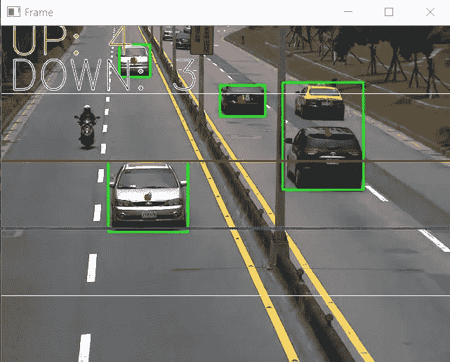
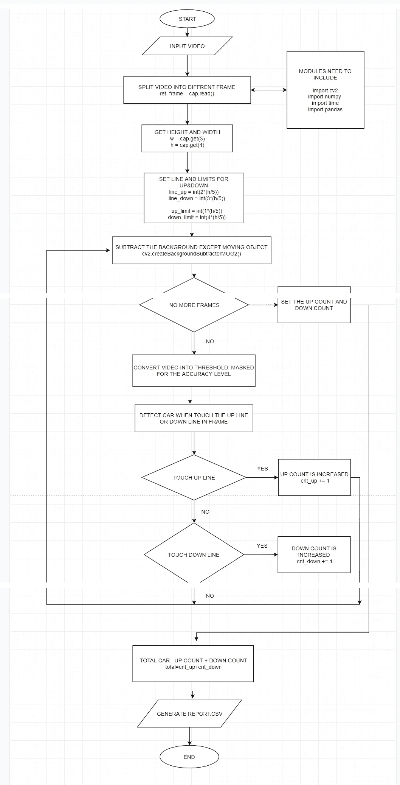
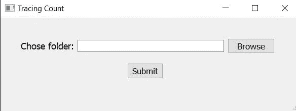

# 使用 Python 进行对象检测

> 原文：<https://medium.com/analytics-vidhya/object-detection-with-python-42272ca27ef4?source=collection_archive---------5----------------------->

这篇文章将介绍一个使用 opencv 的物体检测模型。



这个想法是创建一个模型，能够检测不同车道上的车辆，并将数据存储为 csv 格式。使用该模型，我们可以监控本地的交通流模式，并构建一个深度学习模型来根据实时情况调节交通流。

# 要求

*   Python 3.8
*   PyQt5
*   [计]系统复制命令（system 的简写）
*   操作系统（Operating System）
*   时间
*   Opencv
*   Numpy
*   熊猫

您可以将这些库安装在单独的 env 中，或者直接安装到系统中。

# 装置

通过[点击这里](https://www.python.org/)安装 python。

该安装将照顾基本库，如 pip 等，其他库需要手动安装。

以管理员身份打开 cmd 并键入以下内容

```
pip install PyQt5
```

等待它完成安装，现在开始安装到操作系统和系统。

```
pip install os-sys
```

现在按照相同的说明完成安装上面列出的所有库。安装需要时间，请耐心等待。

# 流程图



# 源代码

现在我为这个项目创建了 5 个不同的模块，让我们从 GUI 开始。

上面的代码代表了 gui，现在把它保存为 python 文件。

复制下面的代码，并做类似的过程

这是上传一个视频文件(交通镜头)作为模型的输入。

在下面的代码是正常化和本地化的视频镜头中的车辆。

现在下面的代码是实际的后端，我们使用 opencv 创建一个算法来计算两条不同车道上的车辆数量。更简单地说，我指定两个变量，每次检测到车辆时迭代。第一个变量是指靠近摄像机的车辆，另一个变量是指远离摄像机的车辆。

为了在单个域中访问所有这些功能，我创建了一个 python 文件，它调用所有这些模块，并在最后给出车辆的数量。

注意:将所有这些文件保存在一个文件夹下。

# 工作

打开 cmd 下的文件夹和下面的命令。

```
python myapp.py
```

“myapp.py”是连接所有模块的主要 python 文件。运行此命令后，将弹出下图(等待几分钟，模型编译需要一些时间)。



现在，浏览您想要分析的特定交通录像，并等待它进行分析。现在你会意识到这个项目已经完成了。

下面的视频展示了如何运行模型的最后几个步骤。

# 将来的

计数以 csv 文件的形式存储在 excel 表格中。现在我们可以使用 matlab 创建一个交通模拟器，根据计数来调节交通灯(信号)控制。

[源代码](https://github.com/king-of-nerds/traffic-light-control)

[论文](https://www.accentsjournals.org/PaperDirectory/Journal/TIPCV/2019/11/1.pdf)

希望你喜欢这篇文章。