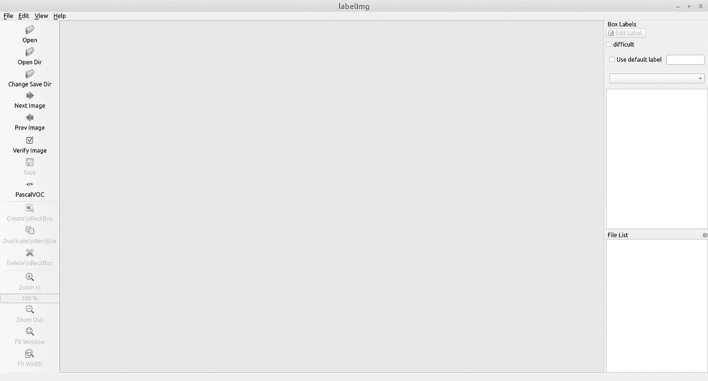
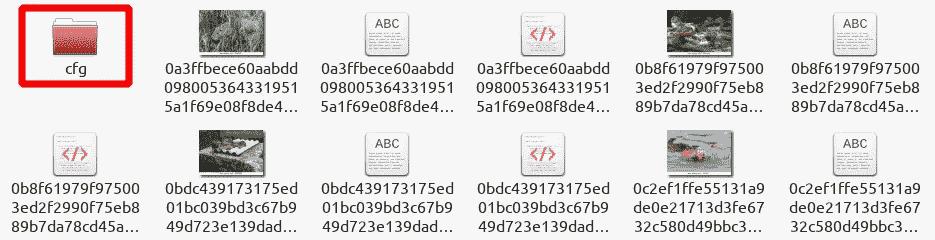

# YOLO 物体检测

> 原文：<https://medium.com/analytics-vidhya/object-detection-with-yolo-aa2dfab21d56?source=collection_archive---------3----------------------->

下面的帖子显示了如何基于 YOLO 架构训练对象检测模型(下面参考资料中关于该主题的研究文章的链接)，在 Google Colab 中获取地图和平均损失统计数据，并使用自定义 Python 脚本测试训练的模型。

# 储存库准备

**1。**克隆存储库(DarkNet 框架):

```
!git clone [https://github.com/AlexeyAB/darknet.git](https://github.com/AlexeyAB/darknet.git)
```

**注意:** bash 命令以感叹号开始

> 感叹号用于执行来自底层操作系统的命令。
> **来源**-[https://towards data science . com/an-effective-way-of-managing-files-on-Google-cola b-ac37f 792690 b？gi=7e7ac2742a2d](https://towardsdatascience.com/an-effective-way-of-managing-files-on-google-colab-ac37f792690b?gi=7e7ac2742a2d)

**2。**创建文件夹构建-发布:

```
cd /content/drive/My\ Drive/darknet/
!mkdir build-release
cd /content/drive/My\ Drive/darknet/build-release/
```

**注意:** *可选地*，在编译之前，用户可能会在终端中注释掉生成打印输出的源代码中的行，因为默认情况下，训练过程生成的输出过于冗余，即使为了显示打印输出，也会额外加载操作内存。)，在某个时候造成冻结甚至突然终止(笔者经历过几次)。以下摘录仅包含两次迭代的输出:

```
**truncated**
7: 679.634888, 679.691040 avg loss, 0.000000 rate, 0.385118 seconds, 224 images, 419.996108 hours left
Loaded: 2.210867 seconds - performance bottleneck on CPU or Disk HDD/SSD
v3 (mse loss, Normalizer: (iou: 0.75, cls: 1.00) Region 16 Avg (IOU: 0.605842, GIOU: 0.574251), Class: 0.500359, Obj: 0.501755, No Obj: 0.500504, .5R: 1.000000, .75R: 0.000000, count: 5, class_loss = 271.598236, iou_loss = 0.801147, total_loss = 272.399384 
v3 (mse loss, Normalizer: (iou: 0.75, cls: 1.00) Region 23 Avg (IOU: 0.000000, GIOU: 0.000000), Class: 0.000000, Obj: 0.000000, No Obj: 0.500954, .5R: 0.000000, .75R: 0.000000, count: 1, class_loss = 1087.291870, iou_loss = 0.000000, total_loss = 1087.291870 
 total_bbox = 248, rewritten_bbox = 0.000000 % 
v3 (mse loss, Normalizer: (iou: 0.75, cls: 1.00) Region 16 Avg (IOU: 0.614312, GIOU: 0.605125), Class: 0.500208, Obj: 0.501565, No Obj: 0.500505, .5R: 0.750000, .75R: 0.000000, count: 4, class_loss = 271.537018, iou_loss = 0.536957, total_loss = 272.073975 
v3 (mse loss, Normalizer: (iou: 0.75, cls: 1.00) Region 23 Avg (IOU: 0.000000, GIOU: 0.000000), Class: 0.000000, Obj: 0.000000, No Obj: 0.500934, .5R: 0.000000, .75R: 0.000000, count: 1, class_loss = 1087.293945, iou_loss = 0.000000, total_loss = 1087.293945 
 total_bbox = 252, rewritten_bbox = 0.000000 % 
v3 (mse loss, Normalizer: (iou: 0.75, cls: 1.00) Region 16 Avg (IOU: 0.640582, GIOU: 0.634447), Class: 0.499148, Obj: 0.500193, No Obj: 0.500503, .5R: 0.600000, .75R: 0.200000, count: 5, class_loss = 271.477295, iou_loss = 0.716827, total_loss = 272.194122 
v3 (mse loss, Normalizer: (iou: 0.75, cls: 1.00) Region 23 Avg (IOU: 0.000000, GIOU: 0.000000), Class: 0.000000, Obj: 0.000000, No Obj: 0.500943, .5R: 0.000000, .75R: 0.000000, count: 1, class_loss = 1087.298706, iou_loss = 0.000000, total_loss = 1087.298706 
 total_bbox = 257, rewritten_bbox = 0.000000 % 
v3 (mse loss, Normalizer: (iou: 0.75, cls: 1.00) Region 16 Avg (IOU: 0.578494, GIOU: 0.560010), Class: 0.500962, Obj: 0.502538, No Obj: 0.500505, .5R: 0.800000, .75R: 0.000000, count: 5, class_loss = 271.405792, iou_loss = 0.654083, total_loss = 272.059875 
v3 (mse loss, Normalizer: (iou: 0.75, cls: 1.00) Region 23 Avg (IOU: 0.000000, GIOU: 0.000000), Class: 0.000000, Obj: 0.000000, No Obj: 0.500935, .5R: 0.000000, .75R: 0.000000, count: 1, class_loss = 1087.299683, iou_loss = 0.000000, total_loss = 1087.299683 
 total_bbox = 262, rewritten_bbox = 0.000000 % 
v3 (mse loss, Normalizer: (iou: 0.75, cls: 1.00) Region 16 Avg (IOU: 0.635607, GIOU: 0.608577), Class: 0.500960, Obj: 0.502537, No Obj: 0.500506, .5R: 0.750000, .75R: 0.250000, count: 4, class_loss = 271.092285, iou_loss = 0.535187, total_loss = 271.627472 
v3 (mse loss, Normalizer: (iou: 0.75, cls: 1.00) Region 23 Avg (IOU: 0.000000, GIOU: 0.000000), Class: 0.000000, Obj: 0.000000, No Obj: 0.500919, .5R: 0.000000, .75R: 0.000000, count: 1, class_loss = 1087.300903, iou_loss = 0.000000, total_loss = 1087.300903 
 total_bbox = 266, rewritten_bbox = 0.000000 % 
v3 (mse loss, Normalizer: (iou: 0.75, cls: 1.00) Region 16 Avg (IOU: 0.571984, GIOU: 0.536152), Class: 0.500218, Obj: 0.501519, No Obj: 0.500505, .5R: 0.500000, .75R: 0.000000, count: 4, class_loss = 271.347656, iou_loss = 0.689331, total_loss = 272.036987 
v3 (mse loss, Normalizer: (iou: 0.75, cls: 1.00) Region 23 Avg (IOU: 0.000000, GIOU: 0.000000), Class: 0.000000, Obj: 0.000000, No Obj: 0.500935, .5R: 0.000000, .75R: 0.000000, count: 1, class_loss = 1087.295410, iou_loss = 0.000000, total_loss = 1087.295410 
 total_bbox = 270, rewritten_bbox = 0.000000 % 
v3 (mse loss, Normalizer: (iou: 0.75, cls: 1.00) Region 16 Avg (IOU: 0.674173, GIOU: 0.652403), Class: 0.500960, Obj: 0.502531, No Obj: 0.500503, .5R: 1.000000, .75R: 0.250000, count: 4, class_loss = 271.155334, iou_loss = 0.497925, total_loss = 271.653259 
v3 (mse loss, Normalizer: (iou: 0.75, cls: 1.00) Region 23 Avg (IOU: 0.000000, GIOU: 0.000000), Class: 0.000000, Obj: 0.000000, No Obj: 0.500935, .5R: 0.000000, .75R: 0.000000, count: 1, class_loss = 1087.292358, iou_loss = 0.000000, total_loss = 1087.292358 
 total_bbox = 274, rewritten_bbox = 0.000000 % 
v3 (mse loss, Normalizer: (iou: 0.75, cls: 1.00) Region 16 Avg (IOU: 0.639989, GIOU: 0.600127), Class: 0.500965, Obj: 0.502533, No Obj: 0.500506, .5R: 0.750000, .75R: 0.500000, count: 4, class_loss = 270.776886, iou_loss = 0.559204, total_loss = 271.336090 
v3 (mse loss, Normalizer: (iou: 0.75, cls: 1.00) Region 23 Avg (IOU: 0.000000, GIOU: 0.000000), Class: 0.000000, Obj: 0.000000, No Obj: 0.500933, .5R: 0.000000, .75R: 0.000000, count: 1, class_loss = 1087.296143, iou_loss = 0.000000, total_loss = 1087.296143 
 total_bbox = 278, rewritten_bbox = 0.000000 % 

 8: 679.609314, 679.682861 avg loss, 0.000000 rate, 0.393729 seconds, 256 images, 418.879547 hours left
Loaded: 1.570684 seconds - performance bottleneck on CPU or Disk HDD/SSD
v3 (mse loss, Normalizer: (iou: 0.75, cls: 1.00) Region 16 Avg (IOU: 0.471209, GIOU: 0.434264), Class: 0.500210, Obj: 0.501556, No Obj: 0.500503, .5R: 0.500000, .75R: 0.000000, count: 4, class_loss = 271.537018, iou_loss = 0.976410, total_loss = 272.513428 
v3 (mse loss, Normalizer: (iou: 0.75, cls: 1.00) Region 23 Avg (IOU: 0.000000, GIOU: 0.000000), Class: 0.000000, Obj: 0.000000, No Obj: 0.500933, .5R: 0.000000, .75R: 0.000000, count: 1, class_loss = 1087.296387, iou_loss = 0.000000, total_loss = 1087.296387 
 total_bbox = 282, rewritten_bbox = 0.000000 % 
v3 (mse loss, Normalizer: (iou: 0.75, cls: 1.00) Region 16 Avg (IOU: 0.616591, GIOU: 0.601557), Class: 0.500208, Obj: 0.501559, No Obj: 0.500503, .5R: 1.000000, .75R: 0.250000, count: 4, class_loss = 271.410980, iou_loss = 0.328857, total_loss = 271.739838 
v3 (mse loss, Normalizer: (iou: 0.75, cls: 1.00) Region 23 Avg (IOU: 0.000000, GIOU: 0.000000), Class: 0.000000, Obj: 0.000000, No Obj: 0.500925, .5R: 0.000000, .75R: 0.000000, count: 1, class_loss = 1087.294678, iou_loss = 0.000000, total_loss = 1087.294678 
 total_bbox = 286, rewritten_bbox = 0.000000 % 
v3 (mse loss, Normalizer: (iou: 0.75, cls: 1.00) Region 16 Avg (IOU: 0.560825, GIOU: 0.559239), Class: 0.499954, Obj: 0.501222, No Obj: 0.500504, .5R: 0.833333, .75R: 0.000000, count: 6, class_loss = 271.661560, iou_loss = 0.975983, total_loss = 272.637543 
v3 (mse loss, Normalizer: (iou: 0.75, cls: 1.00) Region 23 Avg (IOU: 0.000000, GIOU: 0.000000), Class: 0.000000, Obj: 0.000000, No Obj: 0.500941, .5R: 0.000000, .75R: 0.000000, count: 1, class_loss = 1087.299683, iou_loss = 0.000000, total_loss = 1087.299683 
 total_bbox = 292, rewritten_bbox = 0.000000 % 
v3 (mse loss, Normalizer: (iou: 0.75, cls: 1.00) Region 16 Avg (IOU: 0.594659, GIOU: 0.592429), Class: 0.499454, Obj: 0.500582, No Obj: 0.500505, .5R: 0.750000, .75R: 0.250000, count: 4, class_loss = 271.161102, iou_loss = 0.735657, total_loss = 271.896759 
v3 (mse loss, Normalizer: (iou: 0.75, cls: 1.00) Region 23 Avg (IOU: 0.000000, GIOU: 0.000000), Class: 0.000000, Obj: 0.000000, No Obj: 0.500947, .5R: 0.000000, .75R: 0.000000, count: 1, class_loss = 1087.291870, iou_loss = 0.000000, total_loss = 1087.291870 
 total_bbox = 296, rewritten_bbox = 0.000000 % 
v3 (mse loss, Normalizer: (iou: 0.75, cls: 1.00) Region 16 Avg (IOU: 0.546971, GIOU: 0.527006), Class: 0.500188, Obj: 0.501606, No Obj: 0.500506, .5R: 0.500000, .75R: 0.000000, count: 4, class_loss = 271.537018, iou_loss = 0.620148, total_loss = 272.157166 
v3 (mse loss, Normalizer: (iou: 0.75, cls: 1.00) Region 23 Avg (IOU: 0.000000, GIOU: 0.000000), Class: 0.000000, Obj: 0.000000, No Obj: 0.500932, .5R: 0.000000, .75R: 0.000000, count: 1, class_loss = 1087.293457, iou_loss = 0.000000, total_loss = 1087.293457 
 total_bbox = 300, rewritten_bbox = 0.000000 % 
v3 (mse loss, Normalizer: (iou: 0.75, cls: 1.00) Region 16 Avg (IOU: 0.703408, GIOU: 0.697468), Class: 0.500990, Obj: 0.502102, No Obj: 0.500505, .5R: 1.000000, .75R: 0.200000, count: 5, class_loss = 271.091461, iou_loss = 0.492645, total_loss = 271.584106 
v3 (mse loss, Normalizer: (iou: 0.75, cls: 1.00) Region 23 Avg (IOU: 0.326191, GIOU: 0.083068), Class: 0.502488, Obj: 0.502020, No Obj: 0.500926, .5R: 0.000000, .75R: 0.000000, count: 1, class_loss = 1087.353516, iou_loss = 0.583740, total_loss = 1087.937256 
 total_bbox = 306, rewritten_bbox = 0.000000 % 
v3 (mse loss, Normalizer: (iou: 0.75, cls: 1.00) Region 16 Avg (IOU: 0.652279, GIOU: 0.637695), Class: 0.500962, Obj: 0.502520, No Obj: 0.500505, .5R: 0.750000, .75R: 0.250000, count: 4, class_loss = 270.902740, iou_loss = 0.349670, total_loss = 271.252411 
v3 (mse loss, Normalizer: (iou: 0.75, cls: 1.00) Region 23 Avg (IOU: 0.000000, GIOU: 0.000000), Class: 0.000000, Obj: 0.000000, No Obj: 0.500928, .5R: 0.000000, .75R: 0.000000, count: 1, class_loss = 1087.301758, iou_loss = 0.000000, total_loss = 1087.301758 
 total_bbox = 310, rewritten_bbox = 0.000000 % 
v3 (mse loss, Normalizer: (iou: 0.75, cls: 1.00) Region 16 Avg (IOU: 0.673402, GIOU: 0.651781), Class: 0.500969, Obj: 0.502514, No Obj: 0.500506, .5R: 0.750000, .75R: 0.500000, count: 4, class_loss = 271.029327, iou_loss = 0.494690, total_loss = 271.524017 
v3 (mse loss, Normalizer: (iou: 0.75, cls: 1.00) Region 23 Avg (IOU: 0.000000, GIOU: 0.000000), Class: 0.000000, Obj: 0.000000, No Obj: 0.500919, .5R: 0.000000, .75R: 0.000000, count: 1, class_loss = 1087.297485, iou_loss = 0.000000, total_loss = 1087.297485 
 total_bbox = 314, rewritten_bbox = 0.000000 % 
**truncated**
```

每次迭代的长度取决于细分的数量(仅影响内存利用率——细分越少，内存的工作负载越高，因为它必须同时处理更多的图像)和 convnet (DarkNet19、DarkNet53、DenseNet、ResNet 等。)

打开 darknet/src/region_layer.c 并注释掉以下行:

```
printf(“Region Avg IOU: %f, Class: %f, Obj: %f, No Obj: %f, Avg Recall: %f, count: %d\n”, avg_iou/count, avg_cat/class_count, avg_obj/count, avg_anyobj/(l.w*l.h*l.n*l.batch), recall/count, count);
```

打开 darknet/src/yolo_layer.c 并注释掉下面一行:

```
fprintf(stderr, “v3 (%s loss, Normalizer: (iou: %.2f, cls: %.2f) Region %d Avg (IOU: %f, GIOU: %f), Class: %f, Obj: %f, No Obj: %f, .5R: %f, .75R: %f, count: %d, class_loss = %f, iou_loss = %f, total_loss = %f \n”,
 (l.iou_loss == MSE ? “mse” : (l.iou_loss == GIOU ? “giou” : “iou”)), l.iou_normalizer, l.cls_normalizer, state.index, tot_iou / count, tot_giou / count, avg_cat / class_count, avg_obj / count, avg_anyobj / (l.w*l.h*l.n*l.batch), recall / count, recall75 / count, count,
 classification_loss, iou_loss, loss);
```

在某些情况下，最终使用的是区域层而不是 yolo(例如。，对于 DenseNet)因此应该注释掉两个文件中的行。

**3。**编译储存库:

```
!cmake ..
!make
!make install
```

**注意#1:** 如果用户想改变源代码，他必须重新编译。
**注#2:** 为暗网每次新建会话更改权限:

```
!chmod -R 777 darknet
```

否则，使用 darknet 的每个命令将提供:

```
/bin/bash: ./darknet: Permission denied
```

# 数据准备

**注:**数据准备必须在 Colab 中完成

**1。**获取图像

**2。**为图像加标签克隆 LabelImg 并打开它:

```
git clone [https://github.com/tzutalin/labelImg.git](https://github.com/tzutalin/labelImg.git)
cd labelImg
```

**3。**安装所需的软件包(适用于 Linux):

```
sudo apt install pyqt5-dev-tools
sudo pip3 install -r requirements/requirements-linux-python3.txt
make qt5py3
```

**注:**对于其他操作系统，请遵循[https://github.com/](https://github.com/)Tzu talin/labelImg 上的安装指南

**4。**运行标签:

```
python3 labelImg.py
```



**5。**选择 PASCAL VOC 标注格式:


**注意:**最好选择 PASCAL VOC 格式，因为它包含更多的信息，可以在以后使用 Tensorflow 使用标记的图像，并且可以随时使用 Python-script(在下面的模型配置中讨论)转换为 YOLO 格式，而不是相反——格式包含相对于图像宽度和高度的浮点值**,它可以等于 0 到 1，因此，不可能从相对值恢复绝对值。**

**6。**标签图像:


选择创建/n 复选框


突出显示对象，并为其指定名称


对象现在已被标记

**7。**图像和 XML 标签文件:


在继续下一步之前，最好先熟悉几个脚本，这对准备数据和测试最终模型可能是有用的。代码基于使用 OpenCV 的 [YOLO 对象检测](https://www.pyimagesearch.com/2018/11/12/yolo-object-detection-with-opencv/)，[OpenCV‘dnn’使用 NVIDIA GPU:1549%更快的 YOLO、SSD 和 Mask R-CNN](https://www.pyimagesearch.com/2020/02/10/opencv-dnn-with-nvidia-gpus-1549-faster-yolo-ssd-and-mask-r-cnn/) ，[使用 cv2 更快的视频文件 FPS。Adrian Rosebrock 的视频捕获和 OpenCV](https://www.pyimagesearch.com/2017/02/06/faster-video-file-fps-with-cv2-videocapture-and-opencv/) 。
**注:**以下软件将进一步完善。

8。首先克隆存储库:

```
git clone [https://ElencheZetetique@bitbucket.org/ElencheZetetique/rtod.git](https://ElencheZetetique@bitbucket.org/ElencheZetetique/rtod.git)
```

脚本 prepare.py 包含几个功能，如灰度缩放，调整大小，给图像指定唯一的名称，PASCAL VOC 标签修改和转换为 YOLO 格式。

9。转换为 YOLO 格式:

```
python3 prepare.py -s /path/to/Documents/Dataset/ -yf 25 -cpy /path/to/
```

在哪里

*   标志`-s/--src`指向源文件夹(在这种情况下是数据集文件夹)；
*   标志`-yf/--yolo_format`转换为 YOLO 并取 5 到 35 之间的整数，以便将数据集分成训练和验证子集；
*   标志`-cpy/--change_path_yolo`在 train.txt，valid.txt 中的图像名称前设置路径

使用标志`-h/--help`获取更多详细信息

命令的结果:


*   每个图像现在都有额外的 YOLO 格式的 txt 文件:


YOLO 标签文件有以下内容:

`0 0.571111 0.445141 0.764444 0.495298`

> `<object-class> <x_center> <y_center> <width> <height>` 其中:
> `-<object-class>` -整数对象编号从`0`到`(classes-1)
> <x_center> <y_center> <width> <height>` -浮点值**相对于图像的宽度和高度**，可以等于从`(0.0 to 1.0]` 例如:`<x> = <absolute_x> / <image_width>`或`<height> = <absolute_height> / <image_height>` atention: `<x_center> <y_center>` -是矩形的中心(不是左上角)
> **Source**—[https://github . com/AlexeyAB/darknet # how-to-train-to-detect-your-custom](https://github.com/AlexeyAB/darknet#how-to-train-to-detect-your-custom-objects)

*   cfg 文件夹:



cfg 文件夹包含:


*   文件夹 cfg 中的 obj.data 文件，包含以下内容:

```
classes=num_of_classes
train=/path/to/train.txt
valid=/path/to/valid.txt
names=/path/to/obj.names
backup=/path/to/backup
```

更改/path/to/backup to /mydrive，这是一个到路径的链接，所有权重(经过一定次数迭代后的训练模型)将在训练期间保存到该路径，例如。：

```
!ln -s “/content/drive/My Drive/YOLO/backup” /mydrive
```

**注#1:** 链接用于避免因文件夹名 My Drive 不可修改而导致的错误。

*   obj.names 文件，其中包含模型应接受训练的所有对象的列表。例如，如果使用所有 COCO 对象在数据集上训练模型:

```
person
bicycle
car
motorbike
aeroplane
bus
train
truck
boat
traffic light
fire hydrant
stop sign
parking meter
bench
bird
cat
dog
horse
sheep
cow
elephant
bear
zebra
giraffe
backpack
umbrella
handbag
tie
suitcase
frisbee
skis
snowboard
sports ball
kite
baseball bat
baseball glove
skateboard
surfboard
tennis racket
bottle
wine glass
cup
fork
knife
spoon
bowl
banana
apple
sandwich
orange
broccoli
carrot
hot dog
pizza
donut
cake
chair
sofa
pottedplant
bed
diningtable
toilet
tvmonitor
laptop
mouse
remote
keyboard
cell phone
microwave
oven
toaster
sink
refrigerator
book
clock
vase
scissors
teddy bear
hair drier
toothbrush
```

> 下载自【https://github.com/AlexeyAB/darknet】
> **来源**—[https://camo . githubusercontent . com/d 60 fdba 6 c 007 a5df 888747 C2 c 03664 c 91c 12 C1 e/68747470733 a2f 6873746 F2 E6 f 72672 f 776562742 f 79642 f 766 C2 f 61672 f 7](https://raw.githubusercontent.com/AlexeyAB/darknet/master/cfg/coco.names)

*   train.txt 和 valid.txt


文件的内容:


10。得到*。来自[https://github.com/AlexeyAB/darknet/tree/master/cfg](https://github.com/AlexeyAB/darknet/tree/master/cfg)的 cfg 并修改它:

> 在每个`*[yolo]*`层之前的 3 个`*[convolutional]*`中，将`*filters=255*`更改为 filters=(classes + 5)x3，请记住，它只需是每个`*[yolo]*`层之前的最后一个`*[convolutional]*`。
> **来源**-[https://github . com/AlexeyAB/darknet # how-to-train-detect-your-custom-objects](https://github.com/AlexeyAB/darknet#how-to-train-to-detect-your-custom-objects)(项目#1)

**注:** *。cfg 必须对应于预训练的权重，否则执行失败。兼容性列表显示在[https://github . com/AlexeyAB/darknet # how-to-train-detect-your-custom-objects](https://github.com/AlexeyAB/darknet#how-to-train-to-detect-your-custom-objects)(项目#7)中

# 培养

**1。**现在可以开始训练了:

```
!./darknet detector train /content/sample_data/obj.data /content/sample_data/yolov3-tiny.cfg /content/drive/My\ Drive/pretrained/darknet19_448.conv.23 -dont_show
```

**注意#1:** 仔细检查所有文件的路径，否则执行失败(尤其是 train.txt 和 valid.txt 中指定的图像路径)。 **注#2:** 在 Colab 中必须使用 flag -dont_show，否则执行一开始就被终止。

```
**truncated**
If error occurs - run training with flag: -dont_show 
Unable to init server: Could not connect: Connection refused

(chart_yolov3-tiny.png:2780): Gtk-**WARNING** **: 20:15:19.955: cannot open display:
```

> (要禁用丢失窗口，请使用`darknet.exe detector train data/obj.data yolo-obj.cfg yolov4.conv.137 -dont_show`，如果您在没有监控的计算机上训练，例如云亚马逊 EC2)
> **来源**-[https://github . com/AlexeyAB/darknet #如何训练以检测您的定制对象](https://github.com/AlexeyAB/darknet#how-to-train-to-detect-your-custom-objects)(项目#8)


Loss-window(下载自[https://github.com/AlexeyAB/darknet](https://github.com/AlexeyAB/darknet)**来源**-[https://camo . githubusercontent . com/d 60 fdba 6 c 007 a5df 888747 C2 c 03664 c 91 c 12 C1 e/68747470733 a2 F2 f 6873746 F2 E6 f 72672 f 776562742 f 79642 f 766 C2 f 616721](https://camo.githubusercontent.com/d60dfdba6c007a5df888747c2c03664c91c12c1e/68747470733a2f2f6873746f2e6f72672f776562742f79642f766c2f61672f7964766c616775746f66327a636e6a6f64737467726f656e3861632e6a706567)

为了保存可能用于进一步分析(在分析输出中解释)的输出(训练过程),可以将输出重定向到文本文件:

```
!./darknet detector train /content/sample_data/obj.data /content/sample_data/yolov3-tiny.cfg /content/drive/My\ Drive/pretrained/darknet19_448.conv.23 -dont_show > /content/drive/My\ Drive/backup/training_output.txt
```

**2。**在为/mydrive 指定的备份文件夹中查找结果

现在，我们可以将训练好的模型与 obj.names 和*一起使用。cfg(详见测试)。

# 测试

现在是测试训练好的模型的时候了。下载您喜欢用于对象检测的权重文件，将其保存在主机上，并与 obj.names 和*放在一个文件夹中。用于为当前模型定型的 cfg 文件。

**1。**运行视频捕捉命令:

```
python3 test.py -d /path/to/Model -vc 0 -sf
```

在哪里

*   标志`-vc/--video_cap` —处理来自摄像机的视频。设置相机编号。(在这种情况下，它是“0”)
*   标志`-d/--darknet` —暗网(基于)目录的路径(必须包含*。cfg，*。名称(要检测的对象列表)，*。重量—每个仅一次)
*   标志`-sf/--save_frame`—如果为真，则保存检测到对象的帧

详情请致电`-h/--help`

用户可以在文件夹结果中找到带有检测到的对象的帧:


并找到结果。每个所谓的会话都有一个时间戳，对应于运行命令的时间:


检测示例:


**2。**对于推理图像，将图像放入一个文件夹并运行:

```
python3 test.py -d /path/to/Model -is /path/to/folder/with/images
```

在哪里

*   标志`-is/--image_src` —带有图像的文件夹

进度显示在终端中:


执行结束后，所有处理过的图像都在结果文件夹中。

检测到物体的图像示例:


**3。**对于视频:

```
python3 test.py -d /path/to/Model -vs /path/to/folder/with/images
```

在哪里

*   标志`-vs/--video_src`—视频路径

进度显示在终端中:


[检测到物体的视频示例](https://drive.google.com/file/d/1wZXzJ1tBvraVaQEGEeYUskLIB2qxHazi/view?usp=sharing)

执行结束后，可以在结果文件夹中找到处理过的视频。

# 分析输出

**1。**地图

如果你对地图特征不熟悉，可以阅读参考文献中相应的文章。
为了获得所有权重的 mAP，运行以下 bash 脚本([下载脚本](https://drive.google.com/file/d/1mKZt3j1SwwNvFRtZDvXoqRsslQlHmRPM/view?usp=sharing)):

```
!bash /content/drive/My\ Drive/for_mAP/get_mAP.sh
```

内容:

```
#!/usr/bin/bash
cd /content/drive/My\ Drive/darknet/build-releasefor i in {1000..LAST_WEIGHT..1000}
    do
        ./darknet detector map /content/sample_data/obj.data /content/drive/My\ Drive/for_mAP/yolov3.cfg /content/drive/My\ Drive/for_mAP/yolov3_$i.weights -points 0 >> /content/drive/My\ Drive/for_mAP/output$i.txt
        ./darknet detector map /content/sample_data/obj.data /content/drive/My\ Drive/for_mAP/yolov3.cfg /content/drive/My\ Drive/for_mAP/yolov3_$i.weights -iou_thresh 0.75 -points 0 >> /content/drive/My\ Drive/for_mAP/output$i.txt
        ./darknet detector map /content/sample_data/obj.data /content/drive/My\ Drive/for_mAP/yolov3.cfg /content/drive/My\ Drive/for_mAP/yolov3_$i.weights -points 11 >> /content/drive/My\ Drive/for_mAP/output$i.txt
        ./darknet detector map /content/sample_data/obj.data /content/drive/My\ Drive/for_mAP/yolov3.cfg /content/drive/My\ Drive/for_mAP/yolov3_$i.weights -iou_thresh 0.75 -points 11 >> /content/drive/My\ Drive/for_mAP/output$i.txt
        ./darknet detector map /content/sample_data/obj.data /content/drive/My\ Drive/for_mAP/yolov3.cfg /content/drive/My\ Drive/for_mAP/yolov3_$i.weights -points 101 >> /content/drive/My\ Drive/for_mAP/output$i.txt
        ./darknet detector map /content/sample_data/obj.data /content/drive/My\ Drive/for_mAP/yolov3.cfg /content/drive/My\ Drive/for_mAP/yolov3_$i.weights -iou_thresh 0.75 -points 101 >> /content/drive/My\ Drive/for_mAP/output$i.txt
    done
```

在哪里

*   在最后保存的重量中输入 LAST_WEIGHT 而不是 LAST _ WEIGHT

根据 PASCAL VOC 2007(-点 11)、PASCAL VOC 2012(-点 0)和 MS COCO(-点 101)标准，脚本获取 0.5 IoU(默认情况下无标志)和 0.75 IoU (-iou_thresh 0.75)的 mAP。

该脚本提供了:


每个文件包含以下信息:

```
net.optimized_memory = 0 
mini_batch = 1, batch = 16, time_steps = 1, train = 0seen 64, trained: 64 K-images (1 Kilo-batches_64)calculation mAP (mean average precision)...detections_count = 136, unique_truth_count = 109  
 rank = 0 of ranks = 136 
 rank = 100 of ranks = 136 
class_id = 0, name = Nutria, ap = 91.94%     (TP = 99, FP = 4)for conf_thresh = 0.25, precision = 0.96, recall = 0.91, F1-score = 0.93 
 for conf_thresh = 0.25, TP = 99, FP = 4, FN = 10, average IoU = 75.43 %IoU threshold = 50 %, used Area-Under-Curve for each unique Recall 
 mean average precision (mAP@0.50) = 0.919386, or 91.94 %Set -points flag:
 `-points 101` for MS COCO 
 `-points 11` for PascalVOC 2007 (uncomment `difficult` in voc.data) 
 `-points 0` (AUC) for ImageNet, PascalVOC 2010-2012, your custom dataset
net.optimized_memory = 0 
mini_batch = 1, batch = 16, time_steps = 1, train = 0seen 64, trained: 64 K-images (1 Kilo-batches_64)calculation mAP (mean average precision)...detections_count = 136, unique_truth_count = 109  
 rank = 0 of ranks = 136 
 rank = 100 of ranks = 136 
class_id = 0, name = Nutria, ap = 49.81%     (TP = 67, FP = 36)for conf_thresh = 0.25, precision = 0.65, recall = 0.61, F1-score = 0.63 
 for conf_thresh = 0.25, TP = 67, FP = 36, FN = 42, average IoU = 54.34 %IoU threshold = 75 %, used Area-Under-Curve for each unique Recall 
 mean average precision (mAP@0.75) = 0.498097, or 49.81 %Set -points flag:
 `-points 101` for MS COCO 
 `-points 11` for PascalVOC 2007 (uncomment `difficult` in voc.data) 
 `-points 0` (AUC) for ImageNet, PascalVOC 2010-2012, your custom dataset
net.optimized_memory = 0 
mini_batch = 1, batch = 16, time_steps = 1, train = 0seen 64, trained: 64 K-images (1 Kilo-batches_64)calculation mAP (mean average precision)...detections_count = 136, unique_truth_count = 109  
 rank = 0 of ranks = 136 
 rank = 100 of ranks = 136 
class_id = 0, name = Nutria, ap = 90.26%     (TP = 99, FP = 4)for conf_thresh = 0.25, precision = 0.96, recall = 0.91, F1-score = 0.93 
 for conf_thresh = 0.25, TP = 99, FP = 4, FN = 10, average IoU = 75.43 %IoU threshold = 50 %, used 11 Recall-points 
 mean average precision (mAP@0.50) = 0.902615, or 90.26 %Set -points flag:
 `-points 101` for MS COCO 
 `-points 11` for PascalVOC 2007 (uncomment `difficult` in voc.data) 
 `-points 0` (AUC) for ImageNet, PascalVOC 2010-2012, your custom dataset
net.optimized_memory = 0 
mini_batch = 1, batch = 16, time_steps = 1, train = 0seen 64, trained: 64 K-images (1 Kilo-batches_64)calculation mAP (mean average precision)...detections_count = 136, unique_truth_count = 109  
 rank = 0 of ranks = 136 
 rank = 100 of ranks = 136 
class_id = 0, name = Nutria, ap = 49.67%     (TP = 67, FP = 36)for conf_thresh = 0.25, precision = 0.65, recall = 0.61, F1-score = 0.63 
 for conf_thresh = 0.25, TP = 67, FP = 36, FN = 42, average IoU = 54.34 %IoU threshold = 75 %, used 11 Recall-points 
 mean average precision (mAP@0.75) = 0.496749, or 49.67 %Set -points flag:
 `-points 101` for MS COCO 
 `-points 11` for PascalVOC 2007 (uncomment `difficult` in voc.data) 
 `-points 0` (AUC) for ImageNet, PascalVOC 2010-2012, your custom dataset
net.optimized_memory = 0 
mini_batch = 1, batch = 16, time_steps = 1, train = 0seen 64, trained: 64 K-images (1 Kilo-batches_64)calculation mAP (mean average precision)...detections_count = 136, unique_truth_count = 109  
 rank = 0 of ranks = 136 
 rank = 100 of ranks = 136 
class_id = 0, name = Nutria, ap = 92.34%     (TP = 99, FP = 4)for conf_thresh = 0.25, precision = 0.96, recall = 0.91, F1-score = 0.93 
 for conf_thresh = 0.25, TP = 99, FP = 4, FN = 10, average IoU = 75.43 %IoU threshold = 50 %, used 101 Recall-points 
 mean average precision (mAP@0.50) = 0.923423, or 92.34 %Set -points flag:
 `-points 101` for MS COCO 
 `-points 11` for PascalVOC 2007 (uncomment `difficult` in voc.data) 
 `-points 0` (AUC) for ImageNet, PascalVOC 2010-2012, your custom dataset
net.optimized_memory = 0 
mini_batch = 1, batch = 16, time_steps = 1, train = 0seen 64, trained: 64 K-images (1 Kilo-batches_64)calculation mAP (mean average precision)...detections_count = 136, unique_truth_count = 109  
 rank = 0 of ranks = 136 
 rank = 100 of ranks = 136 
class_id = 0, name = Nutria, ap = 49.90%     (TP = 67, FP = 36)for conf_thresh = 0.25, precision = 0.65, recall = 0.61, F1-score = 0.63 
 for conf_thresh = 0.25, TP = 67, FP = 36, FN = 42, average IoU = 54.34 %IoU threshold = 75 %, used 101 Recall-points 
 mean average precision (mAP@0.75) = 0.498992, or 49.90 %Set -points flag:
 `-points 101` for MS COCO 
 `-points 11` for PascalVOC 2007 (uncomment `difficult` in voc.data) 
 `-points 0` (AUC) for ImageNet, PascalVOC 2010-2012, your custom dataset
```

将所有文件保存到主机上的磁盘，放在一个文件夹中，并使用 Python 脚本运行命令:

```
python3 prepare.py -msy -s /path/to/folder_with_mAP_files -d /path/to/output/folder
```

在哪里

*   flag `-msy/--mAP_stat_yolo`从给定文件夹中获取 YOLO 的地图统计数据，并将其保存在 Excel 文件中。

输出:


**2。**平均损耗
为了获得平均损耗动态，它在训练期间如何变化，是下降还是上升，在主机上保存 txt-file training_output.txt 并运行以下命令:

```
python3 prepare.py -s /path/to/folder/with/output/file -tsy training_output.txt -d /path/to/output/folder
```

在哪里

*   flag `-tsy/--train_stat_yolo`从给定的文件夹中获取 YOLO 的训练统计数据，并将其保存在 Excel 中。


**3。**有了给定的信息，现在可以通过绘制图表(使用内置的 Excel 或 OpenDocument 功能)来查看哪个权重文件更适合使用。

对于平均损失:


不同批量的型号

对于地图:


不同的地图评估使用相同的模型

# 下载链接

*   [获取地图脚本](https://drive.google.com/file/d/1mKZt3j1SwwNvFRtZDvXoqRsslQlHmRPM/view?usp=sharing)
*   [训练模型(一个类/对象——动物海狸鼠)](https://drive.google.com/drive/folders/1A8Irwnwd0zWqKNfdzP3VrMApSG5PM-yJ?usp=sharing)
*   [数据集(1000 和 1500 幅图像，一个类别/对象——动物海狸鼠)](https://drive.google.com/drive/folders/1UPiVm6nLWJx88waFsVBqgLyFpZim8g9g?usp=sharing)
*   [预训练的 convnets(在更大的数据集上训练，如 ImageNet、COCO)](https://drive.google.com/drive/folders/1UBZ0hBx_XVRsj2xjbKAKZNlzBtIBaiDx?usp=sharing)
*   [YOLO 剧本](https://colab.research.google.com/drive/1_p_iJlwMro7qvDIs80BTOGW37U0YSX1i?usp=sharing)

# 参考

1.  [你只看一次:统一的、实时的物体检测](https://arxiv.org/pdf/1506.02640.pdf)
2.  更好、更快、更强
3.  约洛夫 3:一个渐进的改进
4.  [YOLOv4:物体检测的最佳速度和精度](https://arxiv.org/pdf/2004.10934.pdf)
5.  [Darknet:C 语言中的开源神经网络](https://pjreddie.com/darknet/)
6.  [GitHub 上的 DarkNet 框架(原版)](https://github.com/pjreddie/darknet)
7.  [GitHub 上的 DarkNet 框架(由 AlexeyAB 派生)](https://github.com/AlexeyAB/darknet)
8.  [在 Google Colab 上管理文件的有效方法](https://towardsdatascience.com/an-effective-way-of-managing-files-on-google-colab-ac37f792690b?gi=7e7ac2742a2d)
9.  [目标检测图(平均精度)](/@jonathan_hui/map-mean-average-precision-for-object-detection-45c121a31173)
10.  [直觉背后的平均精度和地图](https://makarandtapaswi.wordpress.com/2012/07/02/intuition-behind-average-precision-and-map/)
11.  [为什么我们使用 mAp 评分来评估深度学习中的对象检测器？](https://stackoverflow.com/questions/46094282/why-we-use-map-score-for-evaluate-object-detectors-in-deep-learning)
12.  [测量目标检测模型—地图—什么是平均精度？](https://towardsdatascience.com/what-is-map-understanding-the-statistic-of-choice-for-comparing-object-detection-models-1ea4f67a9dbd?gi=e72771773d3f)
13.  [我们从单次拍摄物体探测器(SSD、YOLOv3)、FPN &焦损失(RetinaNet)中学到了什么？](/@jonathan_hui/what-do-we-learn-from-single-shot-object-detectors-ssd-yolo-fpn-focal-loss-3888677c5f4d)
14.  [用 OpenCV 进行 YOLO 物体检测](https://www.pyimagesearch.com/2018/11/12/yolo-object-detection-with-opencv/)
15.  [采用 NVIDIA GPUs 的 OpenCV‘dnn ’: YOLO、SSD 和 Mask R-CNN 的速度提高了 1549%](https://www.pyimagesearch.com/2020/02/10/opencv-dnn-with-nvidia-gpus-1549-faster-yolo-ssd-and-mask-r-cnn/)
16.  [使用 cv2 加快视频文件 FPS。视频捕捉和 OpenCV](https://www.pyimagesearch.com/2017/02/06/faster-video-file-fps-with-cv2-videocapture-and-opencv/)