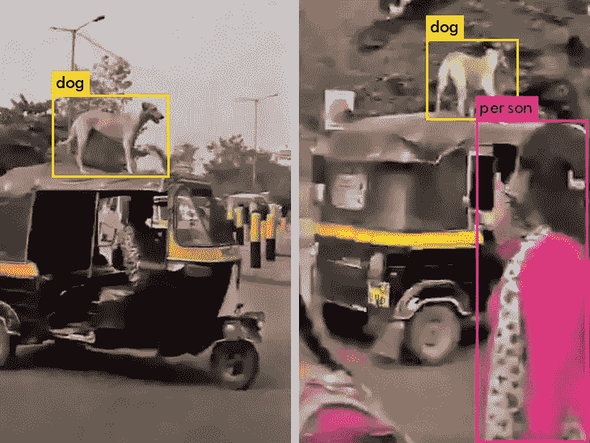
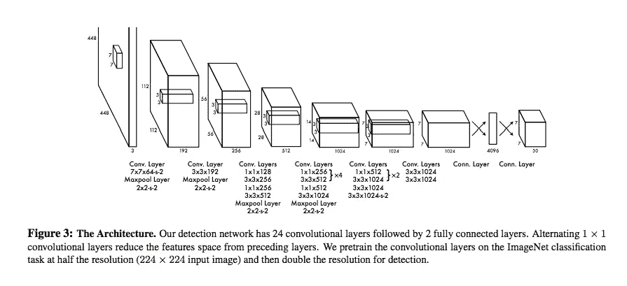
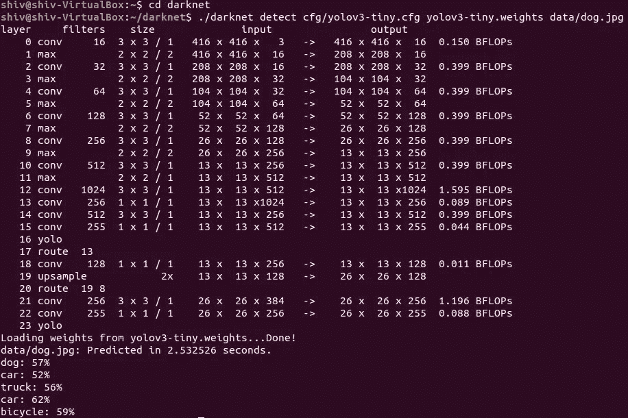
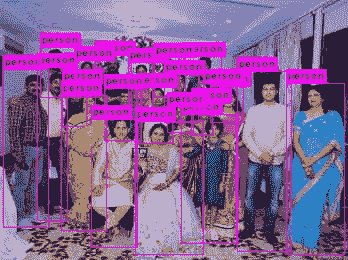
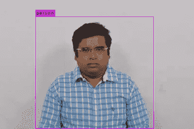

# YOLO 物体检测

> 原文：<https://medium.com/analytics-vidhya/object-detection-with-yolo-d7f3fa788e0a?source=collection_archive---------6----------------------->

黄金视觉

[**物体检测**](https://en.wikipedia.org/wiki/Object_detection) 是与[计算机视觉](https://en.wikipedia.org/wiki/Computer_vision)和[图像处理](https://en.wikipedia.org/wiki/Image_processing)相关的计算机技术，处理在数字图像和视频中检测某一类语义物体(如人、建筑物或汽车)的实例。

**速度、识别和完美**是检测和处理图像、视频或直播流的主要标准。在任何时候，所有这些标准都不能满足。最多，两个可能的标准可以给出最大的好处。

**约洛夫 3 等:**

*   R- CNN、快速 R-CNN 和更快 R-CNN
*   单触发检测器(SSDs)

r-CNN 是首批基于深度学习的对象检测器之一，具有准确的对象检测和语义分割等功能。然而，R-CNN 是精确的并且非常慢(每秒 5 帧)，因此不能用于实时或接近实时的物体检测。

快速 R-CNN 通过外部区域提议算法提高了处理的准确性和时间。

快速 R-CNN 实现的区域提议网络。这完全是 CNN 和对象边界/锚盒的概念是用分数和类标签实现的。狗周围的黄线和人周围的粉线是边界框。边界框顶部的标签是定义图像标签或对象名称的类别标签。

享受汽车之旅的狗狗。

**Yolo 是什么？为什么是 Yolo？**

YOLO 是一种基于卷积神经网络的快速目标检测算法。

为了提高对象检测器的速度，单次检测器(SSDs)和 YOLO 都使用一级检测器策略，其中所有东西都在一次通过中。该算法基于回归，算法同时学习包围盒坐标和相应的类别标签概率。

单次检测器没有委托区域建议网络，并且在一次通过中直接从特征地图预测边界框和类。

**Yolo 如何工作:**

YOLO 将图像分成 13×13 的网格(左图)。每个单元能够预测 5 个边界框，并且每个单元还预测一个类别。

因此，总共 13 * 13 * 5 = 845 个边界框(中上图)。

每个边界框都有一个置信度得分，它表示边界框的确定性。置信度得分表明盒子的形状是好是坏(中上/下图)。

置信度得分和类别预测被合并以导出最终得分，该最终得分告诉包含特定类型的对象的边界框相对于标记和训练的权重被测量的概率。例如，左边的蓝框是 75%，它确认对象是“狗”:

https://arxiv.org/pdf/1506.02640.pdf YOLO 赛段的图示

图像的高分区域被认为是检测到的(阈值大于 30%)

下图描绘了 YOLO V3 的整体**架构**:

YOLO 网络架构

在该示例中，神经网络仅使用标准层类型:具有 3×3 内核的卷积和具有 2×2 内核的最大池。

最后一个卷积层具有 1×1 内核，用于将数据简化为 13×13×125 的形状。

因此，我们发现每个网格单元有 125 个通道。这 125 个通道包含用于边界框和类别预测的数据。每个网格单元预测 5 个边界框，一个边界框由 25 个数据元素描述:

*   边界框矩形的 x，y，宽度，高度
*   置信度得分
*   类别的概率分布

输入图像(416×416 像素)以单输入方式被馈送到卷积网络。

输出从另一端以 13×13×125 张量的形式输出，描述网格单元的边界框。30%以下的分数全部去掉。

**YOLO 积木:**

darknet——用 C 和 CUDA 编写的开源框架

**YOLO 实现:**

下面的代码从命令行调用 YOLO:

shiv @ shiv-VirtualBox:~/darknet $。/darknet detect CFG/yolov 3 . CFG yolov 3 . weights data/dog auto 2 . jpg

下面是自信的输出:

从 yolov3.weights 加载砝码…完成！
data/dog auto 2 . jpg:26.626181 秒预测。
狗:99%
狗:80%
人:98 [%](https://www.facebook.com/jayeeta.it)

[集体合影](https://www.facebook.com/jayeeta.it)

单人形象

稍后，随着 CUDA 和 OpenCV 的实施，这将升级为成熟的代码。这将有助于处理视频以及直播流。

**重要统计:**

*YOLOv1* 在 GPU 上进行 **45 FPS** 的实时物体检测。

*快 YOLO 号称在一个 GPU 上实现***155 FPS。**

*[*YOLO9000:*](https://arxiv.org/abs/1612.08242) (即 YOLOv2)能够以 16%的平均精度检测超过 9000 个物体检测器，并在 156 个标签上训练。*

*YOLOv3 在包含 80 个标签的 COCO 数据集上进行训练*

***限制:***

*它并不总是能很好地处理小物体。*

*参考资料:*

*原始研究论文:*

 *[## 你只看一次:统一的，实时的对象检测

### 我们提出了 YOLO，一种新的目标检测方法。先前关于目标检测的工作将分类器重新用于执行…

arxiv.org](https://arxiv.org/abs/1506.02640)* * [## 基于 OpenCV - PyImageSearch 的 YOLO 目标检测

### 在本教程中，您将学习如何使用 YOLO 对象检测器来检测图像和视频流中的对象…

www.pyimagesearch.com](https://www.pyimagesearch.com/2018/11/12/yolo-object-detection-with-opencv/)*