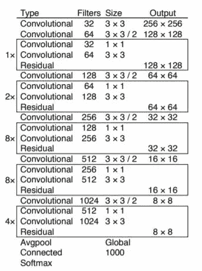
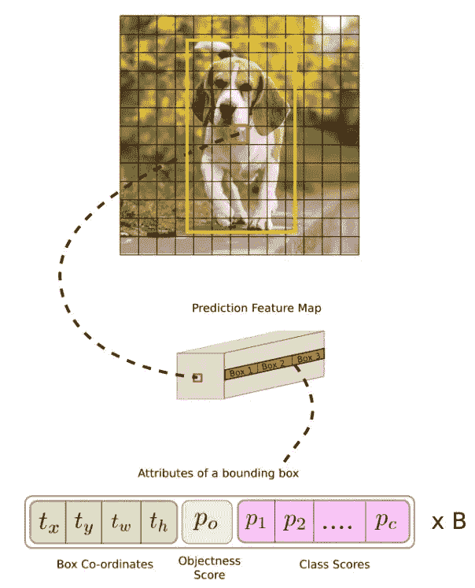
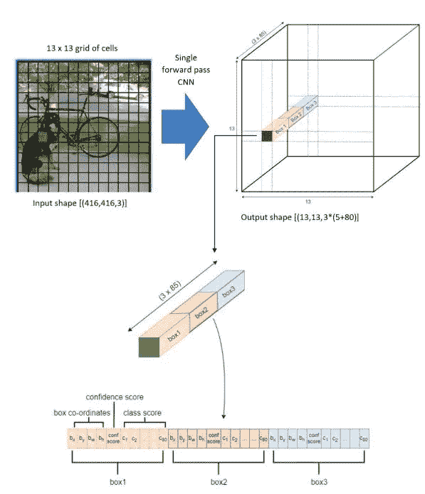
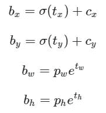
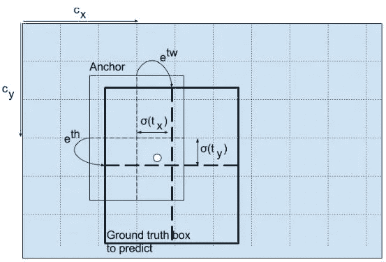
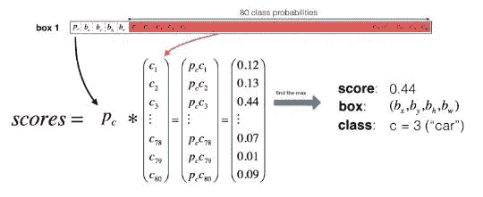
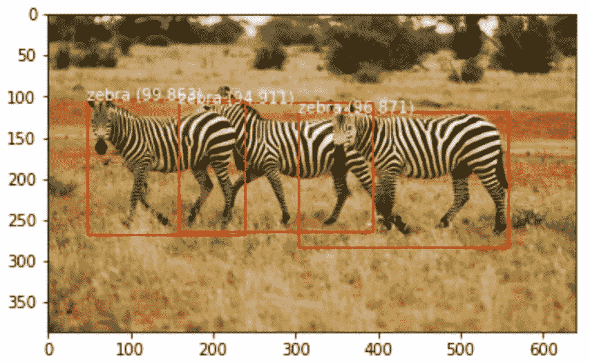
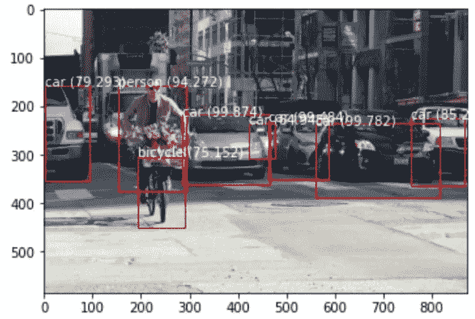

# 物体探测:YOLO

> 原文：<https://medium.com/analytics-vidhya/object-detection-yolo-fc6647ddd11f?source=collection_archive---------7----------------------->

对象检测是一项计算机视觉任务，涉及识别给定图像中一个或多个对象的存在、位置和类型。有许多方法可用于物体检测。其中之一是 R-CNN 家族，即基于区域的卷积神经网络。这包含了用于物体检测和定位的技术 [R-CNN](https://arxiv.org/abs/1311.2524) 、[快速 R-CNN](https://arxiv.org/abs/1504.08083) 、[更快 R-CNN](https://arxiv.org/abs/1506.01497) 和[屏蔽 R-CNN](https://arxiv.org/abs/1703.06870) 。所有这些模型都使用图像的区域来检测和定位对象。他们不看完整的图像，而是看图像中包含物体的概率很高的部分。同样任务的另一个模型是，YOLO(你只看一次)。

YOLO 是一个单一的卷积网络，它查看完整的图像并预测边界框和这些框的类别概率。这将输入分割成单元网格，每个单元直接预测边界框和对象分类。这款车型有三个版本， [YOLO v1](https://pjreddie.com/media/files/papers/yolo_1.pdf) ， [YOLO v2](https://pjreddie.com/media/files/papers/YOLO9000.pdf) ， [YOLO v3](https://pjreddie.com/media/files/papers/YOLOv3.pdf) 。在这里，我们将研究 YOLO v3 网络及其工作原理。

YOLO v3 是暗网的一个变种，最初它由 53 个卷积层组成，每个卷积层之后是批量标准化层和泄漏 ReLu 激活。对于对象检测的任务，在其上堆叠了另外 53 层，为我们提供了 YOLO v3 的 106 层完全卷积架构(**图 1** )。为了更好地理解完整的网络架构，请参考[本](https://towardsdatascience.com/yolo-v3-object-detection-53fb7d3bfe6b)。网络通过网络的步长因子对图像进行下采样。通常，网络中一个层的跨距等于该层的输出小于网络的输入图像的因子。



YOLO v3 架构。图片取自这篇[论文](https://pjreddie.com/media/files/papers/YOLOv3.pdf)。为了更好地理解建筑，请跟随。

网络的输入是一批图像，卷积层学习的特征被传递到分类器/回归器，该分类器/回归器进行检测预测。输出是一个包含已识别类的边界框列表。每个包围盒由 6 个数字 **( *Pc，bx，by，bh，bw，c* )** 表示。 ***Pc*** 是属于特定类的概率， ***bx*** 和 ***by*** 是包围盒的中心， ***bh*** 和 ***bw*** 分别是包围盒的高度和宽度， ***c*** 是可用的总数

为了解释这些特征图的预测并找出边界框属于哪个单元，我们将输入图像划分成与最终特征图的维数相等的网格。例如，如果输入图像是 416×416 个单元，跨距是 32，那么特征图将是 13×13 个单元。然后，我们将输入图像分成 13×13 个单元。



图片取自[此处](https://towardsdatascience.com/yolo-v3-object-detection-53fb7d3bfe6b)

包含对象的基本事实框的中心的单元被选择为负责预测对象的单元(标记为红色)。现在，特征图上对应的细胞被认为是负责检测狗的细胞。由于 YOLO v3 具有三个锚，该单元现在产生三个边界框(锚是边界框先验，其使用 k 均值聚类来计算。更多信息请遵循[和](/@medhijoydeep/anchor-boxes-in-faster-rcnn-6bd566ec4935)。为了更好地理解这一点，参见图 2 。

> 注意:我们将输入图像划分为网格，只是为了确定预测特征图的哪个单元负责预测。



图二。图片取自[此处](https://machinelearningspace.com/yolov3-tensorflow-2-part-1/)

边界框的尺寸是通过对输出应用对数空间变换，然后乘以锚点来计算的，如下所示。



这里， *bx，by，bw，bh* 是我们预测的 *x，y* 中心坐标，宽度和高度。 *tx，ty，tw，th* 为网络输出。 *cx，cy* 是网格的左上角坐标。 *pw，ph* 是盒子的锚尺寸。如需详细了解，请查看下图。



图片取自[此处](https://pylessons.com/YOLOv3-introduction/)。

这里，预测值 *bw* 和 *bh* 通过图像的高度和宽度进行归一化。

现在，为了检查这三个边界框中的哪一个被分配给地面真实图像中的对象，我们为这些框中的每一个计算元素的乘积，并提取该类包含特定类的概率，如下所示。



该盒子检测到 c=3(汽车),概率得分为 0.44。图片取自[此处](https://pylessons.com/YOLOv3-introduction/)

YOLO v3 在具有步长 31、16 和 8 的不同标度上进行预测。在每个比例下，每个单元使用 3 个锚点预测 3 个边界框，使得使用的锚点总数为 9。由于这个原因，我们仍然有许多被高概率选择的边界框。(例如:如果图像是 416 x 415，那么 YOLO 预测，((52x 52)+(26x 26)+(13x 13))x 3 = 10647 个边界框)。为了将输出减少到更少数量的检测对象，我们使用下面的方法。

首先，我们过滤分数低于某个阈值(0.5)的盒子。接下来，使用非最大抑制(NMS ),去除图像中同一物体的多次检测。例如，一个单元的所有三个框可能检测到一个对象，并且相邻的单元也可能检测到相同的对象，在这种情况下，我们使用 NMS 来移除这些多个边界框。这个 NMS 使用 [**交集超过**](https://www.pyimagesearch.com/2016/11/07/intersection-over-union-iou-for-object-detection/) 。移除多个边界框的步骤是:

*   选择得分最高的方框。
*   计算其与其他框的重叠，并移除与其重叠超过联合阈值的框。
*   返回到步骤 1，重复直到没有比当前选择的盒子分数更低的盒子。

在此之后，任何与所选框重叠的框都将被移除，只保留所需的框。

# 实施:

现在，我将向您展示 YOLO v3 在 keras 中的实现。我使用了预先训练的 YOLO 模型来预测和解释预测的边界框。[该](https://raw.githubusercontent.com/experiencor/keras-yolo3/master/yolo3_one_file_to_detect_them_all.py)代码使用预先训练的权重来准备模型，并使用该模型来执行对象检测。我们不直接使用它，而是使用这个程序的元素，准备我们自己的脚本并保存 keras 模型。

[在这里](https://pjreddie.com/media/files/yolov3.weights)你可以找到这个预训练模型的权重。然后，我将这些权重加载到 keras 模型并保存它(代码大量借用了 [**暗网代码**](https://github.com/jbrownlee/keras-yolo3) )

```
model = make_yolov3_model()
weight_reader = WeightReader('yolov3.weights')
weight_reader.load_weights(model)
model.save('model.h5')
```

该模型预测被编码的边界框。这些预测可以通过下面的函数解码。

```
def decode_netout(netout, anchors, obj_thresh, net_h, net_w):
  grid_h, grid_w = netout.shape[:2]
  nb_box = 3
  netout = netout.reshape((grid_h, grid_w, nb_box, -1))
  nb_class = netout.shape[-1] - 5
  boxes = []
  netout[..., :2]  = _sigmoid(netout[..., :2])
  netout[..., 4:]  = _sigmoid(netout[..., 4:])
  netout[..., 5:]  = netout[..., 4][..., np.newaxis] * netout[..., 5:]
  netout[..., 5:] *= netout[..., 5:] > obj_thresh

  for i in range(grid_h*grid_w):
    row = i / grid_w
    col = i % grid_w
    for b in range(nb_box):
      # 4th element is objectness score
      objectness = netout[int(row)][int(col)][b][4]
      if(objectness.all() <= obj_thresh): continue
      # first 4 elements are x, y, w, and h
      x, y, w, h = netout[int(row)][int(col)][b][:4]
      x = (col + x) / grid_w # center position, unit: image width
      y = (row + y) / grid_h # center position, unit: image height
      w = anchors[2 * b + 0] * np.exp(w) / net_w # unit: image width
      h = anchors[2 * b + 1] * np.exp(h) / net_h # unit: image height
      # last elements are class probabilities
      classes = netout[int(row)][col][b][5:]
      box = BoundBox(x-w/2, y-h/2, x+w/2, y+h/2, objectness, classes)
      boxes.append(box)
  return boxes
```

使用非最大抑制移除额外的边界框，如下所示。

```
def _interval_overlap(interval_a, interval_b):
  x1, x2 = interval_a
  x3, x4 = interval_b
  if x3 < x1:
    if x4 < x1:
      return 0
    else:
      return min(x2,x4) - x1
  else:
  if x2 < x3:
    return 0
  else:
    return min(x2,x4) - x3def bbox_iou(box1, box2):
  intersect_w = _interval_overlap([box1.xmin, box1.xmax], [box2.xmin, box2.xmax])
  intersect_h = _interval_overlap([box1.ymin, box1.ymax], [box2.ymin, box2.ymax])
  intersect = intersect_w * intersect_h w1, h1 = box1.xmax-box1.xmin, box1.ymax-box1.ymin
  w2, h2 = box2.xmax-box2.xmin, box2.ymax-box2.ymin
  union = w1*h1 + w2*h2 - intersect
  return float(intersect) / uniondef do_nms(boxes, nms_thresh):
  if len(boxes) > 0:
    nb_class = len(boxes[0].classes)
  else:
    return
  for c in range(nb_class):
    sorted_indices = np.argsort([-box.classes[c] for box in boxes])
    for i in range(len(sorted_indices)):
    index_i = sorted_indices[i]
    if boxes[index_i].classes[c] == 0: continue
    for j in range(i+1, len(sorted_indices)):
      index_j = sorted_indices[j]
      if bbox_iou(boxes[index_i], boxes[index_j]) >= nms_thresh:
        boxes[index_j].classes[c] = 0
```

对单个图像运行此命令会产生以下输出。



该模型可用于您的自定义数据集。详细描述请参考[本](https://machinelearningmastery.com/how-to-train-an-object-detection-model-with-keras/)。

[这里的](https://github.com/kulkarnikeerti/YOLO-v3-for-object-detection)，是完整源代码的链接。

# 参考资料:

*   [https://towards data science . com/yolo-v3-object-detection-53 FB 7d 3 bfe 6 b](https://towardsdatascience.com/yolo-v3-object-detection-53fb7d3bfe6b)
*   [https://pylessons.com/YOLOv3-introduction/](https://pylessons.com/YOLOv3-introduction/)
*   [https://www . analyticsvidhya . com/blog/2018/12/practical-guide-object-detection-yolo-frame wor-python/](https://www.analyticsvidhya.com/blog/2018/12/practical-guide-object-detection-yolo-framewor-python/)