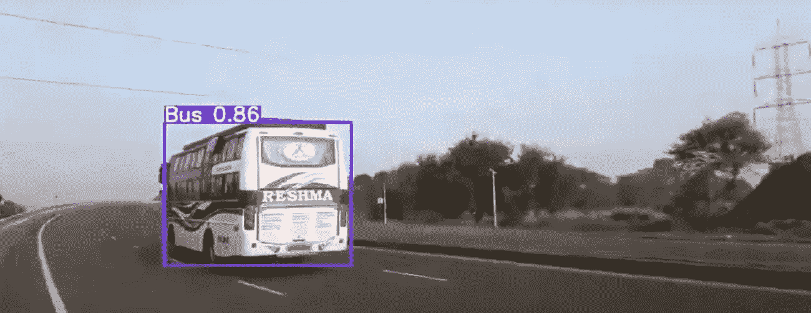

# 对象检测动物园第 1 部分|公交车检测|重型车辆检测

> 原文：<https://medium.com/analytics-vidhya/object-detection-zoo-part-1-bus-detection-heavy-vehicle-detection-1f23a13b3c3?source=collection_archive---------33----------------------->

这是物体探测动物园的第一个帖子。

我将发布一些物体检测输出，短篇故事，以及它的应用/用例。

我介绍的第一个目标检测用例是公交车检测/重型车辆检测。

我为什么选择公交检测？

答案是我已经训练了很多很多深度学习模型。巴士检测是其中之一，我只是按照字母顺序在这里，没有太多的幻想。

无论如何，对于公共汽车/重型车辆检测，有或者可能有几个用例。下面列出了其中的一些。

1)政府公共汽车监控/管理系统。政府可以跟踪监控摄像头的使用情况。

他们可以，

-清点公共汽车站上进出的公共汽车。

-核实公共汽车的到达时间。

-跟踪特定公共汽车站的公共汽车到达频率。

这种生成的数据可以帮助政府解决很多问题。

2)车辆类型(重型或小型)是收费税和高速公路相关服务的一个主要方面，因此他们可以通过结合闭路电视镜头和计算机视觉来解决他们的问题。

3)有些区域或桥梁禁止重型车辆通行，我们可以使用重型车辆检测来监控这些区域。

其中一些用例可能没有任何意义，

也许你能想到一个更好的用例/应用程序！

归根结底，这完全取决于个人的想象力和思考能力。

这是这个模特在从 YouTube 上抓取的各种视频上表演。

公共汽车/重型车辆检测

您可以通过以下方式联系我了解重量/型号:

*   我的 GitHub 个人资料:

 [## mihir135 -概述

### 在 GitHub 上注册你自己的个人资料，这是托管代码、管理项目和构建软件的最佳地方…

github.com](https://github.com/mihir135) 

*   领英:[linkedin.com/in/mihir-rajput-0a3552b8/](https://www.linkedin.com/in/mihir-rajput-0a3552b8/)
*   邮箱:【mihirrajput9@gmail.com 

任何反馈或建议将不胜感激。

谢了。