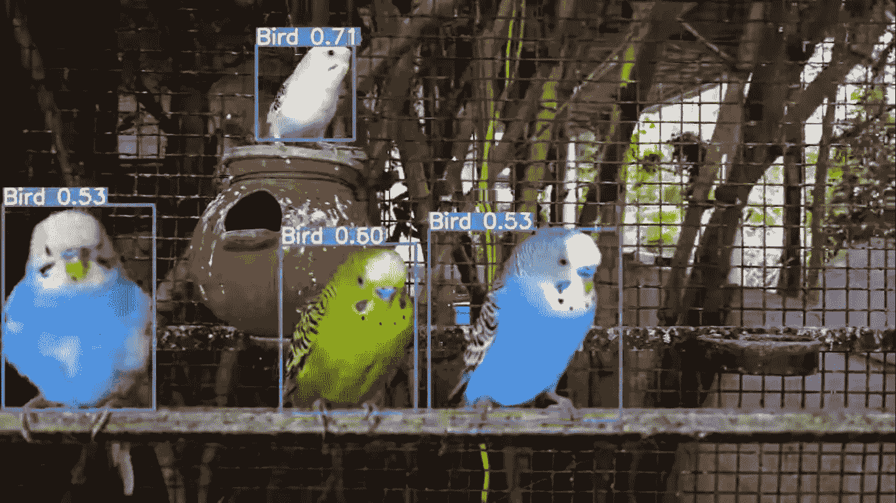
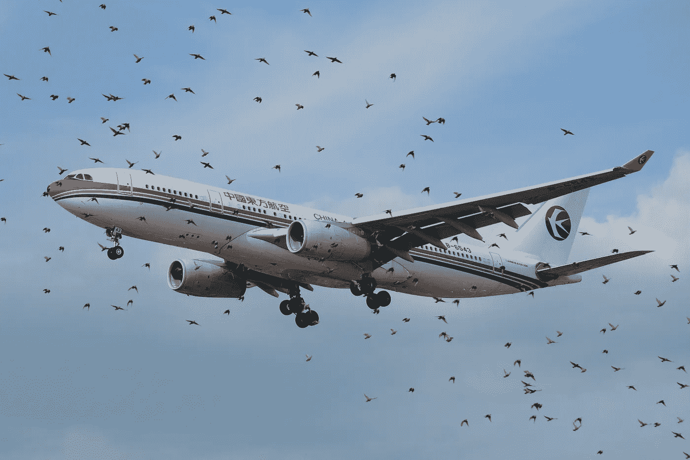
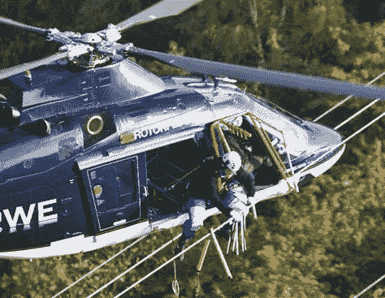
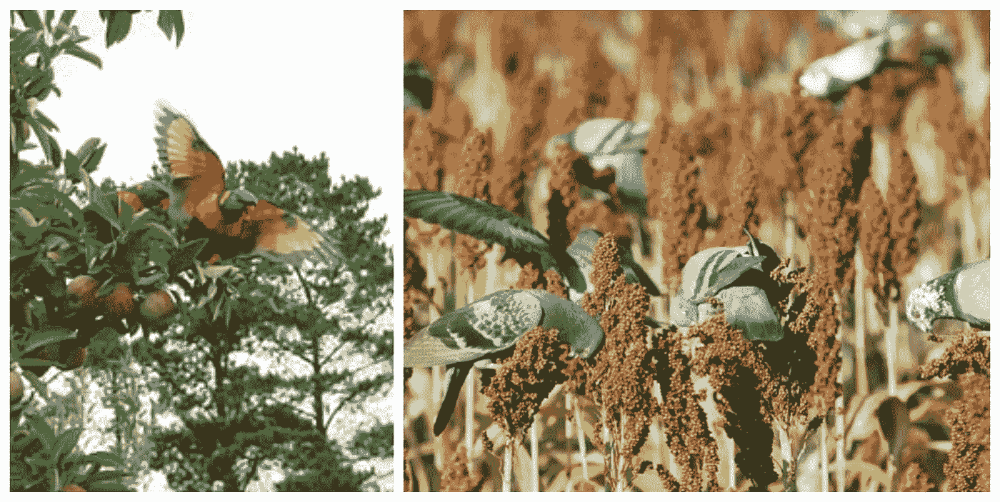

# 对象检测动物园第 2 部分|鸟类检测

> 原文：<https://medium.com/analytics-vidhya/object-detection-zoo-part-2-birds-detection-ac578a3bb3a1?source=collection_archive---------21----------------------->

我希望每个人都过得很好，我带着另一个物体探测动物园的故事回来了。

鸟类探测|物体探测动物园

这次我们将讨论“鸟类探测”。听起来很无聊，对吧？好吧好吧！我们先讨论一些事实。

事实一，

鸟撞——有时被称为鸟撞、鸟食(对于发动机)、鸟撞或鸟撞飞机危险(BASH)——是空中动物(通常是鸟或蝙蝠)和人造车辆(通常是飞机)之间的碰撞。该术语也用于描述因与电线、塔和风力涡轮机等结构碰撞而导致的鸟类死亡(参见“鸟-摩天大楼碰撞”和“塔楼倒塌”)。

来源[https://en.wikipedia.org/](https://en.wikipedia.org/)

仅在美国，这些事故每年造成的损失估计就达 4 亿美元[3],全球商用飞机的损失高达 12 亿美元。

事实二，

根据一项新的研究，世界上有数千万只火烈鸟、鹳、鹈鹕和其他候鸟因为飞进电线而被杀死。

来源 http://www.nbcnews.com/

现在我们知道了这个用例的重要性，让我们探索它的一些应用和输出。

事实三，

对于种植者来说，由于鸟类造成的园艺作物损失是一项持续增加的成本。对损害的估计各不相同，但在研究文献中通常报告为小浆果产量的 30%至 35%,葡萄酒和鲜食葡萄的 7%,苹果和梨的 13%,核果类水果的 16%,坚果类作物的 22%。1 这包括食用的整个水果，从灌木或藤条上掉落的水果，以及滞销的水果(啄、洞、切)。这些估计与 2012 年进行的 OFVGA 种植者调查一致，该调查报告称浆果作物损失 35%，苹果损失 10%，鲜嫩水果损失 15%，葡萄损失 7%。

来源[https://onvegetables . files . WordPress . com/2013/06/managing-bird-damage-in-crops-fact sheet-final . pdf](https://onvegetables.files.wordpress.com/2013/06/managing-bird-damage-in-crops-factsheet-final.pdf)

1)鸟类管理员，饲养或出售鸟类的人(尤其是白鸽管理员，因为在印度他们允许鸽子飞行一段距离)可以很容易地跟踪鸟类，计数和监控它们。

2)在机场跑道等飞机起降区域，可以放置鸟击监测系统，防止鸟击造成重大事故。

3)我们可以在发电厂、巨大的移动塔或任何其他导致大量鸟类死亡的区域附近放置监控系统。

4)农田和农场的监控系统可以帮助农民避免作物和蔬菜受损。

嗯，你可能想知道如何防止这些事故，如何让鸟类远离这些地区？

答案是通过结合检测+报警触发。当有检测时，你可以触发警报，发出一定的噪音，让鸟儿飞走！

其中一些用例可能没有任何意义，

也许你能想到一个更好的用例/应用程序！

归根结底，这完全取决于个人的想象力和思考能力。

YouTube 链接:

鸟类检测

您可以通过以下方式联系我了解重量/型号:

*   我的 GitHub 简介:[https://github.com/mihir135](https://github.com/mihir135)
*   领英:【linkedin.com/in/mihir-rajput-0a3552b8 
*   邮箱:【mihirrajput9@gmail.com 

任何反馈或建议将不胜感激。

谢了。