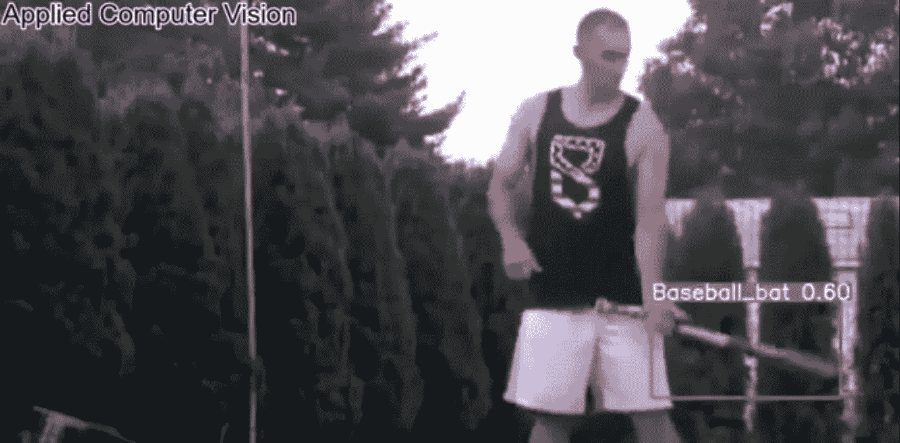

# 对象检测动物园第 3 部分|棒球棒检测

> 原文：<https://medium.com/analytics-vidhya/object-detection-zoo-part-3-baseball-bat-detection-9b3dfd483ada?source=collection_archive---------27----------------------->

在疫情时代，每个人都很害怕，被锁在房子里。比这更糟糕的时代已经过去，这也将很快结束。

嗯，疫情也有一些积极的方面，因为每个人都被锁在自己的房子里，他们都有很多时间来提高他们的技能，发挥创造力，提升他们的职业生涯。这显然是许多可能的积极方面之一！

我也在做类似的事情，有创意！

来讨论一下今天的话题，**“棒球棒检测”。**当真？？这有什么用？有哪些用例？一个人能通过探测一些棒球棒做些什么？

正如我在之前的帖子中所说，这完全是想象力的问题！😄

我向您保证，在故事结束时，您可能会相信棒球棒检测可以有一个健壮的用例。

我们先来讨论一些与此相关的事实。

“棒球棒虽然是娱乐用的，但通常被用作攻击性武器。在英国，人身攻击更可能只发生在身体部位:然而，使用棒球棒的趋势已经被急救部门和警察观察到。球棒是一种容易获得的武器，一种简单的木制武器，在体育用品商店只卖 15 英镑。目前，对购买这些蝙蝠没有任何限制，这些蝙蝠是在攻击中使用时发病和偶尔死亡的主要原因。”

受伤分为三大类:

*   *面部外伤* — 6 (30%)例:鼻骨骨折 3 例，颧骨骨折 2 例，颧弓骨折 1 例。
*   *头部损伤* — 8 例(40%)，多为轻伤和头皮裂伤，本研究中无颅骨骨折或颅内损伤。
*   *四肢创伤* — 6 例(30%)，上肢软组织损伤 5 例，胫骨骨折 1 例。

患者结果记录如下:

*   出院未复查:4 例(20%)。
*   出院时门诊(颌面急诊科)复查:8 例(40%)。
*   入院治疗:8 例(40%)。

Raid-2 战斗场景

来源:

1.Groleau G A，Tso K L，Olshaker J S. *等*棒球棍殴打致伤。创伤杂志 199334366–372。[ [考研](https://www.ncbi.nlm.nih.gov/pubmed/8483176) ] [ [谷歌学术](https://scholar.google.com/scholar_lookup?journal=Trauma+J&volume=34&publication_year=1993&pages=366-372&) ]

2.Ord R . A .贝宁 R . m .殴打造成的颌面部棒球棒伤。口腔颌面外科杂志 199553514–517。[ [考研](https://www.ncbi.nlm.nih.gov/pubmed/7722718)[[谷歌学术](https://scholar.google.com/scholar_lookup?journal=Oral+Maxillofac+Surg+J&volume=53&publication_year=1995&pages=514-517&) ]

3.Berlet A C，Talenti D P，Carroll S . f .*等*棒球棒:城市伤害的流行机制。创伤杂志 199233167–170。[ [考研](https://www.ncbi.nlm.nih.gov/pubmed/1507276) ] [ [谷歌学术](https://scholar.google.com/scholar_lookup?journal=Trauma+J&volume=33&publication_year=1992&pages=167-170&)

因此，我认为这清楚地表明了我为什么选择棒球棒检测。

现在让我们讨论可能的用例。

1.  这种物体检测可用于组织者或政府希望防止这类物体进入的公共区域、事件或聚会。
2.  棒球检测对于从安全摄像机检测暴力也是有用的。当然，这将需要一些额外的努力，我们可能需要嵌入任何活动识别算法。

其中一些用例可能没有任何意义，

也许你能想到一个更好的用例/应用程序！

归根结底，这完全取决于个人的想象力和思考能力。

YouTube 链接:

物体检测|棒球棒检测

您可以通过以下方式联系我了解重量/型号:

我的 GitHub 个人资料，

[https://github.com/mihir135](https://github.com/mihir135)

LinkedIn，

[https://www.linkedin.com/in/mihir-rajput/](https://www.linkedin.com/in/mihir-rajput/)

电子邮件，

[mihirrajput9@gmail.com](mailto:mihirrajput9@gmail.com)

任何反馈或建议将不胜感激。

谢了。