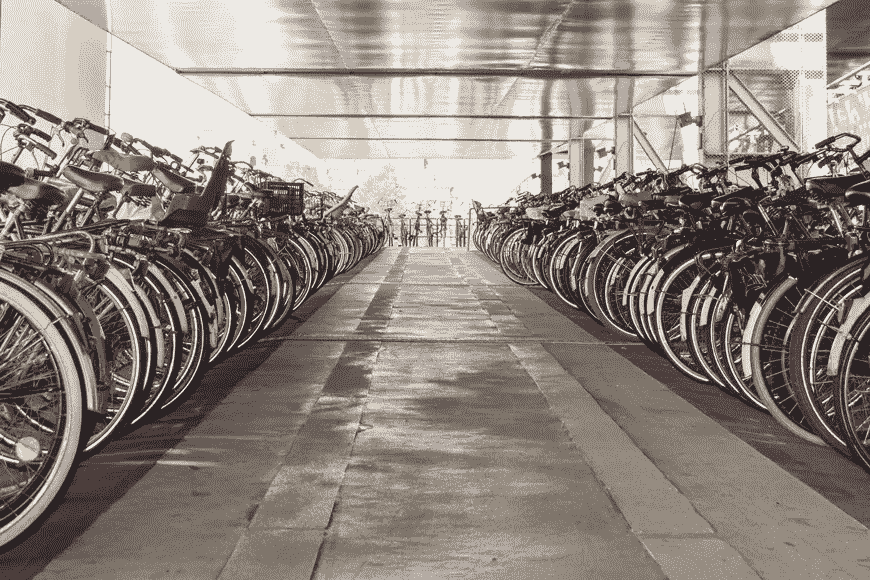

# 对象检测动物园第 4 部分|自行车检测

> 原文：<https://medium.com/analytics-vidhya/object-detection-zoo-part-4-bicycle-detection-66a54f81ee82?source=collection_archive---------27----------------------->

当我还是个孩子的时候，骑自行车是我生活中最美好的部分。我过去总是保持我的自行车干净，并且每天清洗它。这是我生命中最重要的部分。

但是时间一长，我都快忘了。我想这是我们每一个人共同的故事。当我们得到新的东西时，我们会忘记旧的！

嗯，最近骑自行车是一种新的趋势，许多人都在适应它。一些首席执行官、演员、商人、办公室职员更喜欢自行车而不是其他交通工具。这种偏好主要是出于对自身健康和环境的贡献。

在我居住的艾哈迈达巴德，有一个自行车共享和租赁项目。看看这里[https://mybyk.in/](https://mybyk.in/)。

随着这些与“自行车”相关的项目的开展，骑自行车代替其他交通工具再次成为一种趋势。

当事情变得时髦时，总是从中获益。作为一名人工智能工程师，我很容易挑选任何趋势性的机会，并将其与人工智能相关/结合，并提出一些用例及解决方案。下面列出了其中的一些。

1.  像[自行车共享](https://mybyk.in/)这样的项目可以使用自行车检测，通过闭路电视摄像头自动管理、计数和保护他们的自行车。
2.  自行车比赛或任何其他相关事件可以使用使用相机的自行车检测来获得通知(了解参与者已经到达的位置，因为赛道有时很长)，有趣的自动洞察，如多少参与者已经到达/走过特定的里程碑。
3.  自行车检测对于自动监控一些禁止自行车的地方(如国道)或只允许自行车的地方(如河边或花园)也是有用的。
4.  此外，这在智能城市中可能很有用，可以获得关于有多少人使用自行车或骑自行车的频率的有趣见解和信息。哪个地区的自行车数量最多，哪个地区的自行车数量最少？

其中一些用例可能没有任何意义，

也许你能想到一个更好的用例/应用程序！

归根结底，这完全取决于个人的想象力和思考能力。

YouTube 链接:

物体检测|自行车检测

您可以通过以下方式联系我了解重量/型号:

我的 GitHub 个人资料，

【https://github.com/mihir135 

LinkedIn，

[https://www.linkedin.com/in/mihir-rajput/](https://www.linkedin.com/in/mihir-rajput/)

电子邮件，

[mihirrajput9@gmail.com](mailto:mihirrajput9@gmail.com)

任何反馈或建议将不胜感激。

谢了。