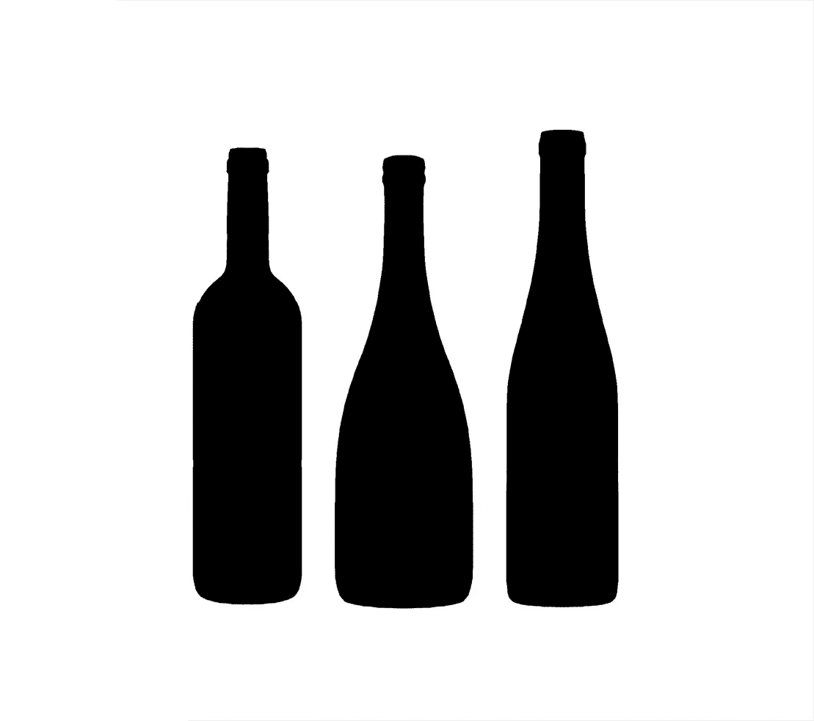

# 对象检测动物园第 5 部分|瓶子检测

> 原文：<https://medium.com/analytics-vidhya/object-detection-zoo-part-5-bottle-detection-aede763bbac3?source=collection_archive---------11----------------------->

瓶子是我们日常生活中最重要的部分之一。每个人都使用它们。塑料瓶，钢或铝瓶，水瓶，饮料瓶，总之瓶子无处不在！

另一方面，塑料瓶正在迅速影响环境。它对陆地和海洋造成了破坏。这里有一些例子/事实，

*   塑料瓶需要 700 年才能溶解。
*   瓶装水 90%的成本是瓶子本身。
*   80%的塑料瓶从未被回收。
*   仅在美国，每年就有 3800 万个塑料瓶被填埋。
*   生产这数十亿个塑料瓶需要 2400 万升石油。
*   普通美国人每年消耗 167 瓶水。
*   瓶装水和船运是人类历史上最不节能的供水方式。
*   瓶装水是美国第二受欢迎的饮料。

来源:[https://my equa . com/blogs/blog/89626311-关于塑料瓶的事实](https://myequa.com/blogs/blog/89626311-facts-about-plastic-bottles)

作为一个环保主义者，我建议不要使用塑料瓶或有限制地使用塑料瓶。

> 为此，需要自动监控。这就是我选择在这个世界环境日训练瓶子检测算法的重要原因！

这里有一些可以使用瓶子检测的用例场景，

*   海滩、湖泊、花园、电影院、一些不允许使用瓶子的街道，瓶子检测可用于使用 CCTV 摄像机自动监控这些区域。
*   瓶子制造商可以利用这一点进行计数和监控。
*   自动化或 ROBO 酒店(使用机器人自动服务)可以使用瓶子检测来验证桌子上是否有所有必需品(主要是水瓶)。

其中一些用例可能没有任何意义，

也许你能想到一个更好的用例/应用程序！

归根结底，这完全取决于个人的想象力和思考能力。

YouTube 链接:

物体检测|瓶子检测

您可以通过以下方式联系我了解重量/型号:

我的 GitHub 个人资料，

【https://github.com/mihir135 号

LinkedIn，

【https://www.linkedin.com/in/mihir-rajput/ 

电子邮件，

[mihirrajput9@gmail.com](mailto:mihirrajput9@gmail.com)

任何反馈或建议将不胜感激。

谢了。