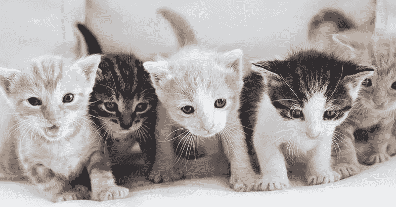

# 对象检测动物园第 6 部分|猫检测

> 原文：<https://medium.com/analytics-vidhya/object-detection-zoo-part-6-cat-detection-6adeca4f2b24?source=collection_archive---------25----------------------->

来源: [Pinterest](https://www.pinterest.co.uk/)

可爱可爱可爱！猫很可爱，很酷，很有趣。我想大多数人都会同意我的观点。

作为一个动物爱好者，我非常喜欢猫。我也喜欢其他动物，但狗是我的最爱😍。

这就是为什么我决定训练猫检测模型。在随后的帖子中，你也可以期待其他动物探测器。狗和大象肯定会是其中的一部分。

现在让我们来讨论一些关于猫的奇妙事实。

1.  从发育的角度来说，猫生命的第一年等于人类生命的前 15 年。第二年后，猫相当于人类的 25 岁。之后，猫的每一年相当于人类的 7 年。
2.  猫可以把耳朵旋转 180 度。
3.  普通猫的听觉至少比成年人灵敏五倍。
4.  在最大的猫品种中，雄性的平均体重约为 20 磅。
5.  家猫一天大约有 70%的时间在睡觉。一天中有 15%的时间用于打扮。
6.  猫不能直接在鼻子下看东西。
7.  大多数猫没有睫毛。
8.  猫的前爪有五个脚趾，但后爪只有四个。然而，猫有多余的脚趾并不罕见。已知脚趾最多的猫有 32 个——每个爪子上有 8 个！
9.  有些人认为，如果你梦见一只白猫，好运就会随之而来。
10.  喵喵并不是天生的猫语——它们是为了与人类交流而发展出来的！

> 来源:[https://www . purina . com/articles/cat/facts/10-关于猫的迷人事实](https://www.purina.com/articles/cat/facts/10-fascinating-facts-about-cats)

太棒了。不是吗？

好了，不用花太多时间，让我们直接跳到用例部分。

动物检测有许多用例，下面将具体讨论猫检测用例。

1.  猫的看护者，即拥有或出售猫的人，可以很容易地跟踪、统计和监控它们。
2.  鸟类学家的监控系统(鸟类学是动物学的一个分支，研究鸟类。)可以帮助保护鸟类免受猫的伤害。
3.  在智能家居中，使用摄像头我们可以识别猫是否进入厨房并破坏食物。此外，该系统可以发出警报，避免资源和食物的浪费。
4.  我们可以在禁止养猫的地方、水族馆、电影院、商场或任何其他禁止养宠物的地方安装监控系统。

其中一些用例可能没有任何意义，

也许你能想到一个更好的用例/应用程序！

归根结底，这完全取决于个人的想象力和思考能力。

这是这个模特在从 YouTube 上抓取的各种视频上表演。

cat 检测

您可以通过以下方式联系我了解重量/型号:

我的 [GitHub](https://github.com/mihir135) 或者 [LinkedIn](https://www.linkedin.com/in/mihir-rajput/) 。

特别感谢 [Mayur Patel](https://medium.com/u/52e4be8e717a?source=post_page-----6adeca4f2b24--------------------------------) 的贡献。

任何反馈或建议将不胜感激。