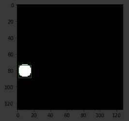

# 使用 Keras 的目标定位

> 原文：<https://medium.com/analytics-vidhya/object-localization-using-keras-d78d6810d0be?source=collection_archive---------0----------------------->

在这篇博客中，我将解释*对象定位*的任务，以及如何实现一个基于 CNN 的架构来解决这个任务。

**资源** :
代码:[https://colab . research . Google . com/drive/169 pj-xecbwd w9 q 92 naane 3 orybr 7d-uh # scroll to = ijfabna 7 nzl](https://colab.research.google.com/drive/169pJ-xECBWDW9Q92naaNE3oRyBr7D-uh#scrollTo=IjFHABNA7nZL)
图片:[https://drive . Google . com/drive/folders/1 ysxdywjuzi-l _ YgzXt _ _ 9 _ _ eUU-I _ 6EH？usp =分享](https://drive.google.com/drive/folders/1YsxDywjUZi-l_YgzXt__9__eUU-I_6EH?usp=sharing)

# **议程**

*   什么是对象本地化？
*   如何使用深度神经网络执行目标定位
*   逐步实施 Keras

## **物体定位**

*物体定位*是“带定位的分类”任务的名称。也就是说，给定一幅图像，对图像中出现的物体进行分类，并找到它在图像中的位置，通常使用边界框。在*对象定位*中，图像中只能出现一个对象。如果出现一个以上的物体，该任务称为“*物体检测*”。

分类与目标定位

## **如何使用 DNNs 进行物体定位？**

目标定位可以被视为一个回归问题——预测一个连续的值，如体重或工资。例如，我们可以将我们的输出(边界框)表示为大小为 4 的元组，如下:
(x，y，height，width)
- (x，y):边界框左上角的坐标
- height:边界框的高度
- width:边界框的宽度

(x，y，height，width)作为边界框表示

因此，我们可以使用输出 4 个数字的 CNN 架构，但是我们的架构是什么呢？

首先，我们会注意到这 4 个数字有一些限制:(x.y)必须在图像内部，x+宽度和 y+高度也是如此。我们将缩放图像的宽度和高度为 1.0。为了确保 CNN 输出在范围[0，1]内，我们将使用 *sigmoid* 激活层——它将强制(x，y)在图像内，但不一定是 x+宽度和 y+高度。该属性将由网络在训练过程中学习。

建议的架构:

给定一幅图像，网络将输出一个 4 数字表示的边界框

损失函数呢？一个*sigmoid**的输出可以被视为概率值，因此我们可以使用*binary _ cross entropy*loss。*

**

*二元交叉熵公式*

*通常，这种损失与二进制值一起使用，作为基本事实({0，1})，但不一定要这样，我们可以使用[0，1]中的值。对于我们的使用，地面真实值确实在范围[0，1]内，因为它表示图像内的位置和维度。*

***逐步实施 Keras】***

*我们将用三个步骤来解决一个目标定位任务:
1)合成用例——检测黑色背景上的白色斑点
2)半合成用例——检测黑色背景上的猫
3)最终用例——检测自然背景上的猫*

1.  ***合成用例:**
    首先，我们将导入并定义以下内容:*

*然后，我们将定义基于 CNN 的模型。我们将执行*迁移学习*:使用预训练版本的 VGG。*

**

*模型的架构*

*我们的下一步将是使用 python 生成器创建数据集。它将在黑色背景上创建一批白色斑点。*

*x 是一批图像，Y 是真实边界框。对于每个图像，我们将创建一个白色的斑点，我们将确保它将在图像的边界内。*

**

*圆生成器的一个例子*

*现在，我们可以训练模型来预测地面真实边界框，并可视化其性能:*

**

*2.**半合成用例:** 对于这个用例，我们将使用相同的架构，使用不同类型的图像——黑色背景上的猫的图像。这将通过使用不同的发电机来实现:*

*对于每张图片，这个生成器会将猫的大小调整为随机大小，并在黑色背景图片上的随机位置绘制它。*

*上面的输出是:*

**

*现在，我们可以定义一个类似的模型，训练它并检查它的结果:*

*我们训练过的模型能够在黑色背景图像中定位一只猫:*

**

*3.**最终用例** 在这个用例中，我们将在自然背景上绘制我们的猫。类似于第二个用例，我们将需要实现一个新的图像生成器——每个图像将由一个随机位置的随机大小的猫组成。这只猫将被画在一个自然的图像上，这将是它的背景。自然图像将从一组图像中随机抽取。*

*这个生成器从给定的集合中为每个图像绘制一个随机的自然背景图像。它会将猫的大小调整为随机大小，并在自然背景上的随机位置绘制它。*

*natural_cat_gen()输出将类似于:*

**

*接下来，我们将定义一个新模型，对其进行训练并可视化其部分结果:*

**