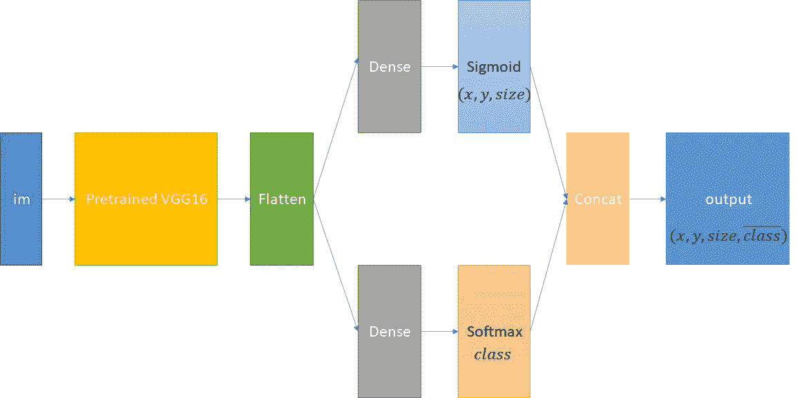
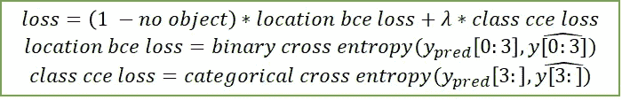
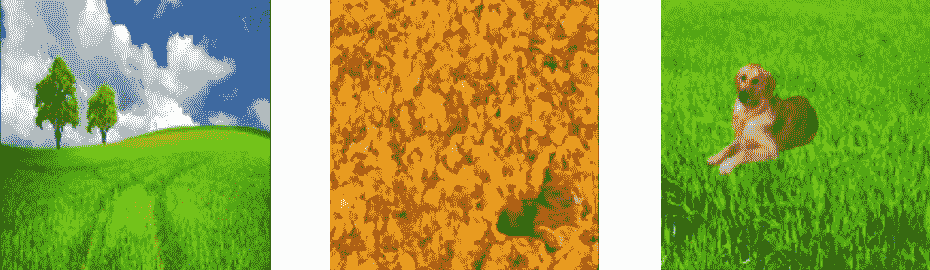
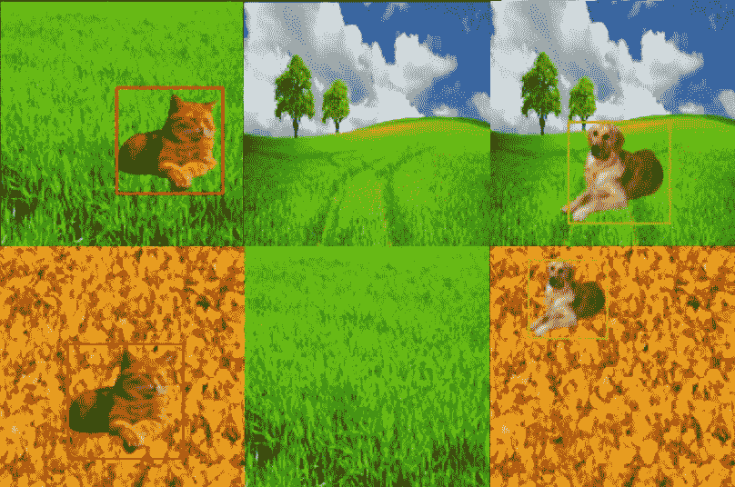

# 使用 Keras 的对象定位—第 2 部分

> 原文：<https://medium.com/analytics-vidhya/object-localization-using-keras-part-2-207e7ccba6ed?source=collection_archive---------13----------------------->

在我的上一篇文章“使用 Keras 的目标定位”中，我解释了什么是计算机视觉中的目标定位，并分享了我的代码，它解决了这个任务的一个简化版本——通过提供一个包围它的边界框来定位一个目标(一只猫)。

在本文中，我们将把它扩展为多类版本。也就是说，检测物体是否出现，对其进行分类，并找到其位置。

**资源** :
代码—[https://colab . research . Google . com/drive/169 pj-xecbwdw 9 q 92 na ane 3 ory br 7d-uh？usp =分享](https://colab.research.google.com/drive/169pJ-xECBWDW9Q92naaNE3oRyBr7D-uh?usp=sharing)
图片—[https://drive . Google . com/drive/folders/1 ysxdywjuzi-l _ YgzXt _ _ 9 _ _ eUU-I _ 6EH？usp =分享](https://drive.google.com/drive/folders/1YsxDywjUZi-l_YgzXt__9__eUU-I_6EH?usp=sharing)

# 议程

1.  什么是多类分类？
2.  前一篇文章的实现需要什么变化？
3.  代码部分
4.  结果

# 多类分类

根据维基百科，“**多类**或**多项分类**是[将](https://en.wikipedia.org/wiki/Statistical_classification)实例分类为三个或更多类中的一个(将实例分类为两个类中的一个称为[二元分类](https://en.wikipedia.org/wiki/Binary_classification))的问题”。

在计算机视觉领域，一个实例可以是一幅图像，任务是从一组至少大小为 3 的给定标签中对其进行标记。例如，CIFAR10 数据集由大小为 32*32*3 的 RGB 图像组成，每个图像都被标记为以下之一:飞机、汽车、鸟、猫、鹿、狗、青蛙、马、船和卡车。

在本文中，类集由一只猫、一只狗和一个无对象组成。

# 与前一篇文章相比的变化

在上一篇文章中，我分享了一个能够在带有自然背景的图像中定位物体(一只猫)的架构。现在，我们的目标是一项更艰巨的任务，原因如下:

-可能根本没有对象
-有不止一个类

由于这些变化，我们需要适当地修改我们的架构和损失函数。此外，还需要一个新的图像生成器。

**架构** :
我们要预测对象的类别——猫/狗/无对象。此外，我们必须提供边界框的坐标— (x，y)坐标和大小(假设边界框是正方形)。
因此，模型的输出应该是一个大小为 6 的向量，它将包含:
- (x，y)坐标
-边界框大小
-大小为 3 的向量，它表示类别-猫/狗/无对象

建议的架构

**损失函数** :
在之前的文章中，我已经使用了二值交叉熵损失，但是现在，这是不可能的，原因主要有两个:

1)当完全没有物体时，我们根本不想预测包围盒。在这种情况下，没有地面真实边界框，我们不想因为边界框而受到惩罚。所以，我们需要定义一个更智能的损失函数。

2)因为我们正在处理多类分类，我们应该在类上使用分类交叉熵(每个实例正好一个类)。

因此，我们需要一个自定义的损失函数，当且仅当类不是“无对象”时，它才检查边界框预测。此外，我们希望类损失是分类交叉熵。

建议的自定义损失函数

**图像生成器** :
我们需要实现一个新的生成器，它能够生成所需类型的图像:
-具有自然背景
-包含一只猫/狗/无对象(随机化)
-随机化的对象大小和位置

图像生成器生成的样本

# 密码

**图像生成器** 下面这段代码加载了图像类，并创建了一个具有所需属性的图像生成器:

**架构** 如上所述定义架构

**损失与训练** 定义我们自定义的损失，训练模型，可视化结果。

以下是一些结果:

结果

正如我们所看到的，该模型成功地检测到了对象的外观，正确地对它们进行了分类，并准确地找到了位置。