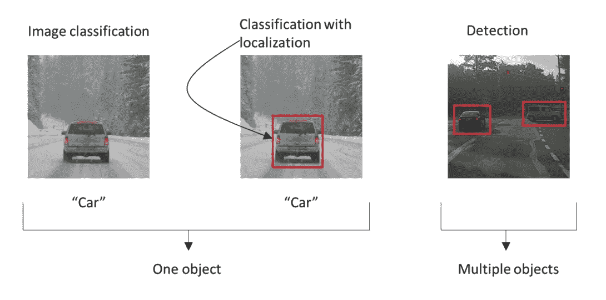

# 基于 Keras 和 W&B 的目标定位

> 原文：<https://medium.com/analytics-vidhya/object-localization-with-keras-2f272f79e03c?source=collection_archive---------6----------------------->

## **该报告使用 Keras 中的边界框回归技术探索了目标定位，并以交互方式可视化了模型的权重预测&偏差**


由[尼克·希利尔](https://unsplash.com/@nhillier?utm_source=medium&utm_medium=referral)在 [Unsplash](https://unsplash.com?utm_source=medium&utm_medium=referral) 上拍摄

## [互动报道](https://wandb.ai/wandb/object_localization/reports/Object-Localization-with-Keras-and-W-B--VmlldzoyNzA2Mzk) | [Colab 笔记本](https://colab.research.google.com/drive/1LWbgjNbQLQHgfY2WH0lKBEFRIZXdqT86?usp=sharing)

# 介绍

对象定位是**在图像中定位特定对象类别**的实例的任务，通常通过指定以实例为中心的紧密裁剪的边界框。相反，对象检测是定位所有目标对象的所有可能实例的任务。

物体定位也叫“带定位的分类”。这是因为可以稍微修改执行图像分类的架构来预测边界框坐标。查看[吴恩达关于物体定位的讲座](https://www.youtube.com/watch?v=GSwYGkTfOKk)或查看[物体检测:Keras、TensorFlow 和深度学习的边界框回归](https://www.pyimagesearch.com/2020/10/05/object-detection-bounding-box-regression-with-keras-tensorflow-and-deep-learning/)作者 [Adrian Rosebrock](https://www.pyimagesearch.com/author/adrian/) 。



**图 1** :图像分类、物体定位、物体检测的区别。([来源](http://datahacker.rs/deep-learning-object-localization/))

在本报告中，我们将构建一个对象定位模型，并在一个合成数据集上对其进行训练。我们将**交互可视化我们模型的预测**权重&偏差。

# 数据集

我们将使用一个基于 MNIST 数据集的合成数据集来完成目标定位任务。这个数据集是由劳伦斯·莫罗尼制作的。想法是，代替 28×28 像素的 MNIST 图像，它可以是 NxN(100×100)，并且任务是预测手指位置的边界框。


**图 2** :数据集的样本。每个图像都是 100x100 像素。

## 下载数据集

这个 [GitHub repo](https://github.com/lmoroney/synthetic_datasets) 是数据集的原始来源。但是，由于这个[问题](https://github.com/lmoroney/synthetic_datasets/issues/2)，我们将使用原始存储库的 [my fork](https://github.com/ayulockin/synthetic_datasets) 。

我们还有一个`.csv`训练和测试文件，其中包含图像名称、标签和边界框坐标。注意，坐标被缩放到`[0, 1]`。

```
!git clone https://github.com/ayulockin/synthetic_datasets
%cd synthetic_datasets/MNIST/
%mkdir images!unzip -q MNIST_Converted_Training.zip -d images/
!unzip -q MNIST_Converted_Testing.zip -d images/
```

## 使用`tf.data`的数据加载器

我们将使用`tf.data.Dataset`构建我们的输入管道。我们的模型必须预测图像的类别(所讨论的对象)和给定输入图像的边界框坐标。

在*模型*部分，您将认识到该模型是一个多输出架构。查看 [Adrian Rosebrock](https://www.pyimagesearch.com/author/adrian/) 的[Keras:Multiple outputs and Multiple loss](https://www.pyimagesearch.com/2018/06/04/keras-multiple-outputs-and-multiple-losses/)以了解更多信息。

**下图所示的** `**tf.data.Dataset**` **流水线处理多输出训练**。我们将随图像一起返回标签和边界框坐标的字典。**键的名称应该与输出层的名称相同。**

```
AUTO = tf.data.experimental.AUTOTUNE
BATCH_SIZE = 32@tf.function
def preprocess_train(image_name, label, bbox):
    image = tf.io.read_file(TRAIN_IMG_PATH+image_name)
    image = tf.image.decode_png(image, channels=1) return image, {'label': label, 'bbox': bbox} # Notice here@tf.function
def preprocess_test(image_name, label, bbox):
    image = tf.io.read_file(TEST_IMG_PATH+image_name)
    image = tf.image.decode_png(image, channels=1) return image, {'label': label, 'bbox': bbox} # Notice heretrainloader = tf.data.Dataset.from_tensor_slices((train_image_names, train_labels, train_bbox))
testloader = tf.data.Dataset.from_tensor_slices((test_image_names, test_labels, test_bbox))trainloader = (
    trainloader
    .map(preprocess_train, num_parallel_calls=AUTO)
    .shuffle(1024)
    .batch(BATCH_SIZE)
    .prefetch(AUTO)
)testloader = (
    testloader
    .map(preprocess_test, num_parallel_calls=AUTO)
    .batch(BATCH_SIZE)
    .prefetch(AUTO)
)
```

# 模型

## 包围盒回归

在我们建立模型之前，让我们简单讨论一下包围盒回归。在机器学习文献中，回归是将输入值 X 映射到连续输出变量 y 的任务。

因此，我们返回一个数字而不是一个类，在我们的例子中，我们将返回 4 个与边界框相关的数字(x1，y1，x2，y2)。我们将用一幅图像和一个真实边界框来训练这个系统，并使用 L2 损失来计算预测边界框和真实边界框之间的损失。查看此视频以了解更多关于边界框回归的信息。


**图 3** :物体定位任务的包围盒回归通用模型架构。([来源](https://leonardoaraujosantos.gitbook.io/artificial-inteligence/machine_learning/deep_learning/object_localization_and_detection#localize-objects-with-regression))

回到模型，图 3 正确地总结了模型架构。该模型由三部分组成——卷积块(特征提取器)、分类头和回归头。

这是一种多输出配置。正如在*数据集*一节中提到的，`tf.data.Dataset`输入管道返回一个字典，其键名是分类头和回归头的输出层的名称。

下面显示的代码片段为对象本地化构建了我们的模型架构。

```
def get_model():
    inputs = Input(shape=(100,100,1))
    x = Conv2D(32, (3,3), activation='relu')(inputs)
    x = MaxPooling2D((3,3))(x)
    x = Conv2D(32, (3,3), activation='relu')(x)
    x = MaxPooling2D((3,3))(x)
    x = Conv2D(64, (3,3), activation='relu')(x)
    x = GlobalAveragePooling2D()(x) classifier_head = Dropout(0.3)(x)
    # Notice the name of the layer.
    classifier_head = Dense(10, activation='softmax', name='label')(classifier_head) reg_head = Dense(64, activation='relu')(x)
    reg_head = Dense(32, activation='relu')(reg_head)
    # Notice the name of the layer.
    reg_head = Dense(4, activation='sigmoid', name='bbox')(reg_head) return Model(inputs=[inputs], outputs=[classifier_head, reg_head])
```

给予多个标题的名称被用作`losses`字典的关键字。请注意，分类头的激活功能是`softmax`，因为它是一个多级分类设置(0-9 位数)。回归头的激活功能是`sigmoid`，因为边界框坐标在`[0, 1]`的范围内。

损失函数被适当地选择。我们可以选择给不同的损失函数不同的权重。

```
losses = {'label': 'sparse_categorical_crossentropy',
          'bbox': 'mse'}loss_weights = {'label': 1.0,
                'bbox': 1.0}
```

# `BBoxLogger` -预测的交互式可视化

在进行对象定位或对象检测时，您可以在权重和偏差中交互式地显示模型的预测。您可以记录样本图像以及地面真实值和预测边界框值。你甚至可以记录多个框，可以记录信心分数，借据分数等。点击查看文档[。](https://docs.wandb.com/library/log#images-and-overlays)

Stacey Svetlichnaya 的报告[对象检测的边界框](https://wandb.ai/stacey/yolo-drive/reports/Bounding-Boxes-for-Object-Detection--Vmlldzo4Nzg4MQ)将带您了解该工具的交互控件。它涵盖了日志图像和边界框坐标的各种麻烦。

下面显示的代码片段是我们的`BBoxLogger`回调的助手函数。函数`wandb_bbox`以所需的格式返回图像、预测边界框坐标和地面真实坐标。注意，传递的值有`dtype`，它是`JSON`可序列化的。比如你的`pred_label`应该是`float`型而不是`ndarray.float`。

```
def wandb_bbox(image, p_bbox, pred_label, t_bbox, true_label, class_id_to_label):
    return wandb.Image(image, boxes={
        "predictions": {
            "box_data": [{
                "position": {
                    "minX": p_bbox[0],
                    "maxX": p_bbox[2],
                    "minY": p_bbox[1],
                    "maxY": p_bbox[3]
                    },
                "class_id" : pred_label,
                "box_caption": class_id_to_label[pred_label]
            }],
          "class_labels": class_id_to_label
        },
        "ground_truth": {
            "box_data": [{
                "position": {
                    "minX": t_bbox[0],
                    "maxX": t_bbox[2],
                    "minY": t_bbox[1],
                    "maxY": t_bbox[3]
                    },
                "class_id" : true_label,
                "box_caption": class_id_to_label[true_label]
            }],
          "class_labels": class_id_to_label
        }
    })
```

我们的`BBoxLogger`是一个定制的 Keras 回调函数。我们可以将它传递给`model.fit`来记录我们的模型在一个小型验证集上的预测。权重和偏差将自动覆盖图像上的边界框。

```
class BBoxLogger(tf.keras.callbacks.Callback):
    def __init__(self):
        super(BBoxLogger, self).__init__()
        self.val_images, label_bbox = next(iter(testloader))
        self.true_labels = label_bbox['label']
        self.true_bbox = label_bbox['bbox']

    def on_epoch_end(self, logs, epoch):
        localization_list = []

        for idx in range(len(self.val_images)):
            # get image
            image = self.val_images[idx]
            # get ground truth label and bbox coordinates.
            true_label = int(self.true_labels[idx].numpy())
            t_bbox = self.true_bbox[idx]
            # get model prediction.
            pred_label, p_bbox = model.predict(np.expand_dims(image, 0))
            # get argmax of the prediction
            pred_label = int(np.argmax(pred_label[0])) 
            # get wandb image
            localization_list.append(wandb_bbox(image, 
                                                p_bbox[0].tolist(),
                                                pred_label, 
                                                t_bbox.numpy().tolist(), 
                                                true_label, 
                                                class_id_to_label))

        wandb.log({"predictions" : localization_list})
```

我们将很快看到结果。

# 结果

现在到了激动人心的部分。我用 10 倍的耐心训练了早停模型。随意训练模型更长的时期，并使用其他超参数。在这个 colab 笔记本上尝试实验。

[](https://colab.research.google.com/drive/1LWbgjNbQLQHgfY2WH0lKBEFRIZXdqT86?usp=sharing) [## 谷歌联合实验室

### 编辑描述

colab.research.google.com](https://colab.research.google.com/drive/1LWbgjNbQLQHgfY2WH0lKBEFRIZXdqT86?usp=sharing) 

由于我们有多个与我们的任务相关的损失，我们将有多个度量来记录和监控。权重和偏差使用`keras.WandbCallback`回调自动记录所有指标。

**查看此互动报告，了解完整结果。**

[](https://wandb.ai/wandb/object_localization/reports/Object-Localization-with-Keras-and-W-B--VmlldzoyNzA2Mzk) [## 基于 Keras 和 W&B 的目标定位

### 目标定位是在图像中定位特定目标类别的实例的任务，通常通过…

wandb.ai](https://wandb.ai/wandb/object_localization/reports/Object-Localization-with-Keras-and-W-B--VmlldzoyNzA2Mzk) 

**图 4:** 训练和验证损失。([来源](https://wandb.ai/wandb/object_localization/reports/Object-Localization-with-Keras-and-W-B--VmlldzoyNzA2Mzk))

`BBoxLogger`的结果如下所示。在交互报告中，单击下面媒体面板中的⚙️图标(BBoxLogger 的结果)来检查交互控件。您可以同时或分别可视化基本事实和预测边界框。您甚至可以选择不想可视化的类。

## 观察

*   该模型准确地对图像进行分类。通过查看上面显示的分类指标，可以进一步确认这一点。对于类似 MNIST 的数据集，期望它具有高精度。
*   边界框坐标的预测看起来不错。我们应该等待并欣赏神经网络的力量。只需几行代码，我们就能找到这些数字。

## 丰富

我们可以改进边界框预测的几件事情是:

*   增加我们模型和训练的回归网络的深度。这可能会导致过度合身，但值得一试。
*   训练当前模型。冻结卷积层和分类网络，并为更多的时期训练回归网络。


**图 5:**bbox logger 的结果。([来源](https://wandb.ai/wandb/object_localization/reports/Object-Localization-with-Keras-and-W-B--VmlldzoyNzA2Mzk)

# 结论

我希望你喜欢这篇简短的教程，它讲述了如何使用 Keras 构建一个对象定位架构，并使用交互式包围盒可视化工具来调试包围盒预测。

你可以在这里找到更多我的作品。点击查看互动报道[。会喜欢你的反馈。:D](https://wandb.ai/wandb/object_localization/reports/Object-Localization-with-Keras-and-W-B--VmlldzoyNzA2Mzk)