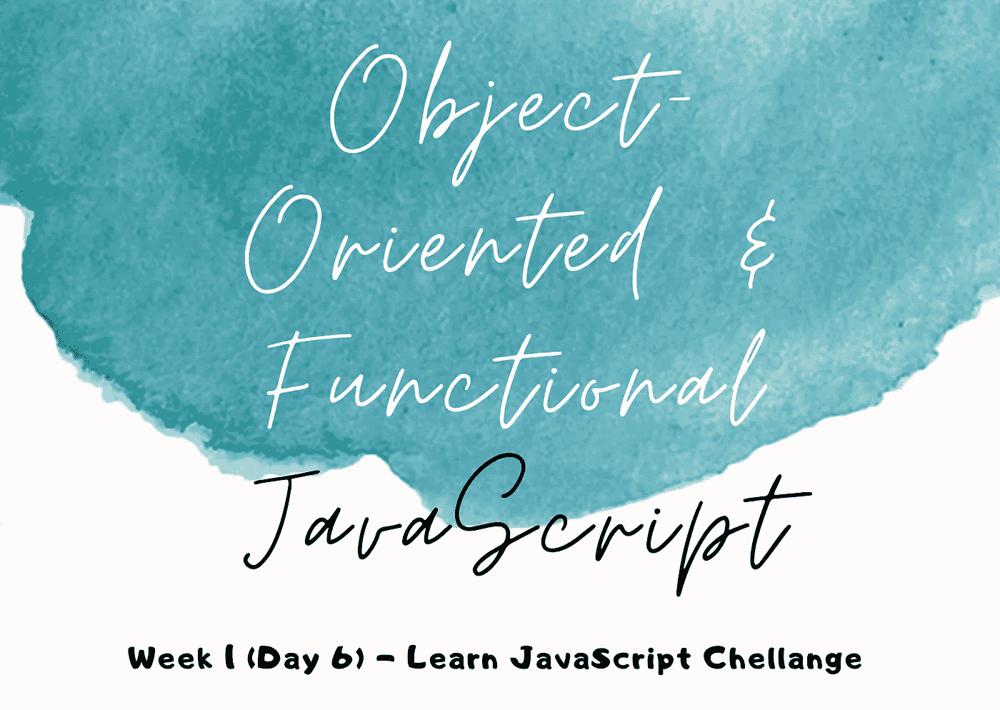
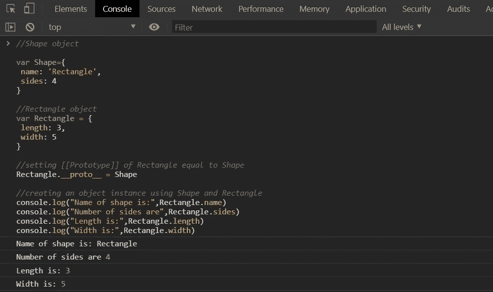
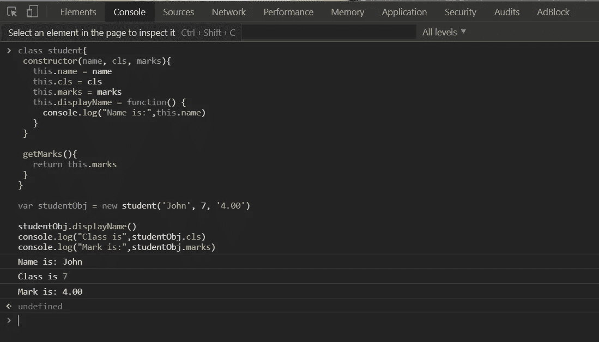
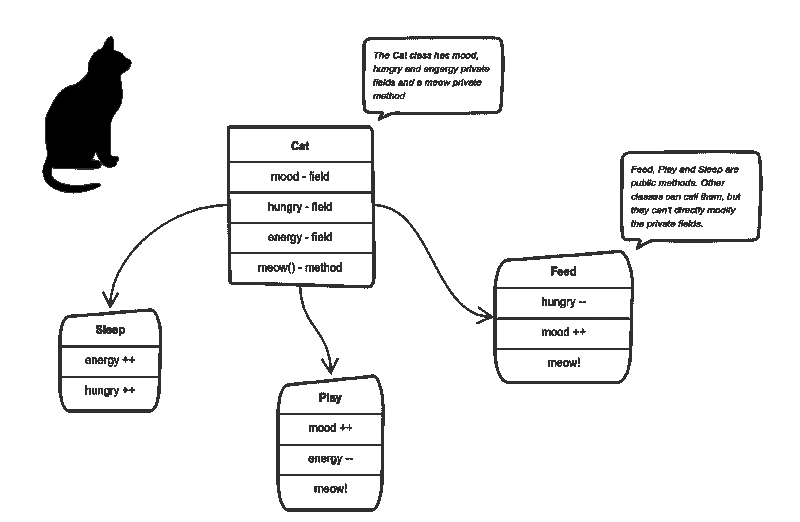
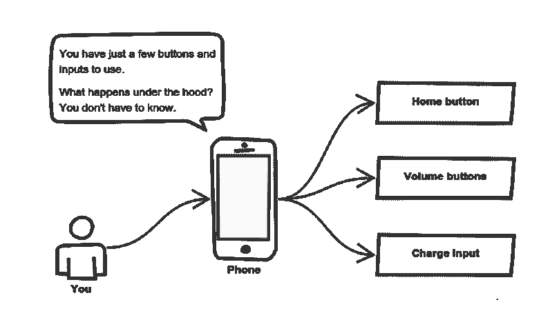
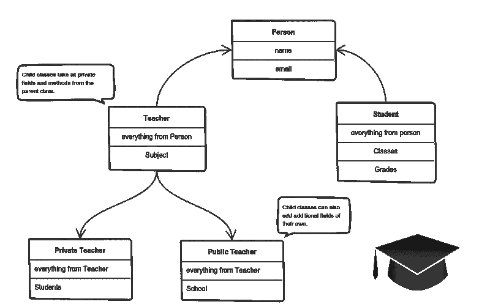
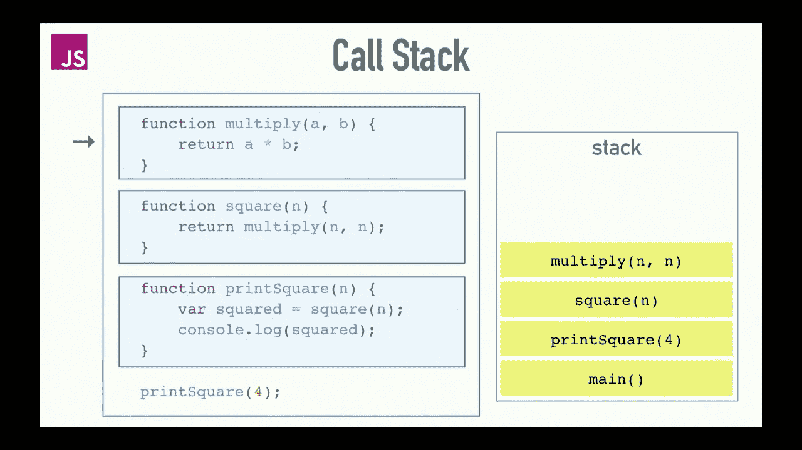
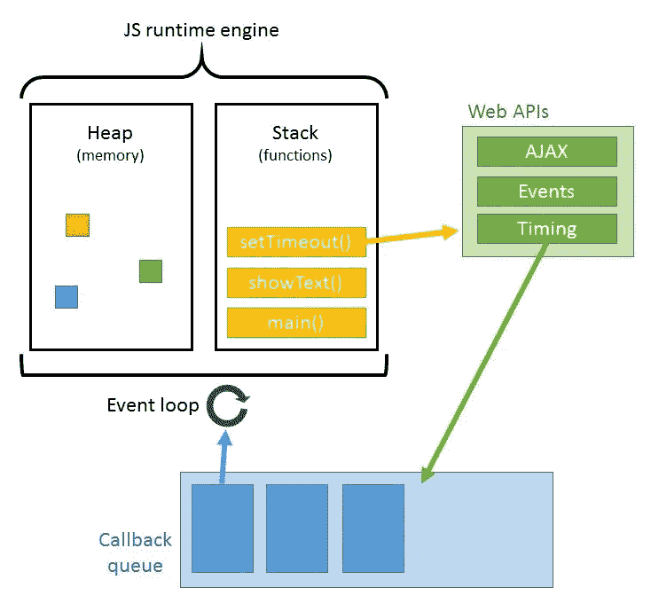
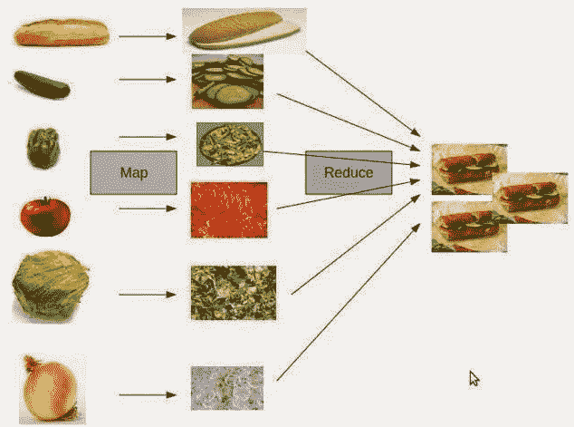

# 面向对象和函数式 JavaScript

> 原文：<https://medium.com/analytics-vidhya/object-oriented-functional-javascript-168069783fcc?source=collection_archive---------36----------------------->

# JavaScript 学习的第 6 天——里程碑 1(第 1 周)

这里我们已经描述了一个流行的和必须学习的编程概念，面向对象编程。除此之外，我们还关注了另一种简单方便的编程方法，称为函数式编程。这两种方法都将与 JavaScript 一起讨论。

## ***1。OOP 是什么？顺利解说***

O 面向对象编程(OOP)是一种流行的编程模式，它使用现实世界中的实体作为对象以及这些对象的蓝图，通常称为类。记住，OOP 不是一种编程语言。它是编程语言遵循的一种技术或模式。还有其他编程模式，例如-

I)结构化程序设计

ii)面向过程的编程(POP)

iii)功能编程等。

***为什么要 OOP？***

OOP 使得代码维护更加容易，我们不需要一次又一次地重写相同的代码。根据需要多次重用代码块是 OOP 的强大特性之一。OOP 提供了一个关于代码模块的透明概念，并且通过隐藏内部实现来保护代码库。数据和代码可以封装到一个模块中，就像药品中的胶囊一样，这将节省大量的复杂性，而没有 OOP 是不可能的。

## ***2。OOP 的三颗“宝石”…核心概念***

OP 提供了许多丰富编程和软件开发的特性，但是有一些(如前所述)必须引起注意。我们称它们为面向对象编程的**‘宝石’**。

***OOP 核心‘宝石’:***

OOP 支持以下特性来简化软件开发-

*   对象(真实世界的实体)
*   类别(对象的蓝图-相同的设计，多个建筑)
*   继承(父子/父子关系)
*   多态性(相同的方法，多种能力)
*   抽象(隐藏内部实现)
*   封装(将数据和代码包装在一起)

这里简要讨论了其中的三种

***i)继承***

当一个对象获得一个父对象的所有属性和行为时，这就是所谓的继承。它提供了代码的可重用性。它用于实现运行时多态性。

***ii)抽象***

隐藏内部细节和显示功能被称为抽象。比如电话，我们不知道内部处理。

***iii)封装***

将代码和数据绑定(或包装)到一个单元中称为封装。比如一个胶囊，它包裹着不同的药物。

## ***3。通过原型链接继承属性***

除了每个对象， **[[Prototype]]** 属性都是从构造函数中创建的。prototype 属性指向另一个对象或者为空。

在下面的例子中，我们将看到**矩形**的原型属性被设置为**形状**，它能够访问**形状**中的所有属性。如果在对象中找不到属性，比如在**矩形**中找不到**名称**属性，JavaScript 将自动从该对象的原型**形状**中获取该属性。

## ***4。定义类中的方法***

一个类的对象的实例总是需要通过首先访问原型来访问类内部的方法。

在上面的代码中-

*   在构造函数之外定义了 **getMarks()** 函数
*   所有这样的方法都存储在**学生**类的原型对象中。
*   因此，一个新对象，比如 **studentObj** ，可以访问该类中定义的所有方法。
*   当被 **studentObj** 调用时，方法 **getMarks()** 取自 student.prototype。

## 5.包装

当每个对象在一个类中保持其状态**私有**时，就实现了封装。其他对象不能直接访问该状态。相反，它们只能调用一系列公共函数，即所谓的方法。

这里猫的“状态”是私人变量**情绪**、**饥饿**和**能量**。它还有一个**私有**方法**喵()**。它可以随时调用它，其他类不能告诉猫什么时候喵喵叫。

它们能做什么是在公共方法 **sleep()** 、 **play()** 和 **feed()** 中定义的。它们中的每一个都以某种方式修改内部状态，并可能调用 **meow()** 。这样，**私有**状态和**公共**方法之间的绑定就完成了。

这就是封装。

**6。抽象**

这个机制隐藏了代码的内部实现细节。它只表达与其他对象相关的操作。

***这里值得举一个现实生活中的例子——***

我们只用几个按钮就能和手机互动。引擎盖下到底发生了什么？我们甚至不需要知道——实现细节是隐藏的。我们只需要知道一组简短的动作。

## 7.遗产

对象往往非常相似。他们有共同的逻辑。但它们并不完全相同。那么我们如何重用通用的逻辑，将独特的逻辑提取到单独的类中呢？实现这一点的方法之一是**继承**。

这意味着我们通过从父类或基类派生来创建子类。这样，我们就形成了一个**层级**。也可以称为**是——一种关系**。使用 **super** 关键字访问父类。

子类重用父类的所有字段和方法，并且可以实现自己的属性。

***——*——**

这里的**私教**和**公办教师**都是俗称的**老师、**，无论是**老师**还是**学生**，他们都是**人。**

## 8。调用堆栈

一个后进先出(LIFO)过程，通过它浏览器引擎执行已经构建的代码。就像我们在堆栈中所做的一样，JavaScript 中的方法或函数调用在我们调用它们时被推到堆栈的顶部，对于函数返回情况则相反，当执行完成时，它首先弹出。

在上面的例子中， **printSquare()** 方法将在主程序开始执行后立即被调用。这就是为什么浏览器引擎检测到 main()在堆栈的第一个位置。在调用了 **printSquare()** 之后，引擎会进入函数内部，并执行 **square()** 。查看 **square()** 函数内部，得到 **multiply()** 函数。一步一步…酷吧？

**main()**→**print square()→square()→multiply()**

现在弹出开始。当 **multiply()** 的执行完成时，它首先从堆栈中弹出，而不管其他调用的函数。然后 **square()** ，然后 **printSquare()，**最后主程序执行完毕。

**乘()→方()→印方()→主()**

## 9.事件循环

事件循环是指等待队列同步接收消息的过程。

事件循环移入的增量称为“滴答”，每次“滴答”时，它检查调用堆栈是否为空，如果是，它将事件队列中的 top 函数添加到调用堆栈中并执行它。一旦它处理完这个函数，它就再次开始计时。

***事件循环到底做什么:***

*   等待和调度事件的代码
*   处理其环境的事件
*   监控调用堆栈和回调队列
*   将异步代码分解成节拍

## 10.函数式编程

F 函数式编程是一种以函数为王的编程范式或编码风格。它以一种简单的方式组织你的代码，并保持代码结构的整洁和简单。函数式编程更安全，更易于调试或维护。

***为什么要用函数式 JavaScript？*** 有时候面向对象的 JS 会变得棘手(原型？这个？！？).总是没有必要使用面向对象的方法来完成事情。另一方面，函数可以根据需要多次重用。我们不需要像想的那样修改整个类来改变一点代码库。函数式编程使用纯函数来解决问题，这种方法使调试变得更容易。它也有一个固定的社区。

***非功能方法:***

> var name = " Rahul
> var greeting = "嗨，我是"；
> 
> console.log(问候语+姓名)；//“嗨，我是 Rahul”

***功能方法:***

> 函数 greet(name) {
> 返回“你好，我是”+name；
> }
> 问候(“拉胡尔”)；//“嗨，我是 Rahul”

***使用高阶函数:***

功能可以只是输入/输出。但是在函数式编程中，我们能做的比我们想象的要多得多。

> 函数 makeAdjectifier(形容词){
> 返回函数(字符串){
> 返回形容词+ " " +字符串；
> }；
> }
> var cooli fier = make adjectifier(" cool ")；
> 冷却器(“天气”)；//“凉爽的天气”

***功能方法不迭代***

函数式编程忽略了迭代，如(loops - for，while，do-while，for…in，for…of 等。)、void 函数、对象突变、数组 mutator 方法、map mutator 方法、set mutator 方法。相反，它使用**贴图**，**减少**，**滤镜**。这里有一个有趣的图片来解释这一点。

***避免可变性***

函数式编程使用不可变的数据。突变和免疫的例子如下。

**突变(不好！):**

> var rooms = ["H1 "，" H2 "，" H3]]；
> 
> 房间[2]=“H4”；
> 客房；//[《H1》、《H2》、《H4》]

**没有突变(好！):**

> var rooms = ["H1 "，" H2 "，" H3]]；
> var newRooms = rooms . map(function(RM){
> if(RM = = = " H3 "){
> 返回" H4 "；
> } else {
> 返回 RM；
> }
> })；新房间；=>【《H1》、《H2》、《H4》】客房；//[《H1》、《H2》、《H3》]

今天到此为止。谢谢:)