# 面向对象编程

> 原文：<https://medium.com/analytics-vidhya/object-oriented-programming-9bbf8a6de2b3?source=collection_archive---------7----------------------->

## 面向对象的概念及其使用

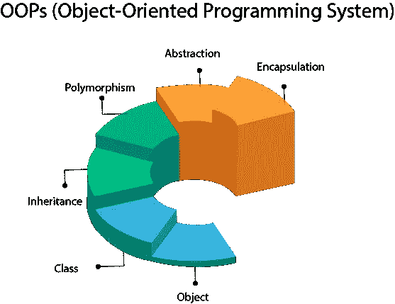

[ref:https://static . Java point . com/images/Java-oops . png](https://static.javatpoint.com/images/java-oops.png)

当你听到 OOP 时，你会想到什么？？有时候看起来就像三个字母。是的，是真的，是三个字母。但是在这背后，有一些每个程序员都应该知道的概念。

OOP 代表面向对象编程。面向对象编程可以被解释为一组强大的概念，试图将现实世界的对象建模成代码。我们考虑类、对象和方法..用 oop 概念写代码的时候等等。我们需要在编码时熟悉这些词。
那么让我们来看看这些强有力的概念是什么。

OOP 中有四个主要的概念。他们是，

*   遗产
*   多态性
*   抽象
*   包装

现在我将逐一解释这些事情。首先我们需要知道一些关键词。他们是，

## 班级

一堂课就像一张蓝图。这也是一个逻辑定义。它布局了对象的基本结构。

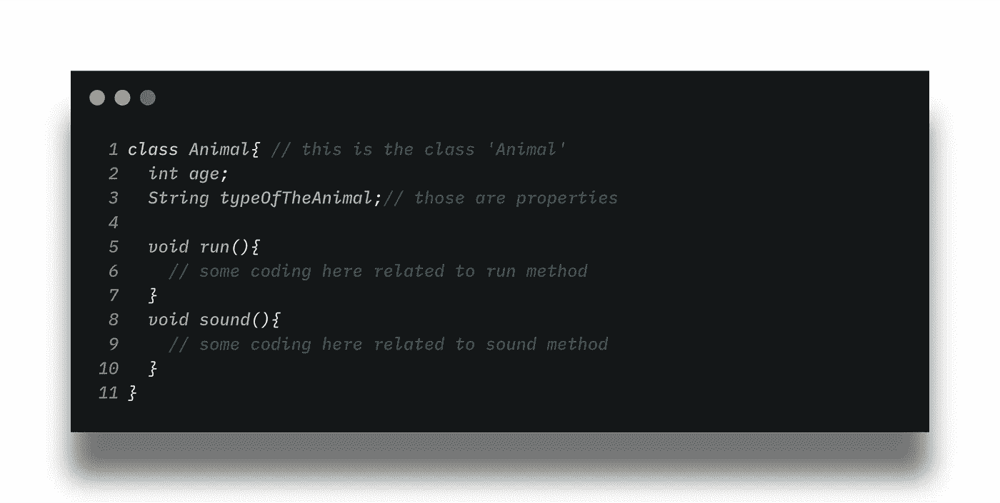

一个类的例子

根据这一点，我们班是动物。所以动物代表了动物的种类。与动物相关的属性和函数位于类中。

## 目标

现实世界中存在的一切都是对象。对象也是模拟现实世界对象的类的实例。例如，一个类可能产生几个对象

> 根据房屋蓝图，我们可以建造几栋相似的房屋，但位置和名称不同。

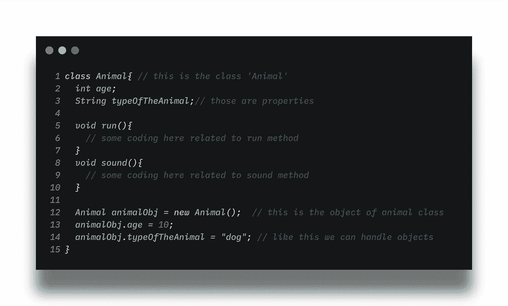

animalObj 是动物类的对象名

这就是在 java 中用类形成对象的方法。在创建该类的对象后，该类中的所有内容都可以访问。

现在让我们来确定 oop 的主要概念是什么。

## 遗产

这就像在现实世界中一代一代地继承相同的属性。

例子:-动物发出声音，但是狗的声音和猫的声音是不同的，其他的也是。使得声音功能来自动物。

现在让我们以代码为例。这有助于避免冗余。

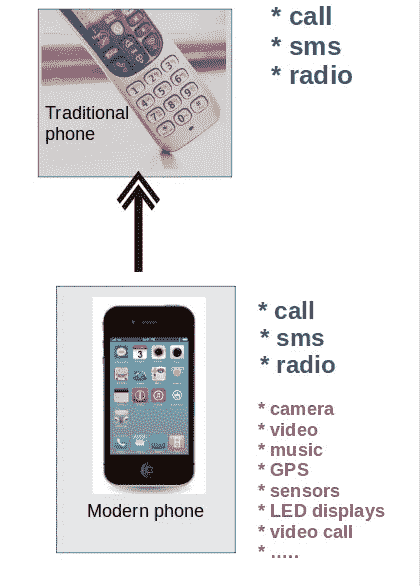

继承的例子

想想一部旧手机。我们可以接电话，发短信，有时我们只能听收音机。但是一部新手机的功能不止这些。摄像头、视频、全球定位系统..等等。但它的功能就像老式手机一样，可以打电话、发短信、听广播..等等。因此，新手机拥有与旧手机相同的功能，这就是继承。

现在让我们用一个代码深入研究继承。

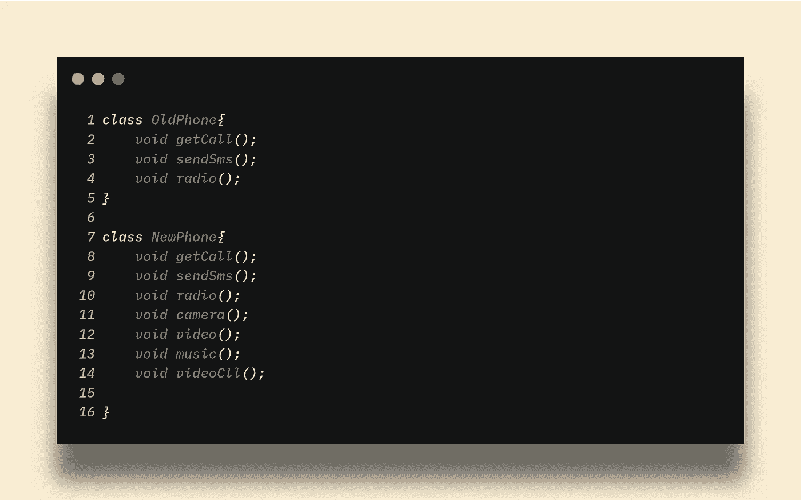

没有继承

相同的功能在两个类中重复出现。但是当我们使用继承概念时，我们可以避免这个问题。

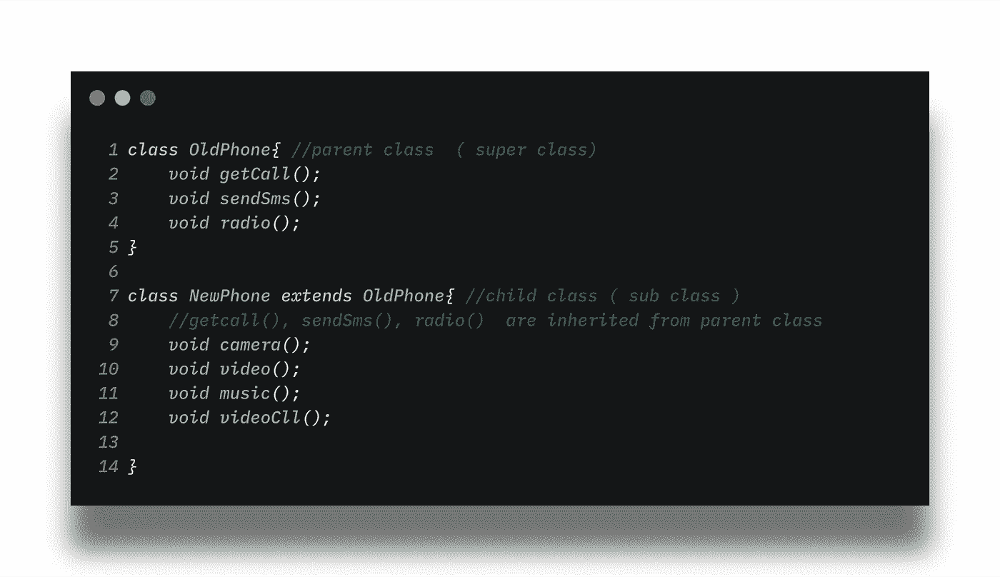

遗产

在继承的概念中我们有一个疑问。如果新电话是从旧电话继承来的，则超类(旧电话)的一些功能和属性不同于子类(新电话)。因此，需要在新手机类别中替换新手机的功能。所以我们应该有办法做到这一点，不是吗？。😁

当然有一种方法，那就是调用方法重写。在超越的意义上，你可能会有所感触。😉如果你觉得没有任何意义，不要担心我会教 you✌️。

## 方法覆盖

这意味着当我们用不同的主体重写一个与超类中相同的方法时。例子:

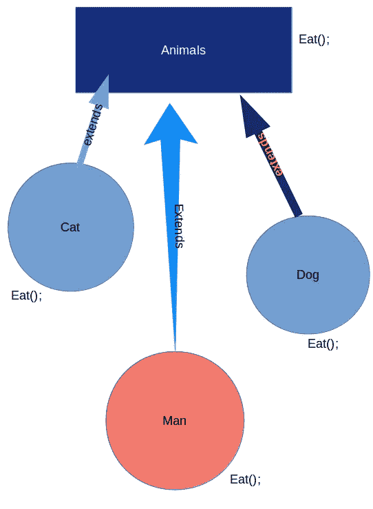

认为:人，猫，狗，继承自动物类

只考虑吃函数，通常我们使用方法 eat()作为超类。但是人和狗、猫的吃法是有区别的。所以我们不能只是继承那些方法然后使用它们。我们必须随心所欲地修改它。现在考虑一下人类阶级。

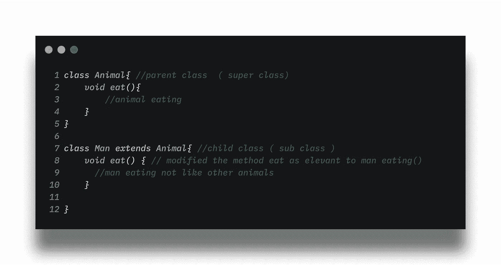

方法重写示例

我们重写了 eat()方法的主体；适合男士类。这就是调用方法重写。这是一个非常有用的概念。

当谈到方法覆盖时，我们不能只让方法重载。这也是一个简单的概念，但作为方法覆盖非常有用。现在就来看看吧。

## 方法重载

这也是一个很重要的概念。这意味着我们在一个类中多次使用同一个方法。

但是调用该方法时可能会出错，因为有太多的方法具有相同的名称。所以这不可能发生。不能多次存在相同的命名方法。

显然应该有区别，不是吗？你可能会想到不同的😉。

这是参数签名。同名方法中应该是不同的。参数签名是带有参数的东西。就想一个这样的方法。

```
void method(int a){
//something here
}
```

这里的参数都是整型的。所以参数签名是' int a '

```
void method(int a, String s){
//something here
}
```

在这个方法中，参数签名是`int a , String s` ,所以你可以看到有相同的方法名并不重要，因为它有不同的参数。那是参数签名。

现在让我们看一个例子。

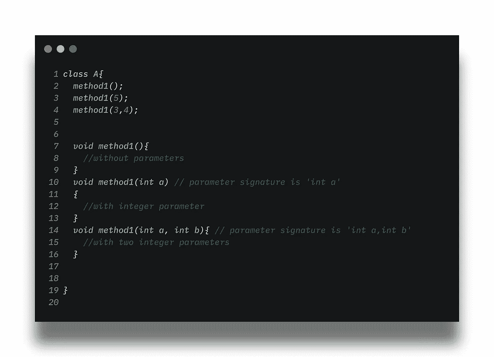

过载方法示例

就像上面的例子，如果我们调用 method1()，它是关于第 7 行的一个方法。如果我们调用一个方法 1(5 ),它是关于第 10 行的一个方法。如果我们调用一个 method1(3，4)，它是关于第 14 行中的方法。就是这样。

## 多态性

多态性意味着同一事物的多种形式。比如相同的属性用不同的方法，相同的方法用不同的属性。

一个子类的对象可以赋值给超类引用，并且有许多带有超类引用的形式。我的意思是许多形式😉。这就是多态性。

> 有两种类型的多态性。

1.  **静态多态**以及被认为是**编译时多态**
2.  **动态多态**以及被认为是**的运行时多态**

关于这个概念，我们应该知道两件事。

*   覆盖-用于运行时多态性
*   重载-用于编译时多态

举个例子。就这样想。

有一类人。在它里面有一个函数 walk()，所以我们可以在扩展后覆盖它。(继承)

一个继承的功能是在子类中“手牵手向前走”。这就是方法重载。
而另一个继承的功能是子类内的“反向步行”。这就是方法重写。

运行时多态性和编译时多态性的主要区别是 JVM 识别哪个方法应该在哪个时间运行并运行它。但是在编译时，重载的方法可以被识别，而重写的方法不能被识别，因为哪个方法应该运行的决定是在运行时决定的。这就是为什么它被称为运行时多态性。

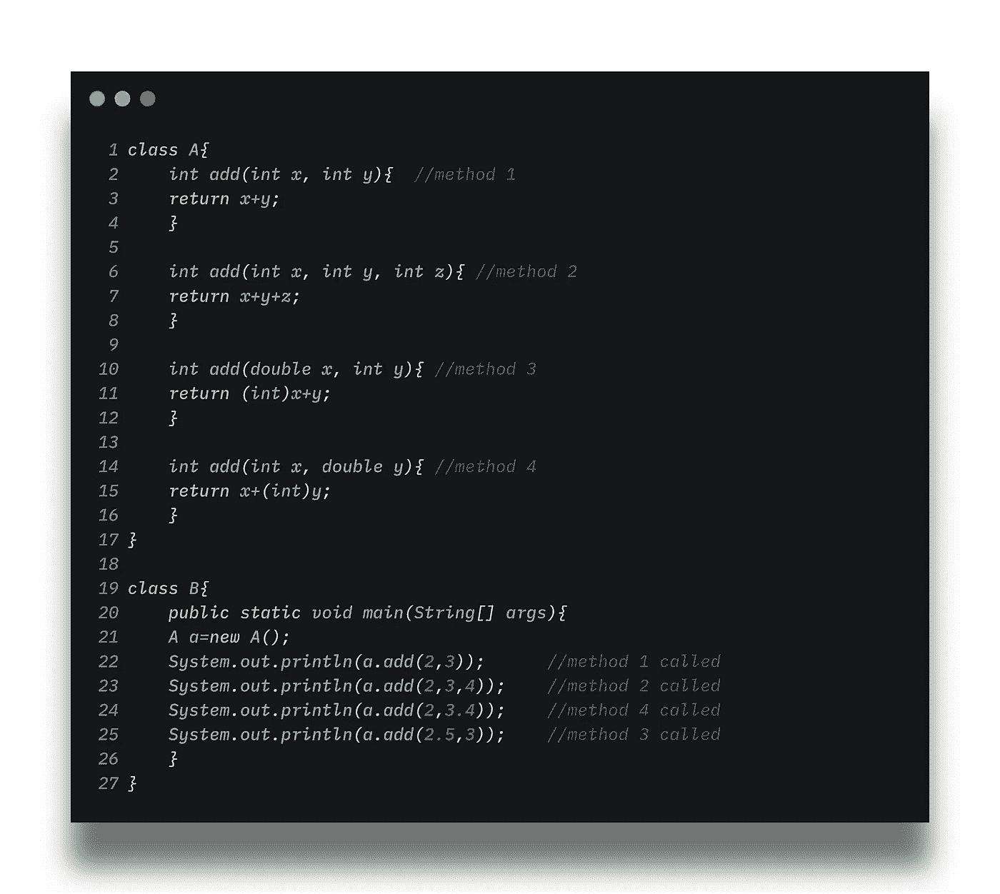

静态绑定-编译时多态性(不同的参数签名)

它有相同的方法，但不同的参数签名。这是方法重载。这被称为编译时多态性(我们一眼就能看出方法的不同)

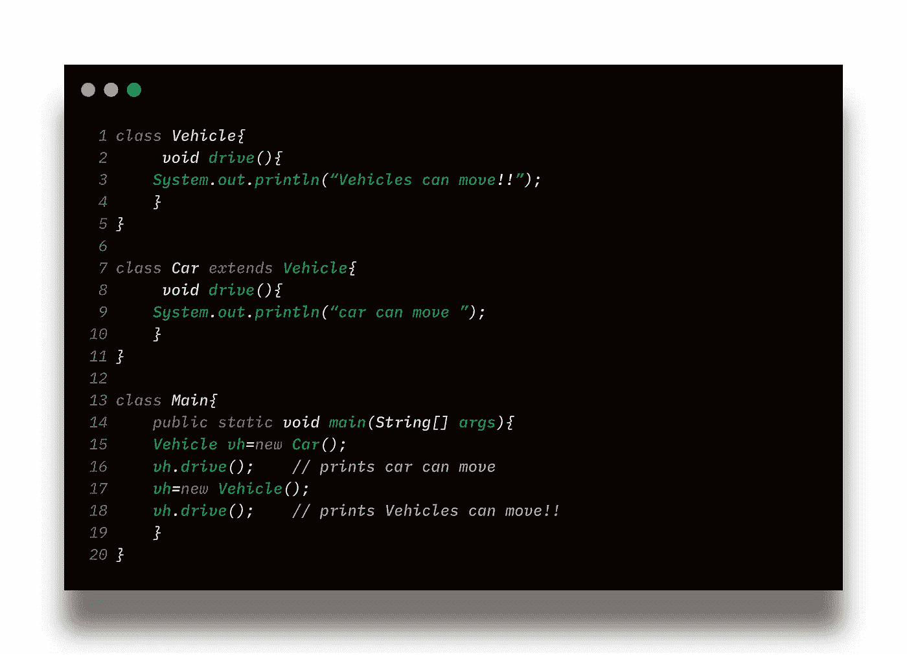

动态多态-运行时多态

这里，子类的对象已经分配给了超类的引用。当我们调用 vh.drive()时，它运行 car 类中的 drive 方法。

## 抽象

当我们只是使用函数而不知道机制(函数发生了什么)时，就使用了抽象，并且忽略了对象的不相关的特征。抽象用于信息隐藏。

*在现实世界的例子中:-*

> 我们知道如何通过按压加速踏板来加速车辆。我们也知道如何通过踩刹车垫来停车。但是我们不知道这些功能的机制，我们只是想用就用。但是我们不需要这个机制。就用那些函数吧。这是一个抽象概念。让我们看得更远。

*另一个例子:-*

> 在咖啡机中，我们不知道咖啡是如何制作的，有哪些成分，但我们知道当按下按钮时，可以从机器中得到一杯咖啡。(我们知道产量但不知道机理)。

现在你可能会怀疑，如果抽象方法没有体，怎么隐藏信息，或者怎么写方法体。😉

答案很简单。我们可以使用方法覆盖技术来访问抽象方法。我们必须使用继承并获得超类的抽象方法。

参见上面的例子

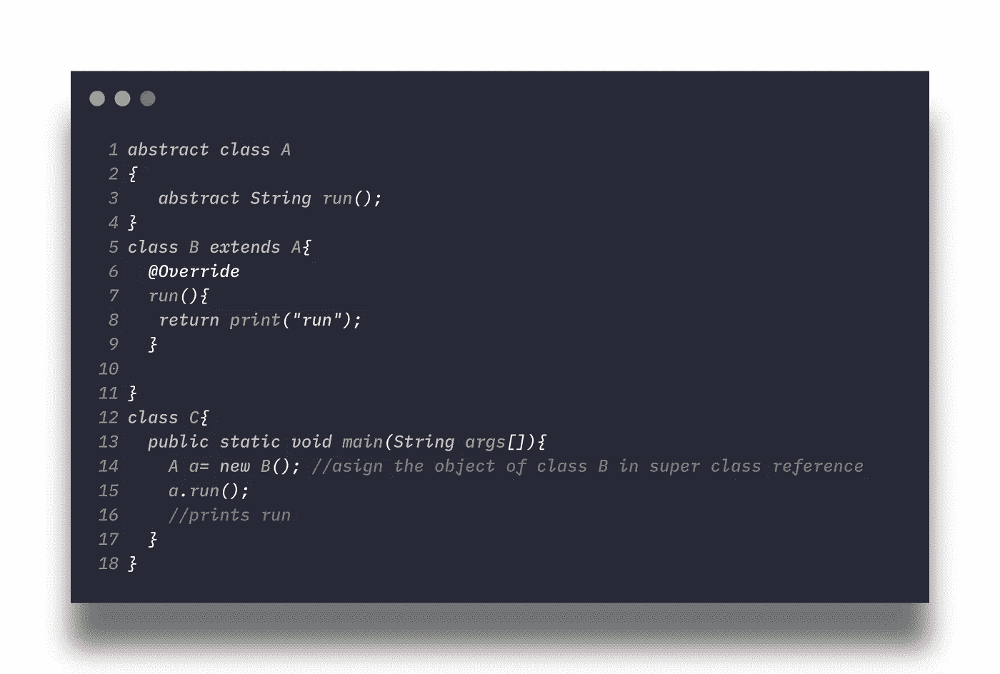

抽象

> **抽象的优势**

*   避免重复，提高可重用性
*   降低复杂性
*   安全数据

> **抽象类&抽象方法**

*   抽象方法应该在抽象类中，但是抽象类不应该只有抽象方法
*   抽象方法不应该有主体。

## 包装

封装意味着在一个部分中封装属性和方法。就像一个医疗胶囊，里面装着药物，但我们不知道它们的成分是什么，也看不到它们，因此我们没有苦味。我们只看到胶囊。

数据隐藏是封装概念中的关键特征。我们使用访问修饰符来实现封装概念。

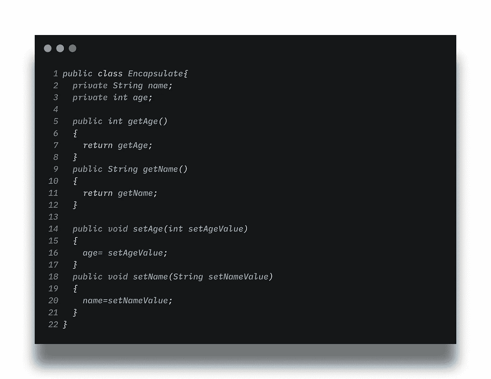

在上面的例子中，姓名、年龄是保密的。不能直接访问，所以我们可以使用 getters 和 setters 来获取和设置胶囊中的值。getName()、getAge()是用于获取值的 getters。和 setName()、setAge()是用于设置值的设置器。

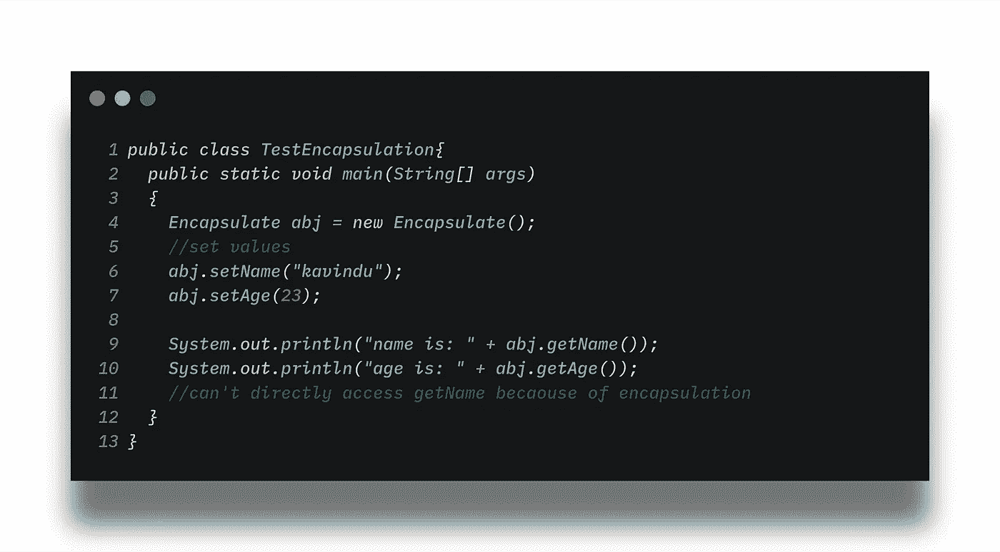

包装

这就是我们如何在 java 中使用封装。

我希望你从这篇文章中有所收获。这就是 oop 的概念及其用途。

> 编码快乐！！

## 关于作者

> 卡温杜·加扬塔
> 
> *本科*
> 
> *软件工程荣誉理学士*
> 
> *凯拉尼亚大学。*

[](https://kavindu-gayantha.github.io/) [## 卡温杜·加扬塔

### 编辑描述

kavindu-gayantha.github.io](https://kavindu-gayantha.github.io/)