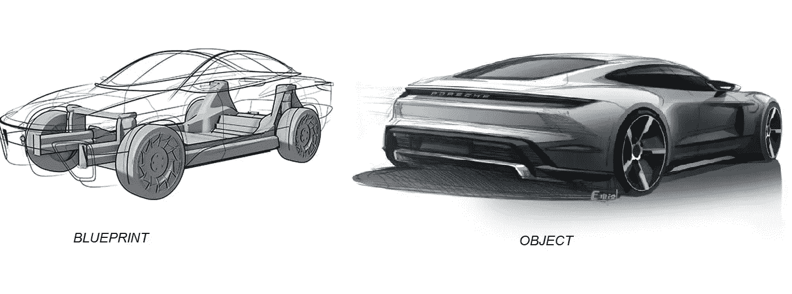
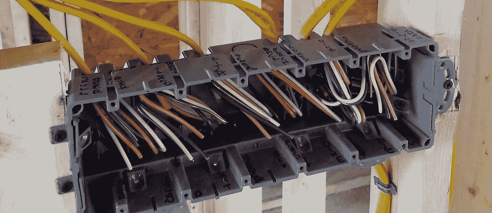

# 面向对象编程概念简化！

> 原文：<https://medium.com/analytics-vidhya/object-oriented-programming-concepts-simplified-29936a8346cf?source=collection_archive---------16----------------------->



> O **面向对象编程**，初学者最困惑的话题！但是当涉及到更干净的编程方式时，它具有非常高的重要性。你在这里期待一些简单和容易的方法来开始 oop 的基础，对不对？太棒了。你是在一个正确的地方，我会试着用许多真实世界的例子和类比来涵盖这个主题，这样你就可以随时将这个概念与这些类比进行比较，以完全掌握这个概念！我向你保证，这些概念将会永远印在你的脑海里！所以登上这辆糟糕的车，让我们开始吧！

T 这里有四个主要的面向对象的概念，你可能已经理解了，它们是

1.封装
2。抽象
3。传承
4。多态性

但是我们不要从这些行话开始😀，让我们首先了解为什么需要这些概念，然后开始一个一个地构建这些概念！🧐:所以我们都用交换台，对吗？(你可能会想，这和 oop 的有什么关系？).让我们看看。。。



没有接口的配电盘。

假设你生活在一个配电盘看起来像这样的世界，有所有可用的连接线，但没有按钮进行交互！。开关你的风扇有多容易？

> 你可以查看配电盘，将与风扇相关的电线和与灯泡相关的电线分开，然后你可以以某种方式连接风扇电线，最后打开风扇！🥱

有点难，对吧？你可以做一些学习来了解这些连接是如何工作的，并在需要的时候打开和关闭你的风扇！。那么我们说这个实现是错误的吗？。不要！然而，这是可行的，但是对于直接使用它的人来说有点困难(而且非常不安全！如果你错接了两根风扇线和一根灯泡线怎么办😐).

让我们假设这是你用来开关电器的密码。这只是伪代码，懂逻辑就好！

在上面的代码中你能观察到什么？你有一个电器，它有 3 根电线连接。对于每个设备，您创建 3 个变量来表示电线，并使用这两个函数，分别连接和切换开关。
试想一下🤔，如果您有另一台设备，并且想要使用它，该怎么办？因此，在上面的代码中，您将添加 3 个变量来表示电线，然后调用这 2 个函数来打开和关闭设备。

如果您有 100 多台设备，并且都连接到这个交换机，会怎么样？🥺🥺.您必须为每个设备创建 3 个变量，并调用这 2 个方法！想想看，你将不得不重复多少代码！！！在大型项目中，这会导致严重的代码可维护性问题！


帮助那些写这种代码的人！

根据[干](https://en.wikipedia.org/wiki/Don%27t_repeat_yourself) ( **不要重复自己**)原则，你应该始终努力避免代码中的冗余！让我们来解决这个问题。但是如何开始呢？
让我们看看，我们的代码中有哪些重复的地方。

```
wire1_red = somevalue
wire1_brown = somevalue
wire1_white = somevalue
```

如果我们仔细观察，所有这些重复的代码都与每个设备相关。那么，为什么不把所有这些结合成一个单一的实体，并提供一个简单的界面来进行交互呢？


这就是我们亲爱的总机！与以前的总机相比，您看到了什么变化？。现在，每条与电器相关的连接线都被组合成一个称为交换机的实体，它内置了一个功能，可以使连接活动或不活动。你还观察到了什么🤔？你不再为了使用电器而直接接触那些危险的电线。

> 这就是封装的全部思想！封装:将(某物)装入或好像装入胶囊中。

根据封装-

1.  我们需要将所有相关字段(所有 3 线变量)和功能(切换开关的方法)打包到一个实体中。[与我们的示例相关-所有的电线都被打包并在交换机内部连接，为用户提供了一个简洁的界面。].

没有私有字段的封装

在这里，您可以看到与设备相关的所有字段和方法都放在一个类中。

```
**NOTE: This section is for beginners who don’t know what class is. Please skip this part if you already know about it.**Class is similar to a blueprint, which contains related fields and functions to implement a certain behavior.Let’s say to implement car behavior, you can create a **class Car** and it can have certain properties like 
1\. speed,
2\. mileage,and some functions like
1\. def moveCar()
2\. def applyBreak() and so on.But this is not a car yet! This is just a blueprint. To bring a car alive we have to create an object out of the blueprint.
In most of the languages you can create an object like this:**myNewCar = Car()**So the variable myNewCar is an actual car now! You can access its properties or call its methods now. For ex:**$print(myNewCar.mileage)
$myNewCar.applyBreak()**
```

2.只向用户公开那些必要的字段和方法。[电线对用户使用电器来说是不必要的(而且也不安全！).因此，尝试对用户隐藏这些电线]。

用私有字段和方法封装

在上面的代码中，您可以注意到类字段现在使用双下划线变成私有的。这意味着该字段仅供“内部使用”(该类专用)，不能从该类外部访问。

## 这里你可以得出三个重要的推论:

1.“字段是私有的”，因此提供了更好的安全性，因为该类的数据字段不会被外部方法修改！

2.“有些类方法是私有的”。在这里，connectWires 方法是私有的，因为用户不需要知道或修改导线是如何连接的(如果您连接了错误的导线并导致短路，该怎么办😂因此，永远不要将访问权限授予他不应该访问的用户或客户端)。

3.这种封装相关字段并通过使它们成为类的私有字段来限制对某些字段的访问的整体思想，将“类的状态”放在它所公开的方法(公共方法)的手中，因此对象总是保持控制并成为它自己的主人！

现在你能想象如果你有 100 个电器连接到交换机上，代码会是什么样子吗？

看起来很简单吧？是的，那就是😀

## 因此，这些是封装提供的优势:

1.  **可重用性🤨**(我们已经看到了代码重复是如何通过使用类来克服的)。
2.  **维修性😮**(由于代码现在更加简洁，假设即使我们想要改变交换机使用的电线数量，我们也可以在类中轻松地进行更改，这不会影响任何用户代码！)
3.  **数据隐藏**🙆‍♂️(We 看到了如何将某些字段设为私有以增强应用程序的安全性。对象总是保持一致，直到它的状态被它所公开的方法所控制！)


图片来源:[https://tenor.com/](https://tenor.com/)

嗯，这是一个详细的解释！希望它是清楚的😊！既然您现在已经对 OOP 有了一个大概的了解，那么接下来的话题就很容易了！现在休息一下，四处走走🚶‍‍🚶‍♀️，然后让我们继续下一个概念！

当你掌握了封装技术后😉，你获得了信心，并试图建立一个像网飞一样的视频流应用程序🎥！。最初，你做了一个可以在 IOS、Android 和 web 上使用的应用程序。在所有 3 个平台上，您现在可以提供最高 480p 质量的视频流，没有下载选项，并且您计划在未来提高质量。现在，你根据你的学习制作了一个类 VideoPlayer，它封装了所有相关的领域。如下所示，这是 VideoPlayer 类的当前实现🎬。

由于您有一个包含数百个文件的更大的代码库，您将每个平台(android、IOS 和 web)的代码分离到单独的文件中，以保持一个清晰的结构并避免混乱。如下所示，目前 web、android 和 IOS 的代码是相同的。所有人都在创建 VideoPlayer 类的对象，并使用 play、pause...方法。

所以直到现在，一切看起来都很好！😊。现在你越来越出名，因此你想引入新的功能。支持 1080p 流媒体。
2。支持视频下载选项。
3。不允许用户在 Web 上观看视频，在显示视频的简短介绍后，通知他们下载应用程序继续观看。

**但是由于技术问题，你只能在 android 中添加前两个功能，因此 IOS 用户必须等待:(**

我将暂停片刻。你能同时滚动上面的代码并思考吗💭，为了在 Android 上支持这些新功能，您需要做哪些改变？🤔

一种可能的方法是在 VideoPlayer 类中添加单独的方法，具体到 android 和 web。所有方法都经过修改，可以分别支持每个平台。

通过查看上面的代码，您可以观察到，旧的方法已经被重命名，以支持 VideoPlayer 类中的每个平台，因此每个 IOS、web 和 Android 都应该修改自己的代码，以适应这一新的变化。

新的 android 特定代码现在看起来像这样-

您可以在上面显示的代码中观察到，我们需要 2 个变化，来修改或添加我们系统中的一些特性，因为我们只在 2 个地方使用了这 2 个方法。但实际上，android handler 不会这么小，它可能是一个非常大的文件，有数千行代码，或者有数十个不同的文件，包含大量代码😳这两个函数可能会被多次引用。在这种情况下，仅仅添加这个新特性就会导致函数名被替换。这可能会增加可维护性问题，并使开发人员对修改代码感到困惑。

如下图所示，这个新功能在 IOS 和 Web 代码上有相同的效果。因此，想象一下，大型应用程序中的真实场景会是什么样的！

那么解决办法是什么呢？

有一个类怎么样，这个类有 playVideo()、downloadVideo()、pauseVideo()这些方法。。。如果你从 IOS 或 android 或 web 上调用它们，它们的工作方式就好像它们知道如何处理特定的平台。对于 android，playVideo 将播放 1080p，对于其他人，将获得 480p，以此类推。

要实现这一点，你可以创建一个人，他会设置一些限制，并且说，任何想要拥有视频播放器功能的人，都必须强制实现这些方法。这样一个定义了实现 videoPlayer 的规则的类叫做抽象类。抽象类有一些未实现的方法，只是定义了声明，也可以有一些已经实现的方法。让我们看一个示例抽象类，它给出了这种限制。

上面的类有一些这样的方法，像 playVideo、downloadVideo 和 pause_play_Video。它们没有被实现，对于那些想要实现它们的人来说是空的。这就像，如果你想获得视频播放器的功能，那么你必须强制实现这些方法。举个例子:政府说，如果你想卖一辆车，那么这辆车必须有喇叭、指示器、安全气囊等等，否则你就不能卖车。因此，你要么创造一辆实现所有这些功能的汽车，要么根本不创造汽车！

因此，我们可以为 IOS、web 和 android 分别创建 3 个独立的类，每个类都将根据自己的需求实现上述方法！。下面是实现。

在这里，你可以看到所有 3 个类都是单独编写的，并且每个类都按照自己的要求实现了这 3 个抽象方法！

如果任何实现抽象类方法的类错过了一些要实现的方法，那么将会抛出一个错误。因此，程序员将始终意识到，要实现某些功能，这是我必须遵循的接口，并且必须实现这些方法来实现该功能！

那么你能想象特定于平台的处理程序代码会是什么样子吗？

是啊！您可以观察到所有的处理程序(上面只显示了 2 个)现在都使用了相同的方法名(playVideo 而不是 playVideoIOS、playVideoWEB)。Ios 处理程序将实例化 VideoPlayerIOS 类，web 和 android 处理程序将实例化各自的类。所有这些类都实现了抽象方法，因此都有相同的名字。

你看到那个巨大的优势了吗？如果没有，你认为 IOS 需要做哪些改变才能支持 1080p 流媒体和视频下载选项？

是的。你是正确的😃，只需改变 videoPlayerIOS 类方法的实现，我们就可以实现这一新特性的添加，其他任何地方都不需要改变！只要滚动上面的代码，你就会明白这个巨大的差异！

你刚刚看到了吗，一个设计更好的软件是如何使整个应用程序易于维护，并减少管理代码的复杂性和开销的？

这才是抽象概念的真正含义！抽象有助于隐藏复杂性。封装促进隐藏数据成员，抽象促进隐藏方法。

**抽象 ARE:🦝的主要好处**

1.  它将方法签名与其实现分离开来。
2.  对于用户来说，除了他们需要知道的方法签名之外，它使他们不会接触到任何东西，从而降低了复杂性。
3.  有助于避免重复代码
4.  为程序员提供了更改抽象行为实现的灵活性。

> 抽象是封装的自然延伸。封装建议您创建包含密切相关的字段和功能/方法的实体/对象。Abstraction 进一步建议实体只向不需要担心底层实现的外部用户公开它们的方法签名。

我们将在下一个系列中再次见面，届时我将介绍继承和多态！

好奇我是怎么学会这个的？


这是 CRIO.DO.
的#IBELIEVEINDOING CHALLENGE 七月版的一部分。我最近在 Instagram 帖子中发现了这一点，我发现自己很幸运能够发现这一点！边做边学的方法真的很有用，因为与传统的学习方法相比，这种知识可以持续更长的时间。

我推荐你去看看他们在 https://crio.do/[的惊人作品](https://crio.do/)😀

希望这篇文章对你有所帮助😃！如果是的话，请鼓掌👏。(你也可以给很多掌声😉).

结束！回头见。👋