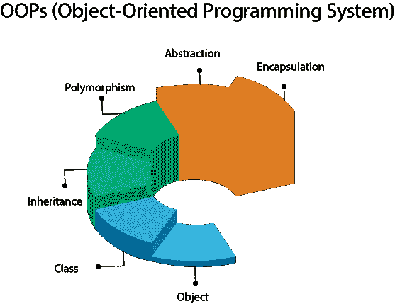
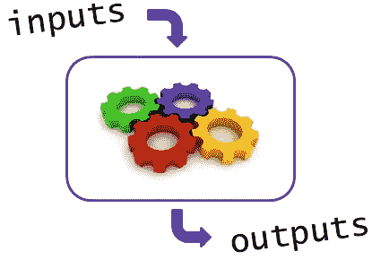
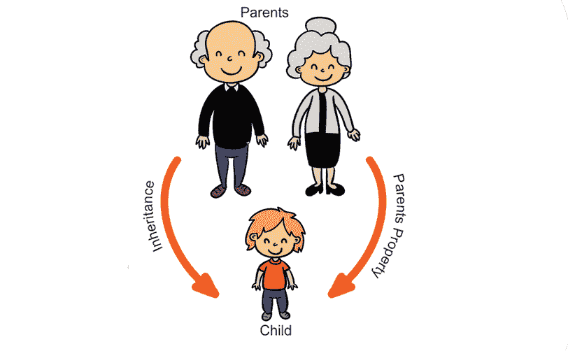
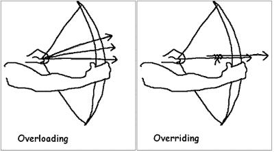
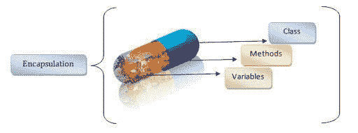

# Python 中的面向对象编程

> 原文：<https://medium.com/analytics-vidhya/object-oriented-programming-in-python-68c58fbcc8d2?source=collection_archive---------19----------------------->



来源:- [弗朗西斯科·莱利](https://www.google.com/search?q=object+oriented+programming&sxsrf=ALeKk01bk_qEEXFgj1j_NvqG7SSduxwFww:1596046384240&source=lnms&tbm=isch&sa=X&ved=2ahUKEwiygZyOiPPqAhUa7XMBHeA9BrYQ_AUoAnoECBcQBA&biw=1366&bih=625#imgrc=W7wD21rwZwFklM)

Python 是脚本语言，也是面向对象的语言。这里我们将讨论 python 中面向对象的操作。在 OOP 中，代码可能很长，但是很容易理解，并且可以重用。

> 类别:-它表示对象的分类或对象的蓝图。例如:-智能手机是一个类别。它由各种规格(变量)组成。智能手机是像(红米，诺基亚等)物体的蓝图。
> 
> self :-它是给定类的指针，它不是一个内置的关键字，但是大多数 python 程序员把它用作类指针。但是除了自己的名字，用户还可以取其他名字。
> 
> __init__ :-通常称为构造函数。它用于初始化给定类中的变量。
> 
> Object :- object 是给定类的类变量。

```
#writing first OOP code 
#Defining Class name
#fOR convenience take first letter of class name Capital**class Person:
    def __init__(self,First_name,last_name,age):
        self.First_name=First_name    #self is pointer of Person
        self.last_name=last_name      #self.any_variable initialize;                   
        self.age=age                  #value of vaiable
obj=Person("Akhil","Anand",22)        #class variable of given class
print(obj.First_name,obj.last_name,obj.age)****[out]>> Akhil Anand 22**
```

正如我之前提到的，self 不是一个内置的关键字，我们可以选择自己的名字作为指针。即:

```
**class Person:
    def __init__(ind,First_name,last_name,age):
        ind.First_name=First_name    #ind is pointer of Person
        ind.last_name=last_name      #ind.any_variable initialize;                   
        ind.age=age                  #value of vaiable
obj=Person("Akhil","Anand",22)       #class variable of given class
print(obj.First_name,obj.last_name,obj.age)****[out]>> Akhil Anand 22**
```

> __str__ :- __str__ 是 python 中的一个内置方法，它的主要目的是将字符串类型作为输出返回。它直接打印对象输出

```
#showing how __str__ changes whole printing Scenario**class Person:
    def __init__(ind,First_name,Last_name,year_of_birth):
        ind.name=First_name    #here left side has different name;        
        ind.surname=Last_name  #than the variable name we have taken
        ind.DOB=year_of_birth   #left side is user defined variable 
                     #and right side is constructor defined variable

    def age(ind,current_year): #user can also take own func
        return current_year-ind.DOB

    def __str__(self):
    return "%s %s your birth yearis"%d(ind.name,ind.surname,ind.DOB)
#To print output we will have to take user defined variable
Information=Person("Akhil","Anand",1998)
print(Information)

[out]>> Akhil Anand yor birth year is 1998**#printing user defined method as output**print(Information.age(2020))****[out]>>22**
```

## Q1。如果我们将在一个类中创建多个 __init__ 会发生什么？

类将最后提到的 __init__ 考虑在内。以清晰的图片为例。

```
**class Person:
    def __init__(self,a):
        self.a=a
    def __init__(self,a,b):
        self.a=a
        self.b=b
    def __init__(self,a,b,c):
        self.a=a
        self.b=b
        self.c=c
obj=Person()**[out]>> Error Missing **Three Arguments,a,b,c****class Person:
    def __init__(self,a,b,c):
        self.a=a
        self.b=b
        self.c=c
    def __init__(self,a,b):
        self.a=a
        self.b=b
    def __init__(self,a):
        self.a=a
obj=Person()**[out]>> Error Missing **one** **Argument,a
#Conclusion:- The latter found __init__ value is taken Unmder Consideration when we will have multiple __init__ in a single class** 
```

## **抽象:——保护和私有化数据的过程**



来源:- [101 计算](https://www.google.com/search?q=abstraction&sxsrf=ALeKk01UsG6iMu9nUFwG4BTHM6UUZshY7Q:1596194721968&source=lnms&tbm=isch&sa=X&ved=2ahUKEwjytJTbsPfqAhUv6XMBHeLwAHoQ_AUoAnoECBUQBA&biw=1366&bih=576#imgrc=xhUpPJCUsQvPtM)

抽象用于使变量(数据)I >公共 ii >私有 iii >受保护

> I >公共:-数据或变量用于每个人都可以访问或使用。
> 
> ii >受保护和 iii >私有:-用户有权在类内使用变量、数据和方法，但在类外是不可能的。

```
#Coding implementation for private variable,methods(data)
#To access the private data as output we will have to use following sets of rules
#object._class_name__variable_name
#Providing double underscore before any variable or method make them Private class Private:
    def __init__(self,a,b,c):
        self.__a=a
        self.__b=b
        self.__c=c
    def __sum(self):
        return self.__a+self.__b+self.__c
obj=Private(10,20,30)
print(obj._Private__a,obj._Private__b,obj._Private__c)
print("*****************************************************")
print("Printing Private Method")
print(obj._Private__sum())[out]>>10 20 30
************************************************************
Printing Private Method
60
```

## 遗产:-

让我们来看一个真实世界的场景。当一个孩子出生时，长辈告诉孩子的脸像他的母亲，眼睛像他的父亲等意味着孩子继承了父母的性格，这种特征被称为遗传，同样的事情也适用于编程。



来源:- [码档](https://www.google.com/search?q=inheritance&sxsrf=ALeKk01RJuIBb2qm_YqmvdIWeKIbG-E-kw:1596194559777&source=lnms&tbm=isch&sa=X&ved=2ahUKEwiPhemNsPfqAhUS93MBHeaTDQYQ_AUoAnoECBUQBA&biw=1366&bih=576#imgrc=_QfOrx4BMaQdDM)

在继承下，子类从父类继承所有/一些特征。

> 继承有两种类型:一、多级继承。>多类继承
> 
> 让我们为继承做一些编码实现；
> 
> 这里我们将单个类的属性继承到子类中

```
#when child class inherits all the characteristics (variable) from #parent class by child classclass Parent:
    def __init__(self,a,b,c):
        self.a=a
        self.b=b
        self.c=c
    def fun(self):
        print("This is Parent part which would be accesed by child")
class Child(Parent):
    Pass
obj2=Child(100,200,300)
print(obj2.a,obj2.b,obj2.c)
print(obj2.fun())[out]>> 100 200 300
This is Parent part which would be accesed by child
```

将父类的一些特征继承到子类中。这里`Super()` 主要作用是将父类的特征继承到子类中。

```
#inheriting limited number of variable from Parent to child classclass Parent:
    def __init__(self,a,b,c):
        self.a=a
        self.b=b
        self.c=c
    def fun(self):
        print("This is Parent part which would be accesed by child")
class Child(Parent):
    def __init__(self,a,b):
        super().__init__(self,a,b)
        self.a=a
        self.b=b
    def difference(self):
        return self.b-self.aobj=Child(10000,400)
print(obj.a,obj.b)
print("Printing the value of user defined method")
print(obj.difference())[out]>>10000 400
Printing the value of user defined method
-9600
```

> 将多个类属性继承到子类中

```
#Inheriting multiple class property into children classclass Parent1:
    def fun1(self):
        return "This is male parent class"
class Parent2:
    def fun2(self):
        return "This is female Parent class"
class Child(Parent1,Parent2):
    pass
obj=Child()
print(obj.fun1())
print("**************************************"
print(obj.fun2())[out]>> This is male parent class
**************************************
This is female Parent class
```

## 什么是方法重载和方法重写？



来源:- [java67](https://www.google.com/search?q=method+overloading+and+overriding&sxsrf=ALeKk03jsYhzJU-1QJY6nhJ-mHxZYrIJGg:1596199352328&source=lnms&tbm=isch&sa=X&ved=2ahUKEwiyhov7wffqAhWwIbcAHebhD18Q_AUoAXoECA4QAw&biw=1366&bih=625#imgrc=EGEa9Bn6VXBHHM)

> 1.方法重载:-当一个函数中存在两个或多个同名不同参数的方法时，称为方法重载。它会将最后出现的方法作为输出打印出来。

```
#Coding implementation of method overloadingclass ABC:
    def fun(self):
        print("printing the function with zero argument")
    def fun(self,a):
        print("printing the function with an argument a= ",a)
    def fun(self,a,b):
        print("printing the function with two arguments {} and    
                                                   {}".format(a,b))
obj=ABC()
print(obj.fun(123,243))[out]>> printing the function with two arguments a and b 123 243
```

> 2.方法重写:-当相同名称和相同参数的方法存在于不同的类中时，这个过程称为方法重写。输出将是最后发生的方法。

```
#coding implementation of method overridingclass ABC:
    def fun(self):print("it's so rude of you")
class XYZ(ABC):
    def fun(self):
        print("It's so humble of you")  
obj=XYZ()
print(obj.fun())[out]>> **It's so humble of you**
```

## 封装:-这是一个隐藏方法的实际实现的过程。

这个概念就像黑盒一样，用户可以做所有的操作来得到输出，但是他们不知道这个方法背后是如何工作的。例如:-我们都知道使用`map()`方法，但不知道它如何从背后工作，因为`map()`是封装的。

> 封装有两种类型。I >复合封装 ii >动态扩展。



来源:- [PHP 专家](https://www.google.com/search?q=Encapsulation&sxsrf=ALeKk00w6s6IPUkOl5ejqSeoll0U328V6Q:1596303097620&source=lnms&tbm=isch&sa=X&ved=2ahUKEwj9mdm4xPrqAhXGH7cAHfHfDVQQ_AUoAnoECBQQBA&biw=1366&bih=625#imgrc=41PV50BILBtb5M)

> 复合封装:这种抽象方法用于消除无用的细节并给出有用的输出。在复合封装中，我们将把所有的对象作为一个变量来传递。

```
class Battery:
    def __init__(self,capacity,backup):
        self.capacity=capacity
        self.backup=backup
    def __str__(self):
        return ("Battery:\n \tcapacity:"+str(self.capacity)+"\n \tbackup:"+str(self.backup))
class Specification:
    def __init__(self,RAM,camera,storage):
        self.RAM=RAM
        self.camera=camera
        self.storage=storage
    def __str__(self):
        return ("Specification \n \tRAM:"+str(self.RAM)+"\n \tcamera:"+str(self.camera)+"\n \tstorage:"+str(self.storage))
class Company:
    def __init__(self,name):
        self.name=name
    def __str__(self):
        return("Company \n \tname"+str(self.name))
class Mobile:
    def __init__(self,Battery,Specifications,Company):
        self.Battery=Battery
        self.Specifications=Specifications
        self.Company=Company
    def __str__(self):
        return("Mobile     \n \t"+str(self.Battery)+"  \n \t"+str(self.Specifications)+"Specifications:    \n \t"+str(self.Company))
B=Battery("6000MAH","24Hours")
S=Specification("4GB","13MP","48GB")
C=Company("Xiaomi")
M=Mobile(B,S,C)
print(M)[out]>> Mobile     
 	Battery:
 	capacity:6000MAH
 	backup:24Hours  
 	Specification 
 	RAM:4GB
 	camera13MP
 	storage:48GBSpecifications:    
 	Company 
 	nameXiaomi
#here output shows the mobile class product and hide all the backend work of remaining class.
```

> 动态扩展:这种技术用于在运行时隐藏超类。在动态扩展中，我们将传递一些对象作为变量。

```
#Coding impelementation of dynamic extensionclass Brother:
    def __init__(self,name,age,Profession):
        self.name=name
        self.age=age
        self.Profession=Profession
   def __str__(self):
       return ("my brother is %s whose age is %d is an %s"%(
                                self.name,self.age,self.Profession))
Bro=Brother("AAshutosh",25,"Engineer")
print(Bro)class Info:
    def __init__(self,info,post):
        self.info=info
        self.post=post
    def __str__(self):
        return ("%s and he is working as %s"%(self.info.self.post))  
information=Info(Bro,"Lead Developer")
print(information)[out]>>my brother is AAshutosh whose age is 25 is an Engineer and he is working as Lead Developer
```

## 多态性:-

当一个单独的类导致不同的-不同的特征被称为多态。例如:-我是一名学生，一名博客作者，一名求职者，一名工程师作为一个单独的人，我有各种各样的角色和行为，所以我本质上是多态的。


来源:- [StudyTonight](https://www.google.com/search?q=POLYMORPHISM&sxsrf=ALeKk03xGNFJ1UElDTks4Xx8mCD0XuArHg:1596529061879&source=lnms&tbm=isch&sa=X&ved=2ahUKEwjlg-2cjoHrAhUxiOYKHZwBC1EQ_AUoAnoECBUQBA&biw=1366&bih=625#imgrc=8XSCGormqlpS0M)

```
#coding implementation of polymorphismdef Result(a,b):
    return a+b
print(Result(1,1))
print(Result("Akhil", "Anand"))
print(Result([1,2,3,4,5],[78,90,100,100]))

[out]>> 2
AkhilAnand
[1, 2, 3, 4, 5, 78, 90, 100, 100]#here in 1st ouput result was integer addition,in 2nd output result was string concatenation and in 3rd output result was lists extension hence a single function showing various behaviour and it is Polymorphic in nature.
```

参考资料:-

1.  [伊努龙](https://ineuron.ai/)
2.  [w3school](https://www.w3schools.com/)