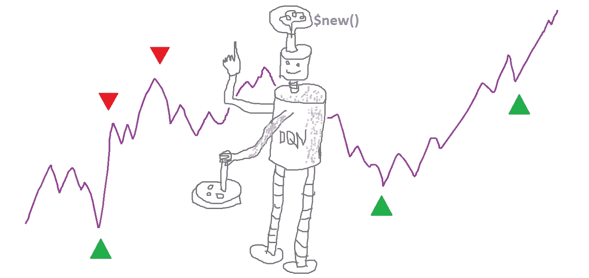
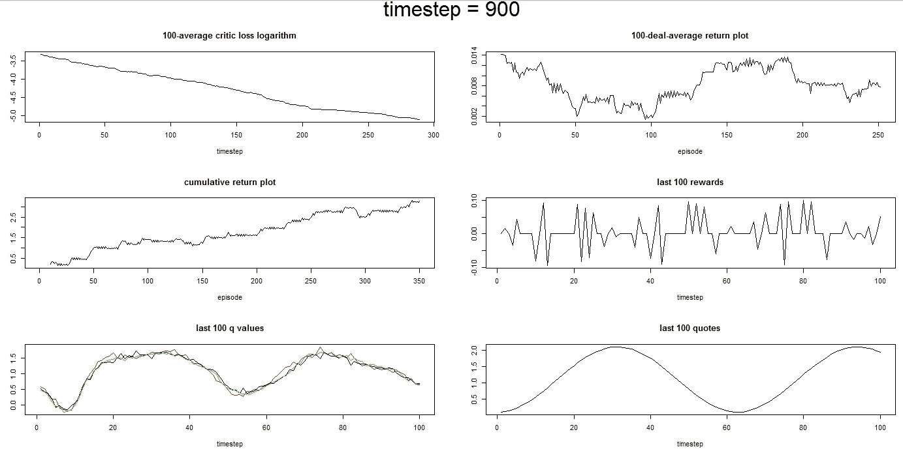

# 深 Q 股票交易:面向对象的 R 代码

> 原文：<https://medium.com/analytics-vidhya/object-oriented-r-code-for-deep-q-stock-trading-90a8f73b2aac?source=collection_archive---------8----------------------->



# 对所做事情的回忆

在过去的系列文章中，我们运行了一个实验来测试强化学习框架可以成功地学习交易模拟和真实股票数据的假设。如果你没有检查它。 [**第一部分。**](/@alexeybnk/can-reinforcement-learning-trade-stock-implementation-in-r-8cd54d13165c)

为了更快地收敛，我们修改了几个东西:在神经网络中增加递归，形成奖励，以及生成演示以获得奖励。实验表明，基于潜力的奖励塑造是最有效的。 [**第二部分。**](/@alexeybnk/improving-q-learning-agent-trading-stock-by-adding-recurrency-and-reward-shaping-b9e0ee095c8b)

那时我发布了神经网络的代码来帮助你开始你的项目。这一次，我贴出了整个实验的代码，这些代码是我用自己最喜欢的 R 语言编写的，并通过 R6 类进行了丰富，使其更容易理解。即使您的日常编码关注使用 Python、Java 或 C，您也可能会发现 R6 的 OOP 非常方便。我希望你们会喜欢它的高层次。查看我的 [**代码库**](https://github.com/alexmosc/deep_q_trading) ，克隆运行！

# 实验逻辑

一旦你按照[的建议](https://github.com/alexmosc/deep_q_trading/blob/master/README.md)安装了软件包，就可以随意从命令行、R 控制台或 RStudio IDE 运行`main.R`。如果你想完全控制选项，RStudio 是你的首选，它是一个方便舒适的编辑器。

```
setwd('C:/R_study/reinforcement/rl_classes') # set your working directory ## Classes 
source('NN_class.R') 
source('DATA_class.R') 
source('RB_class.R') 
source('TRAIN_class.R')
```

在 R 中，你必须设置一个工作目录来指示程序你的文件和目录的位置，你肯定应该首先这样做。因此，其他脚本的导入将会顺利进行。

按照您在脚本中观察到的顺序执行接下来的步骤:生成数据对象，然后重放缓冲区对象，神经网络对象，最后是训练对象。这些对象依赖于在前面步骤中创建的属性和方法。即，重放缓冲器对象从数据对象中取出一段数据字段。

```
Dat <- Data$new()
```

我们创建一个类`Data`的对象，并在这个对象上调用一个方法来获取时间序列。你有几个选择:合成噪音、合成信号和雅虎的真实股票数据。默认情况下，合成信号将是你的时间序列作为一个玩具问题。

```
Dat$synthetic_signal( 
stepsize = 0.1 
, noise_sd = 0.0 
, noise_sd2 = 0.0 
, n = 20000 )
```

您可以创建一个非常简单的(正弦)信号。通过增加`_sd`标准偏差值选择更复杂的信号。

```
Dat$make_features(max_lag_power = 6)
```

为了将任务环境状态置于可测量的空间中，创建以不同顺序的时间序列差的形式实现的输入特征。

```
Nn <- NN$new(lstm_seq_length = 8L) Nn$compile_nn( 
loss = 'mse' 
, metrics = 'mse' 
, optimizer = 'adam'
) Nn2 <- Nn$clone()
```

除了在为 LSTM 层创建输入时将使用多少时间序列时间步长之外，神经网络结构不可从类对象外部修改。

由于学习 q 值的**双**逻辑，我们需要 2 个随机触发的神经网络(你可以在`Train`方法中查看这段代码)。

```
Rb <- RB$new( 
buffer_size = 512 
, priority_alpha = 0.1 
) Rb$init_rb()
```

Replay buffer 是一个`data.table`对象，它存储过去的轨迹，也是调整我们的 NN 模型的数据源。进行优先化采样需要额外的参数，该参数定义了采样期间 RB 行上的概率分布的锐度。

```
Log <- Logs$new()
```

关于神经网络和代理行为的所有相关信息都在一个日志类对象中。您将看到它是如何被利用的，并且您可能想要以自己的风格来绘制它。

```
Tr <- Train$new() Tr$run( 
test_mode = F 
, batch_size = 64 
, discount_factor = 0.99 
, learn_rate = 0.001 
, max_iter = 5000 
, min_trans_cost = 0 
, print_returns_every = 100 
, magic_const = 1
)
```

开始了。训练开始了。我建议你阅读一下 Q 学习参数，这样你就能熟练掌握这一部分。一个有趣的参数是`print_returns_every`,它控制着在这个过程中多长时间弹出一次中级培训报告。该报告可能如下所示:



你可以把长时间的训练放在一边，但要不时地查看屏幕，了解这一过程进行得有多顺利。

当循环停止时，您还将获得代理性能演变的摘要。如果你愿意，可以进行多次训练，每次神经网络都会从上次训练结束时的状态开始进化。当对结果满意时，在一个`Nn`对象上调用`$save()`方法来存储模型。

塑造奖励和演示文稿还没有写好。

在这一点上，我将完成这篇文章，希望这些脚本将顺利地进入你的技术堆栈，你将不仅有一个编码时间，而是一个教育窗口。

花些时间阅读类中的方法来修改一个神经网络结构，输入你自己的数据，或者改变实验逻辑。

祝强化学习好运！