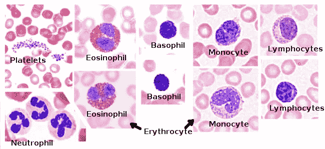
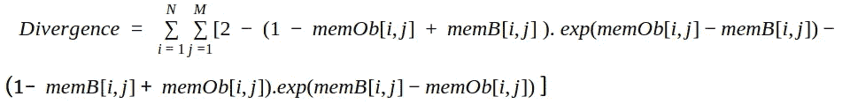
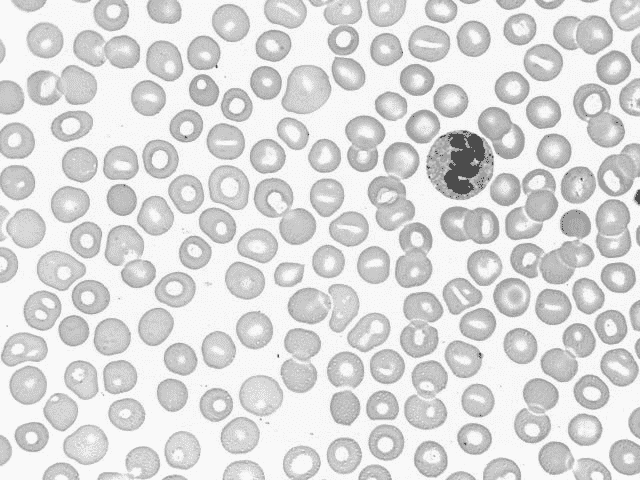
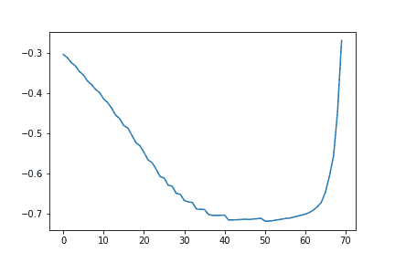
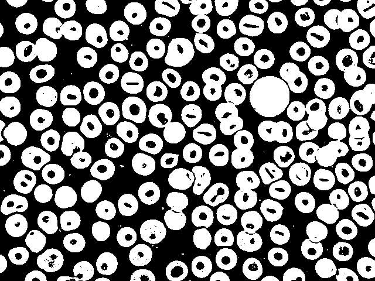
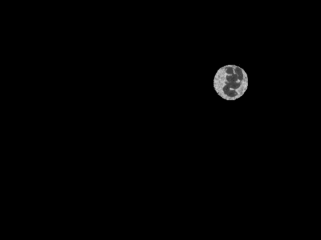

# python 中使用模糊散度的对象分割:外周血涂片的案例研究(上)

> 原文：<https://medium.com/analytics-vidhya/object-segmentation-using-fuzzy-divergence-in-python-a-case-study-over-peripheral-blood-smears-de61ce5dc8d1?source=collection_archive---------12----------------------->



[https://www.google.com/url?sa=i&source = images&CD =&CAD = rja&uact = 8&ved = 2 ahukewjokpmnm 7 llahwt 7 hmbhszwa 5 gqjhx 6 bagbeai&URL = https % 3A % 2F % 2fm megias . webs . uvigo . es % 2f 02-English % 2 fguiada _ a _ sanguineo . PHP&psig = aovvaw 1j 3 zlp 0 ceum 2 UBS lxnvj【1](https://www.google.com/url?sa=i&source=images&cd=&cad=rja&uact=8&ved=2ahUKEwjOkPmNm7LlAhWt7HMBHSzwA5gQjhx6BAgBEAI&url=https%3A%2F%2Fmmegias.webs.uvigo.es%2F02-english%2Fguiada_a_sanguineo.php&psig=AOvVaw1j3ZLp0CEumLy2ubsLxnVj&ust=1571914238260401)

外周血涂片检查是一个便宜但不可避免的步骤，有助于诊断一些关键疾病，如白血病、溶血性贫血和血小板减少症。传统上，训练有素的实验室人员或医疗从业人员使用显微镜手工检查血涂片。最近，已经开发了自动化系统和过程来帮助在阶段、规格和规模的背景下更有效和广泛地分析血涂片。整个过程具有以下步骤:感兴趣区域(ROI)的分割、疾病/非疾病状况的 ROI 参数的识别和表征、阶段、规格和尺度的解释。因此，ROI 分割是从外周血涂片中检测疾病状态的主要步骤之一。它是从图像中存在的一组不同区域中分离出特定区域的过程。在这个博客中，已经讨论了一种特定的方法，其中在阈值选择的模糊散度测量的帮助下，以自动的方式分割血液参数之一。

*   **什么是血液参数，为什么需要它们来识别疾病？**

血液包含三种细胞:红细胞、白细胞和血小板。正常的血液涂片由两个因素描述，即足够数量的细胞和具有正常外观的细胞。但是当血液中细胞的大小、形状、颜色或数量异常时，就要考虑异常血涂片。异常结果可能因受影响的血细胞类型而异。血液相关疾病包括三种类型的疾病。

*   红细胞疾病:缺铁性贫血、镰状细胞性贫血、溶血性尿毒症综合征、真性红细胞增多症
*   白细胞疾病:急性或慢性白血病、艾滋病毒、丙型肝炎病毒感染、寄生虫感染、真菌感染(念珠菌病)、其他淋巴增生性疾病(骨髓瘤)
*   血小板血细胞疾病:骨髓增生性疾病、血小板减少症

关于形状、大小、颜色、质地和对这些血液参数的计数的临床研究有助于勾勒出患病/非患病状况。

**案例研究:从血液涂片(显微图像)中分割白细胞(ROI)**

多年来，模糊技术被用作从背景中提取目标的主要技术方法之一。模糊散度是一种基于图像灰度直方图来处理目标和背景先验概率分布的技术。在这种情况下，从灰度直方图中对象-背景类的先验概率分布的信息内容的最大化中选择阈值。

# 要遵循的步骤:

**第一步:** **将一幅灰度图像表现为一幅模糊图像**

模糊图像是灰度值及其相应隶属度值的组合。假设一个大小为 M×N 的模糊图像被定义为灰度级和它的像素的隶属值的组合。特定像素的隶属值必须在区间[0，1]内。特定灰度级的频率由该特定图像中出现的次数来定义。首先，基于(0，255)中的特定阈值，计算背景和目标区域的平均灰度级。第二，为了计算隶属度值(伽马隶属度)，已经考虑了像素所属区域的平均值和该像素的灰度级之间的距离的绝对值。

**第二步:** **区分模糊图像内的物体和背景**

基于隶属值计算背景和对象的区分度。考虑图像对象和背景作为独立的图像，因此我们可以计算它们之间的区别。图像中特定点( *i，j* )处的对象和背景的信息量被描述为，

exp(memOb[i，j]-member[I，j])

*memOb =对象的成员资格，memB =后台的成员资格

**步骤 3** : **使用香农指数熵计算两幅模糊图像之间的模糊散度**

基于香农的指数熵，我们可以用公式表示物体和背景之间的散度，



**第四步**:求产生最小散度值的阈值。

**步骤 5** :使用阈值从背景中分割出物体。

**步骤 6** :对图像的分割部分进行图像重建。

# 结果:



输入:原始图像



发散图



分段血液颗粒


分节白细胞



输出:分段重建的白细胞

python 中的代码(jupyter 笔记本):

```
# import all libraries 
import numpy as np
from scipy import signal
import cv2
import pip
import matplotlib.pyplot as plt
%matplotlib inline
import math
from math import e
from scipy.signal import find_peaks# this function helps to find out the mean value for onject and background regions separately# this function helps to find out the mean value for onject and background regions separatelydef mean_obj_back(img, threshold):

    Y = img.shape[0]*img.shape[1]
    # setting the max and min of histogram peaks within which 
      threshold point to be found
    fmax = 250
    fmin = 180
    const = 1/(fmax-fmin)
    # calculate the histogram    
    hist,bins = np.histogram(img.ravel(),256,[0,256])
    # set an arbitrary threshold point
    th = threshold
    # initialize the parameters
    s0 = 0
    s1 = 0
    s00 = 0
    s11 = 0
    s = 0
    s2 = 0

    for f in range(0,th):
        s = bins[f]*hist[f]
        num = s0 + s
        den = s1 + hist[f] 
        s0 = num
        s1 = den
    # mue of object
    mueOb = round(num/den)

    for f in range(th,256):
        s2 = bins[f]*hist[f]
        numb = s00 + s2
        s00 = numb
        denb = s11 + hist[f]
        s11 = denb
   # mue of background
    mueB = round(numb/denb)

    return mueOb, mueB,const
# make a gray image to a fuzzy image 
def fuzzyImage(img,th,mueOb,mueB,const):

    for i in range(0, img.shape[0]):
        for j in range(0, img.shape[1]):
            if (img[i,j]<th):
                f = (-const) * abs(img[i,j] - mueOb)
                mem[i,j] = np.exp(f)
            else:
                f1 = (-const) * abs(img[i,j] - mueB)
                mem[i,j] = np.exp(f1)
    return mem# calculation of fuzzy divergence measure
def fuzzydivergence(mem):
    u1 = 0
    for i in range(0, mem.shape[0]):
        for j in range(0, mem.shape[1]):
            p1 = (np.exp(mem[i,j]-1))
            p2 = (np.exp(1-mem[i,j]))
            h = (2 -((mem[i,j]+1)*p1)-(1-1+mem[i,j])*p2) + u1
            u1 = h
    return h
# calculate the divergence measurement between image object and image background
def divergence(img):
    div_vec = []
    threshold =[]
    fmax = 250
    fmin = 180
    for th in range(fmin,fmax):
        const = 1/(fmax-fmin)
        mueOb = mean_obj_back(img, th)[0]
        mueB = mean_obj_back(img, th)[1]
        mem = np.zeros((img.shape[0], img.shape[1]))
        p = th
        mem = fuzzyImage(img,p,mueOb,mueB,const)
        h = fuzzydivergence(mem)
        Y = img.shape[0] * img.shape[1]
        div = h/Y
        div_vec.append(div)
        threshold.append(th)

    return div_vec,threshold
# area based filter that will helps to filter out ROI from rest of the image
def area_based_filter(binary):
    #make binary image as integer type
    binary = np.array(binary, dtype=np.uint8)
    #find all your connected components (white blobs in your image)
    nb_components, output, stats, centroids = cv2.connectedComponentsWithStats(binary, connectivity=8)
    #connectedComponentswithStats yields every seperated component with information on each of them, such as size
    #the following part is just taking out the background which is also considered a component, but most of the time we don't want that.
    sizes = stats[1:, -1]; 
    nb_components = nb_components - 1
    min_size = max(sizes)
    # minimum size of particles we want to keep (number of pixels)
    #here, it's a fixed value, but you can set it as you want, eg the mean of the sizes or whatever
    #your answer image
    result = np.zeros((output.shape))
    #for every component in the image, you keep it only if it's above min_size
    for i in range(0, nb_components):
        if sizes[i] >= min_size:
            result[output == i + 1] = 255
    return result# make binary of image
def binarize_image(img,threshold_value):
    binary = np.zeros((img.shape[0], img.shape[1])) for i in range(0, img.shape[0]):
            for j in range(0, img.shape[1]):
                if (img[i,j] < threshold_value):
                    binary[i,j] = 255
                else:
                    binary[i,j] = 0
    return binary# fill the segmented region holes
def img_fill(im_in):  # n = binary image threshold
    #th, im_th = cv2.threshold(im_in, n, 255, cv2.THRESH_BINARY);
    im_th = im_in.astype('uint8')

    # Copy the thresholded image.
    im_floodfill = im_th.copy() # Mask used to flood filling.
    # Notice the size needs to be 2 pixels than the image.
    h, w = im_th.shape[:2]
    mask = np.zeros((h + 2, w + 2), np.uint8) # Floodfill from point (0, 0)
    cv2.floodFill(im_floodfill, mask, (0, 0), 255); # Invert floodfilled image
    im_floodfill_inv = cv2.bitwise_not(im_floodfill) # Combine the two images to get the foreground.
    fill_image = im_th | im_floodfill_inv return fill_imagePath_to_image  = '.../Original_Image.jpg'# read image from directory path
img = cv2.imread(path_to_image) 
# make it gray
img = cv2.cvtColor(img, cv2.COLOR_RGB2GRAY)
# get the histogram
hist,bins = np.histogram(img.ravel(),256,[0,256])
# define a membership mask for processing
mem = np.zeros((img.shape[0], img.shape[1]))
# find out the divergence measure for segmentation 
diver,thr = divergence(img)
# find out the minimum divergence value
min_diver = min(diver)
index = [i for i,x in enumerate(diver) if x == min_diver]
val = index.pop()
# find out the threshold value for which divergence value is minimum
threshold_value  = thr[val]
# binarize the image using the threshold value
binary = binarize_image(img, threshold_value)
# set an area based filter to get region of interest (ROI)
area_filtered_image = area_based_filter(binary)
# fill up segmented area for reconstruction of original ROI
fill_img = img_fill(area_filtered_image)
# remap segmented ROI with original gray image ROI
out = fill_img.copy()
out[fill_img == 255] = img[fill_img == 255]## Plot the results
fig, axes = plt.subplots(ncols= 2, figsize=(10, 5))
ax = axes.ravel()ax[0].imshow(img, cmap=plt.cm.gray)
ax[0].set_title('Original Image')
ax[0].axis('off')
ax[1].plot(diver)
ax[1].set_title('Divergence Plot')
ax[1].axis('on')plt.show()fig, axes = plt.subplots(ncols= 3, figsize=(15, 8))
ax = axes.ravel()ax[0].imshow(binary, cmap=plt.cm.gray)
ax[0].set_title('Thresholded')
ax[1].imshow(fill_img, cmap=plt.cm.gray)
ax[1].set_title('Segmented_Leukocyte')
ax[2].imshow(out, cmap=plt.cm.gray)
ax[2].set_title('Reconstructed_Leukocyte ')
for a in ax:
    a.axis('off')
plt.show()
```

请参考我关于美光、爱思唯尔的论文

[***Madhumala Ghosh，Dev Kumar Das，Chandan Chakraborty，Ajoy K Ray，使用模糊散度的自动白细胞识别，Micron Vol-41，Issue -7，2010 年 10 月，第 840-846 页。***](https://www.sciencedirect.com/science/article/pii/S0968432810001071)

**结论**

通过检查不同的血液参数，从血液中测量健康状况。每当血液参数测量值异常或不一致时，都会反映在您的健康危害中。这就是为什么了解可能导致基本健康问题的常见血液疾病非常重要。常见的血液疾病有[贫血](https://www.hematology.org/Patients/Anemia/)、[出血性疾病](https://www.hematology.org/Patients/Bleeding.aspx)如[血友病](https://www.hematology.org/Patients/Bleeding.aspx#a2)、[血块](https://www.hematology.org/Patients/Clots/)和[血癌](https://www.hematology.org/Patients/Cancers/)如[白血病](https://www.hematology.org/Patients/Cancers/Leukemia.aspx)、[淋巴瘤](https://www.hematology.org/Patients/Cancers/Lymphoma.aspx)和[骨髓瘤](https://www.hematology.org/Patients/Cancers/Myeloma.aspx)。甚至像疟疾这样的寄生虫感染也可以从血液参数中识别出来。血液涂片的自动化表征取代了人工判读，有助于优化人工误差，减少人工工作量，并最大限度地减少昂贵的资源利用和化学品。从今以后，在未来的连续博客中，我将详细解释血液参数将如何导致检测具有与疾病状况相关的有意义特征的血液相关疾病。回头见。