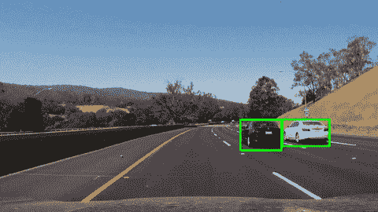
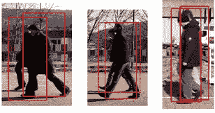
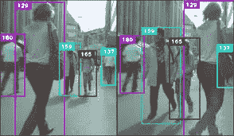
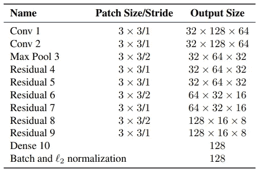
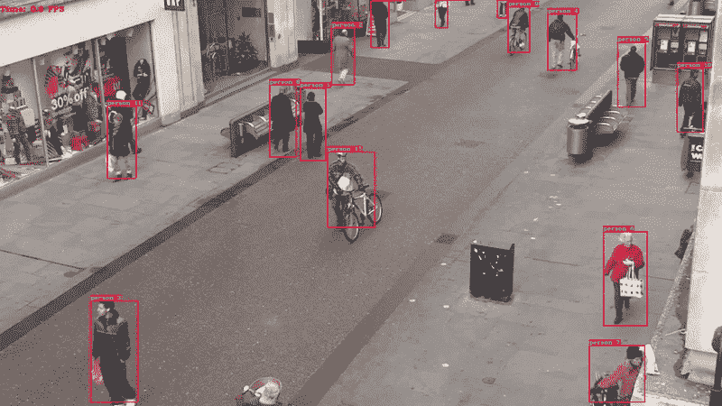

# TensorFlow 2 中使用深度排序的目标跟踪

> 原文：<https://medium.com/analytics-vidhya/object-tracking-using-deepsort-in-tensorflow-2-ec013a2eeb4f?source=collection_archive---------0----------------------->

为了确定有意义的事件和可疑活动，检测和跟踪对象是监控系统必须完成的最普遍和最具挑战性的任务之一。本文介绍了目标跟踪的概念、挑战、传统方法，并在 TensorFlow 2.0 中实现了这样一个系统。

# **物体跟踪**

视频实际上是图像序列，每个图像称为一帧，以足够快的频率显示，以至于人眼可以感知其内容的连续性。显然，所有的图像处理技术都可以应用于单独的帧。此外，两个连续帧的内容通常密切相关。

视频中的对象检测包括验证图像序列中对象的存在，并且可能精确地定位它以便识别。目标跟踪是监控视频序列中目标的空间和时间变化，包括目标的存在、位置、大小、形状等。这是通过解决时间对应问题来实现的，时间对应问题是在以紧密间隔的时间间隔拍摄的图像序列的连续帧中匹配目标区域的问题。这两个过程密切相关，因为跟踪通常从检测对象开始，而在后续图像序列中重复检测对象通常是帮助和验证跟踪所必需的。

> **对象跟踪**的任务是获取一组初始对象检测，为每个初始检测创建一个唯一的 ID，然后在对象在视频帧中移动时跟踪每个对象，并保持 ID 分配。

# **挑战**

每当视频中有移动对象时，都存在对象的视觉外观不清晰的特定情况。在这种情况下，跟踪时检测失败，因为它还具有对象的运动模型和历史。

以下是对象跟踪中的一些挑战:

1.  遮挡:当我们正在跟踪的对象被另一个对象隐藏(遮挡)时，就会发生这种情况。就像两个人擦肩而过，或者一辆车从桥下驶过。这种情况下的问题是，当一个物体消失又重新出现时，你该怎么办。
2.  规模变化
3.  背景混乱:物体附近的背景与物体有相似的颜色或纹理。因此，对于具有杂乱背景小物体，跟踪结果变得更加困难。
4.  外观变化:一个物体的不同视点在没有上下文的情况下可能看起来非常不同。因此，仅使用视觉检测来识别物体变得非常困难。

# **传统方法**

**光流**

光流或运动估计是计算图像强度运动的基本方法，图像强度运动可归因于场景中物体的运动。它提供了经历运动的图像区域和运动速度的简明描述。实际上，光流的计算容易受到噪声和照明变化的影响。

光流可以用来检测独立运动的物体，甚至在摄像机运动的情况下。当然，基于光流的技术计算复杂，因此需要快速的硬件和软件解决方案来实现。由于光流基本上是一个微分量，对它的估计很容易受到噪声的影响；改善噪声敏感度可能意味着复杂性的增加。因此，使用某种类型的光流计算的基于智能摄像机的视频监控系统必须配备大量的计算资源。事实上，正是因为这些技术被引入到智能摄像机技术中，所以具有显著智能能力的视频监控系统正在被设想和实现。

**Meanshift**

均值漂移是一种非参数迭代算法，可用于许多目的，如发现模式、聚类等。多年来，由于迭代次数少、实时性好等优点，它在目标跟踪领域得到了广泛的应用。然而，由于传统的 Mean Shift 算法只使用了目标特征的单色直方图表示，在某些情况下，尤其是在非常复杂的情况下，跟踪效果并不理想。

**卡尔曼滤波器**

基于动态/测量模型，用于跟踪移动对象的卡尔曼滤波器估计包括目标参数(例如位置和速度)的状态向量。我们知道不同的运动条件和遮挡会阻碍对物体的视觉跟踪。考虑使用卡尔曼滤波器的能力，其允许对象的小遮挡和复杂运动。

卡尔曼滤波器是一种递归估计器，这意味着在估计当前状态时，它需要先前状态及其当前测量值。这两个足以估计当前状态。卡尔曼滤波器利用加权平均现象，将系统状态的预测与新的量测进行平均。

如果已知系统和测量模型是线性的，卡尔曼滤波器是目前广泛使用的最简单的线性状态空间模型之一。当随时间递归估计未知状态变量时，测量值中存在一定的不确定性。不确定性是指测量值中包含过程噪声和测量噪声，而卡尔曼滤波器用来估计未知状态变量时，所包含的噪声本质上必然是高斯噪声。由此我们不能完全确定地对系统建模。卡尔曼滤波器使用带有高斯白噪声的线性方程组作为标准模型。

# 深度排序

最广泛使用的对象跟踪框架之一是[深度排序](https://arxiv.org/abs/1703.07402)，这是对[排序(简单实时跟踪器)](https://arxiv.org/abs/1602.00763)的扩展。

> 我们整合了外观信息来提高排序的性能。由于这种扩展，我们能够通过更长时间的遮挡来跟踪物体，有效地减少了身份转换的次数。

— [深度关联度排序，2017 年](https://arxiv.org/abs/1703.07402)

**卡尔曼滤波器**

我们的跟踪场景被定义在八维状态空间(u，v，γ，h，x，y，γ，h)上，该空间包含边界框中心位置(u，v)，纵横比γ，高度 h，以及它们在图像坐标中各自的速度。使用具有恒速运动和线性观测模型的标准卡尔曼滤波器，其中我们将边界坐标(u，v，γ，h)作为物体状态的直接观测值。

对于每个检测，我们创建一个“轨道”，其中包含所有必要的状态信息。它还有一个参数来跟踪和删除上次成功检测的轨迹，因为这些对象已经离开了场景。为了消除重复轨迹，前几帧有一个最小检测数阈值。

现在，当我们从卡尔曼滤波器跟踪到新的边界框时，下一个问题在于将新的检测与新的预测相关联。因为它们是独立处理的，所以这里出现了**分配问题**，因为我们不知道如何将 *track_i* 与传入的 *detection_k.* 关联起来

为了解决这个问题，我们需要两件事情:一个*距离度量*来量化关联，一个*高效算法*来关联数据。

深度排序作者决定使用平方马氏距离(处理分布时的有效度量)来合并卡尔曼滤波器的不确定性。设定这个距离的阈值可以给我们一个很好的实际关联的概念。这个度量比欧几里得距离更准确，因为我们有效地测量了两个分布之间的距离(在卡尔曼滤波器下，一切都是分布)。在这种情况下，作者提出使用标准的[匈牙利算法](https://en.wikipedia.org/wiki/Hungarian_algorithm)，这是一种非常有效和简单的组合优化算法，可以解决指派问题。

## 外观特征向量

到目前为止，我们有一个物体探测器给我们检测，卡尔曼滤波跟踪检测，并给我们丢失的轨迹和匈牙利算法解决关联问题。

尽管卡尔曼滤波器有效，但它在许多真实世界的场景中失败，如遮挡、不同视点等。

因此，为了改进这一点，深度排序的[作者](https://en.wikipedia.org/wiki/Hungarian_algorithm)引入了另一种基于对象“外观”的距离度量。

因此，作者首先在数据集上建立一个分类器，训练它直到它达到相当好的精度，然后剥离最终的分类层。假设一个经典的架构，我们将剩下一个产生单一特征向量的密集层，等待被分类。该特征向量成为我们的对象的“外观描述符”。

上面图片中显示的“密集 10”层将是给定作物的外观特征向量。一旦训练完成，我们只需要将检测到的包围盒的所有裁剪从图像传递到这个网络，并获得“128×1”的维度特征向量。

更新后的距离度量将是:

d =λ∫Dk+(1λ)∫Da

其中 Dk 是马氏距离，Da 是外观特征向量之间的余弦距离，λ是加权因子。

一个简单的距离度量，结合强大的深度学习技术，是 deep SORT 成为一个优雅的和最广泛的对象跟踪器之一所需要的一切。

## 代码实现:

在这一部分中，我在预训练(在 COCO 数据集上训练)的 YOLOv3 模型上实现了对象跟踪器。

设计用于在 Python 3.7 和 TensorFlow 2.0 上运行的代码可以在我的 [**GitHub 库**](https://github.com/anushkadhiman/ObjectTracking-DeepSORT-YOLOv3-TF2) 中找到。

在我的回购中，你会发现一个笔记本(。ipynb 文件)，它是在视频上执行跟踪代码。

首先克隆我的资源库:
`[git clone https://github.com/anushkadhiman/ObjectTracking-DeepSORT-YOLOv3-TF2.git](https://github.com/anushkadhiman/ObjectTracking-DeepSORT-YOLOv3-TF2.git)`

接下来，安装需要的 python 包:
`pip install -r ./requirements.txt`

现在，下载经过训练的 yolov3.weights:
`wget -P model_data [https://pjreddie.com/media/files/yolov3.weights](https://pjreddie.com/media/files/yolov3.weights)`

现在，运行跟踪代码:
`python object_tracker.py`

## 用预先训练的模型跟踪人

**以前的帖子:**

1.  [tensor flow 2 . x 中的 YOLOv3 物体检测](/analytics-vidhya/yolov3-object-detection-in-tensorflow-2-x-8a1a104c46a8)
2.  [计算机视觉:现在和未来](/analytics-vidhya/computer-vision-the-present-and-future-2c2c95fa81af)

**参考文献:**

1.  [https://github.com/nwojke/deep_sort](https://github.com/nwojke/deep_sort)
2.  [简单的在线实时跟踪和深度关联指标](https://arxiv.org/abs/1703.07402) —
    尼古拉·沃里克、亚历克斯·比雷、迪特里希·保卢斯
3.  https://pylessons.com/——罗卡斯·巴尔西斯