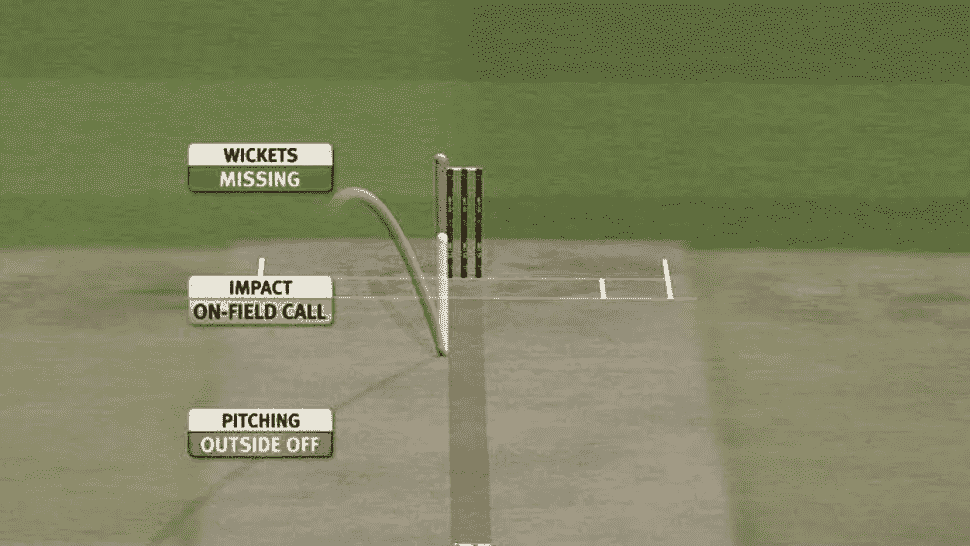
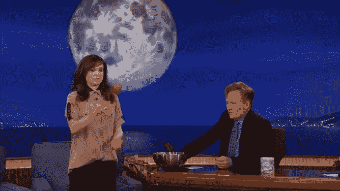
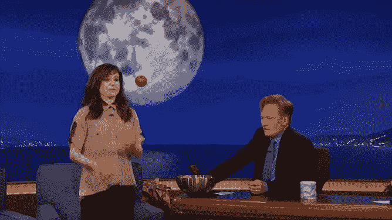
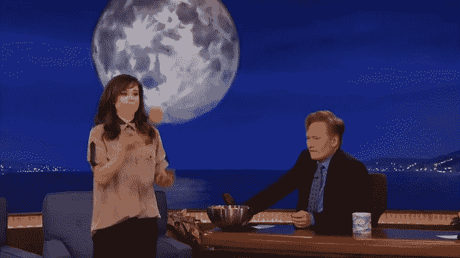

# 使用 OpenCV 进行目标跟踪

> 原文：<https://medium.com/analytics-vidhya/object-tracking-using-opencv-f28a7e09219d?source=collection_archive---------0----------------------->

我已经看了大约 10 年的板球比赛，一直想知道第三裁判是如何跟踪 LBW 三柱门的球的。是的，为了检查 LBW，将使用计算机视觉应用程序跟踪球，并根据角度和其他参数投影轨迹。今天我们将看看如何使用 OpenCV 从视频中跟踪一个球。



# **从所选视频中跟踪球的步骤**

第一步:使用 cv2 逐帧读取视频。视频捕获()

第二步:找到你想要跟踪的球的阈值/颜色(我采用了试错法)

第三步:在每一帧，寻找指定的颜色范围，使其成为白色，其余全黑(二进制图像转换)

第四步:找到轮廓，只取面积较大的区域。

第五步:因为这是球跟踪，我试图找到圆心，并画了一个圆。

步骤 6:相对于捕捉到的中心画圆。就是这样。看起来不简单吗？

```
import cv2
import numpy as np
import imutils
import matplotlib.pyplot as pltcap = cv2.VideoCapture(‘ball_tracking.mp4’)
redLower = np.array([0,10,170], dtype=’uint8')
redUpper = np.array([50,50,255], dtype=’uint8')
c = 0
frame_width = int(cap.get(3)) 
frame_height = int(cap.get(4)) 

size = (frame_width, frame_height)result = cv2.VideoWriter(‘balltracking.mp4’, 
 cv2.VideoWriter_fourcc(*’MJPG’), 
 10, size) 
while True:
 grapped,frame=cap.read()
 if grapped == True:

 red = cv2.inRange(frame,redLower,redUpper)
 red = cv2.GaussianBlur(red,(3,3),0)cnts = cv2.findContours(red.copy(),cv2.RETR_EXTERNAL,cv2.CHAIN_APPROX_SIMPLE)
 cnts = imutils.grab_contours(cnts)if len(cnts) > 0:
 cnt = sorted(cnts,key=cv2.contourArea,reverse=True)[0]
 rect = np.int32(cv2.boxPoints(cv2.minAreaRect(cnt)))
 cv2.circle(frame, (rect[0][0]+(rect[-1][0] — rect[0][0])//2,rect[1][1]+(rect[-1][-1]-rect[1][1])//2), 
 25, (0, 255, 0), -1)
 cv2.imshow(“Ball Tracking”, frame)
 result.write(frame)
 if cv2.waitKey() & 0xFF == ord(“q”):
 break

 else:
 break# cleanup the camera and close any open windows
cap.release()
cv2.destroyAllWindows()
```



跟踪前


跟踪后

# **挑战**

当我们在背景图像中有相同的颜色，模糊的图像，嘈杂的背景等时，真正的挑战就来了。这可以使用特定于数据集的预处理技术或深度学习方法来解决。

一定要试着自己去了解更多，让自己兴奋起来！！！

这里是代码和结果视频的 Github 链接。https://github.com/RamjiB/Ball-Tracking