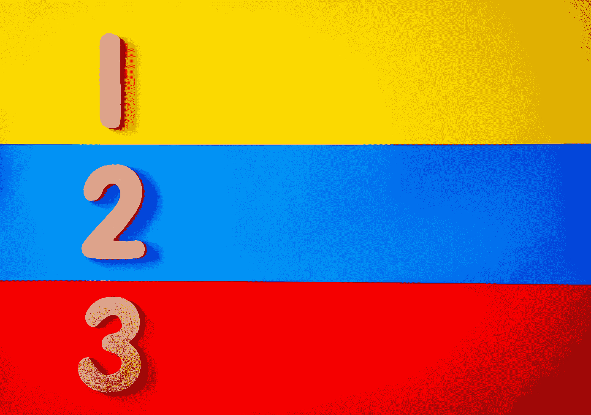

# Python 中对象值对对象类型对对象 Id

> 原文：<https://medium.com/analytics-vidhya/object-value-vs-object-type-vs-object-id-in-python-aafd0444d23c?source=collection_archive---------7----------------------->

## Python 初学者指南📚

## 了解身份比较与平等比较`(is vs ==)`

照片由[玛格达·埃勒斯](https://www.pexels.com/@magda-ehlers-pexels?utm_content=attributionCopyText&utm_medium=referral&utm_source=pexels)从[佩克斯](https://www.pexels.com/photo/blue-red-and-yellow-stripe-surface-1329297/?utm_content=attributionCopyText&utm_medium=referral&utm_source=pexels)拍摄

## Python 中的对象

> *对象*是 Python 对数据的抽象。Python 程序中的所有数据都由对象或对象之间的关系来表示。- [python 文档](https://docs.python.org/3/reference/datamodel.html#objects-values-and-types)