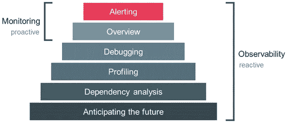
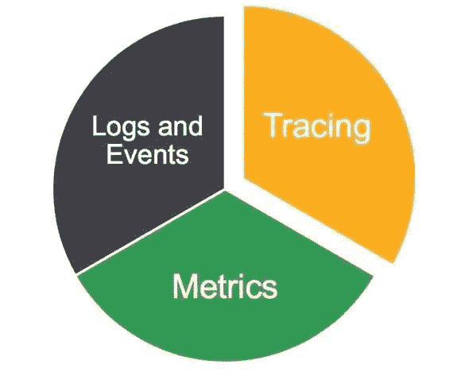

# 可观察性:关于它的 3 件事。

> 原文：<https://medium.com/analytics-vidhya/observability-3-things-about-it-f3e2c6c8b6e0?source=collection_archive---------31----------------------->

原帖:[https://ish-ar.io/observability/](https://ish-ar.io/observability/)

可观察性并不是一个新概念。事实上，它来自工程和控制理论的世界。根据定义，**可观测性**是一个衡量系统内部状态如何从其外部输出的知识中推断出来的指标。

因此，这意味着您的旧 monolith 应用程序现在必须公开其内部状态、指标、关于异常或崩溃的跟踪细节，以及更多，以将其定义为“**可观察的**”

正如你所看到的，可观察性有很多不同的方面，乍一看可能不清楚。在这篇文章中，我将尝试简单有效地解释它。我们将考虑与监控、**可观察性的三大支柱**以及现有标准工具的区别。

# 可观察性与监控:有什么区别？

我们现在已经说服我们的组织朝着**可观测性**前进。但是从不同的部门，产生了一个问题:可观察性和监控性有什么区别？

为了回答这个问题，让我们来回顾一下什么是监控。顾名思义，“监控”是一种行动。它是一个系统对另一个系统执行的操作，以检查它是否工作正常。我们的监控系统应该只回答两个简单的问题:“什么？”以及“为什么？”。结合黑盒和白盒监控可以回答这两个简单的问题。

正如我上面所引用的，**可观测性**“是一个系统的内部状态可以从其外部输出的知识中推断出来的程度的度量。”因此可以将其视为监控的一个超集，包含更多关于我们系统的规范和细节。

此外，当我们想到监控时，我们想到的是故障驱动的东西，它旨在防止事故，并帮助工程师尽快解决问题。但是当谈到可观察性时，它不是失败驱动的。相反，工程师可能用它来调试系统、执行测试分析、运行生产检查等等。

那么，**为什么我们两者都需要呢？**

想想这个:你公司的一个开发人员改变了一些关键的代码路径来引入一个新的很酷的特性。不幸的是，这导致了最终产品功能的故障。您精心设计的监控系统可以返回损坏的内容和原因(**这是必不可少的**)。然而，它不会给出诸如单进程跟踪、负载测试结果、系统分析或异常之类的细节，这并不是因为它不够好，而只是因为它不是应该做的。事实上，监控系统只是向我们的开发人员返回一个内存使用警告和相关的非工作服务。如果能够详细跟踪相关的内存使用情况，了解内存泄漏在哪里，岂不是很棒？或者，一些测试结果来比较其他环境与生产？这就是可观察性发挥作用的地方，这就是为什么它可以被认为是监控的超集。

我们还需要承认，当谈到标准 it 基础架构时，有许多监控系统具有开箱即用的功能，可以在操作系统、硬件甚至服务级别上提供一定程度的可观察性。有时，正如我们稍后将考虑的那样，业务甚至不需要走得更远。

另一方面，当我们谈论定制软件、复杂的 web 平台或分布式系统时，拥有一个可观察的实现可能会为产品和业务提供一些重要的信息。

如今，我们看到产品变得越来越复杂，具有新的功能和新的可靠性标准。从工程的角度来看，IT 基础设施正在演变成新的模式，如微服务、多语言持久性、容器，以将大而旧的整体分离成小的系统，这对产品来说是最佳的，但对工程师来说有点复杂。可用工具的数量也在急剧增加；有这么多的平台和不同的方式让人类去做很酷的新东西。为了在这些条件下成功交付和运行你的产品，你需要**可观察性**。

# 可观察性的三大支柱

# 韵律学

来自 Cindy 的书(分布式系统可观察性):“度量是在时间间隔内测量的数据的数字表示。度量可以利用数学建模和预测的能力来获取系统在现在和未来的时间间隔内的行为知识。由于 numbers 针对存储、处理、压缩和检索进行了优化，因此指标可以延长数据的保留时间并简化查询。这使得指标非常适合构建反映历史趋势的仪表板。度量还允许数据分辨率的逐渐降低。经过一段时间后，数据可以聚合成每日或每周的频率。”

度量帮助我们定义和测量我们服务的 SLO，测量我们分布式系统中发生的一切。根据定义，一个可观测的系统也必须是一个可测的系统。

# 分布式跟踪

随着我们向微*架构发展，分布式跟踪变得越来越重要，在微*架构中，所有这些小系统协同工作，以满足可伸缩性和可靠性要求。

分布式跟踪有助于工程师识别大型基础设施中的瓶颈。

当涉及到产品的性能分析和改进时，它也是一个重要的组成部分。

# 记录

您的基础设施总是在生成日志。不管它们是警告、信息、错误还是关键日志。它们总是在发生。随着分布式系统越来越复杂，关注日志是非常必要的。如果您没有合适的基础设施来接收、阐述和显示日志，那么这样做可能会很累。

因此，有多种工具可以帮助您收集日志并对其进行智能管理。通过跟踪请求，您可以很容易地看到瓶颈在哪里，但是通过日志记录，您可以调试它们，并提供关于如何解决 bug、提高产品性能等等的见解。

# 我推荐的观察工具。

让我们开始练习吧。以下是我最喜欢的可观察性工具的列表和对它们的简短描述。

# 跟踪:

## 贼鸥

Jaeger 受 Dapper 和 OpenZipkin 的启发，是一个由优步技术公司开源发布的分布式追踪系统。它用于对基于微服务的分布式系统进行监控和故障排除，包括:

*   分布式上下文传播
*   分布式事务监控
*   根本原因分析
*   服务依赖分析
*   性能/延迟优化

来源: [www.jaegertracing.io](http://www.jaegertracing.io)

## Linux eBPF

eBPF 对于调试内核和进行性能分析很有用；程序可以附加到跟踪点、kprobes 和 perf 事件。因为 eBPF 程序可以访问内核数据结构，所以开发人员可以编写和测试新的调试代码，而不必重新编译内核。对于在实时运行的系统上调试问题的忙碌工程师来说，这种暗示是显而易见的。甚至可以使用 eBPF 通过使用用户域静态定义的跟踪点来调试用户空间程序。eBPF 的强大来自两个优势:快速和安全。为了充分理解它，你需要了解它是如何工作的。

资料来源:lwn.net/Articles/740157

# 指标:

## 普罗米修斯

Prometheus 是一个开源系统监控和警报工具包，最初由 SoundCloud 开发。Prometheus 的主要特点是:多维数据模型，时间序列数据由指标名称和键/值对 PromQL 标识，灵活的查询语言，利用这种维度不依赖于分布式存储；单个服务器节点是自治的时间序列收集通过 HTTP 上的拉模型进行通过中间网关支持推时间序列通过服务发现或静态配置发现目标支持多种图形和仪表板模式

来源:prometheus.io

# 日志记录:

## 弹性堆叠

Elasticsearch、Logstash 和 Kibana(以前称为 ELK Stack，现在更名为 Elastic Stack，增加了 Beats)可以实时提供几乎任何类型、任何规模的结构化和非结构化数据源的可操作见解。从集中基础架构日志、跟踪和指标以提供出色的最终用户体验，到使用实时遥测技术保持智能设备群的脉搏，弹性堆栈的可能性是无限的。全球成千上万的组织正在将弹性堆栈用于各种任务关键型用例，我们希望向您展示如何为您的企业开始使用它。无论你称之为 ELK Stack 还是 Elastic Stack，这个介绍性的网络研讨会都将提供 Elasticsearch、Kibana、Beats 和 Logstash 的主要功能的现场演示。

亮点包括:将数据纳入 Elasticsearch，包括了解模块如何简化通过 Kibana 探索和搜索数据的体验，包括构建自定义可视化，通过基于机器学习的异常检测和警报跟踪变化，展示将日志和指标纳入单一平台的价值

来源:www.elastic.co/webinars/introduction-elk-stack

# 奖金:

**Stackdriver** 是谷歌云的嵌入式可观测性套件，旨在监控、故障排除和改善云基础设施、软件和应用性能。Stackdriver 使您能够:

*   高效构建和运行工作负载，保持应用程序的高性能和可用性。
*   收集 Google Cloud 内部和外部应用、平台和服务的信号。
*   分析和监控你的操作遥测。
*   设置适当的性能和可用性指标。
*   使用内置的可观察性来排除故障和改进应用程序。
*   使用现成的工具和通过编程界面定制的工具来实现运营自动化。

**主要特点:**

*实时日志管理和分析。* Stackdriver 日志记录是一项完全托管的服务，可大规模执行，并可接收应用程序和系统日志数据，以及来自数千个虚拟机的自定义日志数据。Stackdriver 日志记录允许您实时分析选定的日志并将其导出到长期存储中。

*尺度的内在可观测性。* Stackdriver Monitoring 提供了对云驱动应用的性能、正常运行时间和整体运行状况的可见性。Stackdriver 从 Google 云服务、托管的正常运行时间探测器、应用程序工具和各种常见的应用程序组件收集指标、事件和元数据。

*应用绩效管理工具。* Stackdriver 应用性能管理(APM)包括帮助您减少延迟和成本的工具，因此您可以运行更高效的应用。借助跟踪、调试器和探查器，您可以深入了解代码和服务的运行情况，并在需要时进行故障排除。

资料来源:cloud.google.com/stackdriver/

## 推荐资源:

[**(本书)分布式系统的可观测性**](https://www.oreilly.com/library/view/distributed-systems-observability/9781492033431/)

[**(视频)一集 SRE 实现 DevOps 视频**](https://www.youtube.com/watch?v=SoZZzB-yTOk)

[**(视频)可观察性的下一步是什么**](https://www.youtube.com/watch?v=MkSdvPdS1oA&feature=emb_logo)

# 结论

可观测性是一个令人惊奇的话题，我相信今年我们会看到越来越多关于它的内容。我希望这篇文章明确了论点并恰当地介绍了它。如果您有任何问题，请随时通过 [Twitter](https://twitter.com/isham_araia) 联系我。

敬请期待:)

*原载于*[*https://ish-ar . io*](https://ish-ar.io/observability/)*。*