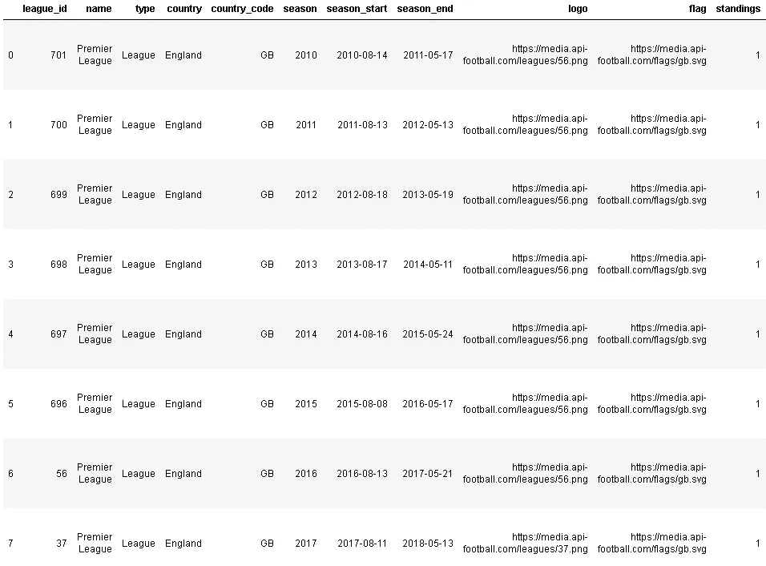

# 使用 Python 请求从 API 获取体育数据

> 原文：<https://medium.com/analytics-vidhya/obtaining-sports-data-from-an-api-using-python-requests-7cd6ec89c821?source=collection_archive---------7----------------------->

埃米利奥·加西亚在 [Unsplash](https://unsplash.com?utm_source=medium&utm_medium=referral) 上拍摄的照片

作为一名数据科学家，通过 API 获取数据的能力是一项关键技能。在这篇文章中，我提供了一个关于从 [API-FOOTBALL](https://www.api-football.com/) 获取足球数据的简短教程，这是一个由 [RapidAPI](https://rapidapi.com/) marketplace 托管的 RESTful API。本教程遵循我在熨斗学校数据科学训练营期间完成的第四个项目中使用的一般方法，在该项目中，我探索了几种使用游戏中的统计数据来确定英格兰超级联赛比赛结果的 ML 算法。我不会在这篇文章中讨论项目的发现，但是可以在这里查看资源库。

# 第一步:创建一个 RapidAPI 帐户并订阅 API-FOOTBALL

一旦您创建了一个帐户并订阅，您将能够访问您的 API 密钥，您将需要它来调用 API。

# 步骤 2:导入在 Python 中工作所需的包

对于本教程，我们需要导入**请求**、 **json** 和 **pandas** 库。

[Requests](https://requests.readthedocs.io/en/master/) 是一个帮助用 Python 发出 http 请求的库。JSON 是一个便于使用 JSON 数据的模块(从我们的 API 调用返回的数据将在 Json 中)。当然,[熊猫](https://pandas.pydata.org/)将帮助我们展示和操作数据。

# 步骤 3:将您的 API 密钥存储在一个私有文件夹中

请记住，您永远不要硬编码您的 API 键/令牌，因为如果您在 GitHub 或其他地方公开您的项目，任何人都可以看到和使用它们。

这是我存储/使用 API 密钥和令牌的首选方法:我选择将我的个人 API 密钥存储在一个名为'的文件夹中。我的 c 盘上的个人用户文件夹中的“秘密”。如果采用这种方式，该文件夹的文件路径将如下所示:

**"/Users/{您的用户名}/。秘密/"**

使用您最喜欢的文本编辑器，您可以创建一个. json 文件(我将我的文件命名为“api_football.json”)，其中包含一个字典，该字典具有一个表示 api 键的键-值对:

那里！现在，您的 API 密钥将位于以下文件路径中:

**"/Users/{您的用户名}/。secret/api_football.json"**

并且您实际的 API 键不需要出现在项目代码中的任何地方！如果您正在访问的特定 API 需要更多的键/令牌，您可以简单地在 JSON 文件的字典中添加更多的键值对！

# 步骤 4:从本地文件夹中检索您的 API 密钥

为了更简单，让我们定义一个可以在 python 中使用的快捷函数:

这个函数将简单地返回包含我们的 API 键的 JSON 文件的内容。

现在我们已经将密钥保存在变量 **api_key** 中了！

# 步骤 5:确定您需要哪个端点 URL，并发出一个“GET”请求

弄清楚使用哪个端点意味着您首先需要弄清楚您希望看到哪种数据。对于大多数 API 来说，这意味着您必须回顾 API 文档本身。

例如，假设我想返回英超联赛的所有赛季。API-Football 的文档说正确的端点 URL 是:

[https://API-football-v1 . p . rapidapi . com/v2/league s/seasons available/{ league _ id }](https://api-football-v1.p.rapidapi.com/v2/leagues/seasonsAvailable/%7Bleague_id%7D)

所以，现在我们只需要英超联赛的‘League _ id’。深入挖掘一下文档，看起来我们可以使用“524”作为英超联赛的“联赛 id”。

现在我们可以发出“GET”请求了。使用请求模块，可以按如下方式完成:

要检查我们的请求是否成功，我们可以执行以下操作:

如果一切顺利，对上述代码行的响应应该是“True”。

要检查响应中的原始数据，只需使用:

这是输出结果:

**{“api”:{“results”:10,”leagues”:[{“league_id”:701,”name”:”Premier League”,”type”:”League”,”country”:”England”,”country_code”:”GB”,”season”:2010,”season_start”:”2010–08–14",”season_end”:”2011–05–17",”logo”:”https:\/\/media.api-football.com\/leagues\/56.png”,”flag”:”https:\/\/media.api-football.com\/flags\/gb.svg”,”standings”:1,”is_current”:0,”coverage”:{“standings”:true,”fixtures”:{“events”:true,”lineups”:true,”statistics”:false,”players_statistics”:false},”players”:true,”topScorers”:true,”predictions”:true,”odds”:false}},{“league_id”:700,”name”:”Premier League”,”type”:”League”,”country”:”England”,”country_code”:”GB”,”season”:2011,”season_start”:”2011–08–13",”season_end”:”2012–05–13",”logo”:”https:\/\/media.api-football.com\/leagues\/56.png”,”flag”:”https:\/\/media.api-football.com\/flags\/gb.svg”,”standings”:1,”is_current”:0,”coverage”:{“standings”:true,”fixtures”:{“events”:true,”lineups”:true,”statistics”:false,”players_statistics”:false},”players”:true,”topScorers”:true,”predictions”:true,”odds”:false}},{“league_id”:699,”name”:”Premier League”,”type”:”League”,”country”:”England”,”country_code”:”GB”,”season”:2012,”season_start”:”2012–08–18",”season_end”:”2013–05–19",”logo”:”https:\/\/media.api-football.com\/leagues\/56.png”,”flag”:”https:\/\/media.api-football.com\/flags\/gb.svg”,”standings”:1,”is_current”:0,”coverage”:{“standings”:true,”fixtures”:{“events”:true,”lineups”:true,”statistics”:false,”players_statistics”:false},”players”:true,”topScorers”:true,”predictions”:true,”odds”:false}},{“league_id”:698,”name”:”Premier League”,”type”:”League”,”country”:”England”,”country_code”:”GB”,”season”:2013,”season_start”:”2013–08–17",”season_end”:”2014–05–11",”logo”:”https:\/\/media.api-football.com\/leagues\/56.png”,”flag”:”https:\/\/media.api-football.com\/flags\/gb.svg”,”standings”:1,”is_current”:0,”coverage”:{“standings”:true,”fixtures”:{“events”:true,”lineups”:true,”statistics”:false,”players_statistics”:false},”players”:true,”topScorers”:true,”predictions”:true,”odds”:false}},{“league_id”:697,”name”:”Premier League”,”type”:”League”,”country”:”England”,”country_code”:”GB”,”season”:2014,”season_start”:”2014–08–16",”season_end”:”2015–05–24",”logo”:”https:\/\/media.api-football.com\/leagues\/56.png”,”flag”:”https:\/\/media.api-football.com\/flags\/gb.svg”,”standings”:1,”is_current”:0,”coverage”:{“standings”:true,”fixtures”:{“events”:true,”lineups”:true,”statistics”:false,”players_statistics”:false},”players”:true,”topScorers”:true,”predictions”:true,”odds”:false}},{“league_id”:696,”name”:”Premier League”,”type”:”League”,”country”:”England”,”country_code”:”GB”,”season”:2015,”season_start”:”2015–08–08",”season_end”:”2016–05–17",”logo”:”https:\/\/media.api-football.com\/leagues\/56.png”,”flag”:”https:\/\/media.api-football.com\/flags\/gb.svg”,”standings”:1,”is_current”:0,”coverage”:{“standings”:true,”fixtures”:{“events”:true,”lineups”:true,”statistics”:false,”players_statistics”:false},”players”:true,”topScorers”:true,”predictions”:true,”odds”:false}},{“league_id”:56,”name”:”Premier League”,”type”:”League”,”country”:”England”,”country_code”:”GB”,”season”:2016,”season_start”:”2016–08–13",”season_end”:”2017–05–21",”logo”:”https:\/\/media.api-football.com\/leagues\/56.png”,”flag”:”https:\/\/media.api-football.com\/flags\/gb.svg”,”standings”:1,”is_current”:0,”coverage”:{“standings”:true,”fixtures”:{“events”:true,”lineups”:true,”statistics”:true,”players_statistics”:false},”players”:true,”topScorers”:true,”predictions”:true,”odds”:false}},{“league_id”:37,”name”:”Premier League”,”type”:”League”,”country”:”England”,”country_code”:”GB”,”season”:2017,”season_start”:”2017–08–11",”season_end”:”2018–05–13",”logo”:”https:\/\/media.api-football.com\/leagues\/37.png”,”flag”:”https:\/\/media.api-football.com\/flags\/gb.svg”,”standings”:1,”is_current”:0,”coverage”:{“standings”:true,”fixtures”:{“events”:true,”lineups”:true,”statistics”:true,”players_statistics”:true},”players”:true,”topScorers”:true,”predictions”:true,”odds”:false}},{“league_id”:2,”name”:”Premier League”,”type”:”League”,”country”:”England”,”country_code”:”GB”,”season”:2018,”season_start”:”2018–08–10",”season_end”:”2019–05–12",”logo”:”https:\/\/media.api-football.com\/leagues\/2.png”,”flag”:”https:\/\/media.api-football.com\/flags\/gb.svg”,”standings”:1,”is_current”:0,”coverage”:{“standings”:true,”fixtures”:{“events”:true,”lineups”:true,”statistics”:true,”players_statistics”:true},”players”:true,”topScorers”:true,”predictions”:true,”odds”:false}},{“league_id”:524,”name”:”Premier League”,”type”:”League”,”country”:”England”,”country_code”:”GB”,”season”:2019,”season_start”:”2019–08–09",”season_end”:”2020–05–17",”logo”:”https:\/\/media.api-football.com\/leagues\/2.png”,”flag”:”https:\/\/media.api-football.com\/flags\/gb.svg”,”standings”:1,”is_current”:1,”coverage”:{“standings”:true,”fixtures”:{“events”:true,”lineups”:true,”statistics”:true,”players_statistics”:true},”players”:true,”topScorers”:true,”predictions”:true,”odds”:true}}]}}**

这个混乱的 JSON 响应包含了我们需要的数据，但是它不是我们想要使用的格式。

# 步骤 6:将 JSON 数据转换成 pandas 数据帧

为了将我们的数据转换成 dataframe，我们首先需要深入研究一下 JSON 响应的架构。我使用下面的代码分几个步骤来完成这个任务。

**字典键(['api'])**

**dict_keys(['结果'，'联赛'])**

就是这样！我们已经成功地从一个 API 中检索到数据，并将其打包成一个熊猫数据帧。现在，您可以将这些数据导出到一个. csv 文件中，继续在笔记本中使用这些数据，或者进行更多的 API 调用来获得更多有趣的数据！