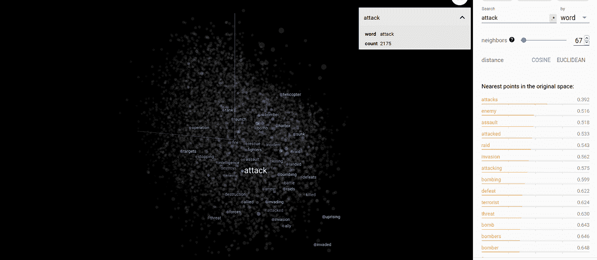
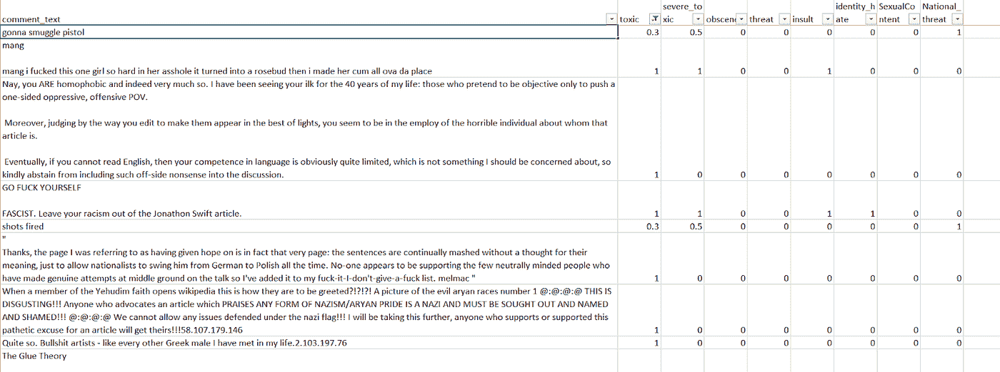
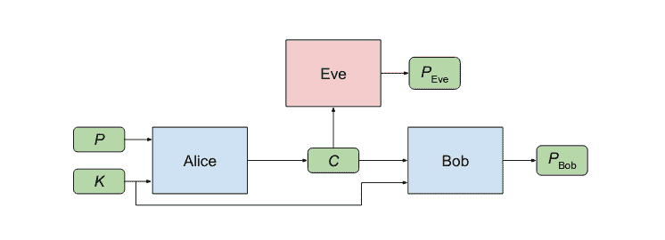
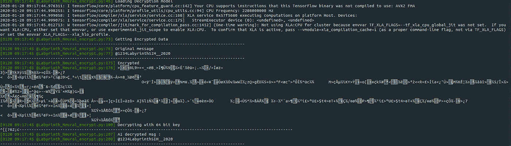
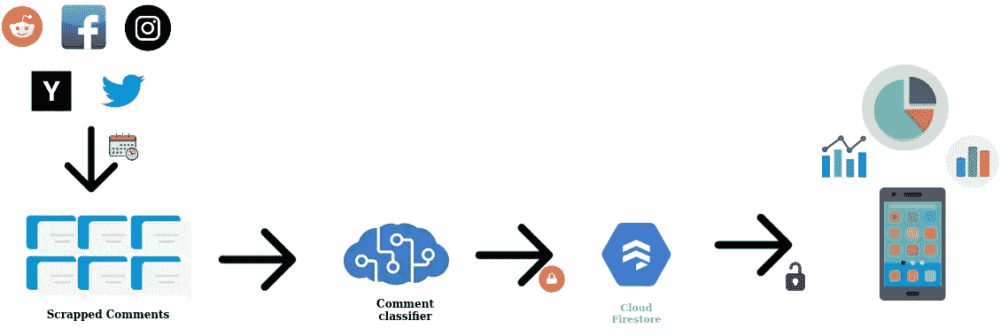
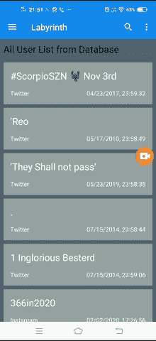

# 对付网络犯罪的攻击性帖子分类器

> 原文：<https://medium.com/analytics-vidhya/offensive-posts-classifier-for-cyber-crime-prevention-55d6421a6e4?source=collection_archive---------9----------------------->


**什么是网络犯罪？**

使用公共领域或匿名洋葱网站参与非法目的，如实施欺诈、贩卖儿童色情和知识产权、[窃取身份](https://www.britannica.com/topic/identity-theft)或侵犯隐私，可归入网络犯罪。自社交媒体发展以来，儿童、妇女、少数民族和弱势群体一直是网络欺凌和骚扰的目标。社交网络如此庞大且相互关联，这对试图监控社交媒体以防止此类网络犯罪的政府当局构成了巨大挑战。

**网络犯罪事件较少:**

1.  2019 年 10 月 14 日，K-pop 明星 Sulli，前乐队 f(x)成员，因极端网络虐待去世，年仅 25 岁。报道称，她死前在社交媒体上说了“再见”。
2.  2017 年 11 月，喀拉拉医科大学的一名学生因对脸书教发表过多的有毒评论而结束了自己的生命
3.  几个极端主义团体在社交媒体团体的帮助下，在各国招募数千名年轻和弱势青年。

我们的目标是什么？

*   我们的目标是建立一个攻击性帖子分类器，以应对专门涉及社交媒体网站的网络犯罪，包括但不限于**脸书、Twitter、Instagram、Reddit 和黑客新闻**。

**从社交媒体领域构建评论抓取器:**

首先，我们必须从公共领域的社交媒体对话中找出罪犯。但正如我们所知，网站防止数据抓取有许多层的预防措施，如 IP 地址匹配，HTTP 头检查，网站从你登陆等等。毫无疑问，开发者 API 是在有限的请求数量下抓取数据的合适方式，因为它不会被网站屏蔽。然而，要构建一个能以频繁的周期间隔搜索网络罪犯和罪犯的产品，开发者 API 并不是一个理想的解决方案。我们发现一种有效的刮削方法是定期进行 HTTPS 刮削。我们使用请求构建了一个刮刀。

为了防止刮域限制数量的请求，一个 IP 地址可以在一个小时。一般来说，每分钟可以发出大约 600 个请求。一旦超过这一限制，IP 地址就会被封锁一段固定的时间。这是一个巨大的挑战，并可能再次导致低刮擦速度。为了克服这一点，我们使用了上述代理旋转技术。HTTP 请求通过代理服务器传递，一旦请求数量接近极限，代理地址就会自动改变。这使得刮削可以继续进行而不会出现任何问题。使用这种代理轮换技术，我们能够获得高达每分钟 30000 个帖子的高抓取率。使用这种技术，我们从不同的社交媒体领域收集了大约 30 万条评论。

```
import urllib.request as urimport jsonfrom bs4 import BeautifulSoupurl = "https://www.reddit.com/r/"+keyword+"/.json?sort=top&t=all"req = ur.Request(url, headers=hdr)response = ur.urlopen(req).read()json_data = json.loads(response.decode('utf-8'))
```

**代理轮换技术:**

从 www.sslproxies.org[获取代理名单](http://www.sslproxies.org)

```
def get_proxy(): proxies_req = Request(‘https://www.sslproxies.org/',headers = hdr) proxies_doc = urlopen(proxies_req).read().decode(‘utf8’) soup = BeautifulSoup(proxies_doc, ‘html.parser’) proxies_table = soup.find(id=’proxylisttable’)

    proxies = [] for row in proxies_table.tbody.find_all(‘tr’): proxies.append({

        ‘ip’: row.find_all(‘td’)[0].string, ‘port’: row.find_all(‘td’)[1].string }) return proxies 
```

在收集了免费代理的列表后，我们可以用下面的代码行设置代理

```
Proxy = get_proxy()for proxy in Proxy: req = urllib.Request(url, headers=hdr) req.set_proxy(proxy[‘ip’] + ‘:’ + proxy[‘port’], ‘http’)#setting up proxy # do your operation
```

**建立自然语言处理分类器模型:**

既然我们已经收集了来自不同社交媒体领域的评论，那么标记不适当的评论就变得至关重要。我们知道，传统的基于关键字的算法根据文本中特定单词或短语的存在来预测这些内容的存在。这可能是非常不准确的，并且有几次出现错误警报的机会。例如，假设有两条推文

> “明天会有很多炸弹爆炸”和“明天是排灯节，会有很多鞭炮爆炸”。

与人类不同，基于关键词的算法不够复杂，不足以发现差异。手动分析每天发布的数十亿条评论是不务实的。随着对理解具有预训练嵌入的句子的上下文的大量研究，例如 GLOVE、ELMO、Word2vec 等，这种困境可以被回避。

我们训练了一个基于 LSTM 的语言分类器模型，该模型具有预训练的嵌入，以对文本的八个参数进行评分，如**国家威胁、身份仇恨、威胁、有毒、侮辱、性内容、严重有毒**和**淫秽**。由于模型考虑了文本的上下文，因此评分精度更好。这也有助于减少错误警报。



[Word2vec](http://projector.tensorflow.org/) ，余弦相似词**用其他相似词攻击**

为了训练语料库，我们从网上搜集了 3L 的帖子，并对数据进行了标注。我们使用这些训练语料来建立自然语言理解模型。一旦用数据集训练了模型，它就被部署来对帖子进行分类/评分。



样本培训记录

**推论:**

收集的公共领域对话通过自然语言理解模型和帖子的元数据(违规者的姓名、评论时间、位置(如果提供的话)、评论链接)进行处理，分数作为 JSON 文档被推送到 Firebase。默认情况下，此过程每 6 小时定期执行一次，或者由服务器管理员手动触发。

**管理数据机密性**

我们正在处理极其敏感的信息。有强烈的隐私问题，这些数据可能会被滥用。如果有人因数据库漏洞而访问数据库，这很可能成为现实。因此，出于保密目的，我们使用了基于人工智能的加密模型来加密数据，然后再推送到云上。



来源:学习用对抗性神经加密技术保护通信(谷歌大脑)

我们使用了谷歌的神经加密技术，其中三个神经网络相互对抗地学习保护敏感数据。我们训练了两个模型——加密模型和解密模型。加密模型部署在服务器端，解密模型(一旦转换为 TensorFlow lite 模型)部署在客户端 android 应用程序上。



客户端应用程序正在下载的数据可以被解密和使用。

*对于后端，有大量内存的高端机器更好。*



工作流程

**用户交互客户端应用**

这个应用程序携带极其敏感的信息，因此只有少数人可以访问(只有政府或警察局当局)。这个应用程序配备了由 Google Firebase 提供的用户认证服务，因此只有授权用户才能使用这个应用程序。在应用程序中，我们将访问云数据库，检索帖子，使用人工智能算法解密，然后可视化它们。

现在有了这么庞大的数据，可以进行大量的数据分析。我们已经实施的一些分析包括根据特定参数的分数过滤帖子，每个域的平均分数和每个域中标记帖子的数量等。



开发的应用程序提供了多种潜在的实际应用。该产品的一些可能用途如下:

*   保护儿童、青少年、妇女和代表性不足的少数民族免受网络掠夺者的侵害。
*   识别宣传激进活动的帖子或评论，并帮助阻止它们。
*   持续监控社交网站上的敏感话题，防范可能的网络犯罪。
*   识别恶意威胁和意图，防止不良事件。
*   识别鼓吹自残的内容并举报。

**数据访问**

要访问带注释的培训数据语料库，请随意填写此[表格](https://forms.gle/J4ZaAugjZa455pBf6)。

[联系我们](https://www.linkedin.com/in/venkatesh-m-s-1aa916161/)了解关于此应用的任何疑问和说明。

**参考文献:**

李，s，2018。 ***递归神经网络在毒性评论分类中的应用*** (博士论文，加州大学洛杉矶分校)。

阿巴迪博士和安德森博士，2016 年。**学习用对抗性神经密码术保护通信**。 *arXiv 预印本 arXiv:1610.06918* 。

**致谢:**

感谢我的团队成员 **-** [**罗凯什·库马尔、**](https://www.linkedin.com/in/rokesh-kumar-710166162/) [**【苏亚·库马尔、**](https://www.linkedin.com/in/surya-kumaran-sainath-307356163/) [**里蒂卡·穆贡丹、**](https://www.linkedin.com/in/ritika-mugundan-4918141a0/) [**萨克提韦兰、**](https://www.linkedin.com/in/sakthivelan009/) [**沙伊克·阿夫纳安·梅赫拉吉**](https://www.linkedin.com/in/shaik-afnaan-mehraj-5ab712105/) 为构建这个解决方案付出的巨大努力