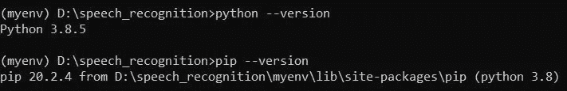
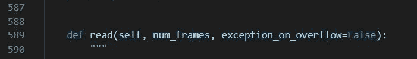

# Vosk 让离线语音识别变得简单

> 原文：<https://medium.com/analytics-vidhya/offline-speech-recognition-made-easy-with-vosk-c61f7b720215?source=collection_archive---------0----------------------->


图片来自 Berleburg 在 Outlook 中的语音识别，2019 年 12 月 19 日

语音识别是人工智能的众多应用之一，可以用于各种日常项目中，以增强其可访问性。谷歌的助手和亚马逊的 Alexa 在少数最受欢迎的语音识别应用中名列榜首。但是，它们有一个问题:它们的语音识别 API 只能通过互联网获得，没有互联网连接就无法访问。这一切都很好，因为语音识别最突出的用途是在家用技术中，在这个“在线时代”(2020 年更是如此)，很难找到一个没有互联网连接的家庭。但是，如果您想在脱机环境中使用语音识别，该怎么办呢？幸运的是，我们有现成的解决方案，并且不需要您付出太多努力！

# ***我们来介绍一下***

Vosk 是一个开源的免费 Python 工具包，用于离线语音识别。它支持 16 种语言的语音识别，包括英语、印度英语、法语、西班牙语、葡萄牙语、中文、俄语、土耳其语、越南语、意大利语、荷兰语、阿拉伯语、希腊语，最近还增加了德语、加泰罗尼亚语和波斯语。

由于 Vosk API 支持多种语言，我们为每种语言都提供了模型。这些是小型型号(每个 50 MB)，但您也可以找到更大的服务器型号。这些模型具有多种特性，如说话者识别、流式 API 和可重新配置的词汇表。

该工具包的另一个重要特性是它可用于各种平台，包括使用 Python、Java、C#、节点绑定的桌面服务器以及轻量级设备，如 Android、iOS 和 Raspberry Pi。因此，你可以用它来录制视频，也可以用它来制作家用技术和聊天机器人。

在我们开始之前，*重要的是*要注意语音识别工具的准确性还没有完善，因此结果有时会出乎意料。但是您仍然可以依靠 Vosk 在语音识别方面提供相当好的准确度。如果没有，您可以修改模型以更好地与您的系统一起工作。

工具箱说得够多了，是时候说到做到了。

# ***安装 Vosk***

安装 Vosk 最简单的方法是使用 pip 命令。但在此之前，建议设置一个虚拟环境来解决依赖关系——当您使用不同版本的 Python 时，这肯定不是必需的，但却是一个很好的实践。

虚拟环境可以通过三个步骤来设置和激活:

安装 virtualenv 软件包

```
pip install virtualenv
```

创建虚拟环境

```
virtualenv myenv
```

激活虚拟环境

```
myenv\Scripts\activate                       //for windows
myenv\bin\activate                           //for linux
```

一旦建立并激活了虚拟环境，下一步就是检查虚拟环境中的 Python 是否满足以下依赖性要求:

Python 版本:3.5–3.8(Linux)，3.6–3.7(ARM)，3.8 (OSX)，3.8–64 位(Windows)

pip 版本:19.0 及更新版本。



接下来，您可以继续使用 pip 命令安装 Vosk:

```
pip install vosk
```

Vosk API 现在应该已经安装在您的系统上了。如果您遇到任何错误，请确保 Python 版本与需求中提到的版本相同。

# ***与沃斯克一起工作***

现在我们已经完成了安装过程，是时候看看如何使用它了！随着虚拟环境的创建和激活，以及 Vosk API 在 virtualenv 中的安全安装，下一步是在根文件夹中克隆 [Vosk Github 库](https://github.com/alphacep/vosk-api)。你可以在这里找到如何克隆 Github 库[。](https://docs.github.com/en/free-pro-team@latest/github/creating-cloning-and-archiving-repositories/cloning-a-repository)

之后，您需要一个模型来使用您的 API。您可以根据您选择的语言(最常见的选择是 vosk-model-en-us-aspire-0.2)从[这里](https://alphacephei.com/vosk/models)安装一个模型，或者您可以训练自己的模型。

下载模型并将其复制到**vosk-API \ python \ example**文件夹中。

现在，让我们开始工作吧！

***使用麦克风进行语音识别***

没有 PyAudio 模块，通过麦克风的语音识别无法工作。因此，您必须再次使用 pip 命令来安装它。

```
pip install pyaudio
```

告诉你一个秘密。当您使用 Python 3.7 或更高版本时，使用 pip 安装 PyAudio 在 Windows 上不起作用，您可以按照本指南[在您的系统上成功安装 PyAudio。](https://stackoverflow.com/questions/52283840/i-cant-install-pyaudio-on-windows-how-to-solve-error-microsoft-visual-c-14/52284344#52284344)

开始麦克风测试前，只需再做一步。转到**myenv \ Lib \ site-packages**文件夹，找到 pyaudio.py 文件。修改它，使 read 函数中的 exception_on_overflow 参数设置为‘False’(如果它最初设置为 True)。



现在，让我们运行 microphone_test.py 文件。通过终端导航到**vosk-API \ python \ example**文件夹，执行**“test _ microphone . py”**文件。

```
python test_microphone.py
```

当你对着麦克风说话时，你会看到语音识别器对出现在你的终端窗口上的转录单词施展魔法。

***使用. mp4 文件进行语音识别***

如果你想使用 Vosk 来转录一个. mp4 视频文件，你可以按照这一节来做。您所需要的只是一个用于语音识别的示例视频和用于通过命令行界面处理多媒体文件的 FFmpeg 包。

你可以很容易地在互联网上找到任何样本. mp4 视频文件，或者你可以录制一个你自己的。

FFmpeg 包可以通过[这个](https://ffmpeg.org/download.html#build-windows)链接下载。

一旦这两个要求都得到满足，你就可以把你的视频放在 **vosk-api\python\example** 文件夹中，并在下载的 FFmpeg 包的 bin 文件夹中寻找 ffmpeg.exe 文件，你必须把它放在和你的视频相同的文件夹中，即 **vosk-api\python\example** 文件夹。

现在，您可以通过执行**“test _ ffmpeg . py”**文件，使用视频文件启动语音识别。

```
python test_ffmpeg.py sample.mp4
```

可以在终端窗口上看到视频的语音转换。

这是一些可以使用 Vosk 进行离线语音识别的方法。您可以使用这个工具包做更多的事情，您可以在 Vosk 的[文档](https://alphacephei.com/vosk/)中获得帮助。API 仍在不断更新，每次更新都会添加更多功能，这将提高语音识别的准确性以及 API 的集成选项。