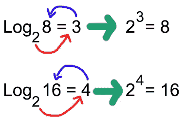

# 哦大 O！(第一部分)

> 原文：<https://medium.com/analytics-vidhya/oh-big-o-part-1-490f4c52afe?source=collection_archive---------28----------------------->

嗨！👋我是**苏西**，你可以在这里找到一点关于我的[！](/@suzy.nakayama/59-days-to-become-a-full-stack-developer-e4f1d94b3c94?source=friends_link&sk=7a2be54c6e5f46c4bd1d03219880a95b)

作为一个去过训练营的人，我被简要地介绍给大 O 和它的重要性。老实说，不，我当时不明白它的真正重要性。两个人都不明白为什么我会停止我的编码进程去学习大 O 符号、数据结构和算法。

训练营结束两周后，我得到了第一次面试机会，安排在下周。我决定做任何人都会做的事情:在 glassdoor 上查看公司的面试问题！🤣

“哦，不！算法！数据结构！**大魔神**！”

“好吧，我有一周的时间来学这个！我完全可以做到这一点，对不对？”🤪

我在想什么？！Lol！不，一周不够。那次面试我没有通过，但我终于开始明白大 O 是什么意思了！你知道吗？！没那么难！所以，我会尽力给你解释，希望，你能通过面试！但如果你没有，没关系，那不是给你的。你的东西是保留的！🤞🏼

要了解大 O 的重要性，你需要知道好代码 的 ***规则:***

1- **可读**代码:请不要命名为“a”、“b”、“c”的变量！

2- **可伸缩**代码:大 O 符号来到现场的地方。在以下方面:

a) **空间**:我们说的是**内存**，你用了多少空间。

b) **速度**:我们说的是**时间**，评估需要多长时间。

> 这就是为什么我们关心大 O 符号。这是**计算** **我们的代码占用**多少空间和时间的一种方式。

好的，在我们开始谈论大 O 的类型之前，我们需要知道更多的规则:

1-我们不**而**关心**常量**，因为当我们将它们与大的输入大小比较时，它们是微不足道的。《出埃及记》

```
Big O(50n) ==> drop the constant (50) ==> Big O(n)
```

2-特别是在面试中，我们关心最坏的情况。这意味着这种情况下最差的大 O 符号。

3-我们必须检查**时间**和**空间**的大 O 符号。它们不一定是相同的。


照片由[爱丽丝·帕斯夸尔](https://unsplash.com/@stri_khedonia?utm_source=unsplash&utm_medium=referral&utm_content=creditCopyText)在 [Unsplash](/images/food/donut?utm_source=unsplash&utm_medium=referral&utm_content=creditCopyText) 上拍摄

好了，现在我们可以开始探索大 O 符号世界了…

# **阿大①**=>**常数😍**

意味着我们的代码只占用一定的时间/空间，输入有多大无关紧要。

```
const instant = (num1, num2) => num1 + num2;// ORconst instant = arr => {
    for (let i = 0; i < 5; i++) {
        console.log(arr[i] + i);
    }
}// Note: in the second example, it doesn't matter the size of the array or if we have a for loop because we are only going to loop 5 times, which would be Big O(5) ==> Big O(5*1) ==> drop the constant ==> Big O(1)
```

# **大 O(logn)** = > **对数**🤩

为了理解这一点，我们需要在 Log 上刷新我们的数学课。在这种情况下， **Log base 2** 。让我们看两个例子:

```
Log 8 is 3, because 2 to the power of 3 equals 8\. Log 16 is 4, because 2 to the power of 4 equals 16.So we can deduct: Log(n) = y, because 2^y = n
```



我对日志的“美丽”解释！

注意，当我们的输入大小加倍时(log 8，log 16，…)，我们实际上只增加了一个操作。

**提示**:当你看到一个函数一直切一半，一般是大 O(logn)，或者至少是这部分函数。😜《出埃及记》二分搜索法。

```
const binarySearch = (sortedArr, target) => {
    let start = 0;
    let end = sortedArr.length - 1;
    while (start <= end) {
        let mid = Math.floor((start + end) / 2);
        if (sortedArr[mid] === target) return true;
        else if (sortedArr[mid] < target) start = mid + 1;
        else end = mid - 1;
    }
    return false;
}
```

# **大 O(n)** = > **线性**😕

这意味着运算量**随着输入量**的增加而线性增加。换句话说，它成比例地增长**，随着元素数量的增加(n)，操作的数量也增加。**

```
A good example is 1 for loor through the input elements:const linear = arr => {
    for (let num or arr) {
        console.log(num);
    }
}**Note**: if we have 5 numbers in the array, we will log 5 times, one for each. Same thing happens if we have 1 billion numbers in the array, we will log 1 billion times. So, our number of operations increases proportionally with the size of our input.
```

****注释**:**

1.  **如果你有 2 个 for 循环，而且是在同一层，没有嵌套，还是大 O(n)。《出埃及记》**

```
const linear = arr => {
    for (let num of arr) {
        console.log(num);
    }
    for (let num of arr) {
        console.log(num * 2);
    }
}
```

**2.如果有 2 个 for 循环，但每个循环都经过**不同的输入**，那么它将是大 O(n + m)，其中‘n’是第一个输入的大小，而‘m’是第二个输入的大小。《出埃及记》**

```
const linear = (arr1, arr2) => {
    for (let num1 of arr1) {
        console.log(num1);
    }
    for (let num2 of arr2) {
        console.log(num2);
    }
}
```

**这是第一部分的家伙！让我们的大脑稍微休息一下，我将很快发布第二部分。我希望你们喜欢这个大 O 符号的介绍，如果你有任何疑问，任何建设性的反馈，或者如果我写错了什么，请留下评论！毕竟，我们应该总是**学习新东西**和**更新我们的知识**！**

# **再见！👋**