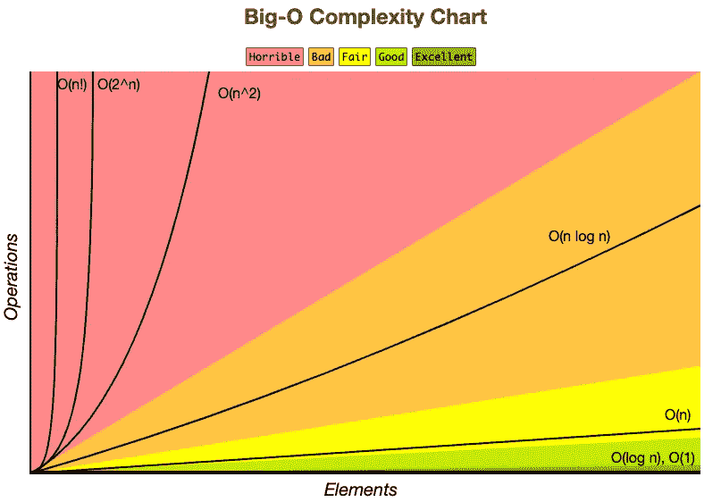

# 哦大 O！(第二部分)

> 原文：<https://medium.com/analytics-vidhya/oh-big-o-part-2-3017fb7c8041?source=collection_archive---------30----------------------->

## 嗨！👋我是**苏西**，你可以在这里找到一点关于我的[！](/@suzy.nakayama/59-days-to-become-a-full-stack-developer-e4f1d94b3c94?source=friends_link&sk=7a2be54c6e5f46c4bd1d03219880a95b)

布兰妮·斯皮尔斯——哦 gif 来自 Giphy

又见面了！这是大 O 系列的第 2 部分！如果你没有看到第一部分，请查看这里的[](/@suzy.nakayama/oh-big-o-part-1-490f4c52afe)**！**

**到目前为止，我们已经了解了什么是以及为什么我们使用大 O 符号。我们还学习了大 O 的规则和前 3 种大 O(线性、对数和常数)。现在让我们继续探索其他一些最常用的类型…**

**Renata Sorrah——Giphy 的数学小姐 gif**

****大 O(n )** = > **二次/平方/多项式**😣**

**顾名思义，对于我们添加到输入中的每个新项目，时间**与指数**(通常为 2)成比例增加。因此，大 O 将与输入的指数成正比。**

**这种类型有不同的指数变化，比如 2、3、4、5……每一种都增加了一层额外的复杂性。**

```
// Ex. when we have 2 for loops nested:const squared = arr => {
    arr.forEach(item => {
        arr.forEach(letter => {
             console.log(letter)
        })
    })
}
```

****注**:如果你有 2 个 for 循环，但是每一个都要经过不同的输入，那就大 O(n * m)，其中‘n’是第一个输入的大小，‘m’是第二个输入的大小。**

```
const squared = (arr1, arr2) => {
    arr1.forEach(item => {
        arr2.forEach(letter => {
             console.log(item, letter)
        })
    })
}
```

****大 O(2^n)** = > **指数**😫**

**在这种情况下，对于添加到输入中的每个新项目/数字，算法的迭代次数将使**的大小加倍**。**

**《出埃及记》2⁵ = 32 → 2⁶ = 64 → 2⁷ = 128**

**最著名的例子是递归斐波纳契数列，其中，对于每个数字，我们运行函数两次。**

```
const fib = num => {
    if (num === 0 || num === 1) {
        return num
    } else {
        return fib(num - 1) + fib(num - 2)
    }
}
```

****大 O(n！)** = > **阶乘**😵**

**他们中最差的。您为正在迭代的每个元素添加一个嵌套循环。一些例子是使用蛮力的*旅行推销员*问题和*排列*问题。**

**比尔·普尔曼 Giphy 提供的独立日 gif**

**就这样，伙计们！我们设法从大 O 符号中幸存下来！💪**

**你们中的大多数人都知道这个伟大的网站，Big O CheatSheet，它可以直观地显示大 O 之间的差异，但是，以防万一你不知道，请查看这里的。**

****

**来自大 O CheatSheet 的大 O 图表**

**另外，如果你有兴趣看更多的例子，**请继续关注**下周的文章！**

# **再见！👋**