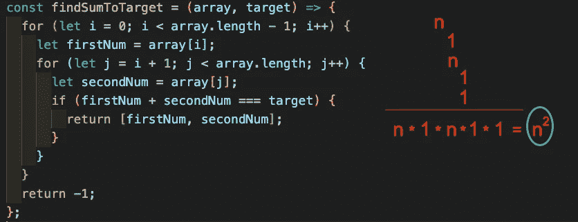
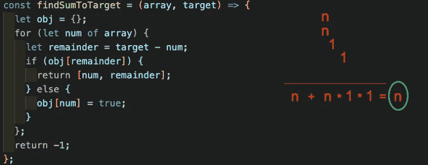

# 哦大 O！(第三部分)

> 原文：<https://medium.com/analytics-vidhya/oh-big-o-part-3-5e3ccee2097?source=collection_archive---------22----------------------->

## 嗨！👋我是苏西，你可以在这里找到一些关于我的信息。

露西尔·鲍尔——我爱 Giphy 的露西·吉夫

又见面了！这是大 O 系列的第 3 部分！如果你没有看到第 1 和第 2 部分，请查看这里的[](/@suzy.nakayama/oh-big-o-part-1-490f4c52afe)****和这里的[](/@suzy.nakayama/oh-big-o-part-2-3017fb7c8041)**！👀******

******今天我们要测试一下我们的知识！我们将一起解决一个问题并找出大 O。让我们解决这个问题！💪******

******吉娜·罗德里格兹 Giphy 的处女 gif******

## ******给你一个包含整数和目标数的数组。如果数组中的两个数字相加得到目标数字，则返回包含这些数字的数组。否则，返回-1。******

```
****const array = [1, 3, 6, 0, 12, -1]
const target = 5const findSumToTarget = (array, target) => {
    // OUR CODE HERE
}****
```

******好了，让我们来看看这个问题:🤓******

*   ******我们有一个包含数字和目标的数组。******
*   ******我们需要迭代数组，并找出是否有一对总和达到目标。******
*   ******如果是，我们需要把它们放在一个数组中并返回它。******
*   ******如果不是，我们需要返回-1。******

******一些可供考虑的选项:******

```
****1️⃣ Two for loops (naive, brute force):const findSumToTarget = (array, target) => {
    for (let i = 0; i < array.length - 1; i++) {          
        let firstNum = array[i];                           
        for (let j = i + 1; j < array.length; j++) {        
            let secondNum = array[j];                         
            if (firstNum + secondNum === target) {            
                return [firstNum, secondNum];         
            };                                  
        };
    };
    return -1;
};****
```

******因此，上述方法将具有**大 O(n)时间和大 O(1)空间**。但是为什么呢？嗯，我们有 1 个 for 循环遍历数组长度(应该是 **n** )，在这个循环内部，我们有另一个循环再次遍历整个数组(另一个 **n** )，其余的函数在恒定时间内运行。******

********

****求和那个大 O！****

```
**2️⃣ Hash Table and 1 for loop:const findSumToTarget = (array, target) => {
    let obj = {};
    for (let num of array) {
        let remainder = target - num;
        if (obj[remainder]) {
            return [num, remainder];
        } else {
            obj[num] = true;
        };
    };
    return -1;
};**
```

****这种方法有一个更好的**大 O 符号表示**时间**，但是有一个更差的**大 O 符号表示**空间**。**大 O (n)时空**。在本例中，我们创建了一个对象，并将每个数字放入该对象中(在 else 语句中)。然后，我们将使用 for 循环遍历数组，并通过将目标数减去当前数来检查余数是多少。然后我们将检查对象是否包含余数。********



再总结一下吧！

```
3️⃣ Sort and 1 while loop:const findSumToTarget = (array, target) => {
    array.sort((a, b) => a - b);
    let start = 0;
    let end = array.length - 1;
    while (start < end) {
        let sum = array[start] + array[end];
        if (sum === target) {
            return [array[start], array[end]];
        } else if (sum < target) {
            start++;
        } else {fi
            end--;
        }
    }
    return -1;
}
```

在这种方法中，我们有一个大的 O (n log n)时间和大的 O(1)空间。在面试中排序通常被认为是一个很大的时间。而 while 循环将是大 O (n)，其和为 **n log n** ，将得到 **2n log n** 。然而，我们删除了常数，这将导致一个大的 O (n log n)。而且，因为我们不再创建一个数据结构来保存数组中的所有项目，所以空间回到了大 O(1)。


你猜怎么着？求和，求和，求和！

伙计们，就是这样！我们做到了！我们终于完成了大 O 系列！🥳

我希望你现在能更好地理解，并享受这次旅程！

**非常感谢您阅读本系列，希望在以后的文章中再次见到您！**

# 再见！👋