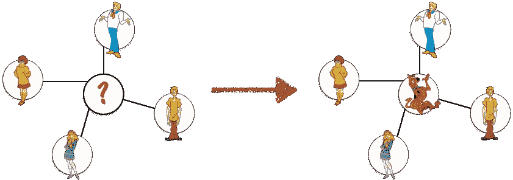
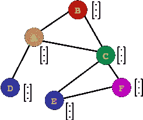
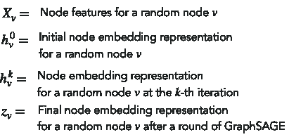
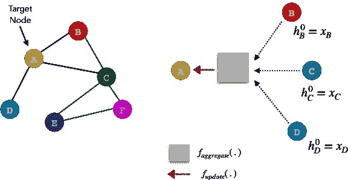
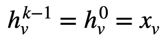
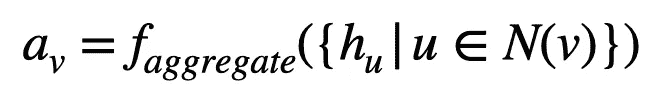
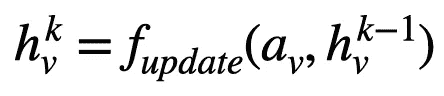
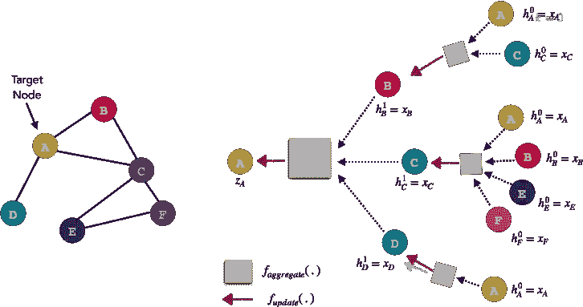
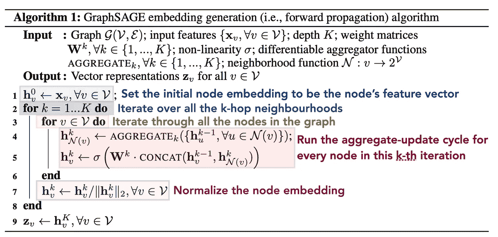
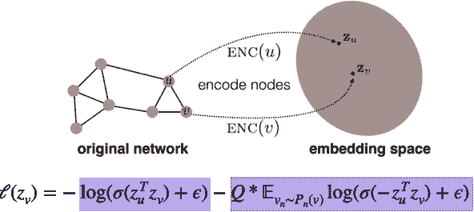

# OhMyGraphs: GraphSAGE 和归纳表示学习

> 原文：<https://medium.com/analytics-vidhya/ohmygraphs-graphsage-and-inductive-representation-learning-ea26d2835331?source=collection_archive---------1----------------------->

他的文章假设你对图及其在图神经网络中的作用有所了解。这是我遇到的一系列很酷的图形神经网络/图形表示学习论文中的第一篇！

# 什么是 GraphSAGE？

[GraphSAGE](https://arxiv.org/abs/1706.02216) [1]是一种迭代算法，学习某个图中每个节点的图嵌入。GraphSAGE 的新颖之处在于，它是第一个以无人监管的方式创建归纳节点嵌入的作品！就像在 NLP 中一样，创建嵌入对于下游任务非常有用。GNNs 可以将节点嵌入用于各种任务，包括节点分类、链路预测、社区检测、网络分析等。

**对 GraphSAGE 的需求:**

在 GraphSAGE 之前，大多数节点嵌入模型都是基于谱分解/矩阵分解方法的。

问题？矩阵分解方法有**固有*直推*** ！简而言之，直推式方法在从未见过的数据上表现不佳。也就是说，这些方法期望整个图结构在列车运行时出现，以生成节点嵌入。如果稍后有新的节点添加到图中，则必须重新训练模型。

相反，归纳方法可以推广到看不见的数据——显然更有用，对吗？让我们深入了解 GraphSAGE 背后的直觉。

# GraphSAGE 背后的主要思想是:

> 你被你的朋友所知。

在上图中，如果你是一个 90 年代的孩子，你很容易猜出弗雷德、维尔玛、达芙妮和沙吉都和谁有关系。如果你猜是 Scooby，那是因为你意识到无论中间节点是谁，都必须与所有相邻节点有关系。你在脑子里秘密做的是，你根据史酷比节点的相邻节点来近似表示它！

# 真正的文法

GraphSAGE 的目标是基于其相邻节点的某种组合来学习每个节点的表示，由 **h** 参数化。

回想一下，每个节点都可以有自己的特征向量，该向量由 **X** 参数化。现在让我们假设每个节点的所有特征向量大小相同。一层 GraphSAGE 可以运行 **k** 次迭代，因此，在每次 **k** 次迭代中，每个节点都有一个节点表示 **h** 。

请注意以下符号:

因为每个节点都可以由它们的邻居来定义，所以节点 A 的嵌入可以由它的邻居节点嵌入向量的某种组合来表示。通过一轮 GraphSAGE 算法，我们将获得节点 a 的新表示。原始图中的所有节点都遵循相同的过程。

GraphSAGE 算法遵循两步过程。因为它是迭代的，所以有一个初始化步骤，将所有初始节点嵌入向量设置为它们的特征向量。( **k** 将从 **1…K** 开始迭代)

1.  **聚合。**

聚合目标节点的相邻节点表示。 **f_aggregate** 函数是任何可微分函数的占位符。这可以像平均函数一样简单，也可以像神经网络一样复杂。下面的等式转化为:

> 聚集在我的目标节点节点 **v** 的*直接*邻域中的所有节点 **u** 的所有嵌入向量。这导致节点 **v** 的聚集节点表示为 **a_v:**

2.**更新。**

在基于其邻居获得节点 **v** 的聚集表示之后，使用其先前表示和聚集表示的组合来更新当前节点 **v** 。 **f_update** 函数是任何可微分函数的占位符，它可以像平均函数一样简单，也可以像神经网络一样复杂。

下面的等式转化为:

> 基于节点 **v** 的邻域聚合表示和节点 **v** 的先前表示，为节点**v**创建更新的表示:

现在，GraphSAGE 背后的基础包括聚合和更新节点表示——但是这个 **k** 超参数呢？k 参数告诉算法使用多少个*邻域或多少跳*来计算节点 **v** 的表示。

为了说明这一点，请观察下图。我们不需要将节点 B 的表示初始化为它的特征向量，实际上我们可以运行这个聚合更新函数来获得节点 B 基于其邻居的表示。我们可以对 **k=1** 层中的节点 C 和 D 进行同样的操作。在 k=0 层，我们将初始化嵌入到其初始特征向量的邻居节点。

在上面的例子中，我们简单地设置 **k** =2，并使用节点 A 的邻居和邻居来获得最终的目标节点表示。你可以尝试使用多个邻域，例如，更大的 T2 k T3 值。然而，太多的邻域可能会稀释节点 **v** 的节点表示，但是太少(少于 2 个)可能类似于不使用 GNNs，而只使用 MLP——值得思考！

太好了！所以现在，我们应该没有问题理解原始论文中的以下算法:

关于本文的实现，需要注意以下几点:

*   **第 4 行:**作者试验了各种聚合函数，包括使用最大池、平均聚合甚至 LSTM 聚合。LSTM 聚合方法要求每 k 次迭代对节点进行洗牌，以便在计算聚合时不会暂时偏向任何一个节点。
*   **第四行:**我们概括为 **f_aggregate** 的，在文中实际上表示为 **AGGREGATE_k** 。
*   **第 5 行:**文中的 **f_update** 函数是一个串联操作。因此，在连接之后，输出的形状是多维的 *(2F，1)* 。级联的输出通过与权重矩阵 **W^k** 的矩阵乘法进行变换。该权重矩阵旨在将输出的维度减少到 *(F，1)* 。最后，连接和变换的节点嵌入向量经历非线性。
*   **第 5 行:**每个 k 次迭代有一个单独的权重矩阵。这具有对学习权重的解释，学习权重知道多个邻域对目标节点有多重要。
*   **第 7 行:**节点嵌入通过除以向量范数进行归一化，防止梯度爆炸。

# 无监督损失函数

那么，一个人如何训练一个笔迹学家 GNN 呢？

作者训练了无监督和有监督的 GraphSAGE 模型。监督设置遵循节点分类任务的常规交叉熵风格预测。然而，无监督的情况试图通过实施以下损失函数来保持图形结构:

损失函数的蓝色部分试图强调如果节点 **u** 和 **v** 在实际的图中是接近的，那么它们的节点嵌入应该是语义相似的。在完美的场景中，我们期望 **z_u** 和 **z_v** 的内积是一个大数。这个大数的 sigmoid 被推向 1，log(1) = 0。

损失函数的粉色部分试图执行相反的情况！也就是说，如果节点 **u** 和 **v** 在实际的图中实际上很远，我们期望它们的节点嵌入是不同的/相反的。在完美的场景中，我们期望 **z_u** 和 **z_v** 的内积是一个大的负数。这可以解释为，嵌入 **z_u** 和 **z_v** 相差如此之大，以至于相差大于 90 度。两个大负数的乘积变成一个大正数。这个大数的 sigmoid 被推向 1，log(1) = 0。由于在图中可能有更多的节点 **u** 远离我们的目标节点 **v** ，我们只从远离节点 **v** : **P_n(v)** 的节点分布中抽取几个负节点 **u** 。这确保了训练时损失函数是平衡的。

epsilon 的加入确保了我们永远不会取 log(0)。

# TL，DR: GraphSAGE

GraphSAGE 是一种聚合给定目标节点的相邻节点嵌入的方法。一轮 GraphSAGE 的输出包括为图中的每个节点找到新的节点表示。GraphSAGE 的几个堆叠层可以为任何下游任务创建复杂的、结构化的和语义级的特性！

在以后的文章中，我将为简单的任务实现 GraphSAGE，比如节点分类。敬请期待！

# **参考文献**:

[1][http://snap.stanford.edu/graphsage/](http://snap.stanford.edu/graphsage/)