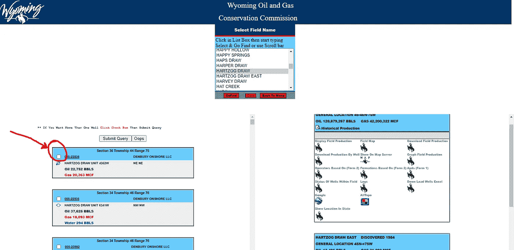
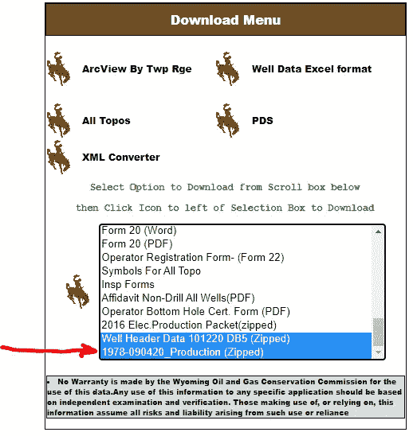
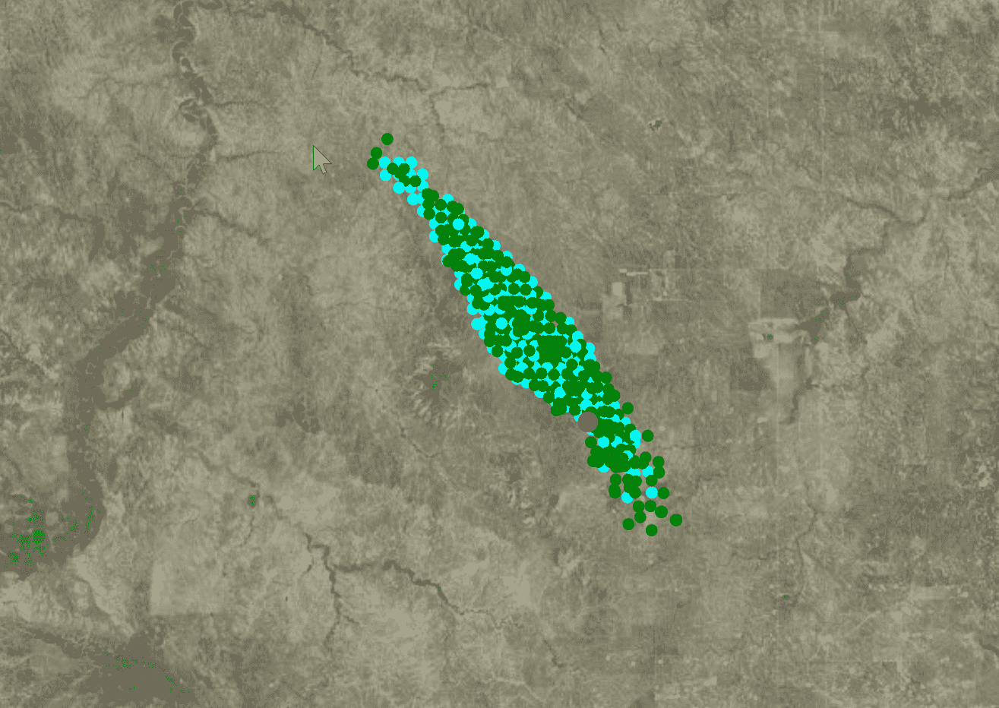
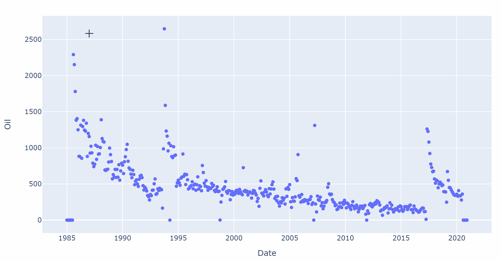
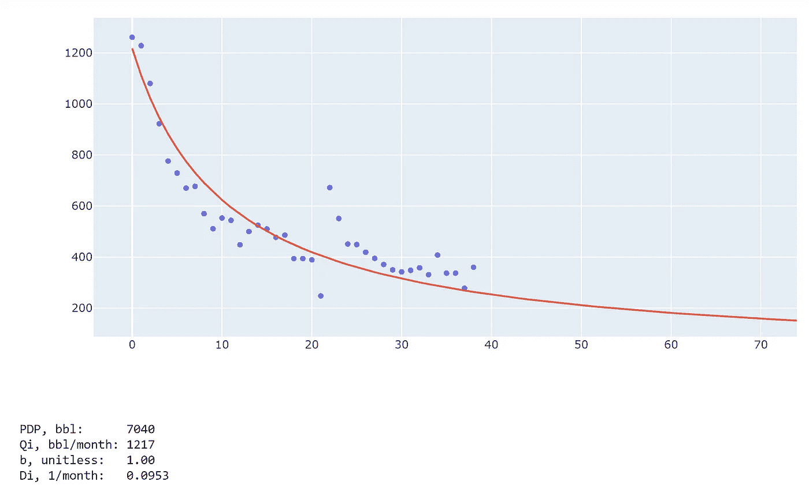
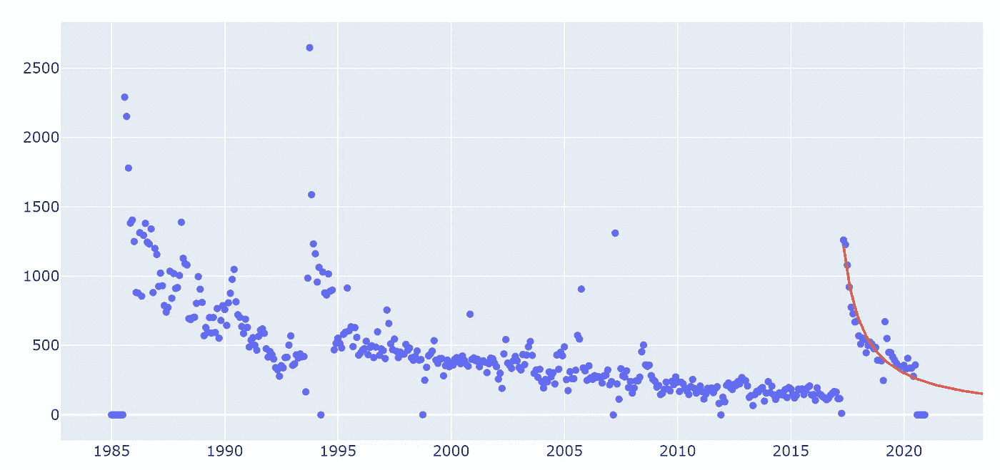
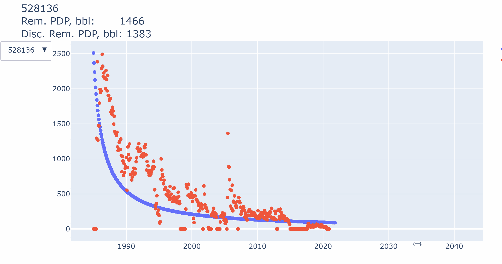

# 油田数据分析:提取、转换、加载(ETL)和递减曲线分析(DCA)

> 原文：<https://medium.com/analytics-vidhya/oilfield-data-analytics-extract-transform-load-etl-and-decline-curve-analysis-dca-f9ce7f4c778e?source=collection_archive---------7----------------------->

# **自我介绍**

我叫 Elii Skeans，是 Surtek 的一名油藏工程师。我拥有科罗拉多矿业学院的石油工程学士学位、阿克伦大学的国际商务学士学位和科罗拉多州立大学的数据分析硕士学位。

我专门从事常规和非常规油藏提高石油采收率的成分数值建模、油田数据分析和油田估价的经济建模。

到目前为止，我有幸在南美、利比亚、科威特、加拿大和美国的世界级资产上进行油藏模拟

自 1978 年以来，Surtek 一直是强化采油领域的全球领导者

*   经验包括所有形式的 EOR，但专业是化学 EOR(液体)
*   EOR 专业实验室服务，EOR 岩心驱替专业知识得到世界认可。(250 多项实验室评估)
*   客户名单包括国家石油公司，主要和独立的石油公司，以及化学品制造商。(25 个以上国家的 375 个以上客户)
*   由 Surtek 发起/协助的最成功的化学 EOR 热点(中国、怀俄明州、加拿大、科威特等。)
*   30 多年的 EOR 技术建模经验。组合建模专家。

# **问题陈述**

生产数据是油藏工程师会遇到的最常见的数据集之一。我处理过的每个资产都有不同格式的生产数据。

根据计划的分析类型，需要不同的格式:

*   模拟软件的 FHF 数据
*   DCA 的月标准化数据
*   费率与累计
*   等等。

Python 是完成所需转换的完美工具，代码通常是可重用的。

## **怀俄明州石油&天然气委员会油田数据(WOGC)**

我在本练习中构建的示例涉及提取怀俄明州一个名为 Hartzog Draw 的油田的生产数据(在单井级别)。

该油田被选中没有特别的原因，只是因为它仍然活跃，并且有许多油井。

现场数据可在 WOGC 网站上的 http://pipeline.wyo.gov/FieldMenu2.cfm 获得。

不幸的是，这些数据很难收集。下面的屏幕截图显示，对于油田中大约 250 口井中的每一口井，我都必须勾选井名旁边的复选框。这是一个令人麻木的任务，任何人都希望避免。

## 有一个更好的选择，但它只保留给那些了解 Python 或等效工具的人

可以选择从以下链接下载怀俄明州所有油井的历史生产数据:[http://pipeline.wyo.gov/urecordsMenu.cfm?Skip=%27Y%27&oops = id 69217](http://pipeline.wyo.gov/urecordsMenu.cfm?Skip=%27Y%27&oops=ID69217)

感兴趣的两个数据集是井口和油井生产数据。请下载这两个版本并继续学习。

您将注意到的第一件事是，生产数据来自(4) CSV 文件。接下来您会注意到，当您尝试打开 Excel 时，它会崩溃，因为每个电子表格都会破坏 Excel 中的行限制。

这是一个完美的 Python 例子，因为即使你想使用 Excel 也不行。

# **装载数据**

对于那些不熟悉 Python 的人来说，Pandas 是一个绝对必要的包，它利用了我将简称为 *df* 的数据帧。聚合数据的一个很好的工具是 *glob* 包。使用 *glob* ，我告诉 Python 循环遍历以“ *Counties* ”开头的每个文件。

*   作为警告，我要告诉你这段代码需要 30 分钟以上才能完成。我提供了一个数据帧片段，允许更快的运行时间和更少的 RAM。

从数据框的形状可以看出，数据集中有 1，490，485 行。打印 df 的头部让我们看到它没有被列为连续时间序列数据。**你会注意到，每个月和每种生产流体都有单独的列。**这意味着您不能以当前格式绘制该数据。

为了使这些数据有用，必须对其进行转换。这样做会增加数据集中的行数。当前每一行都代表一年，因此**进行转换会将行数增加 12 倍**。

我们需要的下一个数据集是井口。这是一个更易于管理的数据集，只有 142k 行。

该数据表包含生产数据集中缺失的每口井的字段名。

我们将找到与油田相关的 API 编号，并仅从总生产数据集中选择那些油井。

现在，我们的生产数据集只包括 Hartzog Draw 油田的油井。数据框的形状如下所示，我们可以看到它现在只有 7，768 行长，包括 359 口井。

# **现在进行转换**

这里使用的主要工具是 _melt_ 它包含在 Pandas 包中。

*id_vars* 定义将保持列的列，而 *value_vars* 是要转换为行的列。 *var_name* 设置新行数据的名称，而 *value_name* 设置新创建的列的名称。

该工具用于为名为 *dfnew* 的新数据帧创建列，然后将其重新加载到 *df_HD_prd 中。*

**这是我们都熟悉的格式，也很容易使用。**

这就完成了网上研讨会的 ETL 部分。这里的想法是展示 Python 如何在加载、操作数据和将数据转换成工作流程中可用的格式方面节省您的时间和精力。每个数据转换都是独特的，需要开发独特的代码。这个例子应该用 Python 展示熊猫的一些基本功能。

# 递减曲线分析

如果你正在看这个网上研讨会，那么你肯定熟悉 Arp 的递减曲线分析方程。这是用于评估油井未来动态的最基本工具。

双曲线递减的 Arp 方程

通常 DCA 是使用商业软件完成的。该软件价格昂贵，许多小公司由于成本限制了他们对这些工具的访问，尤其是在当今的市场上。这个工作流更多的是展示 Python 的能力，以及它如何将您的工作流提升到一个新的水平。

在这一节中，我将介绍两个新的包，我们将在这个分析中结合在一起；**阴谋地**和**机灵地**。

Plotly 是一个制作互动剧情的软件包。我们将使用一个名为 *plotly.express* 的扩展，它的易用性仍然让我大吃一惊。在下一节中，我将使用 46 个字符在一条线上制作一个交互式散点图。

SciPy 是 Python 中的一个基本包，它是科学和工程中数百个预定义数学运算的生态系统。优化被列为 SciPy 的主要能力之一，与数值积分、插值、线性代数和统计并列。

我们想创建一个函数，使用 Arp 的方程来拟合下降曲线。我们还希望能够实时查看下降拟合，并根据需要操纵变量。因此，Plotly 将向我们展示结果，并让我们与它们进行交互，SciPy 将运行代码来生成最符合我们数据的结果。

# **绘图**

让我们画一个简单的随机井的产量图。

太好了。现在看来，在 2017 年左右，已经完成了一些重新完井或修井工作，所以让我们抓住这一下降趋势。

为此，我们必须对数据进行子集划分。我将手动输入一个日期作为预先编写的代码中的变量。

# **拟合数据**

现在，我们将创建一个包含 Arp 等式各种排列的函数。我希望我的函数能够符合指数、双曲线或调和下降。

使用构建的函数，我们可以将生产数据加载到算法中。

下面我按日期对 df 排序，然后重置索引，创建一个从 0 到 len(df)的新索引。现在我的 x 值是 df.index 数字，我的 y 数据是石油价格。你必须为算法的优化变量提供一个起点，这就是我正在用 *p0* 做的事情

优化函数输出(2)个数组。一个包含变量的拟合值，另一个是协方差数组。我将打印 popt 列表来查看 b、Qi 和 Di 的值。

干净利落。现在我想把这些都画出来。首先，让我们为拟合数据创建一个新的数据框。我们将把拟合的变量传递到 dca()函数中，以创建未来 20 年的下降趋势。我们还将设定一个经济极限，低于这个数值，油井将被关闭。

我们还可以输出该井的预期剩余产量，以分配一个 PDP 值。

下面的代码将递减数据绘制到总生产历史上。

现在我们得出了结论。DCA 以自动方式应用于油井，然后手动调整以获得更好的拟合。然后对数据进行分析，根据油井剩余寿命确定 PDP(探明-开发-生产)。

找到 GitHub repo @:[https://github.com/es42289/HackerVillage_1](https://github.com/es42289/HackerVillage_1)

如果您对 es42289@gmail.com 的这个职位有任何疑问或要求，请随时联系我。

干杯，

埃利

# **奖金**

带有下拉菜单的交互式工具可以循环浏览每口井，这有多酷？答案很爽。我不会在这里添加任何话语来支持这一点，但下面的代码可以为每个井制作带有下拉菜单的相同图表。代码中还包括应用于每口井的自动 DCA(但没有成功)。

