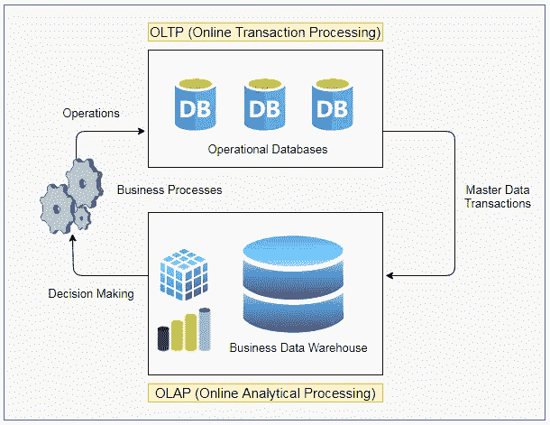

# OLAP 和 OLTP —两种不同的数据管理技术

> 原文：<https://medium.com/analytics-vidhya/olap-and-oltp-the-two-different-data-techniques-78c91e0ab9d6?source=collection_archive---------11----------------------->

卡斯帕·卡米尔·鲁宾在 [Unsplash](https://unsplash.com?utm_source=medium&utm_medium=referral) 上的照片

想象一下计算机系统的早期，不需要像 **RDBMS** 或**数据仓库**这样的复杂系统。在那些日子里，数据存储在一个文件中，一切都很容易实现。然而，随着信息时代的发展，计算机和软件开始席卷我们的生活，它们成为每个企业的需要。它开启了用于存储和管理组织数据的关系数据库管理系统(RDBMS)的时代。直到今天，这还是在组织内存储和提取数据的有效方式之一。

虽然，随着互联网的出现，我们不再局限于普通的 RDBMS 系统。这是因为新时代的工具和应用程序在没有明确关系的域中存储和访问数据，有时甚至不需要这样做(例如:处理不稳定的数据增长)。在这些场景中，我们使用 NoSQL/MongoDB 等。

然而，旧世界的一些术语今天仍在使用，用现代的方法来看待它们是很重要的。准确地说，其中两个是 **OLTP** 和 **OLAP** 。但是，为了有一个总体的背景，让我们看一下下图，它显示了 OLTP 和 OLAP 之间的关系。

*OLTP、在线交易系统、业务流程、OLAP、在线检索和分析系统、业务数据仓库*

从图中，您可以清楚地看出 **OLTP** 和 **OLAP** 并不是针对同一问题的竞争方法，而是互补的流程。接下来，您将会看到对这些术语的更深入的解释。

# 联机事务处理

术语 **OLTP** 是指**在线交易处理**。它通常用来指存储和管理与系统或公司日常运营相关的数据的数据库。OLTP 系统的一个例子是“ **ATM** ”。

由于存储在 OLTP 数据存储上的信息通常对业务至关重要，因此投入了巨大的努力来确保数据的*原子性*、*一致性*、*隔离性*和*持久性* ( [**酸性**](https://en.wikipedia.org/wiki/ACID_(computer_science)) )。根据这四个原则存储的数据被标记为 **ACID 兼容**，这就是关系数据库管理系统的优势所在。

> 例如:在我们的 ATM 机中，我们需要确保 **ACID** 的原理，这是 **OLTP** 系统的一个例子。为清楚起见，请参见下面的示例。
> 
> 让我们考虑一个例子，一个家庭的两个成员有两张与同一个账户相关联的 ATM 卡，账户余额是 500 美元。现在，如果他们两个都去提取全部金额，那么根据 ACID 原则，第一个人应该可以提取，第二个人应该会收到“资金不足”的消息。在第二个场景中，如果第一个人的交易失败(比如说由于服务器故障)，那么第二个人应该能够提取这笔钱。这样，帐户信息应该总是最新的，以避免任何故障。

但是随着 web 的出现，我们不再局限于 OLTP 的旧定义，现在我们也将数据存储在非关系数据库中。这些数据存储中的大部分只遵循了 ACID 的四个原则中的一部分。但是根据不同的用例，可以放松一个或多个原则来换取其他好处(速度、可伸缩性等)。).

因此，比方说，如果我们有一个应用程序来监控某个特定产品的注册用户数或点赞数，我们可以将 NoSQL 或 MongoDB 与 **ACID** 的一些原则结合起来使用，并仍然将其视为一个 **OLTP** 系统。

# OLAP

术语 **OLAP** 指的是**在线分析处理**，通常用来指存储和管理与数据分析和决策相关的数据的数据库。

OLAP 与**商业智能(BI)** 有着紧密的联系，商业智能是一种软件开发的专业化，旨在为商业分析提供应用程序。OLAP 系统的一个例子是不同部门在不同时间段的财务报告。

这个领域带来的最大进步是动态生成报告的能力。它不再需要致电 It 部门要求定制报告，也不再需要自动生成特定报告。一个商业智能系统现在可以回答开发人员不需要提前知道将要被问到的问题。

BI 系统通过以一种叫做 [**超立方体**](https://en.wikipedia.org/wiki/OLAP_cube) 的形式组织数据而成为可能。该表单探索数据的多个维度，并允许用户通过导航立方体的维度来 [**聚集**](https://en.wikipedia.org/wiki/Aggregate_(data_warehouse)) 或 [**向下钻取**](https://en.wikipedia.org/wiki/Data_drilling) 数据。

OLAP 系统可以使用关系数据库来实现，这种技术通常被称为 ROLAP(关系 OLAP)。但为此，我们需要设计的数据库不是第五范式，而是第三范式**。**

**在分析数据时，我们可以忍受冗余数据。**真正重要的是浏览数据维度的能力。这也是 ROLAP 的亮点，因为第三范式的数据库模式适合聚合和下钻。****

# **结论**

**当第一次遇到 OLTP 和 OLAP 这两个术语时，很容易产生疑问:哪个更好？事实上，人们应该问:**一个如何与另一个互补？****

**我们现在知道:**

*   **OLTP 用于存储和管理日常运营的数据；**
*   **OLAP 被用来分析这些数据。**