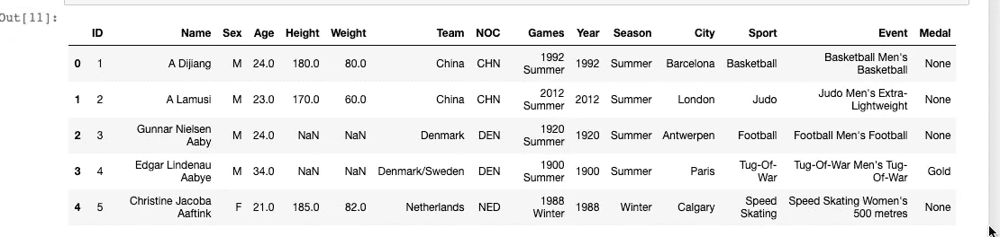
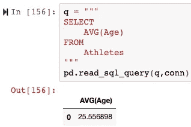
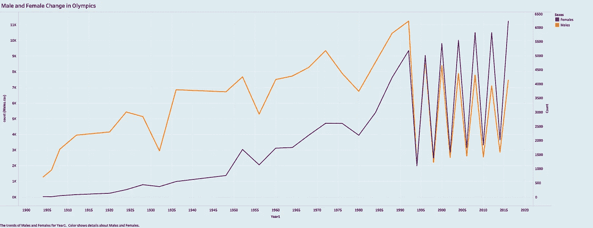

# 奥运数据转储:用 MySQL 探索统计数据

> 原文：<https://medium.com/analytics-vidhya/olympic-data-dump-dde49720e372?source=collection_archive---------8----------------------->

在这个博客中，我将展示一些初级的 MySQL 技巧，我有一个奥运统计的数据集。通常，我会以一个问题开始一篇博文，并试图通过梳理数据来回答这个问题。这一次，主要是因为我想展示如何使用 MySQL 查询，我将询问几个关于数据的小问题，然后编写一些代码来尝试看看我们是否能回答它。我认为这个奥运数据集很有趣，所以我们应该能够找出一些有趣的分组和聚合。

首先，我在亚马逊的 AWS 上创建了一个数据库。这是我第一次创建一个，我发现它非常简单。我选择 MySQL 作为数据库引擎。这里有一些我的计算机利用率的快照，我上传或 pic 数据库的信息，另一张是我登录数据库的次数。

让我们来看一下我们将使用的奥林匹克 CSV 文件的快照:

现在，我将 CSV 文件添加到服务器，并运行一个查询来显示表格，这样我就知道我成功地传输了它。

成功！

这个 CSV 文件有 271，116 行数据，我们应该仔细检查服务器上是否还有同样多的数据。我们可以用这个来验证:

是的，我们已经准备好开始在数据集上运行一些查询了！

首先，让我们看看“团队”一栏，看看我们有什么样的国家。

这很奇怪，到底什么是海狗-2，为什么它被列为一个国家。这些数据可以追溯到 19 世纪，所以我打赌有很多数据需要清理。

现在，我将运行一个查询来查看每届奥运会有多少个不同的团队参加。

看起来只有 18 支队伍参加了 1896 年的奥运会，而且随着时间的推移，这个数字还在稳步增长。这些年有一些大的峰值。例如，1932 年奥运会有 72 个国家或“队”,而在 1936 年这一数字跃升至 132 个——显著增加！大约在这个时候，世界陷入了很多混乱，导致第二次世界大战，我想知道这是否对奥运会的投票率有任何影响？在谷歌上快速搜索 1936 年奥运会可以发现，“纳粹德国利用 1936 年奥运会进行宣传。纳粹宣传了一个新的、强大的、统一的德国的形象。

在“体育”一栏，我注意到有许多不同的体育实例，其中一些我从未听说过。我将把它放在自己的数据框中，稍后在 Tableau 中进行可视化，但下面是我为获取此信息而运行的查询:

现在让我们来看看这些年来运动项目的数量是如何变化的。这是我做的一张快照，展示了 1980 年后的几年以及那一年举办的活动数量。例如，你可以看到在 1984 年奥运会上有 213 场篮球比赛。

我只是修改了上面的代码，以返回 1900 年以来所有奥运会的篮球比赛次数。我们可以插入任何我们想要的运动，看看哪一项运动在奥运会期间最受欢迎。看起来篮球从一开始就没有那么多项目。

在这里，我对性别和年份进行了分组。

现在我们来分别看男性和女性。我将把这两者放入一个数据框架，并在最后做一些可视化，因为我认为这是一个有趣的视觉效果，尤其是女性参与者的变化。

男性:

女性:

在这里我们可以看到奥运会在哪一年举行:

让我们快速看一下所有参赛者的平均年龄:

平均年龄比我想的要小一点，我想 30 岁应该是平均年龄。然而，这确实符合谷歌所说的“男女运动员的巅峰运动年龄”，即“一般来说，运动员在 26 岁左右开始出现体能下降”

以下是所有参赛者的平均体重:

这是以千克为单位的，所以这意味着一名奥运会选手的平均体重大约是 155 磅。这听起来可信。

以下是所有参赛者的平均身高:

这个数字的单位是厘米，所以 175 厘米=大约 5 英尺 7 英寸，这听起来也是可信的。

这里，我们有每年的平均身高，以及它随时间的变化:

我想仔细看看每届奥运会的奖牌数。我不得不过滤掉一些“NaN”列，但是我能够使用这个查询得到想要的结果:

最后，我想看看身高对金牌、银牌和铜牌数量的影响。我对这些问题进行了研究，直到我找到了中间点，大约 50%的参赛者获得的金牌低于 X 身高，而 50%的参赛者获得的奖牌高于 X 身高。

我发现 178 厘米(5 英尺 8 英寸)是所有类别奖牌的中点，略高于所有奥运选手的平均身高。以下是我使用的一个查询示例:

这里有一些图表，可以更好地形象化我在这个过程中发现的一些结果:

这张照片显示了男女奥运选手的变化。注意从 1990 年开始的之字形效应，这是我的数据集开始跟踪 Winer 和 Summer Olympics 的地方。夏季奥运会有更多的竞争对手，这就是如此剧烈波动的原因。

这张图片是一年来的平均身高。它没有我希望的那么有趣，这意味着它的最高和最低高度只有大约 4 厘米的差异。

这张图描绘了奥运会篮球和曲棍球项目随着时间的增加/减少。曲棍球似乎在上升，而篮球在过去几十年里保持相对稳定。

**结论:**

似乎男女运动员在奥运会上的竞争越来越多。与此同时，平均身高似乎也随着时间的推移而增加。我认为这个数据集可以回答更多的问题，尤其是非常有针对性的分组。例如，我们可以将参加游泳项目的女性的平均身高作为目标，并将其与参加滑冰项目的女性身高进行比较。随着我的 SQL 查询技能的提高，我希望能够解决这样的细节问题。就目前而言，我认为这给了其他 SQL 初学者一个很好的起点，并且在研究了这个数据集之后，我对 SQL 感觉更舒服了。

**偏差:**

据我所知，这个数据没有偏见。