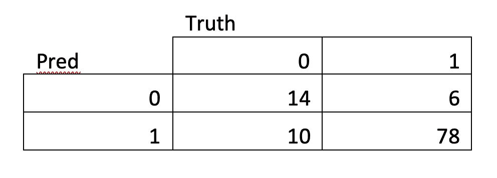

# 奥运奖牌预测

> 原文：<https://medium.com/analytics-vidhya/olympic-medals-prediction-a568fcd739d5?source=collection_archive---------6----------------------->

图片来源:[https://www . nytimes . com/2019/10/01/travel/the-Tokyo-2020-Olympics-what-you-need-to-know . html](https://www.nytimes.com/2019/10/01/travel/the-tokyo-2020-olympics-what-you-need-to-know.html)

# 介绍

如果日本奥运会没有延期，我们可以用什么模型来预测各国的表现？分析结果可能会受到疫情病毒的影响，因为各国都在与病毒作斗争，一些运动员已经感染了新冠肺炎病毒。这是纳西姆·塔勒布的黑天鹅事件和预测局限性的一个很好的例子。看起来这个世界更像是塔勒布而不是泰特洛克。

在这个项目中，我们将使用 2000 年至 2012 年的奥运会数据来预测参加 2016 年里约奥运会的 108 个国家的奖牌总数和金牌数。

我们将使用几种回归方法:线性回归，二项式或泊松广义线性模型以及混合模型。

# 数据描述和方法

数据采用宽格式，108 行对应 108 个国家，44 列对应 5 年的协变量和响应变量。

我们将把数据集分成两部分，训练集包含 2000 年到 2012 年的数据，测试集包含 2004 年到 2016 年的数据。以下是对数据集中包含的变量的描述:

**国家:** 108 个国家参加奥运会

**gdp.min.YY:** 目标年 gdp 减去 YY，即训练集 2012–20YY，测试集 2016–20YY

**gdp.target:** 目标年的 gdp，即 2012 年为训练集，2016 年为测试集

**pop.min.YY:** 目标年 gdp 减去 YY，即训练集 2012–20YY，测试集 2016–20YY

**pop.target:** 目标年的 gdp，即 2012 年为训练集，2016 年为测试集

**苏联:**如果国家是前苏联的一部分，则为 1，否则为 0

**comm:** 1 如果国家是前/现共产主义国家，0 否则

**穆斯林:**如果国家是穆斯林占多数的国家，则为 1，否则为 0

**一党制:**如果国家是一党制国家，则为 1，否则为 0

**gold.min.YY:** 目标年份获得的金牌数减去 YY

**gold.target:** 目标年份获得的金牌数

**tot.min.YY:** 目标年获得的奖牌数减去 YY

**tot.target:** 目标年获得的奖牌数

**totgold.min.YY:** 目标年获得的金牌总数减去 YY

**totgold.target:** 目标年颁发的金牌总数

**tot metals . min . YY:**目标年颁发的所有奖牌总数减去 YY

**tot metals . target:**目标年颁发的所有奖牌总数

**海拔:**该国首都城市的海拔

**运动员.分钟.年**:目标年代表国家的运动员人数减去 YY 运动员.目标:目标年代表国家的运动员人数

**gdp.growth:** 前 3 年到目标年的产品增长率的立方根，即(GDP . target/GDP . min . 04 * GDP . min . 04/GDP . min . 08 * GDP . min . 08/gdp.min.12)^(1/3)

**人均国内生产总值:**计算变量，目标年的国内生产总值/人口增长率。

**any.gold:** 一个二元反应变量，一个国家到底有没有拿过金牌

**any.medal:** 二元反应变量，表示一个国家是否获得过奖牌

**host.min.YY** : 1 如果该国在目标年举办过奥运会(不包括 YY)，否则为 0。

**host.target:** 1 如果该国在目标年举办奥运会，则为 0，否则为 0。

每个国家获得的金牌总数的份额

每个国家获得的奖牌总数的份额

我们还创建了一个数据框架的长格式版本，用于 ed a 和混合模型的时间序列，因为属于一个国家的观测值预计是相关的。

**探索性数据分析:**

让我们看看变量之间的相关性。从下图中可以看出，奖牌和以下因素之间似乎有很强的相关性:

*   运动员人数
*   以前的结果
*   国内生产总值

这一切都很直观。

**注:**我们将尝试不同的模型，包括人口和 gdp 的转换，以使关系更加线性，但并不总是详细说明每种组合。

如果我们现在看看金牌的分布，我们可以看到有很多 0 分，实际上大约 50%的国家没有赢得任何金牌，大约 20%的国家根本没有赢得任何奖牌。由于零的高比例，我们也将考虑障碍和零膨胀模型。

可变性看起来像什么？

让我们来看看金牌数和奖牌总数是如何随着项目的不同而变化的。

从 2000 年到 2012 年每个国家的金牌数

从 2000 年到 2012 年每个国家的奖牌总数

有没有**主机效果**？我们只看最近的主办国:澳大利亚(2000 年)、希腊(2004 年)、中国(2008 年)和英国(2012 年)，并考虑到每项赛事奖牌数量的增加。每个国家举办奥运会的年份似乎都有一个明显的高峰，也许除了澳大利亚和金牌。

金牌和东道主

奖牌和东道主总数

如前所述，我们将测试不同的模型:

- **泊松**奖牌数(金牌和所有)

- **零膨胀泊松**和**跨栏**来补救 0 计数的重要数字

- **正常线性模型**，即使响应是离散的且大于 0

- **二项式**预测获得的奖牌份额

- **二项式**预测是否获得任何金牌/奖牌

- **连续或离散变量的混合模型**，以国家为随机效应

为了对模型进行评级和比较，我们将关注**方差分析**和 **AIC** 以及**均方根误差(RMSE)** 和**平均绝对误差(MAE)** 。对于二元反应，我们将查看准确度值和**曲线下面积(AUC)** 。

# 分析

**泊松模型**

让我们从运行泊松 GLM 开始，我们使用 stepAIC 进行变量选择，最终得到以下模型和结果:

- **对于黄金计数:**

*gold . target ~ log(GDP . target)+comm+gold . min . 04+athletes . target+host . min . 08+GDP . growth*

- **奖牌数:**

*tot . target ~ log(GDP . target)+comm+Muslim+one party+gold . min . 04+tot . min . 08+tot . min . 04+运动员. target+host . min . 04+host . target*

金牌模型的 RMSE 和 MAE 分别为 1.8 和 1.1，奖牌总数模型为 4.4 和 2.7。

我们将测试跨栏和零膨胀模型，但让我们先拟合一些二项式模型，看看我们是否能找到二元类金牌/无金牌或奖牌/无奖牌的最佳预测。

**二元响应和二项式响应的二项式模型**

**二进制**

要确定是否赢得了奖牌:

*any . medal ~ comm+gold . min . 04+tot . min . 12+tot . min . 08+tot . min . 04+运动员. target*

该模型的准确率为 85.2%。

仅针对金牌:

*any . gold ~ log(pop . target)+gold . min . 12+gold . min . 08+tot . min . 08+*

*tot.min.04 +运动员. target +东道主. min.08 + gdp.growth +人均 GDP*

准确率为 83.3%

**二项式**

二项式模型给出了以下结果:

**跨栏、零充气模型** **和负二项式**

考虑到回答中 0 的比例，这两个模型都有意义。我们跑了几个栏，零充气，得到了以下结果:

**跨栏**

**零充气**

鉴于零膨胀的良好结果，让我们来看一下模型拟合:

金牌:零膨胀模型的拟合值与实际值

奖牌总数:零膨胀模型的拟合与实际

韩国的表现似乎超出了预期。

**负二项式**

奖牌总数的负二项式模型显然有问题，需要在未来的分析中加以研究。

总之，零膨胀模型似乎在金牌和奖牌总数方面表现更好。

对于栅栏和零膨胀，我们有一些关于准完美分离和系统计算奇异的错误信息和问题。这限制了模型的复杂性。

**线性回归**

现在让我们看看正常的线性回归。

我们符合以下模型:

*tot . target ~ log(GDP . target)+log(pop . target)+comm+gold . min . 12+gold . min . 08+gold . min . 04+tot . min . 12+tot . min . 04+运动员. target+host . min . 12+host . min . 08+host . min . 04+host . target+GDP . growth+GDP . per . cap*

并且:

*gold . target ~ log(GDP . target)+log(pop . target)+Muslim+gold . min . 12+gold . min . 08+gold . min . 04+tot . min . 12+tot . min . 04+host . min . 12+host . min . 08+host . min . 04+host . target+GDP . per . cap*

线性模型在训练数据上表现得非常好:

最后，由于同一个国家几年间的观察结果之间存在**相关性**，我们将对金牌数和奖牌总数数据拟合一个广义线性混合模型。

**广义线性混合模型**

我们正在查看来自不同国家的 5 个季节的数据，因此有理由假设这些数据在国家层面上是相关的。为了检验这一点，我们还将拟合一个具有泊松分布和对数链接函数的广义线性混合模型。

这些模型如下:

*黄金~年份+comm+穆斯林+one party+log(GDP)+主机+(1 |国家)*

*tot ~ log(GDP)+年份+comm+东道主+运动员+(1 |国家)*

结果如下:

**车型性能总结**

**金牌**

**奖牌总数**

我们对线性模型有很好的结果，但是这个模型对测试数据的表现会一样好吗？从理论角度来看，零膨胀和 GLMM 是有意义的:我们预测的是在国家层面上有很大比例的零和相关性的计数。

## **测试数据集的结果**

我们现在将根据测试数据集测试我们的模型，然后将我们的结果与 2016 年奥运会的其他类似研究进行比较。

线性模型保持了金牌的相同性能:

奖牌总数:

**注:**如果我们用 0 代替负面预测，分数会略有提高。

图形化:

因此，我们将对黄金四舍五入后的前 10 名进行如下预测:

奖牌总数:

与其他型号相比，该型号的性能如何？

让我们来看看高盛、华尔街日报、塔克商学院、库珀等人对黄金十大市场的预测。

高盛、华尔街日报等开发的其他黄金预测模型。

至于奖牌总数，我们看了华尔街日报、高盛、普华永道、塔克商学院、利物浦大学等机构的预测。

高盛、华尔街日报、普华永道等开发的其他奖牌总数预测模型。

总的来说，结果并不坏，由于个别运动员的表现和外部事件，总会有随机因素(例如，由于兴奋剂丑闻，围绕俄罗斯运动员有很多不确定性)。

有几种方法可以对前 10 名进行评分:仅根据排名、正确进入前 10 名的国家数量、预测的奖牌数量或 3 个国家的加权平均值。例如，在黄金预测中，我们得到了 10 个国家中的 3 个国家的正确顺序，10 个国家中的 10 个被正确分配到前 10 名，MAE 为 3.7。

高盛有 3 个国家的排名是正确的，9 个国家被正确分配到前 10 名，MAE 为 4.1。

成绩还不算太差。

**一些(许多)可以改进的地方**

1)更好地利用可用的(金牌)总数，并通过 R 中的 offset()函数解决导致预测出现较大误差的问题。另一个选择是预测金牌/奖牌总数的份额。

2)使用 PPP GDP(购买力平价)数据，而不是 GDP，这是普华永道建议的，它似乎是比 GDP 更好的预测指标。

3)更多的特征工程，一些数据可以被转换以提供更好的线性拟合。

4)结合专业知识和外部信息，如当前非奥运会项目的记录、运动员健康、政治等。调整模型。

5)向 GLMM 添加更复杂的随机效果。

# 来源

**高盛对 2016 年奥运会的**预测:[https://www . Goldman Sachs . com/insights/archive/Olympics-and-economics . html](https://www.goldmansachs.com/insights/archive/olympics-and-economics.html)

来自达特茅斯塔克商学院的卡蜜拉·冈萨雷斯**:[https://www . Tuck . Dartmouth . edu/uploads/content/Tuck _ School _ of _ Business _ 2016 _ Olympic _ predictions . pdf](https://www.tuck.dartmouth.edu/uploads/content/Tuck_School_of_Business_2016_Olympic_Predictions.pdf)**

皇家统计学会的朱莉娅·布雷特曼、卡斯滕·j·克雷德和塞巴斯蒂安·奥滕**:[https://RSS . online library . Wiley . com/doi/full/10.1111/j . 1740-9713 . 2016 . 00915 . x](https://rss.onlinelibrary.wiley.com/doi/full/10.1111/j.1740-9713.2016.00915.x)**

**普华永道**，模拟奥运表现:[https://www . PwC . co . uk/economic-services/assets/Olympic-medals-paper-2016 . pdf](https://www.pwc.co.uk/economic-services/assets/olympic-medals-paper-2016.pdf)

**利物浦大学**预测:[https://news . Liverpool . AC . uk/2016/08/03/experts-predict-Rio-2016-奖牌-兴奋剂-涂改-2012-forecast/](https://news.liverpool.ac.uk/2016/08/03/experts-predict-rio-2016-medals-doping-altered-2012-forecast/)

**体育画报**:[https://www . si . com/Olympics/2016/08/01/Rio-2016-Olympics-奖牌-预测-预计-奖牌数](https://www.si.com/olympics/2016/08/01/rio-2016-olympics-medal-picks-predictions-projected-medal-count)

**元分析**

关于石英的总结，包括来自高盛、普华永道和 RWI-莱布尼茨经济研究所的预测:[https://qz . com/761103/if-your-country-never-wind-a-Olympic-metal-odds-it-never-will/](https://qz.com/761103/if-your-country-has-never-won-an-olympic-medal-the-odds-are-it-never-will/)

非常好的资源，有很多外部链接:[https://www . topendsports . com/events/summer/medal-tally/predicted-2016 . htm](https://www.topendsports.com/events/summer/medal-tally/predicted-2016.htm)

**附加数据**

国际货币基金组织购买力平价 GDP:[https://www . IMF . org/external/data mapper/PPP GDP @ WEO/OEMDC/ADVEC/WEO world/AFQ](https://www.imf.org/external/datamapper/PPPGDP@WEO/OEMDC/ADVEC/WEOWORLD/AFQ)