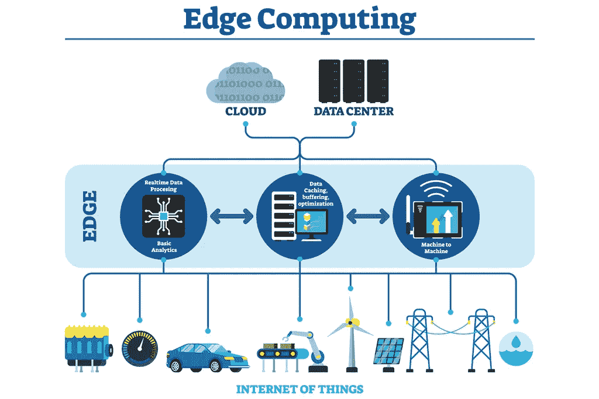

# 在边缘上！

> 原文：<https://medium.com/analytics-vidhya/on-the-edge-cc61f14ee3ea?source=collection_archive---------11----------------------->

> “边缘计算将集合所有技术的力量，让生活变得更简单。”

**什么是边缘计算？**

边缘计算就是在靠近数据源的设备上进行计算，而不需要将数据发送到云端。它是指靠近数据源的计算基础设施或设备，可以将数据的集中计算从中央云带到系统的末端节点。在更靠近网络边缘的地方进行计算，可以让组织近乎实时地分析重要数据，这是许多行业(包括制造、医疗保健、电信和金融)的组织所需要的。边缘计算的最大驱动因素之一是当今计算机生态系统面临的延迟。当两个系统尝试通信时，我们面临的是延迟，在系统之间进行计算和数据传输时会有时间延迟。

像 Alexa 这样的语音助手需要与云基础设施进行通信，并返回结果。假设你需要知道这个国家正在发生的一些重要事件，它会将查询返回给云，然后再返回。这是一段非常显著的时间，是边缘计算可以解决的一个特殊问题。它不会以任何方式毁灭云，而是将云带给你。

[https://wiki . Mike jung . biz/images/9/9a/Meme-response-times-is-too-damn-high . png](https://wiki.mikejung.biz/images/9/9a/Meme-response-times-are-too-damn-high.png)

**它是做什么的？**

边缘计算是一种允许在网络边缘执行计算的技术，以便计算在数据源附近进行。边缘设备同样消耗和产生数据。在这个世界中，云中心、处理单元和存储在微观层面上位于边缘，并相互通信。

它允许在网络边缘进行计算，网络边缘可能就在您的移动设备或安全网络摄像头附近。它既作用于代表云服务的下游数据，也作用于代表物联网服务的上游数据。

我们需要了解边缘计算和云计算之间的一些差异。

> ***优点:***

**边缘计算**

1.它可以在没有云的情况下工作，并且数据更加安全。

2.获得最终结果的延迟非常低。

3.实时响应。

**云计算**

1.  巨大的数据存储和处理能力。
2.  易于扩展。

> ***缺点:***

**边缘计算**

1.存储容量低。

2.高功率使用。

**云计算**

1.高延迟。

2.离线模式下做不到。

[https://innovation network . IEEE . org/WP-content/uploads/2019/06/Real-Life-Use-Cases-for-Edge-Computing _ 1024 x684 . png](https://innovationatwork.ieee.org/wp-content/uploads/2019/06/Real-Life-Use-Cases-for-Edge-Computing_1024X684.png)

**它是如何工作的？**

为了理解边缘计算的工作原理，我们需要理解物联网或物联网的概念。物联网是通过统一协议共享信息的设备、传感器或执行器的网络或互连。

边缘计算的工作原理是将数据、应用程序和计算能力从集中式网络推向极致，使信息片段分散在服务器的分布式网络中。它的目标用户仍然是任何使用商业互联网应用服务的互联网客户。由于大规模实施降低了成本，它以前只适用于大型组织，现在也适用于中小型组织。

**用例:**

边缘计算将会有很多使用案例，其中一些将会改变我们对日常生活的认知方式。低延迟和更安全的数据的最大优势将推动围绕这项技术的许多未来发展。我想谈谈几个将会产生巨大影响的行业，其中一些我认为可能会以许多不可预见的方式加速发展。

**医疗保健:**

医疗保健行业是一个长期致力于集成 IT 解决方案的主要行业。但是，有了有能力的物联网设备，将产生大量患者生成的健康数据，这将潜在地使医疗保健提供商能够访问关键数据库，并在未来使医疗设备能够帮助诊断和治疗患者。

全球医生与患者的比例非常低，边缘计算驱动的医疗设备可以在许多农村地区建立，并在医生无法到达的地方对患者进行初步诊断。边缘设备还可以帮助急救，在需要急救的情况下；这些设备可以帮助诊断根本原因，并有助于减少损坏因素。

这是医疗保健行业的几个例子，在这些例子中，这可能会有所帮助，这类使用案例需要遵守大量的数据保护和隐私协议，但会对我们的社会产生重大影响。

**智能基础设施:**

我们的建筑变得越来越紧密相连，自动门、自动扶梯等以微小的方式却以巨大的规模影响着我们的生活。我们的会议室将很快充满物联网设备，这些设备将相互交互，使我们的生活更加轻松。此外，这将有助于使任何会议的数据更加安全可靠。

**工业自动化:**

边缘计算将彻底提升工业自动化的世界。利用能够根据从传感器收集的数据相互交互的设备，它将增强机器的更快服务，并使建筑产品更高效。

**缺点:**

虽然听起来技术不错，但边缘计算肯定有一些缺点，安全性是主要问题之一。这是一把双刃剑，我说了这么多，虽然数据会更安全，存储肯定会更安全，但硬件有可能被黑客攻击，数据有可能被误导。它还需要更多的硬件和初始设置投资。

所有这些都是关于边缘计算的使用和它的缺点，人们不能否认这是不可避免的事实。我们将生活在一个充满各种设备的世界里，这些设备将使我们的生活变得更好、更健康。