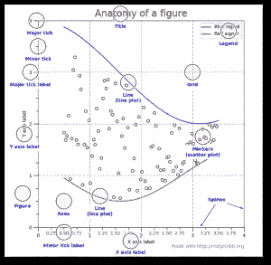

# 优秀设计的重要性

> 原文：<https://medium.com/analytics-vidhya/on-the-importance-of-good-design-814e697bdd61?source=collection_archive---------42----------------------->


上图是一辆 50 年代末的 MGA 敞篷车。我选择这个是因为我碰巧认为这款车是有史以来设计最优雅的汽车之一。肯定在前 50 名。当涉及到我们使用的物理对象时，我们作为人非常重视设计，而当涉及到软件时，我们软件的许多设计看起来更像下面的汽车:这辆车看起来像是由一个委员会设计的，他们不能决定他们是在设计门挡还是高尔夫球车。


关于数据科学领域缺乏良好的软件工程实践，我最近做了很多思考(原因将在几周内变得明显)。我想得越多，就越对数据科学生态系统中存在的可疑设计感到震惊，尤其是在 Python 中。更令人印象深刻的是，python 语言其实是为了促进好的设计而设计的，构建这些模块的人都是很棒的开发者。

作为一个例子，我最近读了一篇关于没有 if 语句的[编码的文章，它让我畏缩。以下是一段引言:](/edge-coders/coding-tip-try-to-code-without-if-statements-d06799eed231)

> *当我教初学者编程并向他们提出代码挑战时，我最喜欢的后续挑战之一是:*现在不用 if 语句(或三元运算符，或 switch 语句)解决同样的问题。
> 
> *你可能会问为什么这会有帮助？嗯，我认为这个挑战迫使你的大脑以不同的方式思考，在某些情况下，不同的解决方案可能更好。*
> 
> 使用 if 语句没有错，但是避免使用它们有时会让代码更容易被人理解。这绝对不是一个通用规则，因为有时避免 if 语句会使代码可读性差很多。你是法官。
> 
> [*https://medium . com/edge-coders/coding-tip-try-to-code-without-if-statements-d 06799 eed 231*](/edge-coders/coding-tip-try-to-code-without-if-statements-d06799eed231)

好吧，我将成为法官，作者引用的每个例子都使代码**更难理解**。在我看来，难以遵循代码意味着你作为开发人员更有可能引入意想不到的 bug 和错误。由于代码很难理解，不仅你会有更多的错误，而且这些错误会花费你更多的时间去发现。更糟糕的是，如果您没有编写这段代码，却被要求调试它！！啊啊啊！！我知道如果是我的话，我都懒得去管。我可能会重写一遍。唯一的例外是它被大量评论。

我还要补充一点，当你有这样的代码时，为它编写考虑到所有可能出错的各种事情的单元测试会更加困难。考虑以下代码:

```
if x > 100:
   # do something
elif: x >= 50:
   # do something else
else:
   # All else failed...do this
```

这段代码非常容易测试并证明它在任何情况下都有效。显然，您必须为每个 if 子句编写一个单元测试，然后针对一些边缘情况，比如 x 未定义或者 x 不是一个数字。即使一个非编码人员也不难理解这里发生了什么。

# Python 鼓励好的设计

Python 的开发者认识到好的设计是好的编码的重要组成部分，并构建了语言来鼓励好的实践。举个例子，我要引用 pep 20:Python 的禅。

```
Beautiful is better than ugly.
Explicit is better than implicit.
Simple is better than complex.
Complex is better than complicated.
Flat is better than nested.
Sparse is better than dense.
Readability counts.
Special cases aren't special enough to break the rules.
Although practicality beats purity.
Errors should never pass silently.
Unless explicitly silenced.
In the face of ambiguity, refuse the temptation to guess.
There should be one-- and preferably only one --obvious way to do it.
Although that way may not be obvious at first unless you're Dutch.
Now is better than never.
Although never is often better than *right* now.
If the implementation is hard to explain, it's a bad idea.
If the implementation is easy to explain, it may be a good idea.
Namespaces are one honking great idea -- let's do more of those!
```

在编写 Python 代码时，这些都是需要考虑的很好的原则。不幸的是，尽管创始人的初衷是好的，但开发人员发现了许多用 Python 创建困难甚至可怕代码的方法。

让我们看一看熊猫。我先说熊猫是一个很棒的模块。这简直太棒了，是编码方式的巨大变革。也就是说，熊猫经常违反“应该有一个——最好只有一个——显而易见的方法”的原则。

在 pandas 中，您可以用点符号访问数据帧中的列:

```
df.col1
```

或者您可以使用括号符号:

```
df['col1']
```

这里的问题是这些**在功能上并不等同！**点符号有几个主要的问题，但两者都存在的事实是有问题的。此外，还有许多方法，如`unique()`和`drop_duplicates()` ， ***看起来与*** 功能相当，但实际上并非如此。不幸的是，当你写了一整天的代码，并试图调试一些看起来应该工作，但实际上并没有工作的代码时，你通常要到凌晨 2 点才能发现这些函数之间的区别。



让我们考虑另一个令人惊叹的东西:Matplotlib。一方面，这个图书馆很棒。另一方面，这个设计令人难以置信的困惑。对我来说，Matplotlib 完全是一个谜，直到我阅读了 Chris Moffitt 的 [*有效地使用 Matplotlib* ，其中解释了 MatPlotLib 有两个接口:基于状态的接口和面向对象的接口。什么？？！？](https://pbpython.com/effective-matplotlib.html)

左边的图像展示了用 MatPlotLib 渲染的可视化的所有组件。这里有很多，但问题是有很多方法来修改每一个。如果有一个，最好是一个明显的方法来改变这些，我怀疑 MatPlotLib 会对更多的人更有意义。

我差点忘了，我对熊猫还有另一个不满，那就是 json.normalize 函数。根据我的经验，这是一个很棒的包，很多人都不知道。正确读取嵌套 JSON 数据的能力非常重要，但是，为了做到这一点，您必须了解这个包，并专门导入它。

# 设计很重要，尤其是对于软件

这么说似乎很傻，但是好的设计真的很重要。从实用的角度来看，好的设计省钱。你怎么会这么问？好吧，让我们从显而易见的开始，一个设计良好的产品会让用户花更少的时间去学习和采用，从而提高生产力。一个设计良好的产品需要较少的培训来教用户如何使用它，也需要较少的资源来支持。

对于开源软件的开发者来说，好的设计也是你的既得利益。如果你创造了一个设计良好的产品，会有更多的人使用它，很少有人会问你“我该怎么做？”问题😉

# 在我即将举办的研讨会上了解更多信息！

如果你有兴趣了解更多关于如何编写设计良好的代码以更容易通过代码审查并投入生产的知识，那么你可能想看看我即将在 Safari Online 上举办的研讨会:[https://learning . oreilly . com/live-training/courses/first-steps-writing-cleaner-code-for-data-science-using-python-and-r/0636920391661/](https://learning.oreilly.com/live-training/courses/first-steps-writing-cleaner-code-for-data-science-using-python-and-r/0636920391661/)