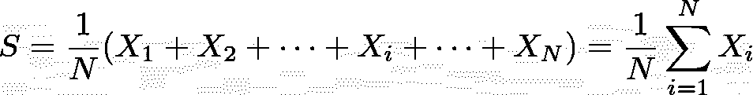
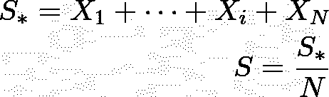
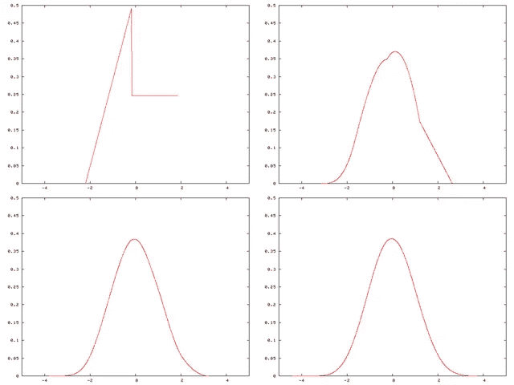
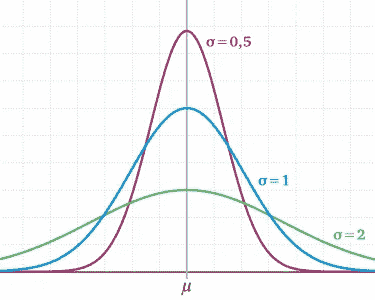
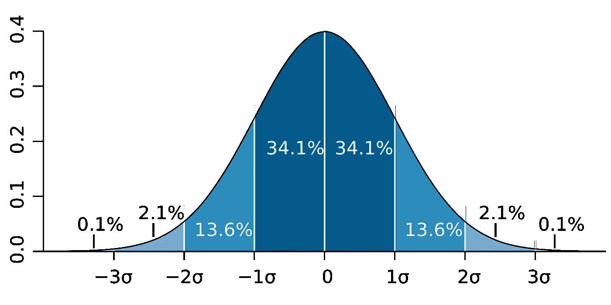
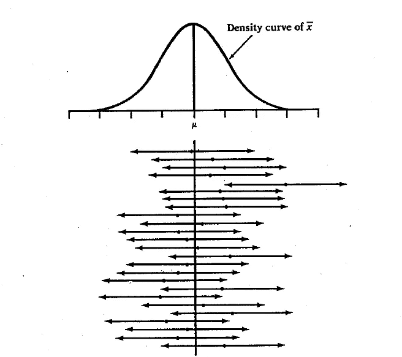

# 关于中心极限定理的理解(直观)

> 原文：<https://medium.com/analytics-vidhya/on-understanding-of-central-limit-theorem-visually-f70f9b0c02dc?source=collection_archive---------7----------------------->

马尔辛·肯帕在 [Unsplash](https://unsplash.com?utm_source=medium&utm_medium=referral) 上的照片

在你的统计学讲座中，你肯定听说过著名的基本的[中心极限定理](https://en.wikipedia.org/wiki/Central_limit_theorem)。特别是对于政治调查、药物有效性评估和数字产品的 A/B 测试，该定理允许我们在测试中从相对较小的样本量中得出结论。“相对较小”指的是通常作为我们调查目标的所有对象/人/顾客。

在这篇文章中，我将介绍应用归纳统计的中心极限定理的最重要的概念，并用一个简单的直观例子来说明，我们如何用一个简单的直观例子从任何分布的随机变量的和得到一个正态分布。

你可能需要一些基本的统计学知识来理解故事情节，但我保证，你会对金融、工程和医学领域的许多人日常应用的基本事物有一个新的观点！

每月在衣服上的花费——Becca McHaffie 在 [Unsplash](https://unsplash.com?utm_source=medium&utm_medium=referral) 上拍摄

我们如何定量描述人口？我们举个例子。对于中欧的每月服装支出，一个很好的描述性指标是算术平均值(即*平均值*或者更精确地说:*期望值* )。我们有两个选择来找出答案:

1.  组织对感兴趣地区(在我们的例子中是整个中欧)所有成年人的调查，并计算平均值。
2.  取一个样本，假设随机选取 1000 个成年人，计算平均值。

很明显，第一种选择是最精确的，但是组织、操作和评估的费用非常高。想想我们要完成的文书工作的数量吧！请记住，不是每个人都有能力使用计算机和电子表格，我们希望在我们的调查中包括每个人，以获得一个准确的数字！

第二种选择似乎是可以管理的，但肯定不是非常精确，因为一次又一次地选取不同的 1000 人“批次”(形式上:样本大小 **N=1000** )将导致不同的平均值。你可能会意外地发现一群时尚博主，或者一些技术人员，他们把钱花在小玩意上，而不是不同的衣服上(是的是的，我到处都知道刻板印象……)。

统计上会发生什么？通过随机选择一个成年人并询问她/他每月的花费等于从随机变量 **X，**中抽取，即测量的花费 **x** 是随机变量 **X** 的单个*实现。*

询问 N 个成年人并计算他们支出的平均值是随机变量 **S** ，定义为:

随机变量**S**:N**N**均匀分布观测值的算术平均值 **xi**

让我们简短地看一下乐谱。我们用大写字母(如 **X** 和 **S** )表示随机变量，用小写字母表示它们的实现(即测量)。

注意，样本分布 **S** 不同于 **X** 。当你阅读这篇文章时，一定要弄清楚是否提到了 S 或 X。

另外，我们不知道, **X** 是如何分配的。是正态分布吗？泊松？也许 [F-distribution](https://en.wikipedia.org/wiki/F-distribution) ？我们不知道，但这真的不重要！

感谢我们所知道的中心极限定理，即 **N** 个均匀分布的随机变量 **X** (无论何种分布)之和将导致正态分布(对于大样本量 **N** )。

在我们的例子中这意味着什么？取一批成年人，计算算术平均值 **s** 换句话说，就是从正态分布 **S** 中得出一个认识。这个正态分布的形状和位置对我们很重要，因为我们将从中推断出 **X** (中欧人均月支出)的特征。

也就是说，中心极限定理表明, **S** 的期望值等于 **X** 的期望值:

**S** 的方差等于 **X** 的方差除以样本量 **N** ，即:

这感觉很自然，因为随着批量的增加，我们越来越接近观察整个群体，并且计算的平均值在实验之间的变化不会越来越小。

只是万一你对上面公式的理论背景感兴趣，可以看看 [Bienaymé公式](https://en.wikipedia.org/wiki/Variance#Sum_of_uncorrelated_variables_(Bienaym%C3%A9_formula))。

## 近距离观察 CLT

现在你肯定会问*为什么*和*为什么*一个相等分布的随机变量的和不考虑 **X** 的分布形状会得到一个正态分布？这实际上是写这篇文章的原因。

我们在统计学理论中找到了答案，也就是在概率分布的卷积中。我在上一篇文章中描述了两个随机变量[的简单和。在那里，你会发现一步一步的例子，如何卷积运算的工作，以及它是如何计算的数字。](/analytics-vidhya/sum-of-two-random-variables-or-the-rocky-path-to-understanding-convolutions-of-probability-b0fc29aca3b5)

在将我们测量的总和除以 **N** 之前，我们有一个 **N** 随机变量 **S*** 的总和:

想象一下， **X** 的分布在[0，1]范围内会是均匀分布。我们将增加样本数量，看看它会对随机变量 **S*** 产生什么影响。

产生的随机变量是 N 次卷积的结果(我们用均匀分布对最后的结果进行卷积):

4 个均匀分布变量的和

卷积运算使均匀分布的形状变得平滑。无论你使用哪种分布，结果总是正态分布！

请看一个来自维基百科的非常简单的可视化例子，带有人工分布(从左上至右下阅读):

[https://commons . wikimedia . org/wiki/File:Central _ limit _ thm . png](https://commons.wikimedia.org/wiki/File:Central_limit_thm.png)

我们取的样本越多，样本均值的分布就越像正态分布。

## 哦，好极了，精彩的情节，但是它们对我有什么帮助呢？

很棒的问题！既然我们知道我们的均值将如何分布，我们就可以推断出一些有用的信息。在询问了 1000 个人的支出后，我们可以说，计算出的平均值在一定范围内，有 95%的置信度，因为我们知道得到的正态分布的方差。

听起来很复杂？让我们来讨论一下什么是置信区间，以及我们如何得到它们。

## 置信区间

**S** 的方差告诉我们样本均值的扩散幅度。换句话说，小的方差将导致相似的样本均值，反之亦然。记住， **S** 的方差取决于样本数和 **X** 本身的方差。给定 **X** 的方差，我们可以通过在我们的批次中进行更多或更少的测量来“调整” **S** 的方差(标准偏差)(即我们正在改变 **N** )。该效应用下面的等式表示:

**σ s 的影响因素**

不同标准差对**S**—[https://matheguru.com/stochastik/normalverteilung.html](https://matheguru.com/stochastik/normalverteilung.html)形状的影响

回到我们的例子，固定样本量为**N**——我们如何计算置信区间？让我们试着一步步理解这个概念。

假设我们知道实验中的期望值**——理论上我们期望在 **[ -2*σ_s，+2 *σ_ s]【T25]中，大约是。95%的潜在实验。****

**作为提醒，不同σ区间及其相应概率的图示。在 **[-2σ，+2σ]** 区间有 34.1%+34.1%= 94.2%的概率抽中一个数字。**

****

**von m . w . Toews-Eigenes Werk，基于(概念上)杰瑞米·坎普的图，2005 年 2 月 9 日，CC BY 2.5，[https://commons.wikimedia.org/w/index.php?curid=1903871](https://commons.wikimedia.org/w/index.php?curid=1903871)**

**我知道你此刻在想什么，你是对的！我们没有任何关于的线索。但是，让我们的样本均值为 **s** 和**【s-2 *σ_ s，s+2 *σ_ s】**会给我们一个区间，该区间将包含 95%置信度的。有意义吗？如果不是真的，看看下图！**

**首先你会看到密度曲线，我们的样本平均值的分布。下面显示了 25 个不同的样本均值和相应的置信区间(每一个都是有 **N** 个参与者的单个实验)。间隔长度由密度曲线的标准偏差得出。**

****

****X 杆**在我们的例子中等于 **S****

**当然，正如你在上面看到的，仍然有可能在最右边的某个地方采样一个平均值(像第 5 个样本)，上面提到的 **[s-2σ_s，s+2σ_s]** 方法不包括**——但是因为采样一个最右边的平均值到真实平均值是非常不可能的，这个方法似乎是有效的——注意，仍然有 5%的机会出错(仍然有一个原因，为什么我们温和地说“有 95%的信心”)。****

****简而言之:区间边界表明，在我们可能进行的所有可能的实验中，真实均值(即我们寻找的期望值)将在 95%的置信边界内( **p** =0.05)。如果我们重复实验无限次，并以与上述相同的方式计算平均值和置信边界，则期望值将位于置信区间内。****

****无论如何，我们观察到一些极高的平均值(因为我们运气不好，在我们的样本中选择了许多时尚博主)并且置信区间不会包括真实的期望值，这种情况仍然可能发生。这个事件发生的几率是 **p=0.05=5%** 。当然，我们理论上可以将 **p** 降低到 0，并要求 100%的置信区间(例如**【s-10σ_ s，s+10σ_ s】**)，但是这个特定的区间对我们来说没有用，因为它将从 *-inf* 到达 *inf* 。****

****为了获得更小的区间和相同的置信度，唯一的方法是增加 **N** 以获得更窄的样本分布 **S** 。抱歉:(****

# ****摘要****

****哇哦。内容太多了！你绝对应该明白的是，单次测量的随机性 **X** 与样本均值的随机性 **S** 之间的差异。得益于中心极限定理和卷积运算， **N** 个均匀分布的随机变量 **X** 之和会导致一个正态分布，而不用顾及 **X** 的概率特征(我们甚至不用知道底层分布)。CLT 允许我们做伟大的事情，例如根据我们事先指定的置信度来估计期望值和计算区间。****

****希望你在阅读这篇文章时感到愉快。我知道，这不是一个容易理解的概念，但我相信这篇文章可以为工业和学术界不同领域使用的基本事物提供一个高层次的概述。****

# ****信用****

****感谢 Anna F .的支持和耐心阅读并修改这篇文章。****