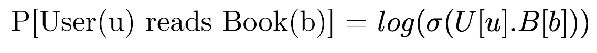
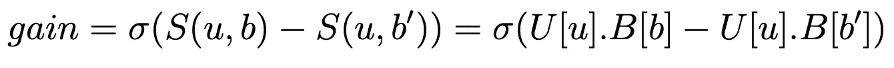

# 一类协同过滤(OCCF)——预测用户是否在阅读一本书

> 原文：<https://medium.com/analytics-vidhya/one-class-collaborative-filtering-occf-to-predict-whether-a-user-reads-a-book-286ce31a2d9b?source=collection_archive---------3----------------------->

我最近参加了由加州大学圣地亚哥分校主办的 Kaggle 竞赛，这是推荐系统和网络挖掘课程的一部分。

提供了良好阅读数据集的子集，表明用户对书籍的评级。目标是预测给定一个用户和一本书，该用户是否阅读该书。

我对 3 / 847 名学生进行了排名，并通过这篇博文分享了我对这个问题的解决方案。

# 资料组

训练数据由 200，000 个用户-图书交互组成，即 11357 个独立用户和 7170 个独立图书的(userID，bookID，rating)三元组。评分范围为 0-5 分。

测试数据由 20K (userID，bookID)组成。还已知测试集是通过负采样生成的，即对于用户阅读的给定书籍(userID，bookID)，生成负样本(userID，bookID’)，使得用户(userID)没有阅读该书籍(bookID’)。测试数据中没有看不见的用户或书籍。

# 模型

简而言之，我的解决方案是基于潜在因素的单类协同过滤(OCCF)模型，由逻辑回归推动。细节在 4 个小节中解释。

## A.一类协同过滤(OCCF)

典型地，潜在因素协同过滤通过嵌入(大小为 K 的潜在因素)来表示每个用户和书。
假设 U[u]和 B[b]分别是用户 U 和图书 B 的潜在因素。
然后，用户(u)阅读一本书(b)的对数似然性计算如下:

为了预测读取，我们可以将训练数据中的所有(userID，bookID)对视为正例，将看不见的对视为反例。然而，完美的模型会将所有看不见的配对视为不正确的反例。
不在训练数据中的(userID，bookID)对可能意味着用户对这本书不感兴趣或者他不知道这本书。我们无法区分这两种情况。

相反，OCCF 学习因素，以便用户(u)和书(b)的因素之间的内积模拟用户(u)对书(b)的偏好。
我们期望 OCCF 在训练数据中为(u，b)对输出较高的分数，否则较低。设得分 S(u，b) = U[u]。乙[乙]。我们也可以在这里包括偏见条款。

为了通过 OCCF 学习，我们在每个时期重复以下程序:

1.  对于每个训练对(u，b) —对看不见的 N 个负对(u，b’)进行采样。因此，我们有三元组(u，b，b’)。让我们称之为小批量。
2.  对于每个三元组(u，b，b’)，我们将增益定义如下:

3.更新参数以通过梯度下降最大化该小批量的平均增益。

给定测试集中的(u，b)对，我计算了用户 u 阅读的所有书籍 b '的 S(u，b ')。让这些分数的最小值为 *Smin* 。然后，我预测了 0 if S(u，b) < 0.50 * *Smin* (当 *Smin* > 0)和 1 if S(u，b) < *Smin* (当 *Smin* < 0)。

用因子大小 6、N=20，250 个时期、Adam 优化器(最初 200 个时期的学习率为 0.01，之后为 0.0001)和 l 2 正则化 0.0001 来训练该模型。
排行榜和验证准确率约为 70-72%。

## B.特征抽出

以前的模型只依赖于在旅途中学习的潜在特征。从数据中提取了其他几个特征，因为我认为它们有助于改进模型。
对于训练集中的每个(u，b ),我计算了:

1.  计算用户 u 阅读的书籍 b 和所有其他书籍 b '之间的 Jaccard 相似性。取前 K 个 Jaccard 相似性的平均值，并将其作为不同 K 值的特征。我使用 K = 3、5 和 7。
2.  类似于前面的特征，用户 u 和所有其他阅读书籍 b 的用户 u '之间的相似性
3.  书的受欢迎程度——阅读一本书的用户数量与总的互动次数之比。
4.  用户活动——用户阅读的书籍数量与总的互动次数之比。

## C.助推

来自 OCCF 模型的输出预测以及上面提取的特征被输入到逻辑回归模型中。这个想法是通过利用计算出的显式特征来学习和纠正 OCCF 模型所犯的错误。排行榜和验证准确率约为 74–75%。

## D.最后一招

考虑测试集是如何生成的。对于每个(u，b)对，抽取一个负样本 b ’,并将(u，b)和(u，b’)添加到测试集中。因此，对于每个用户来说，有 50%已读的书和 50%未读的书。

我们将这一事实用于 OCCF 模型和逻辑回归模型。
对于 OCCF 模型，给定测试集中的用户 u，我们计算测试集中与用户 u 一起出现的所有书籍 b 的 S(u，b)。我们将得分最高的 50%的书籍标记为已读，其他书籍标记为未读。
对于逻辑回归模型，我们考虑生成的模型概率。对于每个用户，我们将分类器最有把握的 50%的书籍标记为已读，其他的标记为未读。

这帮助我在公共排行榜上达到了 78.966%的准确率，在私人排行榜上达到了 79.885%(排名 3)。

源代码可以在[这里](https://github.com/tusharsircar95/Bayesian-Personalized-Ranking)找到。

# 结论

在这个问题中，我应用了一种不同类型的因素模型，这种模型在项目需要相对排名而不是预测评级的情况下非常有用。我还将一个纯粹基于潜在因素的模型与显式特征相结合，以提高准确性。这也是现实生活中可以利用的东西。

# 参考

1.  荣攀等人的《一类协同过滤》。艾尔。([http://www.rongpan.net/publications/pan-oneclasscf.pdf](http://www.rongpan.net/publications/pan-oneclasscf.pdf))
2.  “BPR:来自隐式反馈的贝叶斯个性化排序”。艾尔。([https://arxiv.org/pdf/1205.2618.pdf](https://arxiv.org/pdf/1205.2618.pdf)