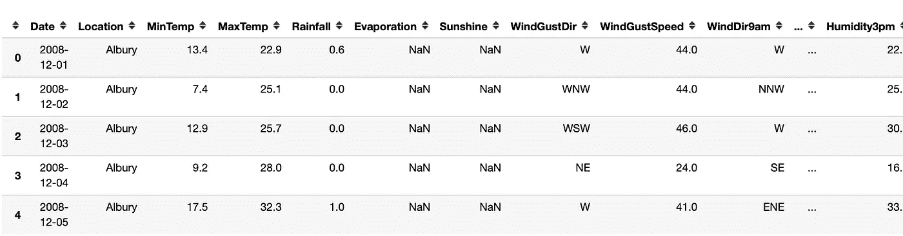
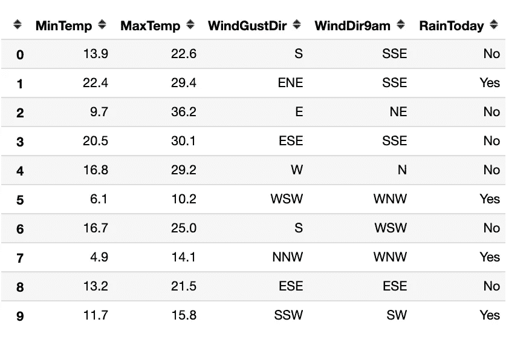
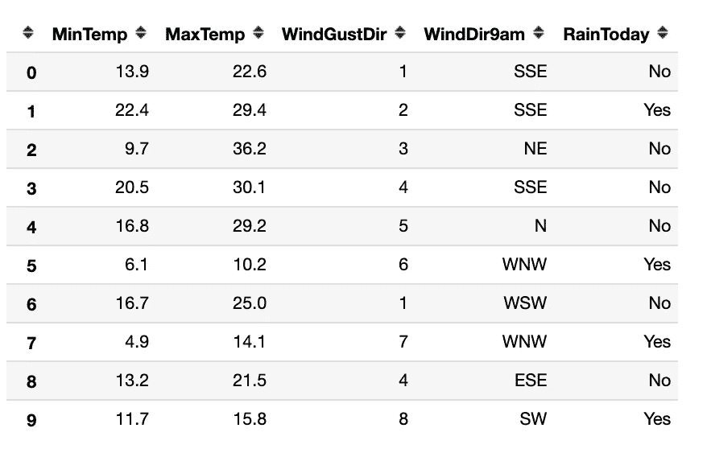
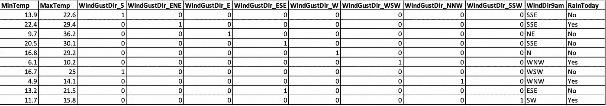

# 一个热编码器和标签编码器

> 原文：<https://medium.com/analytics-vidhya/one-hot-encoders-and-label-encoders-ed086a254edc?source=collection_archive---------21----------------------->


什么是编码器，为什么我们需要它？

考虑一个场景，你正在做一个机器学习项目，比如分类问题。你需要预测明天是否会下雨。

在现实生活中，像这样的情况会有很多特征/因素支配我们的预测。有些可能是数字，有些是类别。

**数值**

1.  连续值
2.  离散值
3.  比例
4.  间隔

**明确的**

1.  名义上的
2.  序数

要深入理解这些变量类型意味着什么，你可以参考我以前的博客。

回到预测的问题，大多数机器学习算法(决策树可能有效)最终都需要直接或间接的数字来进行训练。

对于数值型，可以输入到模型中，而对于分类型，我们需要在输入之前对其进行处理。

降雨量数据集快照。



数据快照

F *特征= ['日期'，'位置'，'最小温度'，'最大温度'，'降雨量'，'蒸发'，
'阳光'，'风阵风'，'风阵风'，'风 9am '，'风 3pm '，'风速 9am '，'湿度 9am '，'湿度 3pm '，【T9]，'压力 9am '，'压力 3pm '，'云 9am '，'云 3pm '，'温度 9am '，
，'温度 3pm '，'今日降雨']*

让我们从中筛选出一些分类和数字数据

```
['MinTemp', 'MaxTemp', 'WindGustDir', 'WindDir9am', 'RainToday']
```



数据集(数据)

```
#Output MinTemp  has  10 distinct  labels
MaxTemp  has  10 distinct  labels
WindGustDir  has  8 distinct  labels
WindDir9am  has  7 distinct  labels
RainToday  has  2 distinct  labels
```

这里“WindGustDir”、“WindDir9am”、“RainToday”是分类变量

**标签编码器:**它为一列中的每个值分配一个整数。

如果您有一个序数变量，如“好”、“非常好”、“非常好”，您也可以手动为其分配整数值。

那名义变量呢，比如我们例子中的 WindGustDir，它取值['S '，' ENE '，' E '，' ESE '，' W '，' WSW '，' NNW '，' SSW']。在这里，如果你应用标签编码器，它也将分配整数给每个条目。



在标签编码后，我们看到 WindGustDir 现在被分配为 1，2，…，8 来表示' S '，' ENE '，…，' SSW '。

缺点:自动将固有等级分配给' S '，' ENE '，…，' SSW '，这可能不是实际订单。

**一键编码器**:这可以看作是分类变量值的向量表示。

在 **R** 3 中，即三维空间集合{(1，0，0)，(0，1，0)，(0，0，1)}可以通过线性组合来表示任意点。

其中 1 表示该轴上存在点。



一个热编码器输出

['S '，' ENE '，' E '，' ESE '，' W '，' WSW '，' NNW '，' SSW'] —> [1，2，3，4，5，6，7，8]

如果您查看每行的输出，我们会看到一列是 1，而其他地方都是 0。如果 1 出现在第 1 个位置，则意味着该行的 WindGustDir 值为“S”，同样，如果 1 出现在第 5 个位置，则意味着 WindGustDir 为 W，依此类推。

如果仔细观察这八个额外创建的列，很明显我们可以用剩下的七个生成任何列。这导致多重共线性，称为虚拟变量陷阱。因此，理想情况下，您可以在培训前删除一列。

希望您理解分类变量及其实现对编码器的需求。